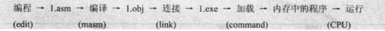
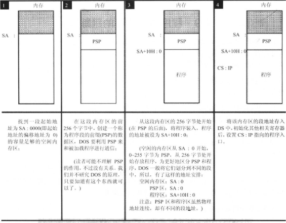

# 计算机组成知识

------

## 数据总线，地址总线，控制总线

如果有M根数据线，一次可以传送Mbit的数据。8086只有8根数据线，一次只能传送8bit的数据，所以传送89D8H需要传送两次。

如果有N根地址线，寻址能力是$2^N$个存储单元（地址），8086有20根地址线，可以传输20bit的地址（用到段地址和偏移地址组合的方式）

CPU对外部器件的控制是通过控制总线实现的（比如有两根控制线向内存发送读写信号)

## 指令执行过程

CPU从CS:IP指向的内存读指令，CS和IP的内容被送入地址加法器，然后送上地址总线，被指到的内存单元存放的机器指令通过数据总线送入CPU

指令被放入指令缓冲器，当读取指令后，IP自动增加当前指令的字节数。接着执行指令缓冲器里的指令，如此一个循环完成。


当8086CPU加电启动时，CS:IP被设置为F000:FFFF，在那里存放了8086CPU机开机后执行的第一条指令

## 寄存器

寄存器包括寄存器和段寄存器

8086CPU寄存器有：ax,bx,cx,dx,ah,al,bh,bl,ch,cl,dh,dl,sp,bp,si,di，段寄存器有：ds,ss,cs,es

### AX-DX

AX-DX都是通用寄存器，8086CPU上一代的CPU寄存器是8位的，为了兼容性，AX-DX都可以拆分成两个独立的8位寄存器来使用。


多字节的数据被放入内存中时，是高对高，低对低的。

### CS,IP

8086CPU有20根地址线，但寄存器只能存16bit的数据，所以采用段地址:偏移地址的方式来表示地址。
$$
物理地址=段地址*16（即16进制下补一个0)+偏移地址
$$
任何时候CPU将CS:IP指向的内容当成指令执行

### DS 

指令中`[]`表示内存单元的**偏移地址**，没在`[]`里使用寄存器bp时，取ds中的数据作为内存单元的**段地址**。

要修改`ds`就必须先把数据送入一个普通的寄存器，然后再送入`ds`

```nasm
mov ax,idata
mov ds,ax
```

### SS,SP

SS:SP始终指向栈顶元素，我们可以把一组长度为N（N<=64K，因为SP的范围是0000-FFFF，为64K）的内存单元定义为一个栈段。

对栈的操作可能越界，栈空时SP=0，放入一个元素后SP=SP-2=FFFE，指向第一个元素。

对SS的修改也需要借助普通的寄存器

> 补充：修改段寄存器（DS，CS，SS，ES）时需要先把段地址送入普通寄存器

### SI和DI

和bx功能相似，但不能拆分为两个8位寄存器使用。

可以用`[bx+si]`和`[bx+di]`的方式对内存单元寻址，也可以写成`[bx][si]`

### 标志寄存器

flag寄存器是按照位起作用的，1,3,5,12,13,14,15位不具有任何含义，其他位都有专门的含义，记录特定的信息。这些信息可以是CPU相关指令的执行结果，也可以用于给CPU执行相关指令提供依据，控制CPU工作方式等等。


DEBUG的查看命令的结果里有一行`NV UP EI PL NZ AC PO NC`，这是标志寄存器的值

| 标志   |  1   |  0   | 意义            |                                                              |
| :----- | :--: | :--: | --------------- | ------------------------------------------------------------ |
| *SF*   |  NG  |  PL  | 符号(Sign)      | 记录指令执行后，结果是否为负。如果为负，SF=1；如果非负，SF=0。<br />我们知道00000001B可以看作无符号数的1，也可以看作有符号数+1<br />10000001B可以看作是无符号数129，也可以看作有符号数-127<br />用补码的好处，就是对有符号和无符号数的加减法运算不用区分，认为它是什么就是什么。关键在于我们需要哪个结果。<br />也就是add等指令必然会影响到SF标志位，只是把数据当作无符号数来运算的时候SF的值没有意义，虽然它确实被影响了，但我们不需要。 |
| *ZF*   |  ZR  |  NZ  | 零值            | 标记相关指令的计算结果是否为0。ZF=1表示结果是0，ZF=0表示结果为1<br />add,sub,mul,div,inc,or,and等会逻辑算术运算指令会影响标志寄存器，<br />而mov,push,pop等数据移动指令则不会 |
| *PF*   |  PE  |  PO  | 奇偶            | 记录指令执行后结果的所有二进制位中1的个数的奇偶。1的个数为偶数，则PF=1；1的个数为奇数，PF=0<br />比如`or al,2`的结果，其中`al`为01H，结果为00000011B，1的个数为偶数，所以PF=1 |
| **CF** |  CY  |  NC  | 进位(Carry)     | 针对的是无符号数，对16位和8位的计算都有效，记录最高位的进位/借位值。<br />比如`sub al,98H`，其中al是97H。执行指令后CF=1，即发生了借位 |
| **OF** |  OV  |  NV  | 溢出(Over flow) | 针对的是有符号数，标识是否发生溢出。<br />如果运算结果使用8位寄存器，那范围是-128~127，如果用16bit存放，范围就是-32768~32767。<br />比如`add al,99`，其中al是98，因为$98+99=197$，所以发生溢出。实际存储结果是C5H，解释为有符号数为-59<br />当然还有$-16-120$也会发生溢出 |
| DF     |  DN  |  UP  | 方向(Direction) | 在串处理指令中，控制每次操作后si,di的增减。<br />DF=0 每次操作后si,di递增<br />DF=1 每次操作后si,di递减<br /><br />8086CPU提供了两条指令对DF位进行设置<br />`cld`：将DF设置为0<br />`std`：将DF设置为1 |

> 对于进位和溢出的一些额外解释：
>
> 对于无符号数运算，用CF位记录是否发生进位；
>
> 对于有符号数，用OF位判断是否溢出，符号看SF位。
>
> 比如$98+99$，如果看成是无符号数，没有进位，所以CF=0。如果看成有符号数，他们相加发生溢出，所以OF=1，实际结果是负数，所以SF=1。
>
> 此外，溢出和进位，并没有什么必然联系。

# x86汇编

------

## 算术逻辑运算

### add

```nasm
add ax,3
add cx,bx    
add cx,cx
add ax,[0]
add [4],bx
add cx,FFFF 					;越界会丢弃高位
add bl,F0 						;低8位越界不会进位到高8位，直接舍掉
add ax,ds 						;(错误示范) add不可以对段寄存器操作
```

### sub

用前面的减去后面的，把结果存在前面的里面。

```nasm
sub bx,10 
sub ax,bx   					;2字节
sub ax,[0]
sub [0],bx
```

### mul

无符号数乘法，两个相乘的数，要么都是8位，要么都是16位。

8位乘8位，默认一个乘数放在AH里，结果放在AX中。

```nasm
mul bl 							;和AH相乘，结果放在AX里
```

16位乘16位，默认一个乘数在AX中，结果放在两个16位寄存器里。高位放在DX中，低位放在AX中。

```nasm
amul bx,2710 					;和AX相乘，结果放在DX AX里
```

### div

除数可以是8bit或者16bit。

除数是8位，被除数就是16位，默认放在AX中。AL放商，AH放余数。

```nasm
div BL 							;被除数是AX，商是AL，余数是AH
```

除数是16位，被除数则是32位，默认放在DX和AX中。DX存放高16位，AX存放低16位。AX存结果的商，DX存除法操作的余数。

```nasm
div BX 							;被除数是DX AX，商是AX，余数是DX
```

### 关于有符号数和无符号数运算的解释

CPU在执行add等加减法指令的时候包含了两种含义：有符号数和无符号数运算。这是因为使用补码表示有符号数时，它的加减规则和无符号数的运算方法相同，所以可以统一管理。只需要根据实际需要把它当成有符号或者无符号即可。SF，CF，OF标志寄存器必然受到影响，只取需要的就行。

但乘除法需要区分有无符号，所以有两种指令：`mul`和`div`(用于无符号)，`imul`和`idiv`(用于有符号)，当然数据本身并不包含是有无符号数的信息，取决于你如何解释它。

### inc

相当于ax++

```nasm
inc ax
```

### dec

相当于ax--

```nasm
dec ax
```

### and

按位与运算

```nasm
and al,01001110B
```

### or

按位或运算

```nasm
or al,10101110B
```

### adc

带进位加法指令，利用了CF位上记录的进位值。下面的指令，实际相当于让$ax=ax+bx+CF$

```nasm
adc ax,bx
```

`adc`被提供的目的就是为了可以对更大的数据进行加法运算

```nasm
;计算1EF0001000H+2010001EF0H，结果放在ax（高位）,bx（中）,cx（低）里
mov ax,001EH
mov bx,0F00H
mov cx,1000H

add cx,1EF0H
adc bx,1000H
adc ax,0020H
```

### sbb

带借位减法指令，利用了CF上的借位值。下面的指令，实际相当于让$ax=ax-bx-CF$

```nasm
sbb ax,0020H
```

和`adc`是类似的道理

### cmp

`cmp`是比较指令，功能相当于减法，只是不保存结果。`cmp`执行后将对标志寄存器产生影响。

```nasm
cmp ax,bx
```

比如`cmp ax,ax`，执行后ZF=1，PF=1，SF=0，CF=0，OF=0

通过`cmp`指令执行后标志寄存器的值，可以看出ax和bx的大小关系。

无符号数看CF和ZF即可

有符号数看ZF，SF和OF。注意计算结果的正负，和逻辑上结果的正负，并不一定一致。因为存在溢出的情况，如果不发生溢出，那二者一致；如果发生了溢出，那计算的结果和真实的结果正负值必然是相反的。

## 移位指令


### shl

逻辑左移

把移出的一位写入CF，最低位用0补充

```nasm
shl al,1 						;把al的数据左移一位
```

如果移动位数大于1,必须把移动位数放到cl里。以及CF的值是最后移出的那位

```nasm
mov al,01010001b
mov cl,3
shl al,cl					;执行后CF是0即最后移出的那位
```

可以看出每一次左移，相当于执行X=X*2

### shr

逻辑右移

低位移出的一位写入CF，最高位补0

```nasm
shr al,l
```

如果移动位数大于1,必须把移动位数放到cl里。CF是最后移出的那位，这里是0

```nasm
mov al,01010010b
mov cl,3
shr al,cl
```

可以看出每一次右移，相当于执行X=X/2

### rol

循环左移，和逻辑左移的区别是移出的位数会被放入右侧

### ror

循环右移，和逻辑右移的区别是移出的位数会被放入左侧

### sal

算术左移，和逻辑左移一样，最高位放到CF里，右侧补0

### sar

算术右移，最高位用移动前最高位填充

### rcl

带进位循环左移，最高位放到CF里，最低位补移动前的CF

### rcr

带进位循环右移，最高位用原来的CF填充

## 定义数据

定义的数据会被编译器直接填充进内存。

### db

定义字节数据

```
db 42,41,73,69,63
```

也可以直接写字符串，要用`''`括起来，下面的和上面的写法等价，根据ASCII码，一个字符对应1Byte

```nasm
db 'BAsic'   			;db 'BAs','ic'
```

> 大写字母+20H=小写字母   利用这个规律，只要改变第5位即可改变大小写（用and 或者or）

### dw

定义字型数据。用法如下：

```
dw 0123H,2321H,2132H,3546H,9ACDH,321FH
```

所以`dw`可以说是定义字型数据，也可以说是开辟2个字节的内存空间。

注意因为定义的是字型数据，占用2个字节。每个数据依旧是高对高，低对低，比如上面定义的数据在内存中是：

```
23 01 21 23 32 21 46 35 CD 9A 1F 32
```

### dd

定义双字型（32bit），和dw一样，定义的数据占4字节，高对高，低对低。

```nasm
dd 36477834  				;识别为十进制，十六进制：22C9B8A
```

内存的结果是

```
8A 9B 2C 02
```

### dup

与db,dw,dd一样，是编译器处理的符号。它和db,dw,dd等数据定义伪指令搭配使用，用来进行数据的重复。

```nasm
db 3 dup (0)			;定义3个字节，它们值都是0，相当于db 0,0,0
db 3 dup (1,2,3)		;定义9个字节，相当于db 1,2,3重复3次
db 3 dup ('abc','ABC')  ;定义18个字节，相当于db 'abcABCabcABCabcABC'
dw 3 dup (2)			;定义6个字节，相当于dw 2重复3次，内存里是000200020002
```

### 将标号当作数据来定义

会根据是字型数据还是双字型，自动选择存放偏移地址还是段地址与偏移地址

```nasm
data segment
	a db 1,2,3,4,5,6,7,8
	b dw 0
	c dw a,b		;字型数据，存放的就是a,b的偏移地址
					;相当于c dw offset a,offset b
	d dd a,b		;双字型数据，存放的是偏移地址和段地址
					;d dw offset a,seg a,offset b,seg b
data ends
```

## 数据移动

### mov

```nasm
mov ax,8    	;3字节
mov bx,ax
mov al,bh   	;操作对象为1字节
mov ax,[0]  	;将ds:0处的数据送入ax中
mov ax,[bx] 	;内存单元长度2字节，放一个字，偏移地址bx中，段地址在ds中
mov al,[bx] 	;内存单元长度1字节，放一个字节，偏移地址bx中，段地址在ds中
mov ax,ds:[bx]	;可以显式的给出段前缀
mov ax,ss:[0]	;
mov bx,cs:[bx]	;显式的给出段前缀
mov ax,[200+bx]
mov ax,[bx+200]
mov ax,200[bx]
mov ax,[bx].200
mov ax,[bx+si]
mov ax,[200+bx+si]
```

### 串传送指令

#### movsb

相当于执行如下的代码

```nasm
mov es:[di],byte ptr ds:[si]		;8086并不支持这样的指令，只是个描述
;根据DF寄存器的值，对si和di的值递增或递减。
;DF=0
inc si
inc di
;DF=1
dec si
dec di
```

可以看出`movsb`的功能是将ds:si指向的内存单元的字节送入es:di中，然后让si和di指向上一个或者下一个内存单元。

#### movsw

和`movsb`的区别只是一次传送一个字，即将ds:si指向的内存单元的word送入es:di中，然后根据DF对si和di递增2或递减2

```nasm
mov es:[di],word ptr ds:[si]        ;8086并不支持这样的指令，只是个描述
;DF=0
add si,2
add di,2
;DF=1
add si,2
add di,2
```

#### cld和std

8086CPU提供了两条指令对DF位进行设置

`cld`：将DF设置为0

`std`：将DF设置为1

#### rep

`movsb`和`movsw`通常都和`rep`配合使用，格式如下

```nasm
rep movsb
;相当于执行
s: 	movsb
	loop s
```

可见`rep`的作用是根据cx的值，重复执行串传送指令。一共可以实现(cx)个字符的传送。

比如用串传送指令，将`data`段中的第一个字符串拷贝到后面的空间中

```nasm
data segment
	db 'Welcome to masm!'
	db 16 dup (0)
data ends

mov ax,data
mov ds,ax
mov si,0						;ds:si指向data:0
mov es,ax
mov di,16						;es:di指向data:16
mov cx,16		`				;cx=16,循环16次
cld								;DF=0 正向传送比较方便
rep movsb
```

### push和pop

SP应该指向栈顶元素（没有元素的时候，SP=栈最大地址-2）

```nasm
push ax
```

SP=SP-2，然后把ax的内容送入SS:SP指向的内存单元

```nasm
pop ax
```

将SS:SP指向的内存单元的数据送入ax，接着SP=SP+2

### pushf和popf

`pushf`：将标志寄存器的值压栈

`popf`：从栈中弹出数据，送入标志寄存器

## 转移指令

8086CPU的转移可以分为两类，段内转移（只修改IP）和段间转移（同时修改CS和IP），段内转移又可以分为短转移和近转移，短转移的IP范围在-128-127（8bit），近转移IP的范围是-32768-32767（16bit）

转移的地址，可以通过偏移量（IP变化量）给出，或者通过目标地址（CS和IP，或者只有IP）

### offset	

offset是由编译器处理的符号，用于取得标号的偏移地址

```nasm
assume cs:codesg
codesg segment
	start: mov ax,offset start  	;相当于mov ax,0
									;这条指令长度3字节
		s: mov ax,offset s			;相当于mov ax,3
codesg ends
end start
```

如果被取得偏移地址的标号和当前指令不在同一个段中，也是可以取得的。不过是相对于标号所在段的偏移地址。

### seg

功能为取得某一标号的段地址，这个段地址就是所在段的标号地址

### jmp

jmp是无条件转移指令，可以只修改IP，也可以同时修改CS和IP

需要给出目的地址和转移的距离（段间，段内近，段内短）

下面三种不同格式的jmp指令对应了三种不同的转移方式：

```nasm
jmp short 标号		;转到标号处执行指令，段内短转移（IP修改范围-128-127）
					 ;它对应的机器指令中保存的是IP的变化量 比如EB 03，表示IP修改为下一条指令的地址+3个字节
					 ;变化量在编译的时候算出，用补码保存
					 ;如果实际跳转超过IP修改范围，会报错
jmp near ptr 标号 	;段内近转移
					;如果实际是短转移，机器码是EB 地址 90（nop占位）
					;如果是近转移，机器码是E9打头，跟16bit的IP变化量（存储依旧是高对高，低对低）
jmp far ptr 标号  	;段间转移，在机器码中保存的是目标地址（CS:IP）
					;比如EA0B01BD0B ，含义是JMP 0BBD:010B
```

转移地址在寄存器中的jmp指令：

```nasm
jmp ax  						;类似于mov IP,ax
```

以下这种修改CS和IP的写法，是在Debug中使用的汇编指令，汇编编译器并不认识，如果在源程序中使用，编译时候会报错

```nasm
jmp 2AE3:3  					;类似于mov CS,2AE3   mov IP,3
```

转移地址在内存中的jmp指令有两种格式：

```nasm
;段内转移
mov ax,0123H
mov ds:[0],ax
jmp word ptr ds:[0]				;ds:[0] 处存放一个偏移地址，执行后IP=ds:[0]指向的内存单元的值

;段间转移
mov ax,0123H
mov ds:[0],ax
mov word ptr ds:[2],0			;高地址放段地址，低地址放偏移地址
jmp dword ptr ds:[0]			;执行后CS=0,IP=0123H
```

### jcxz

jcxz为有条件转移指令，所有的有条件转移指令都是短转移，在对应的机器码中包含转移的位移，IP变化范围是-128-127

```nasm
jcxz 标号(如果cx=0，转移到标号处执行)
```

相当于在cx=0时，执行`jmp short 标号`

### 其他的条件转移指令

条件满足时，发生转移


> j-jump e-equal n-not b-below a-above l-less s-sign o-overflow z-zero

jxxx系列指令和cmp指令配合实现高级语言中的if语句

```nasm
;如果ah=bh,则ah=ah+ah,否则ah=ah+bh
        cmp ah,bh
        je s				;判断是否相等
        add ah,bh
        jmp short ok
   s:   add ah,ah
  ok:	ret
```


### loop

短转移，机器码中包含转移的位移，而不是目的地址。IP修改范围是-128-127。

循环指令的框架如下：

```nasm
mov cx,11
s:	
	;循环执行的代码段
	loop s
```

执行到`loop s`时会先让cx=cx-1，然后判断cx的值是否为0，如果为0继续执行下面的代码，如果不为0转至`s`处执行。

> 结论：cx中存放的值是循环次数

### ret和retf

ret用栈中数据修改IP的内容，实现近转移

```nasm
ret                   	;相当于pop IP
```

retf用栈中数据修改CS和IP的内容，实现远转移

```nasm
retf					;相当于pop IP,pop CS
```

### call

用于将CS和IP压入栈，并转移

#### 地址是标号的情况

根据位移转移的call指令（段内近转移）

```nasm
call 标号			
				;将当前的IP压入栈中，并转移到标号处
				;相当于push IP,jmp near ptr 标号
				;call的机器码存储的同样是IP的变化值，而非目标地址（变化值=标号处的地址-call指令的下一个指令的地址）
				;E80600,变化值为0006
```

根据目的地址转移的call指令（段间转移）

```nasm
call far ptr 标号
				;将当前的CS和IP压入栈中，并转移到标号处
				;相当于 push CS,push IP,jmp far ptr 标号
				;机器码 9A 05 01 6E 07 ,即目标地址076E:0105
```

#### 地址在寄存器中

转移地址在寄存器中的call指令

```nasm
call 16位寄存器
				;比如call ax，等于push IP,jmp ax
```

#### 地址在内存中

转移地址在内存中的call指令

```nasm
call word ptr 内存单元地址
				;段内转移
				;相当于只执行push IP,jmp word ptr 内存单元地址
call dword ptr 内存单元地址
				;段间转移
				;相当于push CS,push IP,jmp dword ptr 内存单元地址
```

### 关于IP的补充

当位移超出转移范围的限制时，编译会发生报错。例如

```nasm
assume cs:code

code segment
	start:	jmp short s				;IP+128才能指向s标号的地址，发生了越界
			db 128 dup (0)
		s:  mov ax,ffffH
code ends
end start
```

因为是在IP自增完后才执行的指令，所以在指令执行时，IP已经指向下一条指令了。所以机器码中的IP变化量都是从下一条指令的位置开始算的，而不是当前的指令位置。call指令里入栈的IP也是指向的下一条。

## 内存单元寻址方式

### []的用法

`[]`有如下几种用法

| 用法          | 解释                                     |
| ------------- | ---------------------------------------- |
| [idata]       | 一个常量来表示地址，直接定位一个内存单元 |
| [bx]          | 一个变量表示地址                         |
| [bx+idata]    | 变量+常量                                |
| [bx+si]       | 两个变量表示地址                         |
| [bx+si+idata] | 两个变量+常量                            |

在8086CPU中，只有`bx,si,di,bp`可以在`[]`中进行内存单元的寻址，

比如下列指令都是正确的：

```nasm
mov ax,[bx]
mov ax,[bx+si]
mov ax,[bx+di]
mov ax,[bp]
mov ax,[bp+si]
mox ax,[bp+di]
```

而下列的指令是错误的：

```nasm
mov ax,[cx]
mov ax,[ax]
mov ax,[dx]
mov ax,[ds]
```

这四个寄存器要么单独出现，要么以[bx+si],[bx+di],[bp+si],[bp+di

]以及它们加上常量的组合出现，其他的组合都是错误的。

### []的格式

以下四种格式等价（常用）

```nasm
mov ax,[bx+200]

mov ax,[200+bx]
mov ax,200[bx]
mov ax,[bx].200
```

### 用哪个段寄存器

段寄存器可以是默认的，可以是显式指定的

只要在`[]`中使用寄存器bp，而没有显式给出段地址，那么段地址默认是在ss中

```nasm
mov ax,[bp]
mov ax,[bp+idata]
mov ax,[bp+si]
mov ax,[bp+si+idata]
```

否则就在ds中，即没有使用bp，也没有显式给出段地址的

```nasm
mov ax,[0]
mov ax,[di]
mov ax,[bx+8]
mov ax,[bx+si]
mov ax,[bx+si+8]
```

也可以显式给出放置段地址的寄存器

```nasm
mov ax,ds:[bp]
mov ax,es:[bx]
mov ax,ss:[bx+si]
mov ax,cs:[bx+si+8]
```

### 数据长度是多少

指令要处理的数据长度，可以是byte和word，在机器指令中必须要指明是字操作还是字节操作，有两种指明方式

一种是根据寄存器来指明要处理的数据尺寸

```nasm
;字操作
mov ax,1
mov bx,ds:[0]
mov ds,ax
inc ax
add ax,1000

;字节操作
mov al,1
mov al,bl
mov al,ds:[0]
mov ds:[0],al
inc al
add al,100
```

一种是用操作符`ptr`指明内存单元的长度

```nasm
;访问的单元是字单元
mov word ptr ds:[0],1
inc word ptr [bx]					
add word ptr [bx],2
;访问的单元是字节单元
mov byte ptr ds:[0],1
inc byte ptr [bx]
inc byte ptr ds:[0]
inc byte ptr [bx],2
```

像`push`这样的指令不需要指明访问的是字单元还是字节单元，因为它只进行字操作

## 关于标号

### 地址标号

地址标号代表一个内存单元的地址，它可以被用于标记指令，数据，段的起始地址。

```nasm
;标记段的起始地址
code segment
code ends

;标记指令
start:	mov ax,1

;标记数据
a:	db 1,2,3,4,5,6
```

### 数据标号

数据标号不但表示内存单元的地址，还表示了内存单元的长度，即是字节单元，字单元还是双字单元。

```nasm
assume cs:code
code segment
		a db 1,2,3,4,5,6,7,8
		b dw 0					;将冒号删掉就是数据标号
start:	mov si,0
		mov cx,8
s:		mov al,a[si]
		mov ah,0
		add b,ax
		inc si
		loop s
		mov ax,4c00H
		int 21H
code ends
end start
```

比如对于上面的数据标号，对应的指令可以解释如下

```nasm
;b的偏移地址是8
mov ax,b		;相当于mov ax,cs:[8]
mov b,2			;相当于mov word ptr cs:[8],2
inc b			;相当于inc word ptr cs:[8]
;a的偏移地址是0
mov al,a[si]	;相当于mov al,cs:0[si]
mov al,a[3]		;相当于mov al,cs:0[3]
mov al,a[bx+si+3]	;相当于mov al,cs:0[bx+si+3]
```

注意上面的段寄存器是CS，这是因为code段被用`assume`和CS寄存器关联了起来，可以看下面的代码。

```nasm
assume cs:code,ds:data				;assume关联ds寄存器，编译器在处理mov al,a[si]这样的指令时，采用ds寄存器
data segment
	a db 1,2,3,4,5,6,7,8
	b dw 0	
data ends
code segment
start:		mov ax,data
			mov ds,ax			;设置ds指向data所在段
			
			mov si,0
			mov cx,8
	s:		mov al,a[si]
			mov ah,0
			add b,ax
			inc si
			loop s
			
			mov ax,4c00H
			int 21H
code ends
end start
```

上面的代码中对应的指令可以解释如下

```nasm
mov al,a[si]			;相当于mov al,ds:[si+0]
add b,ax				;相当于add ds:[8],ax
```

所以总结一下，如果想让数据标号访问正确，必须将数据标号所在段和一个段寄存器关联起来。当然这种联系是编译器要用到的，被关联的段寄存器不会真的就存放该段的地址。所以还必须对相应的段寄存器进行设置，让它指向数据标号所在段。

还可以将标号当作数据来定义：

```nasm
data segment
	a db 1,2,3,4,5,6,7,8
	b dw 0
	c dw a,b		;字型数据，存放的就是a,b的偏移地址
					;相当于c dw offset a,offset b
	d dd a,b		;双字型数据，存放的是偏移地址和段地址
					;d dw offset a,seg a,offset b,seg b
data ends
```

## 其他

### nop

占位，占1个字节，没有实际意义

```nasm
nop			;90
```

## x86发展史

Intel微处理器主要发展过程：8080，8086/8088，80186，80286...Pentium，Pentium Ⅱ...Core系列...

Intel 8086是一款由Intel在1978年设计的16位处理器，它最早采用了x86汇编语言，是x86架构的鼻祖。现代笔记本主要采用的是基于x86架构的现代处理器，比如Intel的Core系列。

x86汇编并非一成不变，它随着处理器架构的进步，也在不断的扩展和更新，以支持新的指令和特性。

例如最早的8086CPU采用的是16位汇编语言，具有基本的指令集和寄存器架构。在32位处理器出现后，x86汇编语言也被扩充为32位模式，这种模式被称为IA-32。后来又出现了64位处理器，x86汇编语言再次扩充，引入新的64位模式，称为AMD64或x86-64。

这里总结的都是最基本的指令集。

# 环境配置（8086CPU）

------

## 参考书上的方案

需要安装DosBox，并下载masm汇编编译器。

### DOSBox的安装

DOS是一种早期的PC命令行操作系统。DOSBox 则是一个模拟 DOS 环境的工具。在ubuntu上安装：

```bash
sudo apt install -y dosbox
```

启动DOSBox在终端输入`dosbox`即可

### masm文件包的下载

masm是由微软公司开发的一种汇编语言编译器。它是针对x86架构的微处理器开发的，可以用于编写和调试汇编语言程序。

可以直接下载DEBUG包，包内包含DEBUG.EXE、MASM.EXE、LINK.EXE等可执行文件，这些文件可以在DOS系统下直接执行，因此只要把DEBUG目录挂载即可。DEBUG包下载地址：

https://github.com/codists/learnings/blob/main/nasm/%E6%B1%87%E7%BC%96%E8%AF%AD%E8%A8%80/DEBUG.zip

> masm是微软专门为windows下汇编而写的，而nasm可以在windows、linux等系统下汇编。两者语法基本一致，有细微区别。
>
> 因为markdown的语法高亮貌似只支持`nasm`，所以文档就采用`nasm`的语法高亮了。

### DOS命令

把DEBUG目录挂载作为c盘

```
mount c ~/nasm_project/DEBUG
```

进入c盘

```
c:
```

查看文件

```
dir
```

进入debug模式

```
debug
```

## vscode解决方案

上面这种方法比较麻烦，因为每次都要重新挂载，可以通过vscode插件 `MASM/TASM`变得方便。

在插件的设置里可以设置DOS环境模拟器，汇编工具等。

### DOSBox配置

这个插件绑定了一个`VSCode DOSBox`的插件，这个插件提供自带的DOS环境模拟器，也可以设置为自己的。使用自己的dosbox要求把它添加到PATH。

### masm编译器

MASM它提供了一个，在`~/.config/Code/User/globalStorage/xsro.masm-tasm/`目录下，在配置里默认是`TASM`，只要改成`MASM`就好

## DEBUG模式下常用命令

### R 查看，修改CPU中寄存器的内容

查看寄存器

```
r
```


> `1000:0015`是当前cs:ip的值，`031E0100`是cs:ip指向的内容，`ADD BX,[0001]`是对应的指令

修改寄存器ax的内容

```
r ax
```

修改寄存器cs的内容

```
r cs 
```

### D 查看内存中的内容

查看1000:1000往后的128个内存单元

```
d 1000:0000
```

查看1000:1000到1000:20的内容，共32字节

```
d 段地址:起始偏移地址 结尾偏移地址
d 1000:0000 20（结尾偏移地址）
```

从1000:9个开始的128个内存单元

```
d 1000:9
```

可以把段地址用段寄存器写，很方便

```
d ds:0
d ds:10 18 						查看10-18中的内容
d cs:0 							查看当前代码段的内容
d ss:0  						查看当前栈段的内容
```

在E，A，U指令中也可以使用

```
e ds:0 11 22 33
u cs:0
a ds:0
```

### E 修改内存中的内容

修改内存 

```
e 起始地址 数据 数据 数据 数据
e 0100:0000 1 2 3
```

逐一修改内存，空格下一个，回车结束

```
e 起始地址
e 0100:0000
```

### U 以汇编指令的形式显示内存中的内容

显示机器指令的地址，机器指令和对应的汇编指令。

```
u
```

由此可见内存中的数据和代码没有任何区别，关键在于如何解释

```
u 1000:0
```

### T 执行CS:IP指向的指令

执行一次CS:IP指向的机器指令

```
t
```

### A 以汇编形式写入指令

直接以汇编指令的形式写入多个指令，不输入然后Enter结束输入

```
a 1000:0
```

注意：

这个方式输入的指令，不能是二进制形式，比如`mov ax,01000101B`是不对的，数据不用点名类型，默认是16进制

### P 

遇到循环的时候使用可以跳过接下来的循环，直到CS:IP指向循环的下一条

`int 21`需要用P执行，记住就好

### q

退出DEBUG模式

# 汇编程序实践

------

## 汇编源程序是什么

以下是一个汇编源程序的示例：

```nasm
; 1.asm
assume cs:abc
abc segment
    mov ax,2
    add ax,ax
    add ax,ax

    mov ax,4c00H
    int 21H
abc ends
end
```

> 源程序：源程序文件中的所有内容，包括伪指令
>
> 程序：源程序中最终被计算机执行处理的指令和数据，以汇编形式被保存在源程序中，编译连接后转变为机器码存在可执行文件中。

## 伪指令

一个汇编程序有两种指令，一种是汇编指令，一种是伪指令。汇编指令有对应的机器码，可以被编译成机器指令，最终被CPU执行。伪指令没有对应的机器码，是由编译器来执行的指令。编译器根据伪指令进行相关的编译工作。

### XXX segement   XXX ends

以下程序定义了一个段：

```nasm
codesg segment             		;定义一个叫codesg的段

codesg ends                		;名称为codesg的段结束
```

一个汇编程序由多个段组成，这些段被用来存放代码，数据或者当成栈空间来使用。指令数据栈被分到不同的段中，一个有意义的汇编程序至少有一个段。

### end

`end`除了可以通知编译器程序结束以外，还可以用于指定程序的入口

```nasm
end								;通知编译器编译结束
end start						;程序入口是star
```

在程序被载入内存后，CS:IP会被设置指向程序入口（CS=入口所在段，IP=入口偏移地址）。

如果直接`end`，CS:IP就会默认指向第一个段的起始地址（CS=第一个段的段地址，IP=0）。

### assume

assume的作用是只是让编译器知道数据标号所在段对应的段寄存器，从而用到数据标号的时候能正确设置段寄存器。而将段地址装入段寄存器的任务仍然是由用户手动完成的

```nasm
assume cs:codesg   				;将codesg和cs联系起来
```

## 汇编程序的执行过程

通用的操作系统都要提供shell，在DOS中shell就是command.com，启动shell只需要输入`command`，在shell中想要执行可执行文件只需要输入文件名。



### 编译

这本书使用微软的masm 5.0汇编编译器，文件名masm.exe。

在DOSBOX里执行`masm`进行编译，编译后生成目标文件 1.obj

一些编译过程中产生的中间结果，直接enter可以不生成。

### 连接

在DOSBOX里执行`link`进行连接，可以生成可执行文件1.exe。

有个.lib的选项，如果调用了库文件的子程序，就要在连接的时候把库文件和目标文件连接到一起生成可执行文件。没有就enter

### 简化的编译连接命令

下面的命令生成1.obj和1.exe，忽略中间文件的生成，记得加`;`

```
masm 1;				
link 1;
```

### 运行1.exe程序的过程

command将1.exe的程序载入内存，并设置相关的寄存器，因为CS:IP指向了程序入口，所以接下来运行1.exe程序，command暂停运行。

CPU运行完1.exe程序后，再返回到command中，CPU继续运行command

1.exe具体载入过程如下：



> 内存加载1.exe后程序的长度被装入CX，内存区的段地址被装入DS（也是PSP的起始地址，PSP区的开头是CD 20），CS:IP指向程序入口（默认指向ds+10H:0，即图中程序区开始的地方）
>

### 跟踪1.exe运行过程

和直接执行1.exe不一样，调试的执行过程是 command 加载 DEBUG 进内存，DEBUG 再把1.exe程序载入内存，接着设置相关寄存器的值，但DEBUG不放弃对CPU的控制。这样就可以用DEBUG的相关命令单步执行程序。

```
DEBUG 1.exe
```

返回时从1.exe程序返回 DEBUG ，再返回 command

## 使用段组织代码，数据和栈

### 段是什么

一段内存可以是代码存储空间，数据存储空间，栈空间，也可以啥也不是。它就是一串二进制数据，关键是如何解释它。

一个段名是一个段地址。

一个段的容量不能大于64KB，即0000-FFFF的偏移地址范围（这是8086模式的限制，并不是所有处理器都这样）

### 在代码段中使用数据和栈

#### 使用数据

以下代码在这个段的开头开辟了12个字节的内存空间。

```nasm
; 1.asm
assume cs:abc
abc segment
	dw 0123H,2321H,2132H,3546H,9ACDH,321FH
    start:	mov ax,0
    		mov cx,5
        s: 	add,ax,cs:[bx]
            add bx,2
            loop s
    mov ax,4c00H
    int 21H
abc ends
end start
```

> `end start`指明了程序的入口在标号`start`处，这个入口地址会被放在可执行文件的描述信息中，程序被载入内存时，加载者会从描述信息中读取入口地址，并设置CS:IP。

#### 使用栈

通过`dw`开辟空间用于栈，然后设置SS:SP指向第一个栈元素来创建一个栈。将程序中定义的数据逆序存放代码如下：

```nasm
assume cs:codesg
codesg segment
	dw 0123H,2321H,2132H,3546H,9ACDH,321FH
	dw 0,0,0,0,0,0                              	;定义6个字型数据，程序加载后，将取得8个字的内存空间，这部分当作栈使用
	start:	mov ax,cs
			mov ss,ax								;
			mov sp,24								;将栈顶指向cs:24，cs:0-cs:23存放的是数据，从cs:12-cs:23被当作栈使用
			mov bx,0
			mov cx,6								;循环次数
	s:		push cs:[bx]
			add bx,2
			loop s
			mov bx,0
			mov cx,6
	s0: 	pop cs:[bx]
			add bx,2
			loop s0
			mov ax,4c00h
			int 21h
codesg ends
end start											;指明程序入口
```

### 将数据，代码，栈放入不同的段

以下代码实现的功能和上面的一样，用栈把数据反过来放，但是定义了3个段，用对应的段寄存器指向对应的段名来实现不同的段。

把段名放入段寄存器需要借助中间寄存器，因为段名被视为0100H这样的数值，所以`mov ds,段名`的写法是错误的。

```nasm
assume cs:code,ds:data,ss:stack						;assume是伪指令，用于指定每个段对应的段寄存器
data segment
	dw 0123H,2321H,2132H,3546H,9ACDH,321FH
data ends
stack segment
	dw 0,0,0,0,0,0
stack ends
code segment
	;`stack`，`code`都只是标号，CPU不会主动把它们作为数据段和栈，要手动修改段寄存器存储它们。
	start: 	mov ax,stack
			mov ss,ax
			mov sp,16									;设置栈顶指向stack:16
			
			mov ax,data
			mov ds,ax
			mov bx,0									;ds:bx指向data段的第一个单元
			
			mov cx,8
		s:	push [bx]
			add bx,2
			loop s										;循环的把data段的0-15单元的8个字形数据入栈
			
			mov bx,0
			mov cx,8
		s0: pop [bx]
        	add bx,2
        	loop s0                                      ;出栈送到data段的0-15单元中
        	
        	mov ax,4c00h
        	int 21h
code ends
end start
			
```

在8086处理器中，段与段之间紧密连续，每个段的起始地址都是紧接着上一个段的结束地址。当然，段的最小跨度是10H，也就是16字节。所以会用0填充不满的内存。

## 模块化程序设计

即使用call和ret实现子程序

### 用寄存器存储参数和结果

计算N的3次方，完整代码如下。把参数放到BX寄存器中，子程序会用它，然后把结果放到dx和ax中

```nasm
assume cs:code

data segment
	dw 1,2,3,4,5,6,7,8			;2字节
	dd 0,0,0,0,0,0,0,0			;4字节
data ends


code segment
	start: 	mov ax,data
			mov ds,ax
			mov si,0
			mov di,16			;[di],[si]默认是ds寄存器

			mov cx,8
	s:		mov bx,[si]			;第一个word放入bx
			call cube			;当前IP入栈，跳转计算
								;
			mov [di],ax
			mov [di+2],dx		;放到di里

			add si,2			;ds:si指向下一个word单元
			add di,4			;ds:di指向下一个dword单元
			loop s

			mov ax,4c00h
			int 21h

;计算N的3次方
;参数：(bx)=N
;结果：(dx:ax)=N^3
cube:	mov ax,bx
		mul bx
		mul bx
		ret						;出栈元素放到IP

code ends
end start
```

载入代码后DS寄存器被设置为内存区的地址（也是PSP区的地址），CS和IP指向程序的入口，查看内存SS居然默认是被设置为PSP区的最后16个字节..

### 用内存单元传递数据

将数据放到内存中，然后把内存空间的首地址放到寄存器中，传给需要的子程序。

下面的代码将data段中的字符串转化为大写

```nasm
assmue cs:code
data segment
	db 'conversation'
data ends
code segment
	start:	mov ax,data
			mov ds,ax
			mov cx,12
			call capital
			mov ax,4c00H
			int 21H
	capital:and byte ptr [si] 11011111b
			inc si
			loop capital 
			ret
code ends
end start
```

### 用栈传递参数

将子程序参数压入栈中，子程序从栈中获得参数

计算$(a-b)^3$，a和b都是word型数据


```nasm
code segment
start:			mov ax,1
				push ax
				mov ax,3
				push ax
				call difcube			;IP入栈
				mov ax,4c00H
				int 21H
difcube:		push bp					;在栈中保存bp旧值，因为主程序可能用到bp
				mov bp,sp
				mov ax,[bp+4]
				mov ax,[bp+6]
				mov bp,ax
				mul bp
				mul bp
				pop bp
				ret 4
code ends
```

### 寄存器冲突的问题

cx既用于循环，又用于读取数据，就发生了冲突

还是将data段中的字符转化为大写的问题，但这次用0表示字符串结束

```nasm
assmue cs:code
data segment
	db 'conversation',0
data ends
code segment
	start:	mov ax,data
			mov ds,ax
			mov si,0			;设置起始地址
			call capital
			mov ax,4c00H
			int 21H
	capital:
			mov cl,[si]
			mov ch,0
			jcxz ok
			and byte ptr [si] 11011111b
			inc si
			jmp short capital 
		ok:	ret
code ends
end start
```

当处理多个字符串时，cx又用于循环，又用于判断是否遇到0

```nasm
assmue cs:code
data segment
	db 'conv',0
	db 'word',0
	db 'good',0
data ends
code segment
	start:	mov ax,data
			mov ds,ax
			mov bx,0
			mov cx,4
		s:	mov si,bx
			call capital
			add bx,5
			loop s
			mov ax,4c00H
			int 21H

;si 字符串起始地址
;当读到0时结束处理
	capital:
			mov cl,[si]
			mov ch,0
			jcxz ok
			and byte ptr [si] 11011111b
			inc si
			jmp short capital 
		ok:	ret
code ends
end start
```

难道，寄存器冲突，就只能调用别的寄存器吗。要调用子程序，就必须要看到子程序的源码吗。我们希望调用子程序的时候不必考虑子程序使用了哪些寄存器，编写子程序的时候也无需考虑调用者使用了哪些寄存器。也就是说，子程序必须是独立的。解决方案如下：

**在子程序的开始，保存将用到的所有寄存器，在子程序返回前再恢复**

```nasm
子程序开始:		
				子程序中用到的寄存器入栈
				子程序内容
				子程序使用到的寄存器出栈
				返回（ret,retf）
```

比如上面的问题可以这样解决

```nasm
assmue cs:code
data segment
	db 'conv',0
	db 'word',0
	db 'good',0
data ends
code segment
	start:	mov ax,data
			mov ds,ax
			mov bx,0
			mov cx,4
		s:	mov si,bx
			call capital
			add bx,5
			loop s
			mov ax,4c00H
			int 21H

;si 字符串起始地址
;当读到0时结束处理
	capital:
;;;;;;用到cx,si;;;;;;;;;;;;;;;;;;;
			push cx
			push si
;;;;;;;;;;;;;;;;;;;;;;;;;;;;;;;;;;
			mov cl,[si]
			mov ch,0
			jcxz ok
			and byte ptr [si] 11011111b
			inc si
			jmp short capital 
			
		ok:	pop si			;
			pop cx			;出栈
			ret
code ends
end start
```

## 操作显存数据

屏幕上的内容=显存中的数据


在屏幕中间显示白底蓝字的Welcome to masm

```nasm
assume cs:codeseg,ds:datasg
datasg segment
	db 'welcome to masm!'
datasg ends

codeseg segment
start:	
		;初始化寄存器
		mov ax,datasg
		mov ds,ax
		mov ax,0B800H
		mov es,ax
		mov si,0
		mov di,1984		;160*12+80-16，即在屏幕中间显示

		;显示字符串
		mov cx,16
w:		mov al,[si]
		mov es:[di],al
		inc di
		mov al,71H
		mov es:[di],al
		inc si
		inc di
		loop w

		mov ax,4c00H
		int 21H
codeseg	ends
end start
```

## 用查表的方法解决问题：直接定址表

### 对数据的查表

对数据的查表是将数据放到表中，统一管理。

问题：以十六进制的形式在屏幕中间显示给定的byte型数据

最简单的解决方案：建立一张表，表中依次存放字符0-F，通过数值0-15直接查找到对应的字符

```nasm
table db '0123456789ABCDEF'			;建立字符表
```

完整代码如下

```nasm
assume cs:code
code segment
start: 		mov al,2Bh
			call showbyte
			mov ax,4c00H
			int 21H
			
;子程序
showbyte:
			jmp short show
			table db '0123456789ABCDEF'
    show:		push bx
                push es
                push cx

                mov ah,al
                mov cl,4
                shr ah,cl		;右移4位，ah中得到高4位的值
                and al,00001111b	;al中为低4位的值
				
				;取得字符并显示
				mov bl,ah
				mov bh,0
				mov ah,table[bx]		;code段和cs关联起来了，所以相当于mov ah,cs:[table+bx]，这实际使用起来就像数组一样
				mov bx,0b800H
				mov es,bx
				mov es:[160*12+40*2],ah
				
                pop cx
                pop es
                pop bx
code ends
end start
```

再看另一个问题：计算$sin(x)，x∈\{0,π/6,π/3,π/2,2π/3,5π/6,π\}$，并在屏幕中间显示结果。

偏移表如下，`table`标号处的是连续7个偏移地址

```nasm
;用0标志字符串的结尾
table dw ag0,ag30,ag60,ag90,ag120,ag150,ag180
	ag0 	db '0',0
	ag30 	db '0.5',0
	ag60	db '0.866',0
	ag90	db '1',0
	ag120   db '0.866',0
	ag150   db '0.5',0
	ag180 	db '0',0

;访问数据
table[bx]		;可以找到下标为bx的元素（元素是偏移地址）
cs:[bx]			;假设bx已经是偏移地址，这将得到第一个字符的ascii码
```

完整代码如下

```nasm
assume cs:code
code segment
start:
	mov al,60
	call showsin
	mov ax,4c00H
	int 21H
showsin:
	jmp short show
	;这里放字符串偏移表
	show:
			push bx
			push es
			push si
			
			mov bx,0b800H
			mov es,bx
			
			;用角度值/30作为相对于table的偏移量，取得字符串的偏移地址放入bx
			mov ah,0
			mov bl,30
			div bl
			mov bl,al
			mov bh,0
			add bx,bx
			mov bx,table[bx]
			
			;显示sin(x)对应的字符串
			mov si,160*12+40*2
			shows:	mov ah,cs:[bx]
					cmp ah,0				;判断ah是否是0
					je showret
					mov es:[si],ah
					inc bx					;一个字符1byte，所以bx加1即可
					add si,2
					jmp shows
			showret:
			
			pop si
			pop es
			pop bx
	ret
code ends
end start
```

### 对代码的查表

对代码的查表即将子程序保存到一张表中统一管理

例如下面的代码，实现了一个子程序setscreen，提供了四个功能：清屏，设置前景色，设置背景色，向上滚动一行。

实现的方式是将这4个功能写成4个子程序，然后把这些子程序的入口地址保存在一张表中，他们在表中的位值和功能号相对应。对应关系为：功能号*2=对应功能的子程序相对于地址表的偏移。接着用主程序去调用相应的子程序即可。

```nasm
;清屏：将显存中的所有字符设置为空格符
sub1:
	push bx
	push cx
	push es
	
	mov bx,0b800H
	mov es,bx
	mov bx,0
	mov cx,2000
sub1s:
	mov byte ptr es:[bx],' '
	add bx,2
	loop sub1s
	
	pop es
	pop cx
	pop bx
	ret
	
;设置前景色：设置显存中奇地址字节的012位
;al:颜色
sub2:
	push bx
	push cx
	push es
	
	mov bx,0b800H
	mov es,bx
	mov bx,1
	mov cx,2000
sub2s:
	and byte ptr es:[bx],11111000b
	or es:[bx],al
	add bx,2
	loop sub2s
	
	pop es
	pop cx
	pop bx
	ret

;设置背景色：设置显存中的奇地址字节的456位
;al:颜色
sub3:
	push bx
	push cx
	push es
	
	mov cl,4
	shl al,cl
	
	mov bx,0b800H
	mov es,bx
	mov bx,1
	mov cx,2000
sub3s:
	and byte ptr es:[bx],10001111b
	or es:[bx],al
	add bx,2
	loop sub3s
	
	pop es
	pop cx
	pop bx
	ret

;向上滚动一行：依次将第n+1行的内容复制到第n行处，最后一行置空
sub4:
	push cx
	push si
	push di
	push es
	push ds
	
	;准备工作
	mov si,0b800H
	mov es,si
	mov ds,si
	mov si,160
	mov di,0	 		;ds:si指向n+1行,es:di指向第n行
	cld					;DF=0
    mov cx,24
	;复制前24行
sub4s:
	push cx
	mov cx,160
	rep movsb			;复制
	pop cx
	loop sub4s
	;清空最后一行
	mov cx,80
	mov sl,0
sub4s1:
	mov byte ptr es:[160*24+si],' '
	add si,2
	loop sub4s1

	pop ds
	pop es
	pop di
	pop si
	pop cx
	ret
```

主程序如下

```nasm
;ah：功能号
assume cs:code
code segment
start:
	mov ah,2
	mov al,5
	call setscreen
	mov ax,4c00H
	int 21H

setscreen:
	jmp short set
	table dw sub1,sub2,sub3,sub4
set:
	push bx
	cmp ah,3	
	ja sret			;高于则转移
	mov bl,ah
	mov bh,0
	add bx,bx
	call word ptr table[bx]
sret:
	pop bx
	ret
;这里放4个功能子程序
code ends
end start
```

可以看出，要想在setscreen里添加新的功能，只要在地址表中加入入口地址就可以了，结构清晰，便于扩充。

## 中断

CPU不再接着执行（刚执行完的指令）向下执行，而是转去处理中断信息。由CPU内部发生的事情引起的中断叫做内中断，由外部设备发生的事件引起的中断叫做外中断。


### 8086的内中断

内中断的中断信息来自CPU内部。不同的中断信息包含不同的中断类型码。中断类型码是一个字节型数据，可以表示256中中断信息的来源。

| 中断源        | 举例                    | 中断码 |
| ------------- | ----------------------- | ------ |
| 除法错误      | 执行div指令产生除法溢出 | 0      |
| 单步执行      |                         | 1      |
| 执行int0指令  |                         | 4      |
| 执行int n指令 |                         | n      |

CPU收到中断信息后，会去转而执行中断处理程序。8086CPU会从中断向量表找到相应的中断处理程序的入口地址，这个入口地址包括段地址和偏移地址。

**中断，端口，BIOS，磁盘读写等学完操作系统再补充**
