# 使用模板操作硬件

## 1. LED


### 1.1 IMX6ULL

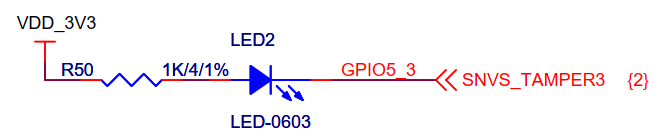


GPIO1 : 0~31

 GPIO2:32~63

GPIO5: 4*32 

GPIO5_3 : 4*32 + 3


### 1.2 STM32MP157

第1步：确认引脚编号并修改led_drv.c

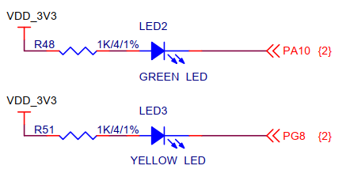


PA10的编号：10

PG8的编号：96+8=104


第2步：修改设备树`arch/arm/boot/dts/stm32mp15xx-100ask.dtsi`

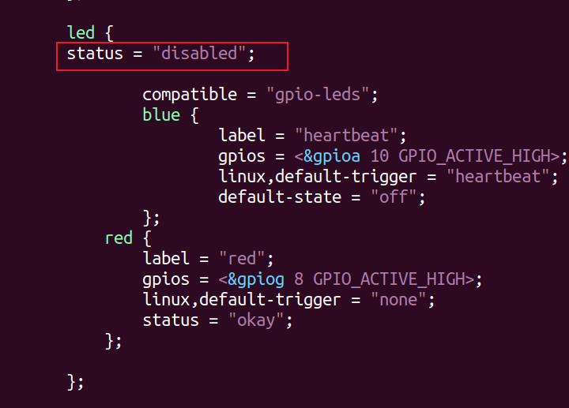


第3步：编译设备树

```shell
make dtbs
```


第4步：替换设备树

```shell
// Ubuntu
cp arch/arm/boot/dts/stm32mp157c-100ask-512d-lcd-v1.dtb ~/nfs_rootfs/

// 开发板
mount /dev/mmcblk2p2 /boot
cp /mnt/stm32mp157c-100ask-512d-lcd-v1.dtb  /boot
```


### 1.3 D1H

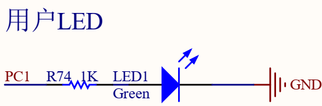


第1步：确认引脚编号

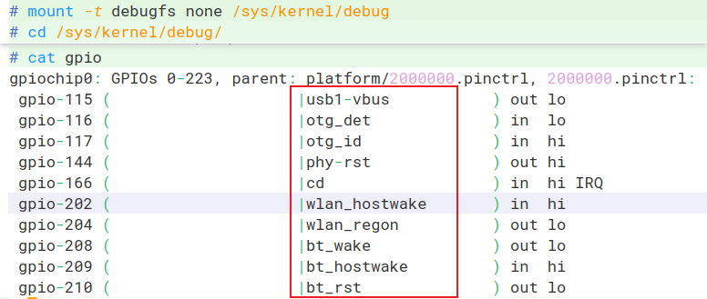


在arch/risc/boot/dts/board.dts里搜上图的红框中的文字，确认引脚是哪个，根据它们的编号推理出：

* 每个PORT占据32个引脚编号
* 反推出PC1的编号是65


其实，有一个计算公式：每组GPIO占据32个编号，编号从0开始，第1组GPIO叫PA。那么PC1的编号就是 2*32+1=65


## 2. 按键


## 3. 红外感应

### 3.1 接口图

#### 3.1.1 IMX6ULL

以IMX6ULL为例，下图是跟红外模块的接口图：

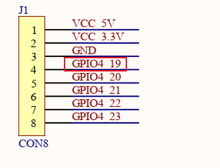

* GPIO4 ==> 第3组 ===> 起始编号 = 3*32 = 96
* GPIO4_19的编号：96+19=115

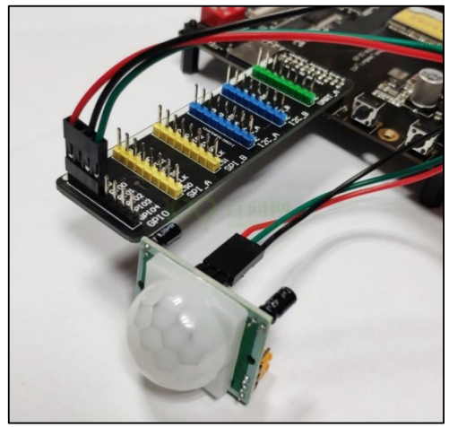


#### 3.1.2 STM32MP157

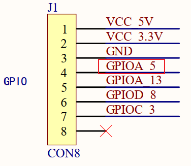


* GPIOA ==> 第0组 ===> 起始编号 = 0*16= 0
* GPIOA_5的编号：0+5=5


#### 3.1.3 D1H

PA,PB,PC :每组占据32个编号，PC1的编号 = 2*32 + 1 = 65


#### 3.1.4 T113

PA,PB,PC :每组占据32个编号，PC1的编号 = 2*32 + 1 = 65


### 3.2 修改模板


## 4. 超声波测距模块

### 4.1 SR04工作原理

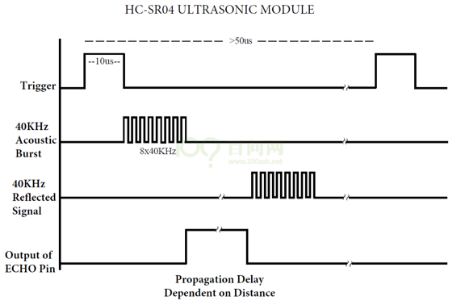

要测距，需如下操作：

* 触发：向Trig（脉冲触发引脚）发出一个大约10us的高电平。
  * 模块就自动发出8个40Khz的超声波，超声波遇到障碍物后反射回来，模块收到返回来的超声波。

* 回响：模块接收到反射回来的超声波后，Echo引脚输出一个与检测距离成比例的高电平。
* 我们只要计算Echo引脚维持高电平的时间T即刻计算举例：D = 340*T/2。


### 4.2 核心函数

测试内核精确的时间：`ktime_get_ns`


### 4.3 编程

以IMX6ULL为例：

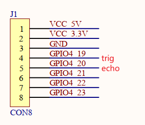

确定引脚编号：

* GPIO4_19的编号3*32+19 = 115
* GPIO4_20的编号3*32+19 = 116


要点：

* 不要在中断处理函数里执行printk
* 不在ioctl发出trig信号后不要printk、在sr04_read里也不要printk
* APP不要频繁地调用ioctl发出trig信号


## 5. 步进电机

### 5.1 步进电机操作原理


### 5.2 步进电机驱动编写

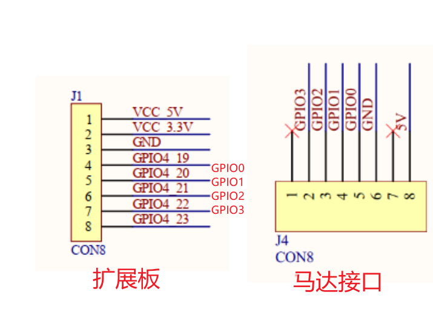

* GPIO0: GPIO4_19, 编号: 3*32+19 = 115
* GPIO1: GPIO4_20, 编号: 3*32+20= 116
* GPIO2: GPIO4_21, 编号: 3*32+21= 117
* GPIO3: GPIO4_22, 编号: 3*32+22= 118


## 6. DHT11

### 6.1 硬件操作原理


### 6.2 编程

确定引脚：

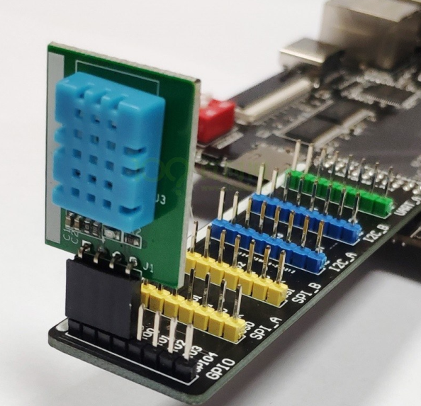

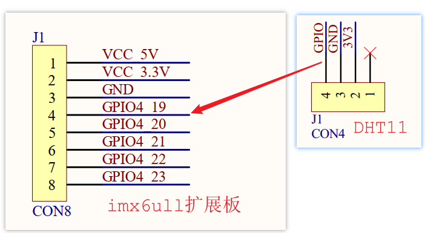

* GPIO4_19编号：3*32+19=115
* 测试内核精确的时间：`ktime_get_ns`


## 7. DS18B20

### 7.1  硬件连接

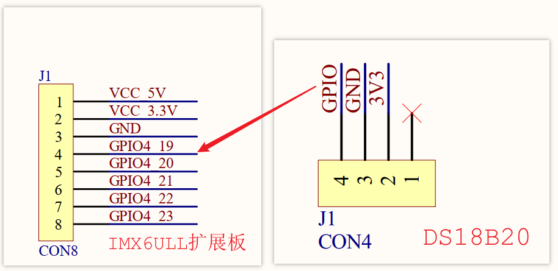


### 7.2 访问流程

在一条数据线上，可以连接多个DS18B20。每个DS18B20都内嵌不同的ID，所以需要先选择某个DS18B20。

如果只有一个DS18B20，就不需要选择。

访问DS18B20的流程为：启动温度转换、读取温度。

怎么启动温度转换？方法如下：

* 发出Start信号
* 得到回应
* 发出8位的数据，用于选择某个DS18B20
* 发出温度转换命令
* 等待温度转换完毕

温度转换完毕后，数据存在DS18B20内部的暂存器中。怎么读出数据？方法如下：

* 发出Start信号
* 得到回应
* 发出8位的数据，用于选择某个DS18B20
* 发出读暂存器的命令
* 读温度低8位
* 读温度高8位


### 7.3 硬件信号

#### 7.3.1 Start和回应

深黑色线表示由主机驱动信号，浅灰色线表示由DS18B20驱动信号。

最开始时引脚是高电平，想要开始传输信号：

* 必须要拉低至少480us，这是复位信号；
* 然后拉高释放总线，等待15~60us之后，
* 如果GPIO上连有DS18B20芯片，它会拉低60~240us：这就是回应

如果主机在最后检查到60～240us的低脉冲回应信号，则表示DS18B20初始化成功。

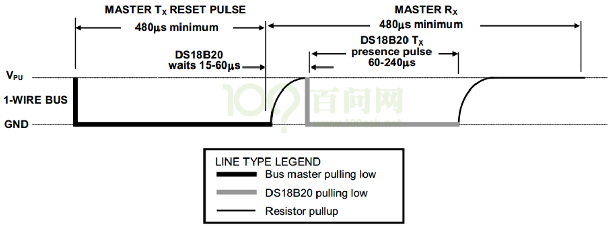


#### 7.3.2 写一位数据

如果写0，拉低至少60us(写周期为60-120us)即可；

如果写1，先拉低至少1us，然后拉高，整个写周期至少为60us即可。

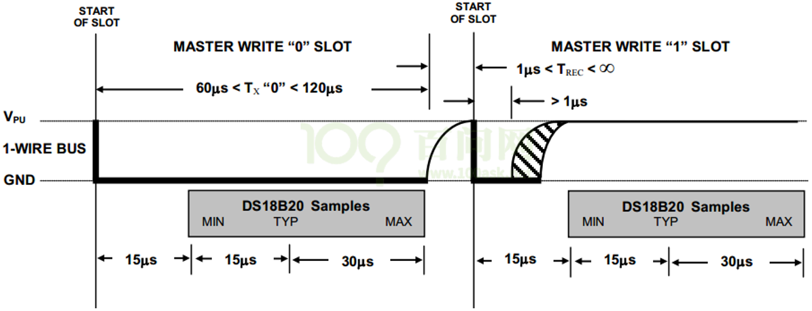


#### 7.3.3 读一位数据

主机先拉低至少1us，随后读取电平，如果为0，即读到的数据是0，如果为1，即可读到的数据是1。

整个过程必须在15us内完成，15us后引脚都会被拉高。

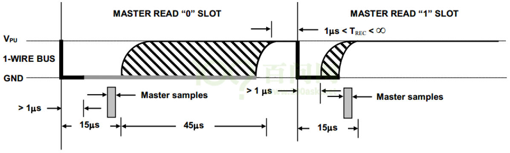

### 7.4 DS18B20内部寄存器

参考：

```shell
《嵌入式Linux应用开发完全手册V4.0_韦东山全系列视频文档-IMX6ULL开发板.docx》
	第13篇 IMX6ULL裸机开发
		第二十二章 DS18B20温度模块
```

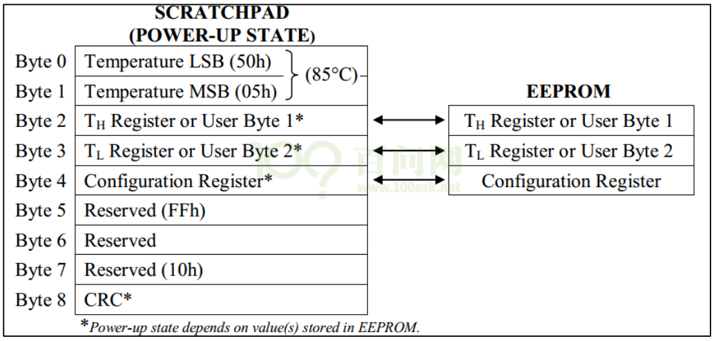

### 7.5 编写驱动程序

* GPIO4_19，编号：3*32+19=115
* CRC：参考 https://www.cnblogs.com/yuanguanghui/p/12737740.html
* 测试内核精确的时间：`ktime_get_ns`
* 关键：关中断下操作


## 8. 红外遥控器

### 8.1 操作原理

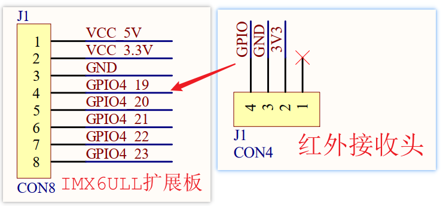


### 8.2 编写程序

* 引脚编号：GPIO4_19, 编号 3*32+19=115
* 测试内核精确的时间：`ktime_get_ns`


