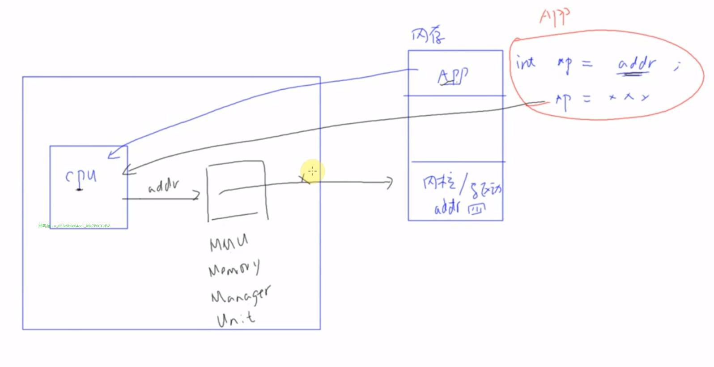
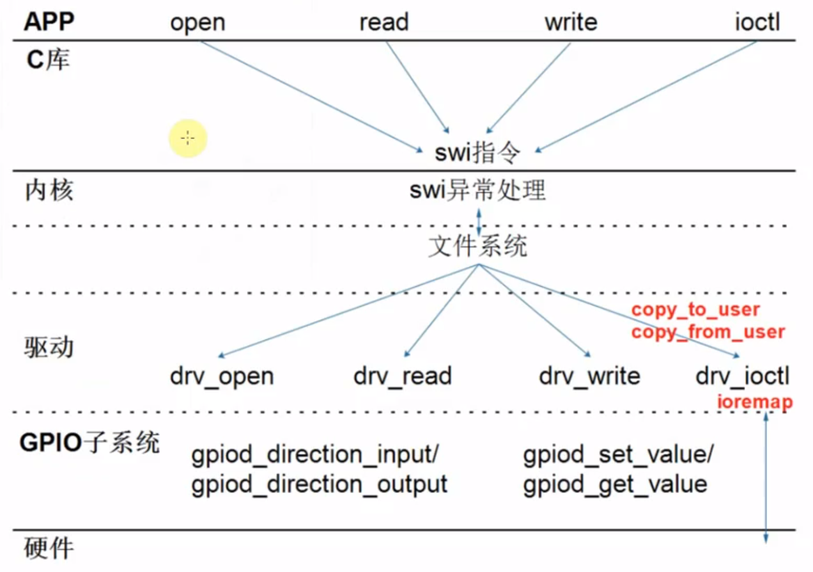
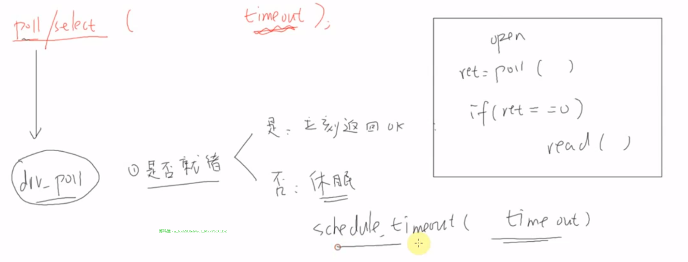
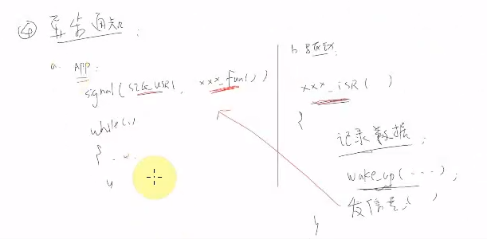

应用程序不能直接访问驱动程序，被内存管理单元隔离开了：



驱动和app通过copy_to_user和copy_from_user两个函数传输数据，驱动程序和硬件之间通过子系统的函数或者ioremap映射寄存器地址后直接访问寄存器：



### Hello驱动

先来看看如何从内核“抄”代码吧：

ctrl+p按文件名搜索文件， ctrl+f当前文件内查找，ctrl+` 切换或隐藏终端。

全局查找变量和函数：去要搜索的路径下，然后执行`grep "register_chrdev" * -rn`查找

```c
//hello_drv.c
#include "asm/cacheflush.h"
#include "linux/types.h"
#include <linux/mm.h>
#include <linux/module.h>
#include <linux/miscdevice.h>
#include <linux/slab.h>
#include <linux/vmalloc.h>
#include <linux/mman.h>
#include <linux/random.h>
#include <linux/init.h>
#include <linux/raw.h>
#include <linux/tty.h>
#include <linux/capability.h>
#include <linux/ptrace.h>
#include <linux/device.h>
#include <linux/highmem.h>
#include <linux/backing-dev.h>
#include <linux/shmem_fs.h>
#include <linux/splice.h>
#include <linux/pfn.h>
#include <linux/export.h>
#include <linux/io.h>
#include <linux/uio.h>

#include <linux/uaccess.h>


static struct class *hello_class;
static int major;
static unsigned char hello_buf[100];

static int hello_open (struct inode *node, struct file *filp)
{
    printk("%s %s %d\n", __FILE__, __FUNCTION__, __LINE__);
    return 0;
}
//buf是用户空间提供的缓冲区，offset是起始位置，filp指向文件
static ssize_t hello_read (struct file *filp, char __user *buf, size_t size, loff_t *offset)
{
    unsigned long len = size > 100 ? 100 : size;

    printk("%s %s %d\n", __FILE__, __FUNCTION__, __LINE__);

    copy_to_user(buf, hello_buf, len);

    return (ssize_t)len;
}

static ssize_t hello_write(struct file *filp, const char __user *buf, size_t size, loff_t *offset)
{
    unsigned long len = size > 100 ? 100 : size;

    printk("%s %s %d\n", __FILE__, __FUNCTION__, __LINE__);
    copy_from_user(hello_buf, buf, len);

    return len;
}

static int hello_release (struct inode *node, struct file *filp)
{
    printk("%s %s %d\n", __FILE__, __FUNCTION__, __LINE__);
    return 0;
}

/* 1. create file_operations */
static const struct file_operations hello_drv = {
    .owner      = THIS_MODULE,
	.read		= hello_read,
	.write		= hello_write,
	.open		= hello_open,
    .release    = hello_release,
};


/* 2. register_chrdev */

/* 3. entry function */
static int hello_init(void)
{
    //注册字符设备
    //chardevs链表数组，chardevs[1]是主设备号为1,256..的链表，链表的元素是char_device_struct，里面有struct cdev* cdev，它里面包含file_operations结构体
    major = register_chrdev(0, "100ask_hello", &hello_drv);

    //在/sys/class下创建hello_class文件夹，之后创建设备文件会用到
	hello_class = class_create(THIS_MODULE, "hello_class");
	if (IS_ERR(hello_class)) {
		printk("failed to allocate class\n");
		return PTR_ERR(hello_class);
	}

    //在hello_class文件夹下创建链接文件hello，它指向的目录下有详细的设备信息，在/dev下根据它创建设备文件
    device_create(hello_class, NULL, MKDEV(major, 0), NULL, "hello");  /* /dev/hello */

   return 0;
}


/* 4. exit function */
static void hello_exit(void)
{
    //销毁设备文件/dev/hello
    device_destroy(hello_class, MKDEV(major, 0));
	//销毁设备类
    class_destroy(hello_class);
	//注销之前注册的字符设备
    unregister_chrdev(major, "100ask_hello");
}


module_init(hello_init);
module_exit(hello_exit);
MODULE_LICENSE("GPL");
```

APP运行时其实是这样：看书，放入书签保存现场，分辨中断源，调用中断处理函数，继续看书


 

APP使用驱动的4种方式：

* 非阻塞(查询)：read访问drv_read为例，有数据返回数据，没数据返回错误，不会等待

* 阻塞(休眠-唤醒)：read访问drv_read为例，没数据休眠，直到某个中断调用唤醒它

  

* poll(定个闹钟)：是调用poll/select函数，然后调用drv_poll驱动，休眠也是等待某中断唤醒

  

* 异步通知



不把占一个主设备号，占用一部分次设备号
