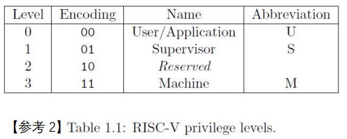

# RVOS代码解析

------

## 00-引导过程

### qemu-virt

Hart就是一个执行流，现代的core有时候包含多个执行流，所以就把Hart抽象出来了


下面这个就是一个完整的机器，可以称为Platform（？一块芯片）


然后这个命令行指定qemu模拟的是virt这个机器，并且不加载bios

```shell
qemu-system-riscv32 -nographic -smp 1 -machine virt -bios none -kernel os.elf
```

QEMU-virt就是模拟了一个Platform


QEMU-virt地址映射表：https://github.com/qemu/qemu/blob/master/hw/riscv/virt.c


咱们写的东西就加载到DRAM这块


### 链接脚本介绍

链接时候指定用自己的链接脚本`os.ld`了，没有通过-T选项指定脚本时会使用内置的。

```makefile
# Makefile
os.elf: ${OBJS}
	${CC} ${CFLAGS} -T os.ld -o os.elf $^
	${OBJCOPY} -O binary os.elf os.bin
```

`os.ld`里定义了输出的可执行文件的体系架构和程序入口是`_start`标签。

```linkerscript
OUTPUT_ARCH( "riscv" )
ENTRY( _start )
```

然后就是`MEMORY`，用于描述目标机器上的内存。

```linkerscript
# os.ld
MEMORY
{
	/* w:可写 x:可执行 a:可分配 !r:不可读 !i:不初始化 */
	ram   (wxa!ri) : ORIGIN = 0x80000000, LENGTH = 128M
}
```

然后就是用`SECTIONS`描述段怎么存放在内存中的：

```linkerscript
# os.ld
SECTIONS
{
	.text : {
		PROVIDE(_text_start = .);
		/* 所有输入文件的.text段和.text.*段 */
		*(.text .text.*)
		PROVIDE(_text_end = .);
	} >ram

	.rodata : {
		PROVIDE(_rodata_start = .);
		*(.rodata .rodata.*)
		PROVIDE(_rodata_end = .);
	} >ram

	.data : {
		. = ALIGN(4096);
		PROVIDE(_data_start = .);
		*(.sdata .sdata.*)
		*(.data .data.*)
		PROVIDE(_data_end = .);
	} >ram
	.bss :{
		PROVIDE(_bss_start = .);
		*(.sbss .sbss.*)
		*(.bss .bss.*)
		*(COMMON)
		PROVIDE(_bss_end = .);
	} >ram
	PROVIDE(_memory_start = ORIGIN(ram));
	PROVIDE(_memory_end = ORIGIN(ram) + LENGTH(ram));

	PROVIDE(_heap_start = _bss_end);
	PROVIDE(_heap_size = _memory_end - _heap_start);
}
```

`PROVIDE(_text_start = .)`把当前位置计数器的地址导出为标号，在源文件中可以使用导出的标号

```assembly
# mem.S
HEAP_START: .word _heap_start
# start.S
```

`>ram`表示输出段的位置，这里的段都放到`ram`里了。输出段有两个地址，前面这个是虚拟内存地址（VMA），还有一个是用`AT>`指定的加载内存地址（LMA）。如果没有指定LMA，那么默认等于VMA。

那么，程序的入口，在哪里呢？被放在`start.S`中

### 代码解析

`start.S`文件里包含了`_start`标签，所以程序会从这个标签的位置开始执行。

首先是将`platform.h`给`include`进来，这个文件定义了一些和机器相关的宏

```c
// platform.h
#ifndef __PLATFORM_H__
#define __PLATFORM_H__

#define MAXNUM_CPU 8
#define UART0 0x10000000L

#endif
```

然后是一些伪指令：

```assembly
.equ	STACK_SIZE, 1024	# 定义符号常数，当前汇编文件可见
.global	_start				#定义全局符号`_start`，被定义的符号可以在其他的汇编文件或C文件中使用
```

特别介绍下`.text`，和`.section .text`是一个意思

> `.section`用于定义段，段的范围持续到文件结尾或者下一个`.section`	

段的内容最终会通过链接被放置到可执行文件的段里，可以通过`objdump -d benos.elf`查看`.text`段的反汇编：

```
Disassembly of section .text:

80000000 <_start>:
80000000:	f14022f3          	csrr	t0,mhartid
80000004:	00028213          	mv	tp,t0
80000008:	02029c63          	bnez	t0,80000040 <park>
8000000c:	00022517          	auipc	a0,0x22
80000010:	00450513          	addi	a0,a0,4 # 80022010 <out_buf>
80000014:	00025597          	auipc	a1,0x25
80000018:	0d858593          	addi	a1,a1,216 # 800250ec <_bss_end>
8000001c:	00b57863          	bgeu	a0,a1,8000002c <_start+0x2c>
80000020:	00052023          	sw	zero,0(a0)
80000024:	00450513          	addi	a0,a0,4
80000028:	feb56ce3          	bltu	a0,a1,80000020 <_start+0x20>
8000002c:	00a29293          	slli	t0,t0,0xa
80000030:	00010117          	auipc	sp,0x10
80000034:	3d010113          	addi	sp,sp,976 # 80010400 <stacks+0x400>
80000038:	00510133          	add	sp,sp,t0
8000003c:	0882006f          	j	800200c4 <start_kernel>

80000040 <park>:
80000040:	10500073          	wfi
80000044:	ffdff06f          	j	80000040 <park>
80000048:	00000013          	nop
8000004c:	00000013          	nop
......
8000fff8:	00000013          	nop
8000fffc:	00000013          	nop

80010000 <stacks>:
	...
```

当然`.text`段不只`start.S`的`.text`段，所有输入文件的`.text`段和`.text.*`段都被放到了里面：

```linkerscript
# os.ld
.text : {
    PROVIDE(_text_start = .);
    /* 所有输入文件的.text段和.text.*段 */
    *(.text .text.*)
    PROVIDE(_text_end = .);
} >ram
```

os.ld文件里的`.text`最先被放入DRAM这块内存，`start.S`又是第一个输入文件，所以`start.S`的第一条汇编占据DRAM的开头：

```makefile
# OBJS的第一个是 start.S
os.elf: ${OBJS}
	${CC} ${CFLAGS} -T os.ld -o os.elf $^
```

又因`_start`是第一条汇编，所以`_start`的虚拟内存地址就是`0x80000000`。因为定义了`_start`是入口程序，所以第一条执行的指令的地址是`0x80000000`。

`.align 16 `是对齐伪指令，这里的16是对齐的位数，也可以理解为指数，实际把地址对齐到`0x10000`的倍数

`.skip`创建一段连续的内存空间，用于栈空间。

`.end`感觉加不加都行..标志代码结束

------

接下来的代码跳转前做了三件事情：让除了第一个Hart以外的核空转，将`.bss`段初始化为0，分配栈空间并设置`sp`寄存器

```assembly
	csrr	t0, mhartid					# csrr是伪指令，从CSR寄存器中读取值
	mv		tp, t0			
	bnez	t0, park
					
	la		a0, _bss_start
	la		a1, _bss_end
	bgeu	a0, a1, 2f					# a0-a1大于或等于零（无符号数），则跳转2f
1:										# 这块都是为了bss初始化，如果bss为0,1是可以跳过的
	sw		zero, 0(a0)
	addi	a0, a0, 4
	bltu	a0, a1, 1b					# 如果a0小于（无符号数）a1，则跳转
2:
	slli	t0, t0, 10					# 左移10位，即乘以1024
	la		sp, stacks + STACK_SIZE		# 设置sp寄存器
	add		sp, sp, t0					# 每个hart的sp都独占一片栈空间

	j	start_kernel	
park:
	wfi									# 进入休眠状态，直到收到中断信息
	j	park
```

上面段里用到的标签可以分3类：

|          | 说明                                                         | 例子           |
| -------- | ------------------------------------------------------------ | -------------- |
| 全局符号 | 即用`.global`声明过的，在其他源程序中也可以访问              | `_start`       |
| 本地符号 | 只在当前汇编文件中使用的                                     | `park`,`stack` |
| 本地标签 | 临时使用的，没有特别意义的，比如循环时候用<br />通常用0-99整数作为编号，可以重复定义，在汇编器内会编译成更有意义的符号<br />搭配`f`和`b`向前搜索或者向后搜索标签：`1f`,`2b` | `1`,`2`        |

### CSRs寄存器组	

Control and Status Registers（CSRs）



> - 除了所有Level下都可以访问的通用寄存器组之外，每个Level都有自己对应的一组寄存器
>
> - 高Level可以访问低Level的CSR，反之不可以
>
> - ISA Specification（"Zicsr"扩展）定义了特殊的**CSR指令**来访问这些CSR

Machine模式下的CSR列表：


看见了吗，有`mhartid`，它是Machine模式下的CSR寄存器，这个CSR只读

## 01-helloRVOS

### 代码解析

```c
// kernel.c
// extern告诉编译器某个变量或函数的定义在当前文件之外，需要在其他文件中找到
extern void uart_init(void);
extern void uart_puts(char *s);

void start_kernel(void)
{
	uart_init();
	uart_puts("Hello, RVOS!\n");

	while (1) {}; // stop here!
}
```

它在`uart.c`里

```c
#include "types.h"
#include "platform.h"

// UART的控制寄存器被内存映射到地址UART0
// 根据寄存器的偏移地址返回寄存器的地址
#define UART_REG(reg) ((volatile uint8_t *)(UART0 + reg))

//这些寄存器的大小是8bit
#define RHR 0	// 用于存储接收到的数据
#define THR 0	// 用于存储要发送的数据
#define DLL 0	// 用于设置波特率
#define IER 1	// 用于启用和禁用不同类型的串口中断，如接收数据中断和发送数据中断
#define DLM 1	
#define FCR 2	
#define ISR 2	
#define LCR 3	
#define MCR 4	
#define LSR 5	
#define MSR 6	
#define SPR 7

#define LSR_RX_READY (1 << 0)
#define LSR_TX_IDLE  (1 << 5)

#define uart_read_reg(reg) (*(UART_REG(reg)))
#define uart_write_reg(reg, v) (*(UART_REG(reg)) = (v))

void uart_init()
{
    //禁止中断
    
    // (*(((volatile uint8_t *)(UART0 + IER))) = (0X00))
	uart_write_reg(IER, 0x00);	
    
    //设置波特率
	//(*(((volatile uint8_t *)(UART0 + LCR))))
    //lcr是解引用后拿到的寄存器内容
	uint8_t lcr = uart_read_reg(LCR);
	uart_write_reg(LCR, lcr | (1 << 7));
	uart_write_reg(DLL, 0x03);
	uart_write_reg(DLM, 0x00);

    //设置传输格式，字长为8,无奇偶校验
	lcr = 0;
	uart_write_reg(LCR, lcr | (3 << 0));
}

int uart_putc(char ch)
{
	//判断LSR第5位（0-7）是不是0
	//直到LSR的第5位读出来是1，说明THR空闲，可以放新数据进去
	while ((uart_read_reg(LSR) & LSR_TX_IDLE) == 0);

	return uart_write_reg(THR, ch);
}

void uart_puts(char *s)
{
	while (*s) {
		uart_putc(*s++);
	}
}
```


### NS16550a编程接口


qemu模拟器的`0x10000000`往后`0x100`的内存被映射为UART0的寄存器，所以才有：

```c
#define UART0 0x10000000L
```

## 02-内存管理

### 代码解析

```c
// kernel.c
#include "os.h"

extern void uart_init(void);
extern void page_init(void);
// extern void uart_puts(char *s)被放到os.h里了，因为多次使用
void start_kernel(void)
{
    /*省略上一章串口的内容*/
    //新增
	page_init();
}
```

这里新增一个对`page_init`的调用，它的定义在`page.c`里

```c
#include "os.h"

// 存放各个段的地址
// extern说明要到其他文件中去找，事实上它们在mem.S里
extern uint32_t TEXT_START;
extern uint32_t TEXT_END;
extern uint32_t DATA_START;
extern uint32_t DATA_END;
extern uint32_t RODATA_START;
extern uint32_t RODATA_END;
extern uint32_t BSS_START;
extern uint32_t BSS_END;
extern uint32_t HEAP_START;
extern uint32_t HEAP_SIZE;

//_alloc_start指向堆池的实际起始地址
//_alloc_end指向堆池的实际结束地址
//_num_pages 保存我们可以分配的实际最大页面数
static uint32_t _alloc_start = 0;
static uint32_t _alloc_end = 0;
static uint32_t _num_pages = 0;

#define PAGE_SIZE 4096
#define PAGE_ORDER 12

#define PAGE_TAKEN (uint8_t)(1 << 0)
#define PAGE_LAST  (uint8_t)(1 << 1)

// 位 0：标记此页是否已占用（已分配）
// 位 1：标记该页是否是分配的内存块的最后一页
// 用数组存储页表是否被使用
struct Page {
	uint8_t flags;
};

static inline void _clear(struct Page *page)
{
	page->flags = 0;
}

static inline int _is_free(struct Page *page)
{
	if (page->flags & PAGE_TAKEN) {
		return 0;
	} else {
		return 1;
	}
}


static inline int _is_last(struct Page *page)
{
	if (page->flags & PAGE_LAST) {
		return 1;
	} else {
		return 0;
	}
}

static inline void _set_flag(struct Page *page, uint8_t flags)
{
	page->flags |= flags;
}

/*
 * align the address to the border of page(4K)
 */
static inline uint32_t _align_page(uint32_t address)
{
	uint32_t order = (1 << PAGE_ORDER) - 1;
	//可以自己画一下
    // 00101011 address
    // 00001111 order
    // 11110000 ~order
    // 001_0000 结果只有_不确定，取决于address的后4位是不是0
    // 最后的效果是向上取整，order是4,就是按照10000的倍数对齐
    // 因为一个页是4k，所以对齐到4k
	return (address + order) & (~order);
}

void page_init()
{
	// 保留了 8 个页面 (8 x 4096) 来保存页面结构
	_num_pages = (HEAP_SIZE / PAGE_SIZE) - 8;
	printf("HEAP_START = %x, HEAP_SIZE = %x, num of pages = %d\n", HEAP_START, HEAP_SIZE, _num_pages);
	// 清理保存页面结构的flag
	struct Page *page = (struct Page *)HEAP_START;
	for (int i = 0; i < _num_pages; i++) {
		_clear(page);
		page++;	
	}

    // 页面标识从HEAP_START开始 然后是空了一块 接着是页面(4k一个) 
	_alloc_start = _align_page(HEAP_START + 8 * PAGE_SIZE);
	_alloc_end = _alloc_start + (PAGE_SIZE * _num_pages);

	printf("TEXT:   0x%x -> 0x%x\n", TEXT_START, TEXT_END);
	printf("RODATA: 0x%x -> 0x%x\n", RODATA_START, RODATA_END);
	printf("DATA:   0x%x -> 0x%x\n", DATA_START, DATA_END);
	printf("BSS:    0x%x -> 0x%x\n", BSS_START, BSS_END);
    printf("flag:   0x%x -> 0x%x\n", HEAP_START,HEAP_START + 8 * PAGE_SIZE)
	printf("HEAP:   0x%x -> 0x%x\n", _alloc_start, _alloc_end);
}


// 分配一个内存块，传页数，返回指针
void *page_alloc(int npages)
{
	// 有够暴力的，直接遍历查找了
	int found = 0;
	struct Page *page_i = (struct Page *)HEAP_START;
	for (int i = 0; i <= (_num_pages - npages); i++) {
		if (_is_free(page_i)) {
			found = 1;
			//遇到一个空闲的，看它下面的是不是空的
			struct Page *page_j = page_i + 1;
			for (int j = i + 1; j < (i + npages); j++) {
				if (!_is_free(page_j)) {
					found = 0;
					break;
				}
				page_j++;
			}
			
            //如果found=1，就分配下
			if (found) {
				struct Page *page_k = page_i;
				for (int k = i; k < (i + npages); k++) {
					_set_flag(page_k, PAGE_TAKEN);
					page_k++;
				}
				page_k--;
				_set_flag(page_k, PAGE_LAST);
                // (void*)是malloc()的返回类型，它不能加减，因为不知道指向的数据类型大小，就不知道加减跳几个字节
				return (void *)(_alloc_start + i * PAGE_SIZE);
			}
		}
		page_i++;
	}
	return NULL;
}

// 释放内存块，p指向内存块的起始地址
void page_free(void *p)
{
	/*
	 * Assert (TBD) if p is invalid
	 */
	if (!p || (uint32_t)p >= _alloc_end) {
		return;
	}
	/* get the first page descriptor of this memory block */
	struct Page *page = (struct Page *)HEAP_START;
	page += ((uint32_t)p - _alloc_start)/ PAGE_SIZE;
	/* 循环并清除该内存块的所有页面标识 */
	while (!_is_free(page)) {
		if (_is_last(page)) {
			_clear(page);
			break;
		} else {
			_clear(page);
			page++;;
		}
	}
}

void page_test()
{
	void *p = page_alloc(2);
	printf("p = 0x%x\n", p);
	//page_free(p);

	void *p2 = page_alloc(7);
	printf("p2 = 0x%x\n", p2);
	page_free(p2);

	void *p3 = page_alloc(4);
	printf("p3 = 0x%x\n", p3);
}
```

咱们编写的东西放在DRAM这块128M的内存上，然后段被加载到这块内存上后，它的大小不可变的。128M剩下的内存用作堆。


动态分配要做的就是如何利用Heap这段空间。Heap的起始结束地址已经在链接文件中导出了

### 数据结构设计

红颜色表示分配的内存，红颜色表示未分配的内存

链表方式：


数组方式：占空间，速度块


这里用的数组实现方式，每个数组元素和后面的页一一对应，数组用2bit记录了是否alloc和是否这个内存块最后一个页。

## 03-上下文切换和协作式多任务

### 上下文切换

在一个Hart上实现多任务，可以通过备用寄存器然后切换，轮流执行两个任务来实现。这样就能用一个Hart模拟多个执行流


上下文即CPU 寄存器和程序计数器，上下文切换就是将CPU 寄存器和程序计数器保存起来，然后加载新任务的上下文到这些寄存器和程序计数器


### 多任务系统的分类

**协作式多任务**：协作式环境下，下一个任务被调度的前提是当前任务主动放弃处理器。但是需要我们编写函数主动放弃CPU，但是如果编程出现问题，很可能出现死循环空转CPU

**抢占式多任务**：抢占式环境下，操作系统完全决定任务调度方案，操作系统可以剥夺当前任务对处理器的使用，将处理器提供给其它任务

------

这里实现的是协作式多任务：

- Context A和Context B用于保存上下文
- mscratch寄存器是machine模式下的特权寄存器，我们使用 mscratch 来作为指向当前Context的指针
- `t6`被用于保存没被使用的Context的地址
- `ra`寄存器在调用`call`时会保存下一条指令的地址
- Context里的 `ra`保存的是对应Task当前的指令


### 代码解析

相关函数的实现在`sched.c`和`entry.S`里：

```assembly
# entry.S
# sw 把寄存器读入结构体
# .macro和.endm伪指令可以用来组成一个宏
.macro reg_save base
# 在宏函数里使用参数，需要添加前缀\
	sw ra, 0(\base)
	sw sp, 4(\base)
	sw t0, 16(\base)
	sw t1, 20(\base)
	sw t2, 24(\base)
	sw s0, 28(\base)
	sw s1, 32(\base)
	sw a0, 36(\base)
	sw a1, 40(\base)
	sw a2, 44(\base)
	sw a3, 48(\base)
	sw a4, 52(\base)
	sw a5, 56(\base)
	sw a6, 60(\base)
	sw a7, 64(\base)
	sw s2, 68(\base)
	sw s3, 72(\base)
	sw s4, 76(\base)
	sw s5, 80(\base)
	sw s6, 84(\base)
	sw s7, 88(\base)
	sw s8, 92(\base)
	sw s9, 96(\base)
	sw s10, 100(\base)
	sw s11, 104(\base)
	sw t3, 108(\base)
	sw t4, 112(\base)
	sw t5, 116(\base)
	# t6寄存器存的当前context结构体的地址
.endm

# lw 把结构体读入寄存器，base应该是结构体地址 w表示四字节
.macro reg_restore base
	lw ra, 0(\base)
	lw sp, 4(\base)
	lw t0, 16(\base)
	lw t1, 20(\base)
	lw t2, 24(\base)
	lw s0, 28(\base)
	lw s1, 32(\base)
	lw a0, 36(\base)
	lw a1, 40(\base)
	lw a2, 44(\base)
	lw a3, 48(\base)
	lw a4, 52(\base)
	lw a5, 56(\base)
	lw a6, 60(\base)
	lw a7, 64(\base)
	lw s2, 68(\base)
	lw s3, 72(\base)
	lw s4, 76(\base)
	lw s5, 80(\base)
	lw s6, 84(\base)
	lw s7, 88(\base)
	lw s8, 92(\base)
	lw s9, 96(\base)
	lw s10, 100(\base)
	lw s11, 104(\base)
	lw t3, 108(\base)
	lw t4, 112(\base)
	lw t5, 116(\base)
	lw t6, 120(\base)
.endm

.text

# switch_to 将原有的task的寄存器保存起来(没指向task时候t6为0,不保存)，然后加载a0指向的结构体
# void switch_to(struct context *next);
# struct context *next 会被放到a0
.globl switch_to
.align 4
switch_to:
	csrrw	 t6, mscratch, t6 	# 交换 t6 和 mscratch
	beqz	 t6, 1f				# t6等于0就跳转到1，即当前指向的任务不用保存
	reg_save t6					# 保存上下文到换下来的任务，除了t6

	# 利用t5复制一份t6，从而把t6放进上下文
	mv		t5, t6				# t6->t5
	csrr	t6, mscratch		# mscratch->t6
	sw		t6, 120(t5)			# t6->context

1:
	# 让mscratch指向下一个上下文
	csrw	mscratch, a0

	# 加载
	mv	t6, a0
	reg_restore t6

	# ra已经被修改为任务的地址
	ret

.end
```

然后是`sched.c`：

```c
#include "os.h"
// 包含了context结构体的定义

/* defined in entry.S */
extern void switch_to(struct context *next);

#define STACK_SIZE 1024
//在标准RISC-V调用约定中，堆栈指针sp始终是 16 字节对齐
//所以按照指定的16字节进行内存对齐
uint8_t __attribute__((aligned(16))) task_stack[STACK_SIZE];
struct context ctx_task;

static void w_mscratch(reg_t x)
{
    //将参数 x 的值写入到 mscratch 寄存器
	asm volatile("csrw mscratch, %0" : : "r" (x));
}

void user_task0(void);
void sched_init()
{
	w_mscratch(0);

    // ra存函数的地址(即第一条命令地址)，sp存结构体的第一个元素的地址
	ctx_task.sp = (reg_t) &task_stack[STACK_SIZE];
	ctx_task.ra = (reg_t) user_task0;
}

void schedule()
{
	struct context *next = &ctx_task;
	switch_to(next);
}

//让函数暂停一段时间，一个很粗糙的实现
void task_delay(volatile int count)
{
	count *= 50000;
	while (count--);
}

void user_task0(void)
{
	uart_puts("Task 0: Created!\n");
	while (1) {
		uart_puts("Task 0: Running...\n");
		task_delay(1000);
	}
}
```

最后通过`kernel.c`调用

```c
extern void sched_init(void);
extern void schedule(void);
void start_kernel(void)
{
	/*  新增  */
	sched_init();
	schedule();
}
```

`sched_init()`将mscratch寄存器置为0，把ctx_task的sp和ra改为对应的地址。

`schedule()`将ctx_task传入switch_to函数，然后切换到user_task0这个任务
