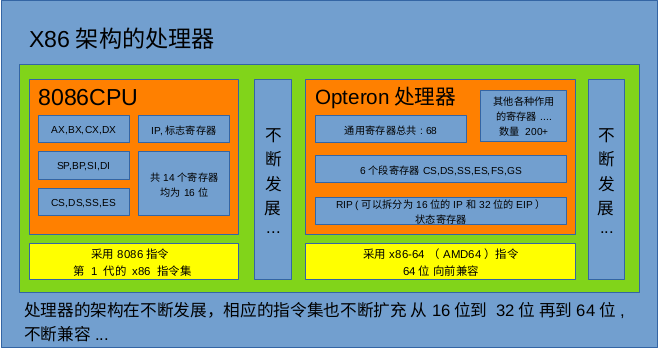

# 实验环境

> 书中的样例CPU：								8086CPU
>
> 书中采用的汇编语法（编译器）： 	MASM
>
> 操作系统环境：									DOS

## 8086CPU

8086CPU是最早的X86架构，拥有最基本的指令集和寄存器架构。

之后CPU的硬件架构和指令集不断的发展，引入新的寄存器和新的指令。

在32位处理器出现后，x86汇编语言也被扩充为32位模式，这种模式被称为IA-32。

后来又出现了64位处理器，x86汇编语言再次扩充，引入新的64位模式，称为AMD64或x86-64。



## x86汇编编译器

汇编语言编写的源程序需要通过汇编编译器翻译为相应的机器码。

在汇编源代码中不单单有机器码对应的汇编语句，还有一些专门给编译器看的、指导编译器工作的内容。不同的组织对于如何书写源程序有不同的想法，就有了不同语法的编译器。

TASM、MASM 和 NASM 都是 x86 汇编程序编译器。其中MASM是x86语法的Microsoft版本，运行在DOS/Windows下；NASM则主要运行于Linux。


> nasm的语法和masm因为同是X86汇编，有许多相似，但也有很多不一样的地方。因为偏离主题太多所以不介绍。

### masm

#### masm的安装

masm汇编工具下载链接 [MASM汇编工具](https://github.com/codists/learnings/blob/main/nasm/%E6%B1%87%E7%BC%96%E8%AF%AD%E8%A8%80/DEBUG.zip) 

masm汇编工具内包含DEBUG.EXE、MASM.EXE、LINK.EXE等可执行文件，这些文件可以在DOS系统下直接执行。

### nasm

#### nasm的安装

```shell
sudo apt install nasm
```

#### nasm的命令

```shell
nasm -f elf 1.asm			#把文件1.asm编译成ELF格式的文件1.o
nasm -f bin 1.asm -o 2.com  #把文件1.asm编译成二进制格式的文件2.com
nasm 1.asm -f bin -o 2.bin	#把文件1.asm编译成可执行文件2.bin
nasm 1.asm -o 2.bin			#如果文件类型可推断，可以不加选项
```

像上面.bin这种只包含机器码，不包含可执行文件信息的文件，不能直接在操作系统上运行。要执行只能绕过操作系统。

## DOSBox

DOS是一种早期的PC命令行操作系统。DOSBox 则是一个模拟 DOS 环境的工具。

早期的Windows是以DOS为底层操作系统的，随着发展Windows逐渐摆脱对DOS的依赖，成为一个独立的操作系统。

### DOSBox的安装

在ubuntu上安装：

```bash
sudo apt install -y dosbox
```

### 常用DOS命令

把masm目录挂载作为c盘

```
mount c ~/nasm_project/masm
```

进入c盘

```
c:
```

查看文件

```
dir
```

## vscode插件

MASM/TASM：run MASM/TASM assembly in DOSBox 汇编语言开发插件