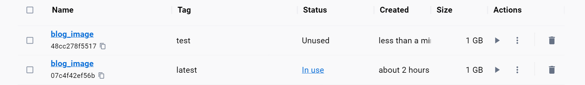
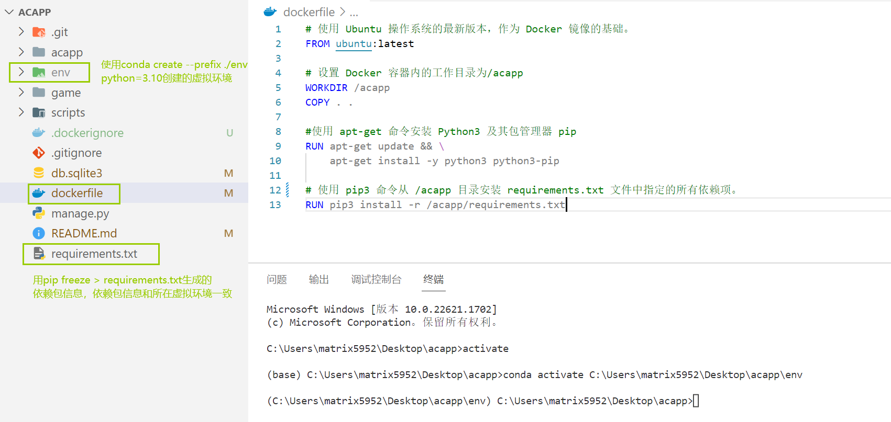
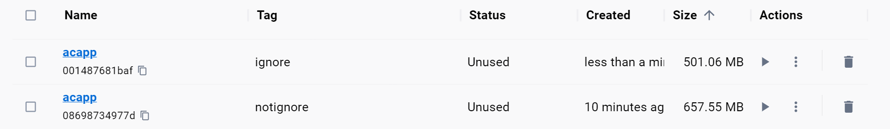
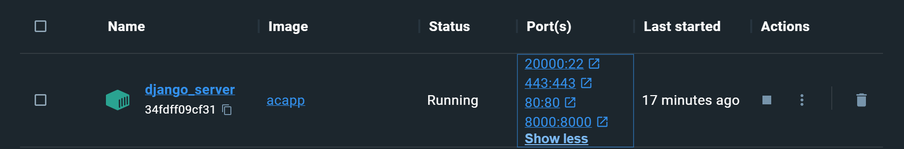
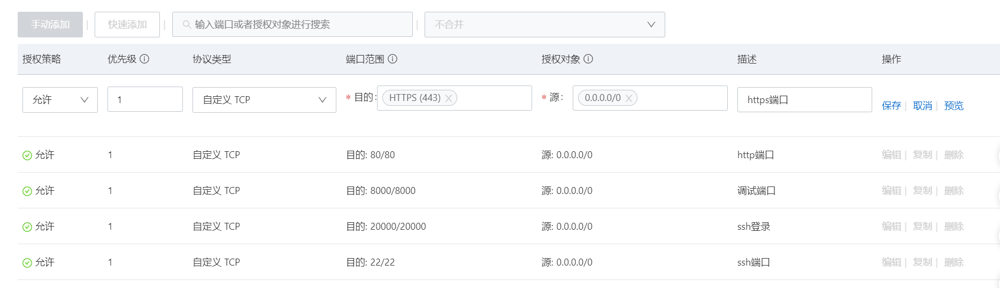

### 参考文档

官方文档 https://docs.docker.com/get-started/02_our_app/

菜鸟教程 https://www.runoob.com/docker/windows-docker-install.html

### 基础命令速查

#### 镜像和容器的实用命令

`docker pull ubuntu:20.04`：从云端拉取`ubuntu:20.04`的镜像，命令中的 `ubuntu`部分指定了包含该镜像的仓库，`:20.04`部分指定了标签，用于识别镜像的特定版本

`docker run -p <本机端口>:<容器端口> --name <容器名称> -itd <镜像名称> `：创建并运行容器，其中`-d`参数使得容器在后台运行，`-p`指明了端口映射，如果使用`-t`参数，将不会在后台运行，而是进入交互式会话。

如果想进入在后台运行的容器，可以使用`docker attach <容器名称>`进入容器，如果用`exit`退出，容器会停止运行，先按`Ctrl+p`，再按`Ctrl+q`可以退出并让容器在后台运行。也可以用`docker exec -it <name> sh`在启动一个新的交互式 shell 会话，这样即使exit了容器也不会停止。

`docker start <容器名称>`：启动容器

`docker images`：列出本地所有镜像

`docker ps -a`：查看本地的所有容器

`docker build -t <镜像名> .`：利用`dockerfile`构建一个镜像，`-t`参数指定镜像名，`.`表示在当前目录下查找`dockerfile`

`docker commit <container_name> <new_image_name>`：将容器导出为镜像，保留容器所有历史文件和元数据

#### 在主机和容器之间传输文件

```powershell
docker cp <SRC_PATH> <mycontainer>:<DEST_PATH>
docker cp <mycontainer>:<SRC_PATH> <DEST_PATH>
```

其中，第一个命令将从主机的 `SRC_PATH` 复制文件或文件夹到运行中的 `mycontainer` 容器内的 `DEST_PATH` 目录，而第二个命令会将 `mycontainer` 容器内的 `SRC_PATH` 的文件或文件夹复制到主机上的 `DEST_PATH` 目录中。

```bash
docker cp blog_server:/blog ./1         #复制blog文件夹到主机当前目录下的1文件夹
docker cp blog_server:/blog/ ./1        #复制blog文件夹下的内容到主机当前目录下的1文件夹
```

#### 导出和导入tar文件

在 Docker 中，可以使用 `docker save` 和 `docker load` 命令来导出和导入镜像，使用 `docker export` 和 `docker import` 命令来导出和导入容器，使用`docker commit`将容器导出为镜像。

```
# save+load模式
docker commit <container_name> <new_image_name>：将容器导出为镜像，会保留容器的所有历史文件和元数据
docker save -o test.tar blog_image         # 导出镜像
docker load -i test.tar                    # 加载镜像

# export+import模式
docker export -o test.tar blog_container   # 导出容器,会丢失所有元数据和历史记录，只保留最新的快照
docker import test.tar blog_image:test     # 导入容器（得到的是镜像）
```

这张截图的`blog_image:test`是用`import`导入的，首先是用`export`把`blog_container`容器导出为`test.tar`，然后用`test.tar`导入成镜像，这个镜像需要命名，这里命名为`blog_image:test`



#### 将本地镜像上传到服务器

将本地镜像上传到服务器，只需要上传`tar`文件即可，例如上传当前目录下的`blog.tar`到已经配置过别名的服务器，这个服务器应该安装了`docker`：

```
scp blog.tar aliyun:/home/acs/   # 上传到用户目录下
```

### docker安装

`Docker` 实质上是在已经运行的` Linux `下制造了一个隔离的文件环境，因此它执行的效率几乎等同于所部署的` Linux `主机。也因此`Docker `必须部署在` Linux `内核的系统上。

如果其他系统想部署 `Docker` 就必须安装一个虚拟 `Linux `环境。以`windows`为例，在 `Windows` 系统上运行 `Docker` 实际上是在运行一个基于` Hyper-V `的虚拟机中运行` Docker `引擎。

> **windows安装**：建议使用`Docker Desktop`，https://docs.docker.com/desktop/install/windows-install/
>
> **linux安装**：建议使用`Docker`引擎，https://docs.docker.com/engine/install/ubuntu/

如果我在`Docker Desktop`里启动了一个容器，即使关闭窗口`Docker Desktop`也会在后台继续运行。在`linux`上，`docker`容器也是以后台进程的方式运行，即使关闭终端也不会停止容器，停止容器要使用`docker stop <CONTAINER_ID>`。

不能在 `Docker `容器或映像中运行` Docker`！！！

### 在`django`项目中使用docker

#### 生成`requirements.txt`

以一个基于`django`框架的应用程序为例，`django`是基于`python`的框架，这个项目一直使用的是旧的`conda`环境，比较杂乱。所以首先我是在项目文件夹下新建一个`conda`环境。执行`conda create --prefix ./env python=3.10`在在当前目录下创建一个名为 `env` 的 `Conda` 环境，其中`--prefix`用于指定安装路径。激活这个环境需要指定路径`conda activate c:\Users\Matrix5952\Desktop\acapp\env`。

切换新环境后缺少相应的依赖包，用`pip`命令安装`django`包，注意一定要在新环境下！最后用`pip freeze > requirements.txt`生成依赖库信息。



#### 创建`Dockerfile`并构建镜像

在项目所在的目录下创建一个 `Dockerfile` 文件来储存 `Docker` 镜像构建时执行的指令。

```dockerfile
# 使用 Ubuntu 操作系统的最新版本，作为 Docker 镜像的基础。name:tag是镜像的命名规范，指定了它的名称和版本
FROM ubuntu:latest

# 设置 Docker 容器内的工作目录为/acapp,在容器中执行命令时，默认的执行路径就是工作目录
WORKDIR /acapp
# 将当前文件夹的所有内容拷贝到容器的工作目录
COPY . . 

#使用 apt-get 命令安装 Python3 及其包管理器 pip
RUN apt-get update && \
    apt-get install -y python3 python3-pip

#使用 pip3 命令安装工作目录下的 requirements.txt 文件中指定的所有依赖项。
RUN pip3 install -r requirements.txt
```

然后执行`docker build -t acapp .`生成镜像，其中`-t`用于指定镜像的名称。生成的镜像会被储存在本地的镜像仓库中，可以使用`docker images`查看所有镜像。

#### 添加`.dockerignore`

因为执行了`COPY . . `，项目文件夹下的所有东西都被拷贝到了镜像里，包括`env`。我们知道`env`是`conda`虚拟环境，它在`windows`系统下创建的，那么直接拷贝到`linux`环境中是否仍可使用？答案是否，注释掉`RUN pip3 install -r requirements.txt`并生成镜像再创建相应的容器，在对应目录下执行`python3 manage.py runserver 0.0.0.0:8000`将告诉你没有`django`这个模块。

因此`env`并没有什么用，我们添加`.dockerignore`使它在构建时被忽略，文件内容如下，顺带着把`**/__pycache__`也忽略了。

```dockerfile
**/__pycache__
env/
```

然后再生成镜像，忽略和不忽略分别构建出的镜像如下，可见size小了很多。



#### 利用镜像创建容器

执行`  docker run -p 20000:22 -p 8000:8000 -p 80:80 -p 443:443 --name django_server -itd acapp`创建如下容器



执行`docker attach django_server`进入终端环境，接下来只要把它当成一个`linux`终端去使用就可以了。

```
# 根目录在/
root@34fdff09cf31:/# ls
acapp  boot  etc   lib    lib64   media  opt   root  sbin  sys  usr
bin    dev   home  lib32  libx32  mnt    proc  run   srv   tmp  var
# 安装vim编辑器
root@34fdff09cf31:/acapp/acapp # apt-get update 
root@34fdff09cf31:/acapp/acapp # apt-get install vim
# 这里略过了添加ALLOWED_HOSTS的过程
# 启动服务器
root@34fdff09cf31:/acapp# python3 manage.py runserver 0.0.0.0:8000
```

`8000:8000`前面的是本机端口，后面的是容器相应的端口，所以在主机的8000端口就可以访问到容器的应用程序。

### `hexo`框架搭建的博客使用docker

#### 创建`dockerfile`

回顾一下博客配置环境的过程，`Hexo`是基于`nodeJS`编写的，所以先安装了`nodeJs`和它的包管理器`npm`，然后执行`npm install -g hexo-cli`全局安装`Hexo`。接着执行以下代码来初始化博客项目，`npm install`会局部安装`dependences`里的所有依赖。

```
hexo init 文件夹名
cd 文件夹名
npm install
```

因此`dockerfile`相应的内容：

```dockerfile
# 基于ubuntu:latest镜像文件
FROM ubuntu:latest 

# -y 自动确认，没加这个会报错，我猜测是执行这个命令的时候一直没确认所以卡住了
RUN apt-get update && \
    apt-get install -y nodejs npm

# 全局安装 hexo
RUN npm install -g hexo-cli

# 设置工作目录并把当前目录下所有文件拷贝到工作目录
WORKDIR /blog
COPY . .
```

此时`hexo`环境就已经配置好了，文件夹下的文件也全部都拷贝过去了，现在思考一个问题。`package.json`里的依赖项有没有必要安装？事实上，现在创建出的镜像生成的容器已经可以运行博客应用程序了，这是因为`node_modules`里包括所有的依赖项，而它们也被拷贝到了镜像里，因此不用二次安装。

#### 添加`.dockerignore`

添加`.dockerignore`，它和`gitignore`一样用通配符匹配文件，这些文件在构建镜像时会被忽略。我直接把自带的`.gitignore`里的内容复制了过来，这里面包括但不限于`node_modules/`。然后用`docker build`创建镜像并`docker run`，结果正如所料`node_modules`没用被拷贝到工作目录下，因此执行`hexo s`时出现了问题。解决方案是执行`npm install`局部安装依赖再执行`hexo s`。所以在`dockerfile`里继续添加以下内容：

```
# 安装模块到项目 node_modules 目录下
RUN npm install
```

但是要注意，`RUN`是在构建镜像时执行而非在创建容器时，因此新安装的模块也被放到了镜像内，所以上面两种方法创建出的镜像其实大小一样。

### `acwing`使用`docker`容器时的案例

做的事情是，先把配置好的镜像上传到云服务器，然后用镜像创建`docker`容器，然后直接通过`ssh`登录。

`AC Terminal`里有已经配置好环境的镜像，然后：

```powershell
scp /var/lib/acwing/docker/images/docker_lesson_1_0.tar server_name:  # 将镜像上传到自己租的云端服务器
ssh server_name  # 登录自己的云端服务器
sudo usermod -aG docker $USER # 将当前用户添加到docker用户组，再执行docker命令时不需要写sudo
docker load -i docker_lesson_1_0.tar  # 将镜像加载到本地
docker run -p 20000:22 --name my_docker_server -itd docker_lesson:1.0  # 创建并运行docker_lesson:1.0镜像
docker attach my_docker_server  # 进入创建的docker容器
passwd  # 设置root密码
```

去云平台控制台中修改安全组配置，放行端口20000，即可通过`ssh`登录自己的docker容器：

```powershell
ssh root@xxx.xxx.xxx.xxx -p 20000  # 将xxx.xxx.xxx.xxx替换成自己租的服务器的IP地址
```

创建工作账户`acs`，`ssh`登录并配置`docker`容器的别名和免密登录，具体可以参考`Linux`基础。

#### 增加容器的映射端口：80与443

在通过浏览器访问网站的时候，如果没指定端口号，网址以`http://`开头则浏览器会默认访问80端口，以`https://`开头浏览器会默认访问443端口。比如说我直接输入`8.130.116.50`，因为是基于`http`协议，所以访问的是80端口，如果在80端口启动了服务器，应该可以访问到。

这个方式是先把容器导出为镜像，然后用镜像重新生成一个映射到443和80端口的容器。先登录到`docker`容器把服务器关闭，再登录到云服务器，然后使用以下命令：

```bash
$ docker commit django_server django_lesson:1.1 #将django_server容器导出为django_lesson:1.1镜像
$ docker images #列出本地镜像
REPOSITORY      TAG       IMAGE ID       CREATED          SIZE
django_lesson   1.1       3fae09fc0465   25 seconds ago   1.61GB
django_lesson   1.0       58e383d3fa92   17 months ago    1.5GB
$ docker stop django_server #停止容器
$ docker rm django_server #删除容器
$ docker run -p 20000:22 -p 8000:8000 -p 80:80 -p 443:443 --name django_server -itd django_lesson:1.1
#用镜像重新生成容器
```



新的容器就创建好了。
