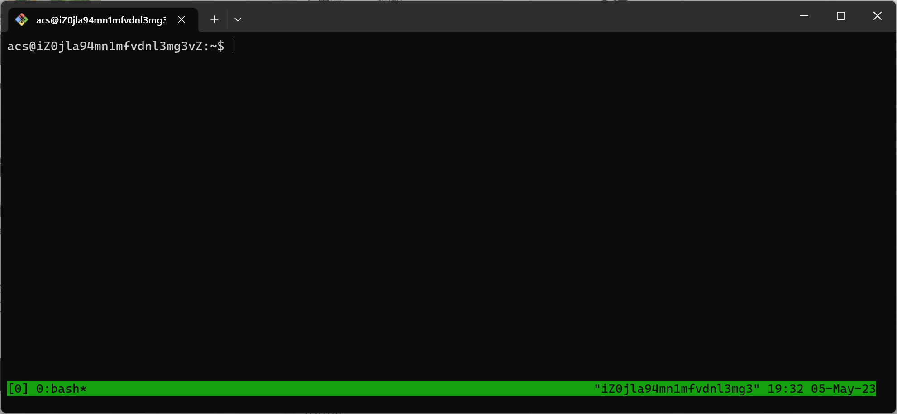
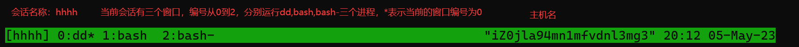

### 参考文档

如何在 Linux 上使用 tmux https://www.howtogeek.com/671422/how-to-use-tmux-on-linux-and-why-its-better-than-screen/

### 安装tmux

在ubuntu上安装tmux

```bash
sudo apt-get install tmux
```

### 常用命令速查

- **Ctrl+B D** — 从当前会话中分离。
- **Ctrl+B X** — 关闭窗格/窗口/会话。
- **Ctrl+B %** — 将窗口水平拆分为两个窗格。
- **Ctrl+B "** — 将窗口垂直拆分为两个窗格。
- **Ctrl+B 箭头键**（左、右、上、下）— 在窗格之间移动。
- **Ctrl+B C** — 创建一个新窗口。

### 启动tmux会话

输入`tmux`启动一个 tmux 会话，底部状态栏信息参考后面会细说。



启动一个命名的`tmux`会话：

```bash
$ tmux new -s <name>
```

### 挂起/进入tmux会话

按下`Ctrl+B`来告诉`tmux`你要使用快捷键了。会话有两种状态：`attached`和`detached`，可以通过按`Ctrl+B`然后按`D`来进入`detached`状态，它将在后台继续运行。

列出活动的` tmux` 会话。

````bash
$ tmux ls
0: 1 windows (created Sat Aug 27 20:54:58 2022)
````

进入名称为0的`tmux`会话

```bash
$ tmux attach -t 0
```

所有` tmux` 命令也可以缩写，例如，您可以输入 `tmux a` ，它的作用与 `tmux attach`相同。

### 使用窗口

按` Ctrl+B`，然后按 `C`来创建窗口

按`ctrl+B`，再按`N`显示下一个窗口

按`ctrl+B`，再按`P`显示上一个窗口

#### 状态栏信息

状态栏右侧显示主机名、时间和日期。左侧显示会话相关信息：

`[0]`：这是会话名称。默认情况下，它们从零开始编号。

`0:bash*`：0 表示这是本次会话中的第一个窗口。在此会话中运行的唯一进程是`bash`。`*`表示正在查看的窗口。



### 使用窗格

`Ctrl+B %`： 将窗口水平拆分为两个窗格。

`Ctrl+B " ` ：将窗口垂直拆分为两个窗格。

窗格只会影响当前窗口

### 关闭会话/窗口/窗格

如果想关闭当前的窗口，可以按`Ctrl+B`再按`X`。当关闭的窗口是此会话的最后一个窗口时，将终止当前的会话。如果有窗格，会先关闭当前的窗格。

### 开启鼠标模式

开启鼠标模式的方法为：先按`Ctrl+B`再按`:`，输入`set -g mouse on` 回车。

