# 参考文档

[在可汗学院学习编程 (文章) | 编程简介 | 可汗学院 (khanacademy.org)](https://zh.khanacademy.org/computing/computer-programming/programming/intro-to-programming/a/learning-programming-on-khan-academy)

[CSS 链接(link) | 菜鸟教程 (runoob.com)](https://www.runoob.com/css/css-link.html)

[学习 Web 开发 | MDN (mozilla.org)](https://developer.mozilla.org/zh-CN/docs/Learn)

还有几本讲css,javascript和jquery的书，可以当字典用

# HTML

你可以把`html`的标签看作`<span>`和`<div>`的拓展，事实上除了一些特别的标签，绝大多数的标签都只是有着不同的`css`样式而已。行内元素可以看作是`<span>`的拓展，块级元素可以看作是`<div>`的拓展。

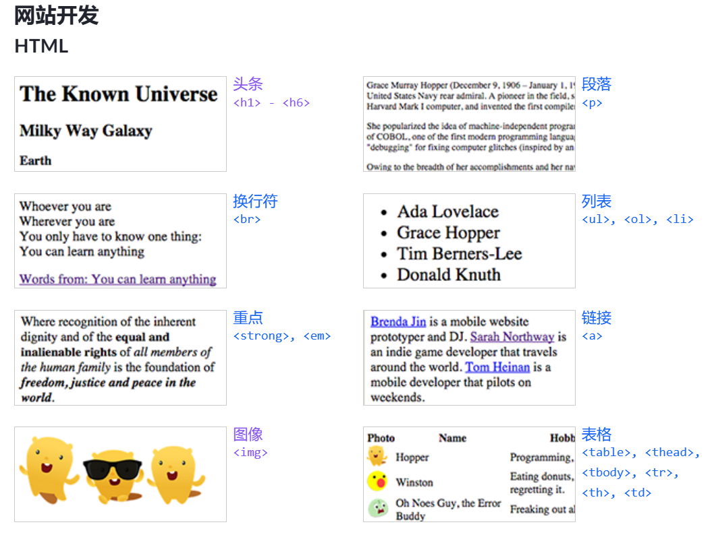

## 块级元素

`<div>`需要独占一行，不满足的时候就会另启一行从头开始。

### `<h1>-<h6>`：头条

<h4>Australia</h4>
<p>The world's six largest country by total area.</p>
<h5>New South Wales</h5>
<p>A state on the east coast of Australia.</p>
<h6>Sydney</h6>
<p>The most populated city in Australia, but not the capital.</p>

### `<p>`：段落

`<p>`标签会把连续的空格只保留一个，删除所有的换行。使用[CSS](https://developer.mozilla.org/zh-CN/docs/Web/CSS) [`margin`](https://developer.mozilla.org/zh-CN/docs/Web/CSS/margin)属性去改变段落之间的间隙，**不要**在段落之间插入空的段落元素或者`<br>`元素。

<p>She popularized the idea of machine-independent programming languages, which led to the development of COBOL, one of the first modern programming languages. She is credited with popularizing the term "debugging" for fixing computer glitches (inspired by an actual moth removed from the computer).</p>
<p><a href="http://en.wikipedia.org/wiki/Grace_Hopper">Biography from Wikipedia: Grace Hopper (CC-BY-SA)</a></p>

### `<pre>`：预定义格式文本

在该元素中的文本通常按照原文件中的编排，以等宽字体`monospace`的形式展现出来，文本中的空白符（比如空格和换行符）都会显示出来。

<pre>      t          kl         
      L          TE
        A       A
          C    V
           R A
           DOU
           LOU
          REUSE
          QUE TU
          PORTES
        ET QUI T'
        ORNE O CI
         VILISÉ
        OTE-  TU VEUX
         LA    BIEN
        SI      RESPI
                RER       - Apollinaire
</pre>


### `<ul>,<ol>,<li>`：列表

<div>
<ul>
    <li>Ada Lovelace</li>
    <li>Grace Hopper</li>
    <li>Tim Berners-Lee</li>
    <li>Donald Knuth</li>
</ul>
<ol>
    <li>1957: Fortran</li>
    <li>1958: Lisp</li>
    <li>1964: BASIC</li>
</ol>
</div>

`<table>`：表格

table 标签用于格式化表格数据。表标签必须包含将数据格式化为标题、行和列所需的所有子标签。 表格应以带有列名的标题行开头。 thead 元素开始标题区域，tr 元素创建一行，th 元素在行中创建单元格。一个表在表头之后可以包含任意数量的数据行。 tbody 标签开始正文（数据）区域，相同的 tr 标签创建一行，td 标签在每行中创建数据单元格。

 <table>
        <thead>
            <tr>
                <th>Photo</th>
                <th>Name</th>
                <th>Hobbies</th>
            </tr>
        </thead>
        <tbody>
            <tr>
                <td></td>
                <td>Hopper</td>
                <td>Programming, hopping.</td>
            </tr>
            <tr>
                <td></td>
                <td>Winston</td>
                <td>Eating donuts, then regretting it after writing programs to realize how bad it is for him.</td>
            </tr>
            <tr>
                <td></td>
                <td>Oh Noes Guy, the Error Buddy</td>
                <td>Freaking out all the time.</td>
            </tr>
        </tbody>
    </table>


## 行内元素

### ``：图片

<div>
     
    
    
</div>


### `<a>`：链接

`<a> `标签既用于链接到其他网站，也用于链接到当前网页的部分内容。它有一个必需的属性：`  href `。如果它应该转到一个新页面，那么这应该是一个以 `http://` 或` https://` 开头的 URL。如果它应该在当前页面内跳转，那么它应该以“#”开头，然后匹配要跳转到的标签的 id 属性（如“`#main`”）。  a 标签应包含浏览器应使其可点击的任何内容。这通常是文本，但也可以是图像或任何标签集合。

在新页面打开加上`target="_blank"`

<div>
    <a href="https://developer.mozilla.org/zh-CN/docs/Web/HTML/Element/canvas">canvas的链接</a>
    <a href="#hh">到文章开头</a>
</div>


### `<br>`：换行

### `<em>`：斜体

### `<strong>`：加粗

## 转义字符

`<`是特殊字符，要转义。`<`用`&gt;`，`>`用`&lt;`。空格是`&nbsp;`。

# CSS

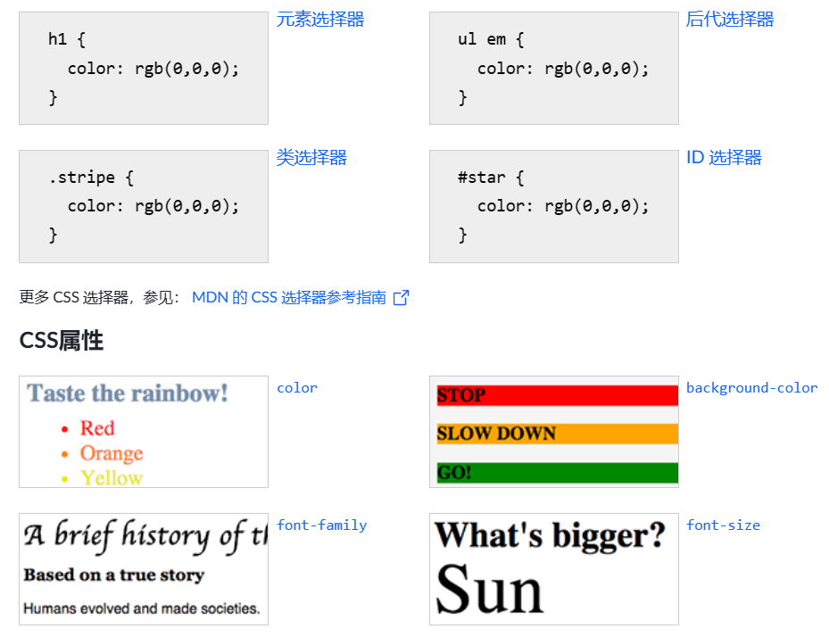

## 插入样式表

插入样式表就是如何导入css样式

### 行内样式表

当样式仅需要在一个元素上应用一次时使用，这不是一个好方法

```html


<div style="width:300px;height:300px;background-color: blue">qmy</div>
```

### 内部样式表（一个页面）

`<style>`放在body和head里都行。设置单个页面的css样式就用这个。

```css
<head> 
  <style> 
    hr {color:sienna;}
    p {margin-left:20px;} 
    body {background-image:url("images/back40.gif");}  
  </style> 
</head>
```


### 外部样式表（多个页面）

当样式需要应用于很多页面时，就用一个css文件存储样式，使用`<link>`在html中导入样式文件

```html
<head> 
<link rel="stylesheet" type="text/css" href="mystyle.css"> 
</head>
```

下面是一个样式表文件的例子：

```css
hr {color:sienna;} 
p {margin-left:20px;} 
body {background-image:url("/images/back40.gif");}
```

### 覆盖问题

后来者覆盖前者

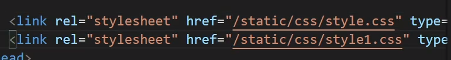

## 选择器

### 元素选择器

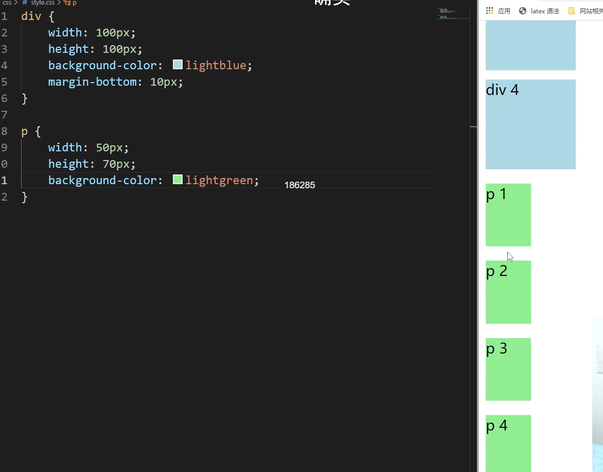

### id选择器 `#`

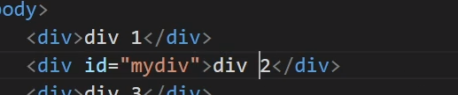

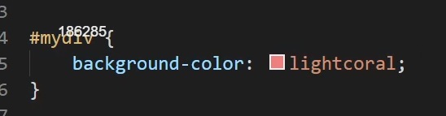

### class选择器 `.`

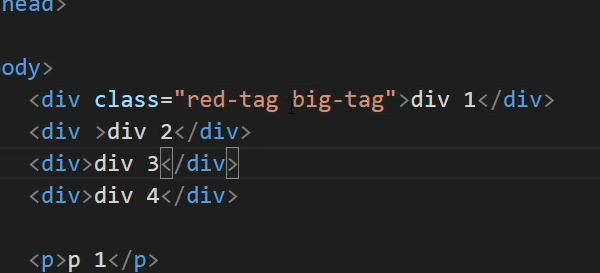

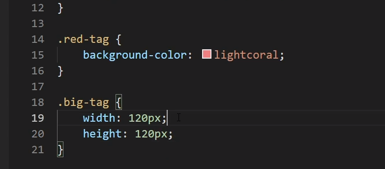

### 伪类选择器（用于变化）

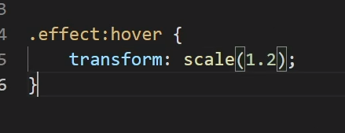

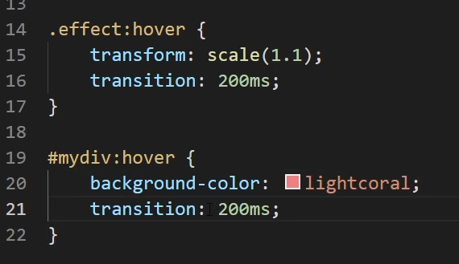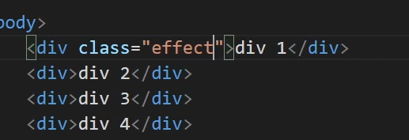

鼠标放上去是hover状态，放大1.2倍

#### 超链接

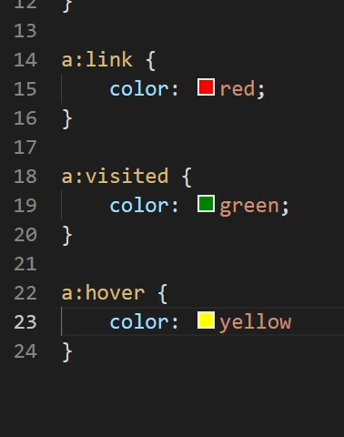

#### 按钮

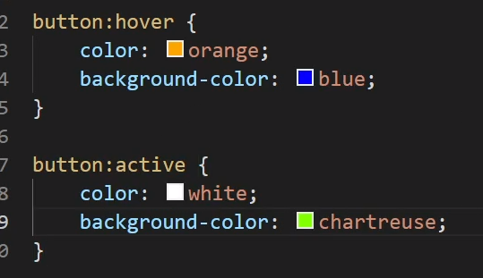

#### 父节点的第二个变蓝

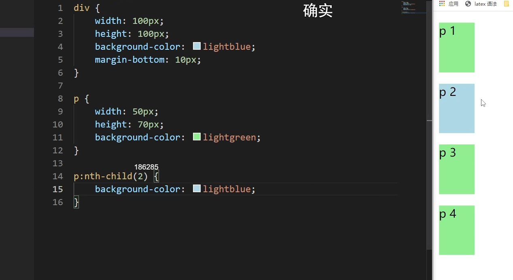

## 常用属性

## 数值

`1em`：`1em`等于`font-size`，如果`font-size`使用`em`，则`1em`等于父元素的`font-size`

`70vh`：相对于视窗高度的70%

`70%`：父元素的宽度的70%

### 文本属性

`font-weight`：设置字体粗细，`blod`

`font-family`：字体

`font-size`：字体大小

`font-style`：倾斜程度，`italic`

`text-align`：对齐方式


### 盒子属性

一切皆是盒子

`margin`：外边距

`padding`：内边距，`1em`

`border`：边框，`4px dashed rgb(222,22,22)`

## css布局

`float:left`浮动的元素会脱离文档流，它会被拉到容器的一侧，然后由文档流包围它。多个浮动的盒子不会发生重叠，会紧靠在一起。

`position:absolute`也是会脱离文档流，然后相对于最近的已定位的祖先元素进行定位，若没有，就相对于文档定位。记得设置`top,right`等属性

# Javascript

## 使用方式

HTML页面中的任意位置加上`<script>`标签即可。

1. 直接在`<script></script>`标签内编写JS代码。

2. 将所需的代码通过`import`关键字引入到当前作用域。要使用`import`和`export`关键字必须用`<script type="module">`以ES6模块方式解析`js`代码。ES6的变量作用域是模块级别的，在其他模块中使用，要在`js`文件中用`export {name,print}`的方式导出变量或函数，然后用`import { name, print } from './example.js`导入变量。

   ```html
   <script>
       import {name,print} from "./example.js"
       print();
   </script>
   ```

   `./example.js`代码如下

   ```js
   let name = "acwing";
   function print() {
       console.log("Hello World!");
   }
   export{
       name,print
   }
   ```

3. 通过`src`属性导入`js`文件。如果使用了`src`属性就不应该在标签内包含js代码，因为会被忽略。`src`可以是一个完整的URL，可以来自外域，解析这个资源时会发送`GET`请求以获取资源。比如导入`jquery`。

   ```html
   <script src="https://cdn.staticfile.org/jquery/1.10.2/jquery.min.js"></script>
   ```

   

## 执行顺序

从上到下逐步执行，因此由于页面在解析到`<body>`标签时候开始渲染，把`<script>`放在`<body>`里，可以不用在完全加载javascript脚本后再渲染。

## 变量与运算符

### let与const

`let`用来定义变量，`const`用来定义常量，给常量赋值会报错。

### 变量类型常见用法

`number`：数值变量，例如1, 2.5

```js
let x=1.y=1.2;
console.log(typeof x,typeof y)
let t = 1.234567;
let s = t.toFixed(2); //保留后两位，s是string类型
```

`string`：字符串，例如"acwing", 'yxc'，单引号与双引号均可。字符串中的每个字符不像c++的可以修改，Javascript的字符串是只读的。如果想修改字符串只能重新构造。\`\`内的是模板字符串，可以包含变量和表达式，并且可以跨行书写。`parseInt`和`parseFloat`可以把字符串解析为对应的数据类型。

```js
let s1="acwing",s2='qmy';
console.log(s1[1]); //可读

let s3=s1/substr(0,1)+'x'+s1.substr(2);
console.log(s3);

let s=`My name is ${name}, I'm ${age/2} years old.`;
const message = `
  This is a multi-line
  string that spans
  several lines.
`;
```

`boolean`：布尔值，例如true, false

```js
let flag=false;
console.log(typeof flag);
```

`object`：对象类型，它是一组键对值，例如`{name: "yxc", age: 18}`，它在`js`里用的非常的多。还有`[1, 2, 3]`，`null`，`dom`元素等，它们由`object`派生而来。

```js
let d = { name: 'qmy', age: 20 };

d['name'] = 'yxc';
d['school'] = 'nuist';
d.school = 'nuist';

console.log(d['name'], d["age"]);
console.log(d.name, d.age);
console.log(d);

//数组对象
const arr=[1,2,3];
console.log(arr[0]); //1
console.log(arr.length);
console.log(arr['length']);
//dom对象
let d=document.querySelector("div");
console.log(typeof(d));
```

`undefined`：未定义的变量

```js
let t;
console.log(typeof t);
let t=undefined
```

和python一样，变量的类型是动态的。

### 解构赋值

```js
let [a,b]=[1,2];
let {name, age} = {name: 'Alice', age: 18};


let [a,b]=input.value.split(' '); //input是<textarea>
a=parseInt(a),b=parseInt(b);
output.innerHTML=a+b;

```

### 运算符

`**`表示乘方，等于与不等于用`===`和`!==`

逻辑运算符和`c++`一样，`&&`表示与，`||`表示或，`!`表示非

## 输入和输出

### 获取输入的方式

从HTML与用户的交互中获得信息，例如通过`input`、`textarea`等标签获得输入，然后用`js`取得相应的`dom`元素，添加相应的监听器，通过通过`click`、`hover`等事件触发回调函数，处理`dom`元素的数据。

```html
<textarea class="input" name="" cols="30" rows="10"></textarea>
<br>
<button>Run</button>
<br>
<pre></pre>
<script type="module">
    import {main} from "./example.js";
    main();
</script>
```

`./example.js`代码如下，`querySelector`是原生`javascript`中的可以根据`css`选择器匹配`dom`元素的方法，详细见常见`api`。

```js
let input=document.querySelector(".input");
let run =document.querySelector("button");
let output=document.querySelector("pre");

function main(){
    run.addEventListener("click",function(){
        let s=input.value;
        output.innerHTML=s; 
    });
    console.log(input);
}

export{
    main
}
```

通过`Ajax`与`WebSocket`从服务器端获取输入，详细见常见`api`。

标准输入，使用`process.stdin`，这个不重要

```js
process.stdin.setEncoding('utf8');

process.stdin.on('readable', function() {
  var chunk = process.stdin.read();
  if (chunk !== null) {
    // 处理输入数据
    console.log('输入的数据是：' + chunk);
  }
});
```

### 输出方式

调试用`console.log`，会将信息输出到浏览器控制台
改变当前页面的`HTML`与`CSS`
通过`Ajax`与`WebSocket`将结果返回到服务器

## 判断和循环

### 判断

```js
let score = 90;
if (score >= 85) {
    console.log("A");
} else if (score >= 70) {
    console.log("B");
} else if (score >= 60) {
    console.log("C");
} else {
    console.log("D");
}
```

### 循环

JavaScript中的循环语句与C++中类似，也包含`for`、`while`、`do while`循环。

```js
//0~9
for (let i = 0; i < 10; i++) {
    console.log(i);
}
//0~9
let i=0;
while(i<10){
    console.log(i);
    i++;
}
//第一次无条件执行，0~9
let i=0;
do{
    console.log(i);
    i++;
}while(i<10)
```

### 枚举数组

```js
const arr = [1, 2, 3];
for (let i = 0; i < arr.length; i++) {
  console.log(arr[i]);
}

arr.forEach(function(item) {
  console.log(item);
});
```

### 枚举对象

```js
const obj = { name: 'Alice', age: 18 };
for (let key in obj) {
  console.log(key + ': ' + obj[key]);
}

const keys = Object.keys(obj);
keys.forEach(function(key) {
  console.log(key + ': ' + obj[key]);
});
```

## 函数

以下为三种定义方式，如果没有定义返回值，返回`undefined`。

```js
function add(a, b) {
    return a + b;
}

let add = function (a, b) {
    return a + b;
}

let add = (a, b) => {
    return a + b;
}
```

函数的`this`让人迷惑，对于不是箭头函数的情况，`function`中的`this`指针在被调用时动态确定，调用时谁直接指向函数的地址，`function`中的`this`就是谁的`this`，这篇知乎写的很好/[彻底搞懂JavaScript中的this指向问题 - 知乎 (zhihu.com)](https://zhuanlan.zhihu.com/p/42145138)。箭头函数的情况不太了解。

## `object`

对象因为很重要，单独拿出来详细写一遍，它由一组`key:value`构成。`value`可以是变量、数组、对象、函数等。

```js
let person = {
    name: "yxc",
    age: 18,
    money: 0,
    add_money: function (x) {
        this.money += x;
    }
}
```

属性这样调用

`person.name`,`person.add_money()`
`person["name"]`,`person["add_money"]()`

### 数组

数组由`object`派生而来，数组的下标不需要连续，可以是1,2,4,10...，数组的元素可以是变量，数组，对象，函数。

```js
let a = [1, 2, "a", "yxc"];

let b = [
    1,  // 变量
    "yxc",  // 变量
    ['a', 'b', 3],  // 数组
    function () {  // 函数
        console.log("Hello World");
    },
    { name: "yxc", age: 18 }  // 对象
];

console.log(b[4]['name']);
b[0]=function(){
    console.log("嗨嗨嗨")
}
b[0](); //该函数的this指针指向该数组，详细看上面的解释
```

属性`length`：返回数组长度，即最大下标+1。注意length是属性，不是函数，因此调用的时候不要加()
函数`push()`：向数组末尾添加元素
函数`pop()`：删除数组末尾的元素
函数`splice(a, b)`：删除从a开始的b个元素
函数`sort()`：将整个数组从小到大排序
自定义比较函数：`array.sort(cmp)`，函数cmp输入两个需要比较的元素，返回一个实数，负数表示第一个参数小于第二个参数，0表示相等，正数表示大于。

ellipse(x,y,w,h)绘制椭圆

react(x,y,w,h)绘制长方形

line(x1,y1,x2,y2)绘制线段

## 类

类的`this`指向类的实例。

### 定义

```js
class Point {
    constructor(x, y) {  // 构造函数
        this.x = x;  // 成员变量
        this.y = y;
        this.init();
}

    init() {
        this.sum = this.x + this.y;  // 成员变量可以在任意的成员函数中定义
    }

    toString() {  // 成员函数
        return '(' + this.x + ', ' + this.y + ')';
    }
}

let p = new Point(3, 4);
console.log(p.toString());
```

### 继承

```js
class ColorPoint extends Point {
    constructor(x, y, color) {
        super(x, y); // 这里的super表示父类的构造函数
        this.color = color;
    }
    toString() {
        return this.color + ' ' + super.toString(); // 调用父类的toString()
    }
}
```

注意：
`super`这个关键字，既可以当作函数使用，也可以当作对象使用
作为函数调用时，代表父类的构造函数，且只能用在子类的构造函数之中。作为对象时，指向父类的原型对象。
在子类的构造函数中，只有调用`super`之后，才可以使用`this`关键字。
成员重名时，子类的成员会覆盖父类的成员。类似于C++中的多态。

### 静态方法

在成员函数前添加`static`关键字即可。静态方法不会被类的实例继承，只能通过类来调用。例如：

```js
class Point {
    constructor(x, y) {
        this.x = x;
        this.y = y;
    }

toString() {
    return '(' + this.x + ', ' + this.y + ')';
}

static print_class_name() {
    console.log("Point");
}

}

let p = new Point(1, 2);
Point.print_class_name();
p.print_class_name();  // 会报错
```

### 静态变量

在ES6中，只能通过`class.propname`定义和访问。例如：

```js
class Point {
    constructor(x, y) {
        this.x = x;
        this.y = y;
        this.id=Point.cnt;
        Point.cnt++;
}

toString() {
    return '(' + this.x + ', ' + this.y + ')';
}

}

Point.cnt = 0;

let p = new Point(1, 2);
let q = new Point(3, 4);

console.log(Point.cnt);
```

## 常用事件

`addEventListener(event,function)`为元素绑定事件触发的函数。

`event`可选的鼠标事件有单击`click`,双击`dblclick`,右击`contextmenu`,按下`mousedown`,抬起`mouseup`等，可以用`event.type`获得对应的鼠标事件，用`event.button`获得按下的按键，`event.clientX`获得事件发生的横坐标等。

```js
div.addEventListener('click',function(event){
        console.log(event.type);
});
```

`event`可选的键盘事件有按下`keydown`，抬起`keyup`。`event.code`返回按的是哪个键。`event.altKey`、`event.ctrlKey`、`event.shiftKey`分别表示是否同时按下了alt、ctrl、shift键。

```js
input.addEventListener('keydown',function(event){
	console.log(event.type,event.code,event.altKey,event.ctrlKey);
});
```

表单事件：`focus`和`blur`两个`event`分别表示聚焦和失去焦点。`change`表示元素发生改变，只有在失去焦点的时候才会判断元素是否发生了改变。

窗口事件：需要绑定到全局对象`window`上。`resize`：当窗口大小放生变化，`scroll`：窗口的轴发生滚动的时候，`load`：当元素被加载完成时触发。

```js
window.addEventListener('resize',function(event){
    console.log(event.type);
});
```

## API

### `querySelector()`

`querySelector()`接收`css`选择符，返回匹配的第一个后代元素

```js
let body=document.querySelector("body"); // 匹配<body>元素
let myDiv =document.querySelector("#myDiv");// 取得ID为"myDiv"的元素
let selected=document.querySelector(".selected");// 取得第一个类名为"selected"的元素
let img=document.querySelector("img.button");// 取得类名为"button"的图片
```

### 异步函数

`setTimeout(func, delay)`：delay毫秒后，执行函数func()。

`clearTimeout()`：关闭定时器，例如：

```js
let timeout_id = setTimeout(() =>js {
    console.log("Hello World!")
}, 2000);  // 2秒后在控制台输出"Hello World"
clearTimeout(timeout_id);  // 清除定时器
```

`setInterval(func, delay)`：每隔delay毫秒，执行一次函数func()，第一次在第delay毫秒后执行。

`clearInterval()`：关闭周期执行的函数，例如：

```js
let interval_id = setInterval(() => {
    console.log("Hello World!")
}, 2000);  // 每隔2秒，输出一次"Hello World"
clearInterval(interval_id);  // 清除周期执行的函数
```

`requestAnimationFrame(func)`：该函数会在下次浏览器渲染页面之前执行一次，通常会用递归写法。回调函数有一个参数，它会被赋值为函数执行的时间戳，单位为毫秒。例如下面的代码：

```js
let step = (timestamp) => {  // 每帧将div的宽度增加1像素
    $('div').width($('div').width()+1); //有参数设置，无参数获得
    requestAnimationFrame(step);
};
requestAnimationFrame(step);
```

考虑到每次渲染的间隔时间不完全相同，所以有时候需要以时间作为单位去计算一些值，例如速度路程之类的，可以这样写。注意，如果把浏览器切到后台就不会继续渲染，因此也不会再执行回调函数，这时候切回浏览器，时间间隔会很大。

```js
let last_timestamp=0;
let step = (timestamp) => {  // 每帧将div的宽度增加1像素
    console.log(timestamp-last_timestamp);
    last_timestamp=timestamp;
    $('div').width($('div').width()+1); //有参数设置，无参数获得
    requestAnimationFrame(step);
};
requestAnimationFrame(step);
```

### `localStorage`

数据存储方式：后端有云盘，mysql，redis，越往后数据越小访问越快；前端有`js`的变量，还有`localStorage`。

用`localStorage`保存的键值对储存在浏览器的本地存储空间中，它的作用域是与域名相关的。在浏览器的`application`里可以查看。

```js
localStorage.setItem('name','qmy');
localStorage.getItem('name');  //查不到就是null
localStorage.removeItem('name');
console.log(localStorage);
localStorage.clear();
```

### JSON

数据用键值对存比较方便，但是有的函数比如`WebSocket`的`send`就是只能传字符串，所以要有函数可以把键值对和字符串相互转换。

```js
let obj ={
    name:"yxc",
    age:18,
};
let str=JSON.stringify(obj);
let new_obj=JSON.parse(str);
console.log(str,typeof(str));
console.log(new_obj,typeof(new_obj));
```

### 日期

`Date.now()`返回一个整数，表示自 1970 年 1 月 1 日 00:00:00 UTC（协调世界时）起经过的毫秒数。

`Date.parse("2022-04-15T15:30:00.000+08:00")`将日期字符串转换为时间戳，相对于协调世界时。

### WebSocket

`Http`是基于请求-响应模式的协议，只能是`client`向`Server`主动发送请求，`Server`没法主动向`client`发消息。`WebSocket` 是一种基于消息的协议，它可以在`client`和`Server`之间建立一个全双工的连接，从而`Server`可以主动向`client`发信息。`ws`协议也有个加密版叫做`wss`。

```js
var socket = new WebSocket("ws://localhost:8000/"); //建立ws协议的连接。
socket.onopen = function() {     //当连接建立时触发。
  console.log("WebSocket 连接已打开");
};
socket.onmessage = function(event) {     //当从服务器端接收到消息时触发。
  console.log("收到消息：" + event.data);
};
socket.send("Hello, WebSocket!"); //向服务器端发送一个字符串。一般用JSON将传入的对象序列化为字符串。
socket.onclose = function(event) {   ////当连接关闭后触发。
  console.log("WebSocket 连接已关闭，状态码：" + event.code + "，原因：" + event.reason);
}; 
socket.close(); //关闭WebSocket连接
```

### Window

```js
window.open("https://www.acwing.com") //在新标签栏中打开页面。
location.reload() //刷新页面。
location.href = "https://www.acwing.com" //在当前标签栏中打开页面。
```

### canvas

[Canvas 教程 - Web API 接口参考 | MDN (mozilla.org)](https://developer.mozilla.org/zh-CN/docs/Web/API/Canvas_API/Tutorial)

### jquery

是javascript的一个扩展库，当成语法糖就行。引入用第三中导入方式，可以是外域的url，也可以把jquery下载到本地，放到项目文件夹下用相对路径导入。

```js
<script src="https://cdn.staticfile.org/jquery/1.10.2/jquery.min.js"></script>
<script src="./jquery-3.7.0.js"></script>
```

`$()`是一个函数，它可以接受 CSS 选择器、HTML 代码、DOM 元素、函数等参数，返回`jquery`对象。`javascript`变量可以包含`$`字符，把它作为`jquery`对象变量的前缀只是为了增强代码可读性。

```js
let $div=$('.mydiv')  //匹配所有满足条件的dom元素

//绑定与解绑
$div.on("click",function(e){console.log(e.type,e.which)});
$div.click(function(e){})  //快捷写法
$div.off("click");

//存在多个相同类型的事件触发函数时，可以通过click.name来区分
$div.on("click.name1",function(e){console.log(e.type)});
$div.off("click.name1");

$div.on("click",function(e){e.stopPropagation();});//阻止向上传递
$div.on("click",function(e){e.preventDefault();});//阻止当前事件触发
$div.on("click",function(e){return false;});//事件触发函数的return false等价于同时执行上面两个

$div.hide(1000);   //1000毫秒隐藏
$div.show(1000);   //1000毫秒展示

//操控dom元素
let $p =$("<p id=\"p1\">Hello, world<span>!!</span></p>") ;
$div.append($p); //为$div里的所有dom元素添加$p
$div.remove(); //删除$div里的所有dom元素
$div.empty();//删掉所有匹配的dom元素的的后代

//操控元素的选择器
$div.addClass('my-div');//添加类
$div.removeClass('my-div');//删除类
$div.hasClass('my-div');//判断类是否存在

//获得或修改元素的css样式、属性或内容，有值就是修改，没值就是获得
$div.css('background-color'); //获得css样式
$div.css('background-color','orange'); //修改css样式
$div.css({
    width:"200px",
    height:"200px",
    "background-color":'orange',
})
$div.attr('yxc');  //<div yxc="18"></div> 获取yxc的值，结果是'18'
$div.attr('id',"ID"); //把id的值改为ID
$div.text();   //无参数返回不带标签的文本，有参数就是设置文本
$div.html('hello world'); //无参数就是获取html标签，有参数就是设置文本内容
$input.val('hhh'); //无参数获取输入的值，有参数设置输入的值

//查找相邻节点
$div.parent(); //查找父节点
$div.parents('.div-1'); //祖先节点，用选择器筛选class为div-1的元素
$div.children('div'); //儿子节点，要满足是div标签
$div.find(); //子孙节点，注意不是childrens

//文档加载完毕后执行,隐式执行了$(document).ready(function(){})
$(function() {
    console.log("DOM is ready");
});
```

### `ajax`

jquery封装了原有的`ajax`，它用于发送异步请求。`GET` 请求将`data`参数附加在 URL 后面，以 `?` 开头，多个参数之间用 `&` 分隔；`POST` 请求将`data`参数放在请求体中，不会在 URL 中显示。因此提交表单使用`POST`更隐私，获取资源的时候使用`GET`。

```js
$.ajax({
    url: url,
    type: "GET",  //'POST'
    data: {
    },
    dataType: "json",
    success: function (resp) {
	},
});
```

