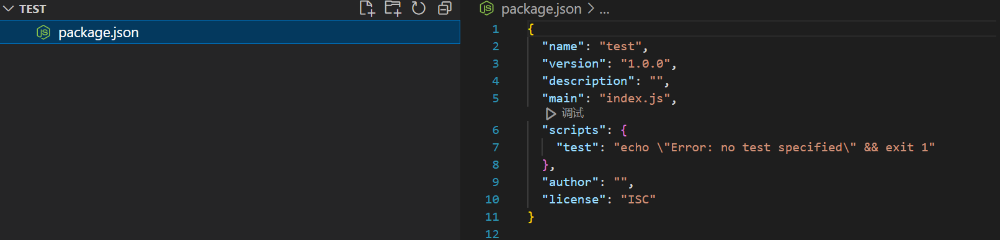
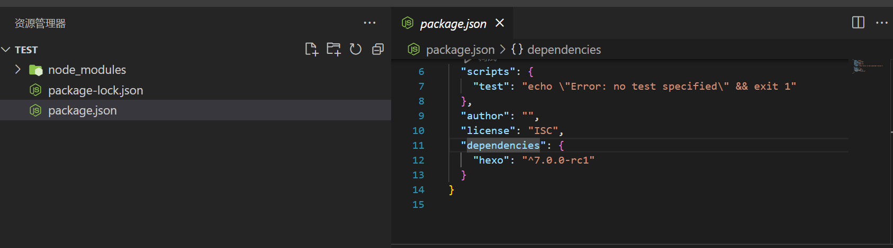
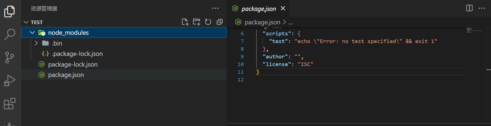
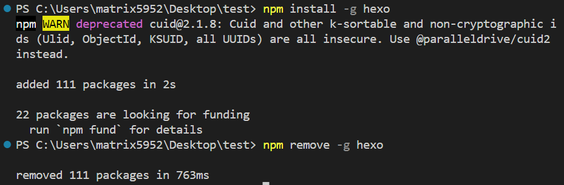
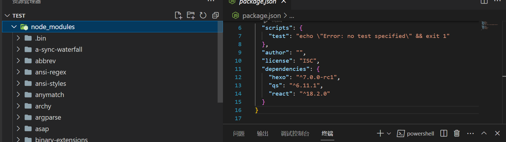
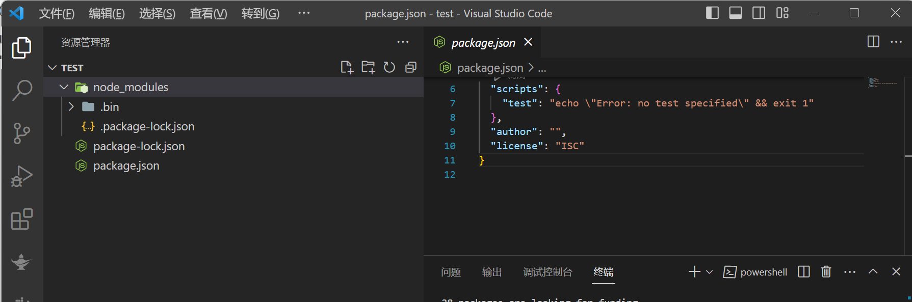

#### 玩一玩`npm`

首先执行`npm init`生成`packages.json`文件



`npm install hexo  ` ：局部安装 添加依赖



`npm remove hexo` ：截图是顺着代码执行下来的，能看出`remove`会自动删除相应的依赖



全局安装和全局删除，`dependencies`没有变，`node_modules`也没有变



```
npm install hexo
npm install qs
npm install react
```

然后删除`node_modules`，执行`npm install`，可见`dependencies`的包都被装上了



```
npm remove hexo qs react
```

执行完又是光秃秃的了


