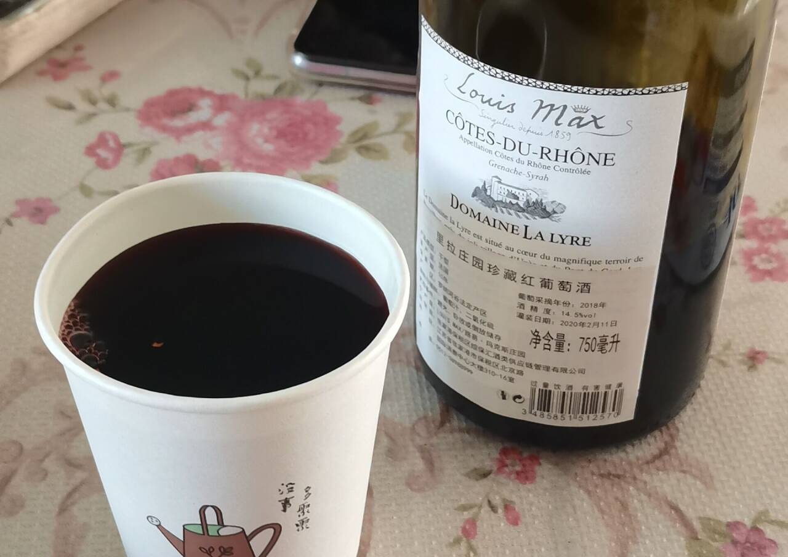
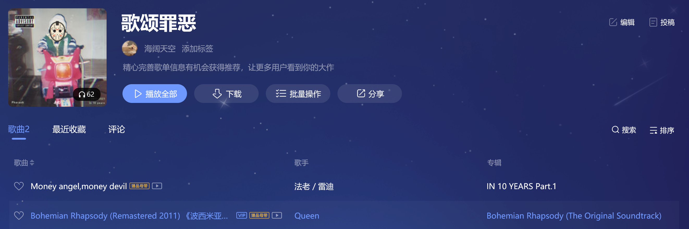
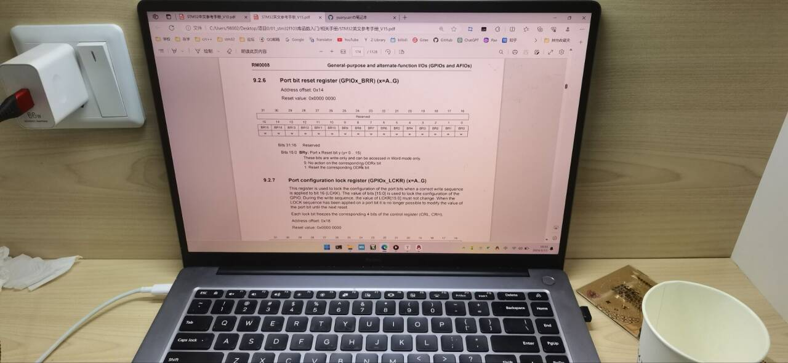
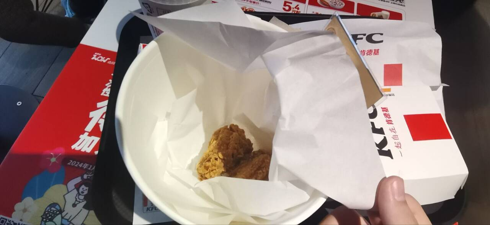

## 1.12

------

上午打打驾照学时，中午去奶奶家喝了瓶葡萄酒倒头就睡，下午四处随便逛逛，晚上再学一两小时，一天就过去了。我还是太摆了，这可如何是好？对自己还是太温柔了。

今天晚上和老爸聊了很多，聊到驾校聊到闻神然后又谈到网红。刷抖音不能给我带来乐趣，但是观察网络上的各种现象是很有意思的，当然你得保持清醒，不然会掉进信息漩涡。像闻神这个人很精明，是很擅长洞察机遇的，当初是受另一个网红启发开始跳舞，一步步发展过来的。他的视频抓住了许多当代年轻人的心理，引发他们的共鸣。在刷屏朋友圈的那几天闻神果断开了直播，净赚860w。很多人心里不平衡：我兢兢业业工作，一辈子也赚不了那么多。是这样的，这是实话。我爸说他们那会是造火箭没有卖茶叶蛋赚钱，俞敏洪是去国外洗盘子比在国内干啥都赚钱。事情见的多了，就开始对过去的看法反思，渐渐觉得什么都不奇怪了。

我说，时常满足私利的事情对社会不见得有利，比如像网红这些事情很赚钱，但是对社会的影响是极坏的。像直播带货，没有一个带货主播能真正的为他们的产品负责，但你想赚这份钱就不能被良心绊住了脚，你的行动得以卖出产品为目的。我一直在挣扎，迈不过良心这道坎，不愿意做对不起良心的事情，但如今为了赚钱，为了能在大城市立足，我必须得先迈过良心这道坎。不要去害怕算计和利用别人，也不要害怕被别人利用和算计。要掌控更多的资源，会演戏会伪装会利用别人是必须的。要赚钱，就得狠。唯独违背法律的事情不可以做，因为那种力量是难以对抗的。我爸说，说的对，迈过了坎就好。

我想了很久，但为了区别自己和那些臭虫并不一样，我是为了“崇高的理想”，但被逼无奈才选择成为的“精致利己主义者”，我要成长就不能用条条框框束缚自己。想了一句话来恳求自己的原谅：“**通往天堂的道路上，我与魔鬼同行**”。

## 1.13

------

租了一寒假的自习室。每天7:30-9:30是打学时，打完学时就往自习室跑了。每天学上8小时，大力出奇迹，期待下学期与七七前辈见面。

寒假初把小时候收藏的破铜烂铁收拾了一下，然后列了份物件清单放闲鱼上卖，已经卖了1600了，可这毕竟属于今朝有酒今朝醉的赚钱方式，不过也暂时够我寒假花了。

滚去kfc，实在是索然无味，我的确是一个不懂享受的人，我得接受这一点。要我说，还是学习和赚钱比较有意思。其他东西带来的快乐都不会长久，只有这两者带来的快乐是永远的。

> 我们必须要吃、喝、睡、懒、爱，必须要对生活中最甜美的事物进行接触，但是却不能沉湎其中，在做全部这些必须做的事情的时候，还要坚定不移地保持主导思想的正统地位，并使它在我们可怜的脑袋里面坚定不移地发展下去。我们必须要把生活变成一个梦，然后再使梦想变成现实。

## 1.15

------

下午在自习室学了会，觉得自己还是适合写读书笔记，然后一边写一边重复回想记忆学到的东西，一定要动脑子去追问，不要只看。

晚上和我爸去喝酒了，上次跟我爸去应酬还是五六年前，那时我还小，总是在沙发上玩手机。放假刚回来我和我爸说有酒席一定要带我去学学，今晚就跟着去了。我爸是和几个同事喝酒的，酒席上我认真的观察他们每个人的言行举止，的确是很精彩。座位是按照职位高低坐的，出门也是领导先请。像领导，话就比较少，都是手底下人在活跃气氛，夸这夸那，装傻。领导有时候会说一些证明自己的观点，这个时候要给领导面子，若是能展开阐述一下领导的话讨领导欢喜就更好了。

还有酒这个东西，一杯伤身卸去防备的酒，就好像在说：“小弟我鞠躬尽瘁，一定跟着领导好好干。”喝酒只是表面，以示忠心才是真，一杯酒就能拉近你我之间的距离。这种表示忠诚的方式和酒的烈、醉、去防备是一脉相通的。用我爸的话来说，就是“中国酒文化”。

酒席有时候避之不及，但要明白这只是为了拉近和人的关系。我们要去积极的寻求别人的肯定，但无论何时还是要听自己内心的判断，因为它更可控，不容易被别人误导。
