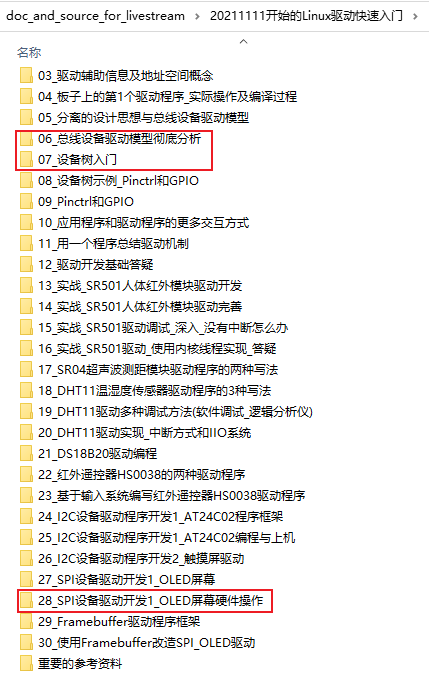
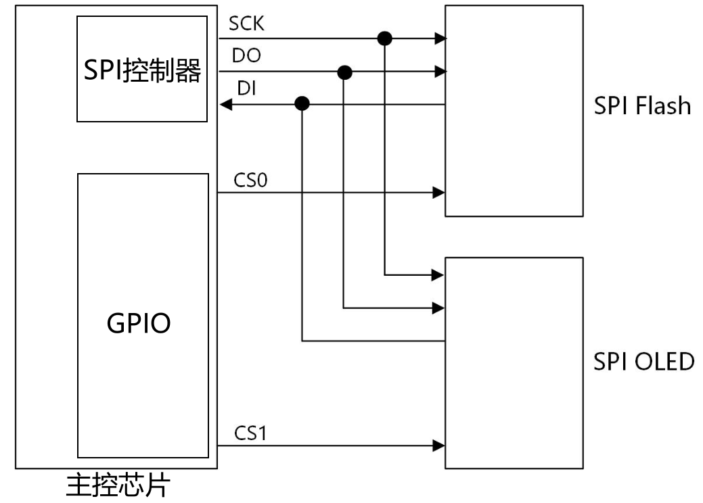

# SPI驱动程序模板

参考资料：

* 内核头文件：`include\linux\spi\spi.h`

* 百问网驱动直播课里对应的源码

  * GIT仓库：https://e.coding.net/weidongshan/livestream/doc_and_source_for_livestream.git
  * 源码位置：
    

* 上述源码也放到了驱动大全的GIT仓库里，位置如下：
  

  

## 1. 回顾平台总线设备驱动模型

Linux驱动程序开始基于"平台总线设备驱动"模型，把驱动程序分成2边：

* 左边注册一个platform_driver结构体，里面是比较固定的、通用的代码

* 右边注册一个platform_device结构体，里面是硬件资源

  * 可以在C文件中注册platform_device
  * 也可以使用设备树创建一个节点，内核解析设备树时注册platform_device

  


## 2. 数据结构

SPI子系统中涉及2类硬件：SPI控制器、SPI设备。




SPI控制器有驱动程序，提供SPI的传输能力。

SPI设备也有自己的驱动程序，提供SPI设备的访问能力：

* 它知道怎么访问这个设备，它知道这个设备的数据含义是什么
* 它会调用SPI控制器的函数来收发数据。


### 2.1 SPI控制器数据结构

参考内核文件：`include\linux\spi\spi.h`

Linux中使用spi_master结构体描述SPI控制器，里面最重要的成员就是`transfer`函数指针：


### 2.2 SPI设备数据结构

参考内核文件：`include\linux\spi\spi.h`

Linux中使用spi_device结构体描述SPI设备，里面记录有设备的片选引脚、频率、挂在哪个SPI控制器下面：


### 2.3 SPI设备驱动

参考内核文件：`include\linux\spi\spi.h`

Linux中使用spi_driver结构体描述SPI设备驱动：


### 2.4 接口函数

#### 2.4.1 函数原型

接口函数都在这个内核文件里：`include\linux\spi\spi.h`

* 简易函数

  ```c
  /**
   * SPI同步写
   * @spi: 写哪个设备
   * @buf: 数据buffer
   * @len: 长度
   * 这个函数可以休眠
   *
   * 返回值: 0-成功, 负数-失败码
   */
  static inline int
  spi_write(struct spi_device *spi, const void *buf, size_t len);
  
  /**
   * SPI同步读
   * @spi: 读哪个设备
   * @buf: 数据buffer
   * @len: 长度
   * 这个函数可以休眠
   *
   * 返回值: 0-成功, 负数-失败码
   */
  static inline int
  spi_read(struct spi_device *spi, void *buf, size_t len);
  
  
  /**
   * spi_write_then_read : 先写再读, 这是一个同步函数
   * @spi: 读写哪个设备
   * @txbuf: 发送buffer
   * @n_tx: 发送多少字节
   * @rxbuf: 接收buffer
   * @n_rx: 接收多少字节
   * 这个函数可以休眠
   * 
   * 这个函数执行的是半双工的操作: 先发送txbuf中的数据，在读数据，读到的数据存入rxbuf
   *
   * 这个函数用来传输少量数据(建议不要操作32字节), 它的效率不高
   * 如果想进行高效的SPI传输，请使用spi_{async,sync}(这些函数使用DMA buffer)
   *
   * 返回值: 0-成功, 负数-失败码
   */
  extern int spi_write_then_read(struct spi_device *spi,
  		const void *txbuf, unsigned n_tx,
  		void *rxbuf, unsigned n_rx);
  
  /**
   * spi_w8r8 - 同步函数，先写8位数据，再读8位数据
   * @spi: 读写哪个设备
   * @cmd: 要写的数据
   * 这个函数可以休眠
   *
   *
   * 返回值: 成功的话返回一个8位数据(unsigned), 负数表示失败码
   */
  static inline ssize_t spi_w8r8(struct spi_device *spi, u8 cmd);
  
  /**
   * spi_w8r16 - 同步函数，先写8位数据，再读16位数据
   * @spi: 读写哪个设备
   * @cmd: 要写的数据
   * 这个函数可以休眠
   *
   * 读到的16位数据: 
   *     低地址对应读到的第1个字节(MSB)，高地址对应读到的第2个字节(LSB)
   *     这是一个big-endian的数据
   *
   * 返回值: 成功的话返回一个16位数据(unsigned), 负数表示失败码
   */
  static inline ssize_t spi_w8r16(struct spi_device *spi, u8 cmd);
  
  /**
   * spi_w8r16be - 同步函数，先写8位数据，再读16位数据，
   *               读到的16位数据被当做big-endian，然后转换为CPU使用的字节序
   * @spi: 读写哪个设备
   * @cmd: 要写的数据
   * 这个函数可以休眠
   *
   * 这个函数跟spi_w8r16类似，差别在于它读到16位数据后，会把它转换为"native endianness"
   *
   * 返回值: 成功的话返回一个16位数据(unsigned, 被转换为本地字节序), 负数表示失败码
   */
  static inline ssize_t spi_w8r16be(struct spi_device *spi, u8 cmd);
  ```

* 复杂的函数

  ```c
  /**
   * spi_async - 异步SPI传输函数，简单地说就是这个函数即刻返回，它返回后SPI传输不一定已经完成
   * @spi: 读写哪个设备
   * @message: 用来描述数据传输，里面含有完成时的回调函数(completion callback)
   * 上下文: 任意上下文都可以使用，中断中也可以使用
   *
   * 这个函数不会休眠，它可以在中断上下文使用(无法休眠的上下文)，也可以在任务上下文使用(可以休眠的上下文) 
   *
   * 完成SPI传输后，回调函数被调用，它是在"无法休眠的上下文"中被调用的，所以回调函数里不能有休眠操作。
   * 在回调函数被调用前message->statuss是未定义的值，没有意义。
   * 当回调函数被调用时，就可以根据message->status判断结果: 0-成功,负数表示失败码
   * 当回调函数执行完后，驱动程序要认为message等结构体已经被释放，不能再使用它们。
   *
   * 在传输过程中一旦发生错误，整个message传输都会中止，对spi设备的片选被取消。
   *
   * 返回值: 0-成功(只是表示启动的异步传输，并不表示已经传输成功), 负数-失败码
   */
  extern int spi_async(struct spi_device *spi, struct spi_message *message);
  
  /**
   * spi_sync - 同步的、阻塞的SPI传输函数，简单地说就是这个函数返回时，SPI传输要么成功要么失败
   * @spi: 读写哪个设备
   * @message: 用来描述数据传输，里面含有完成时的回调函数(completion callback)
   * 上下文: 能休眠的上下文才可以使用这个函数
   *
   * 这个函数的message参数中，使用的buffer是DMA buffer
   *
   * 返回值: 0-成功, 负数-失败码
   */
  extern int spi_sync(struct spi_device *spi, struct spi_message *message);
  
  
  /**
   * spi_sync_transfer - 同步的SPI传输函数
   * @spi: 读写哪个设备
   * @xfers: spi_transfers数组，用来描述传输
   * @num_xfers: 数组项个数
   * 上下文: 能休眠的上下文才可以使用这个函数
   *
   * 返回值: 0-成功, 负数-失败码
   */
  static inline int
  spi_sync_transfer(struct spi_device *spi, struct spi_transfer *xfers,
  	unsigned int num_xfers);
  ```

  

#### 2.4.2 函数解析

在SPI子系统中，用spi_transfer结构体描述一个传输，用spi_message管理过个传输。

SPI传输时，发出N个字节，就可以同时得到N个字节。

* 即使只想读N个字节，也必须发出N个字节：可以发出0xff
* 即使只想发出N个字节，也会读到N个字节：可以忽略读到的数据。


spi_transfer结构体如下图所示：

* tx_buf：不是NULL的话，要发送的数据保存在里面
* rx_buf：不是NULL的话，表示读到的数据不要丢弃，保存进rx_buf里


可以构造多个spi_transfer结构体，把它们放入一个spi_message里面。

spi_message结构体如下图所示：


SPI传输示例：


## 3. SPI驱动框架


### 3.1 SPI控制器驱动程序

SPI控制器的驱动程序可以基于"平台总线设备驱动"模型来实现：

* 在设备树里描述SPI控制器的硬件信息，在设备树子节点里描述挂在下面的SPI设备的信息
* 在platform_driver中提供一个probe函数
  * 它会注册一个spi_master
  * 还会解析设备树子节点，创建spi_device结构体


### 3.2 SPI设备驱动程序

跟"平台总线设备驱动模型"类似，Linux中也有一个"SPI总线设备驱动模型"：

* 左边是spi_driver，使用C文件实现，里面有id_table表示能支持哪些SPI设备，有probe函数
* 右边是spi_device，用来描述SPI设备，比如它的片选引脚、频率
  * 可以来自设备树：比如由SPI控制器驱动程序解析设备树后创建、注册spi_device
  * 可以来自C文件：比如使用`spi_register_board_info`创建、注册spi_device


## 4. DAC示例

### 4.1 设备树

* 放在哪个SPI控制器下面
* DAC模块的片选引脚
* SPI频率
* compatible属性：用来寻址驱动程序

修改设备树：`arch/arm/boot/dts/100ask_imx6ull-14x14.dts`

```shell
&ecspi1 {
    pinctrl-names = "default";
    pinctrl-0 = <&pinctrl_ecspi1>;

    fsl,spi-num-chipselects = <2>;
    cs-gpios = <&gpio4 26 GPIO_ACTIVE_LOW>, <&gpio4 24 GPIO_ACTIVE_LOW>;
    status = "okay";


    dac: dac {
        compatible = "100ask,spidev";
        reg = <0>;
        spi-max-frequency = <1000000>;
    };
```


### 4.2 编写驱动


