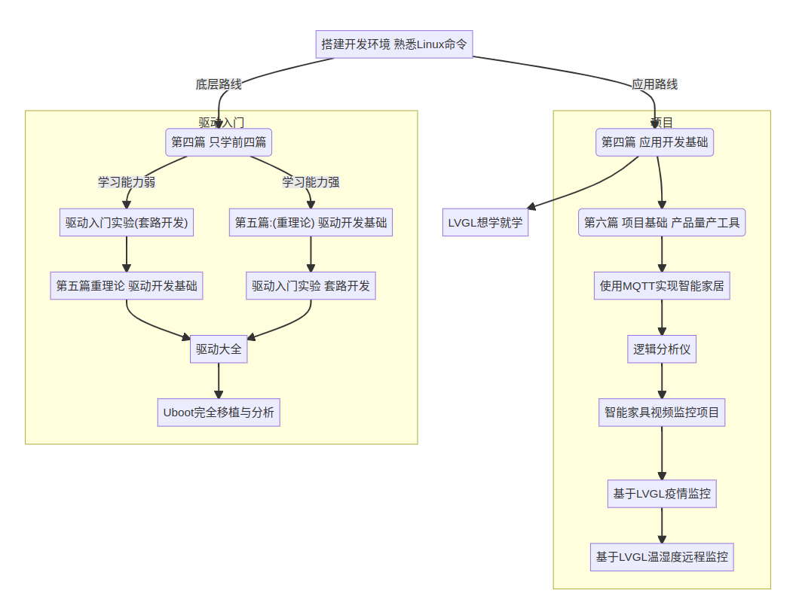
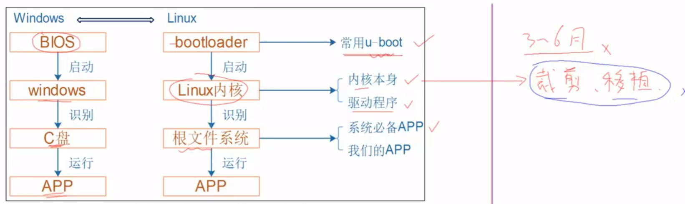

有的问题用英文搜索更容易找到答案

兼容性问题是在是罪恶至极，换最新的linux源码不行，换最新的gcc工具链也不行，必须完全配套，有的又太老在电脑上用不了，虚拟机确实可以解决这个问题。

## 也许合理的学习路线

要快速承担业务，内核本身和bootloader都不用学，深入学习驱动和app

## 简单的app

用了自己下的arm交叉编译工具链，然后编译后传到板子上运行，编译需要注意添加-static标志来执行静态链接，这样可执行文件会包含用到的库，而不依赖于运行系统上的动态链接库：

```
gcc -o hello hello.c -static
```

## 尝试内核移植

配置之前先导出环境变量：

```shell
export ARCH=arm CROSS_COMPILE=arm-linux-gnueabihf-
```

配置和编译内核：

```shell
#配置
# _defconfig结尾的是开发板的配置文件，在arch/xxx/configs目录下	
# arch/arm/configs/100ask_imx6ull_defconfig文件名会被makefile自动读取为对应规则
make 100ask_imx6ull_defconfig

#编译
#生成的zImage在arch/arm/boot/下
make zImage -j32
```

把它们都放到nfs_rootfs目录下，这个目录用于挂载到开发板的/mnt方便文件传输

```
cp arch/arm/boot/zImage ../nfs_rootfs
```

从3.8开始要求每个硬件平台要有对应的设备树二进制文件，然后设备树是描述开发板硬件细节的，就是dtb二进制文件，是dts设备树源码编译生成的，放在arch/xxx/boot/dts/目录下。.dtsi类似c的.h文件

设备树：https://doc.embedfire.com/linux/rk356x/driver/zh/latest/linux_driver/base_driver_tree.html

```
# 百问网提供的
cp 100ask_imx6ull-14x14.dtb ../nfs_rootfs
```

更新完成新编译的 zImage 内核镜像和设备树文件后，还需要更新内核模块驱动文件，否则可能会出现某些外围设备无法使用的问题

```shell
# 编译内核模块
make -j16 modules
make INSTALL_MOD_PATH=../nfs_rootfs modules_install
```

然后安装，把zImage和设备树二进制文件放到/boot下，modules拷贝到Lib里

```shell
mount -t nfs -o nolock,vers=3 192.168.5.11:/nfs_rootfs /mnt
cp /mnt/zImage /boot
cp /mnt/100ask_imx6ull-14x14.dtb /boot
cp /mnt/lib/modules /lib -rf
#将内存中的东西里吗写入硬盘
sync
```

最后是附上清理的命令行工具

```shell
make clean
make mrpproper
#清理所有构建产生的文件，config文件和备份文件等
make distclean	
```

必须采用LInux4.8的源码和版本是6.1的交叉编译工具链，说是因为必须和文件系统和uboot配套。我通过那么做解决了内核较老的问题，内核版本可以用uname -a查看。

## 使用Buildroot

使用Buildroot可以快速构建bootloader，内核，文件系统。uboot用来引导linux kernel。文件系统是内核起来以后需要挂载的。最后会生成.img文件，可以把它烧写到EMMC或者sd/tf卡中。看清楚sd卡对应的设备节点，把.img写入sd卡：

```shell
sudo dd if=sdcard.img of=/dev/sdb bs=4M status=progress
```

假如我们从sd卡启动，如何确认的确是sd卡呢？可以使用`df -h .`查看当前文件系统，一般就是对应的设备节点名，但是有个例外是/dev/root，它是个符号连接，用`cat/proc/cmdline`可以查看实际的设备节点。

## 读写驱动

把板子对应的Linux源码在电脑上留一份，因为驱动要用到相关头文件，最后生成相关文件再放到板子上装载。

Makefile这样配置：

```makefile
# 内核的路径，要正确配置
KERN_DIR = /home/yuanyuan/Workspace/linux/Linux-4.9.88

all:	
# -c指定了进入指定的目录Linux-4.9.88执行make（调用的也自然是这个目录下的）
# ``用于将命令的输出结果赋值给环境变量，M指定了模块的位置
#  modules是要生成的目标，这个规则在内核的Makefile下
makefile的目录，生成的目标
	make -C $(KERN_DIR) M=`pwd` modules 
	$(CROSS_COMPILE)gcc -o hello_test hello_test.c 
```

执行`make`生成hello_drv.ko和hello_test，然后传到板子上并安装：

```shell
insmod hello_drv.ko
```

如果提示内核被污染是因为内核版本太老，重新编译下zimage然后替换板子现有的再重新安装。

可以用`lsmod`查看当前加载的模块列表，用`rmmod `卸载模块。

查看字符设备和块设备，第一列是主设备号，第二列是设备名称，记住主设备号：

```shell
cat /proc/devices|grep yuanyuan -n
# 245 yuanyuan_first_drv
```

创建设备节点，设备节点可以用`rm`删除：

```shell
mknod /dev/hello c 245 0
```

然后就可以测试了：

```shell
./hello_test /dev/hello 100ask
./hello_test /dev/hello
```

## problem

### windterm无权限

要么以root身份启动windterm，要么添加 tty dialout 两个用户组，这两个用户组允许用户使用串口设备通讯

### 串口设备

插上usb serial后，`dmesg`查看消息，发现最近有一条：

```
[ 1188.028792] cdc_acm 3-4:1.0: ttyACM0: USB ACM device
```

查看设备节点：

```
ls /dev/ttyACM0 -l
crw-rw---- 1 root dialout 166, 0 10月 28 21:25 /dev/ttyACM0
```

按理来说，设备节点在就能用WindTerm连接了

### 网卡连接

连上网卡，配置静态ip，然后再通过串口修改板子上网卡的IP

```
ifconfig eth0 192.168.5.9
```

接着应该就能互相ping通了，如果Ping不通可能是连的eth1，可以用`ifconfig eth0 down`删掉ip，然后给eth1用这个Ip。

修改配置文件可以开机后自动设置IP，执行`vi /etc/network/interfaces`修改文件：

```
auto lo
iface lo inet loopback
auto eth0
iface eth0 inet static
	address 192.168.5.9
	netmask 255.255.255.0
	gateway 192.168.5.1
```

然后执行`/etc/init.d/S40network restart`重启网络服务。

### nfs挂载目录

可以通过网络挂载其他设备的目录，但感觉这种方式不如scp来的方便..

```shell
# -t：指定网络文件系统协议nfs，-o：不锁定，使用版本为3的nfs协议
mount -t nfs -o nolock,vers=3 192.168.5.11:/home/yuanyuan/Workspace/linux
/nfs_rootfs /mnt
```

如果nfs连不上可能是因为connection refused：服务器没启用NFS服务，Permission denied：要在/etc/exports文件中添加共享目录和访问权限

```
/home/yuanyuan 192.168.5.0/24(rw,no_root_squash)
```

## knowledge

### makefile的变量

makefile中变量是可以使用后面的变量来定义的，`:=`表示只能使用前面定义的变量，`?=`表示变量未定义就赋值

### 设备节点

Linux系统中除了网络接口卡之外，其他的所有设备都被视为文件，并且统一在/dev下有对应所谓节点文件。/dev目录下的文件节点被称为特殊设备节点，他们要不是字符设备(c)的节点，要不就是块设备(b)的节点。所谓节点指的是一个入口，我们通过这样的入口来达到操作(读、写等)某设备的目的，而之所以要统一在/dev下搞那么多所谓“入口”，是因为Linux系统提供所谓虚拟文件系统，它可以帮助我们使用一致的函数接口(open()、read()、write()、close()……)等来操作各种不同的设备，大大降低了应用程序访问Linux外围设备的复杂性。

### clang

Clang是个命令行工具，采用LLVM编译器作为后端，支持c++/c等编程语言，它和GCC很相似：Clang≈gcc，LLVM≈cc,as,ld...

可以通过apt安装Clang，用它翻译c源代码：

```
clang test.c -o test 
```

Clangd（Clang Daemon）是Clang编译器的一个组件，它主要用于提供C/C++代码的实时语法和语义分析，以供编辑器和集成开发环境（IDE）使用。如果Clangd没有在Clang工具集的一部分可以单独安装：

```
sudo apt install clangd 
```

然后可以在vscode里安装Clangd插件禁用c/c++自带的语法分析，像c/c++插件自带的它的悬浮提示代码补全跳转比较弱，换成clangd搭配compile_commands.json可以在阅读代码时享受更加精确的跳转和补全。

可以通过Bear来在make时生成compile_commands.json，安装：

```shell
sudo apt install bear
```

老师是执行bear make来生成文件的，在高版本的 bear 中需要使用--来表示执行命令：

```
bear -- make
```

### printk调试

printk是用于在 Linux 内核中打印信息的函数，打印的信息可以通过demsg查看。

它还提供输出等级，内核会根据这个等级来判断是否在终端或者串口中输出，可以这样修改：

```shell
echo "7 4 1 7">/proc/sys/kernel/printk	# 原来是7717
```

那么改了后能打印自己写的驱动的函数调用日志。具体没找到很好的解释，算了不管了。

## vscode快捷键

ctrl+p搜索文件， ctrl+f当前文件内查找，ctrl+`切换或隐藏终端

全局查找变量和函数：去要搜索的路径下，然后执行`grep "register_chrdev" * -rn`查找
