# 《编译原理》面向试卷复习

## 第二章 语言及其文法

- **终结符和非终结符**	

  非终结符是还可以继续推导的符号，终结符是它的补集 

- **$V_T$和$V_N$**

  终结符集合与非终结符集合

- **正闭包和克林闭包**

  正闭包：$A^+=A^1+A^2+A^3+.....$

  克林闭包：$A^*=A^0+A^1+A^2+A^3+.....$

  克林闭包比正闭包多一个$A^0$，$A^0$有一个元素$ε$，表示空串

- **幂运算**

  $s^n$：将n个s连接起来，s是字符串。串的0次幂是空串 

- **产生式**

  $a→b$，其中$a∈(V_T∪V_N)^+$，$b∈(V_T∪V_N)^*$，前面的叫左部，右边的叫右部

  其实就是描述一个字符串怎么得到另一个字符串

  $a→b|c$ 等价于$a→b,a→c$

- **文法**

  $G=(V_T,V_N,P,S)$，$S$默认是$P$里第一个产生式的左部

- **推导和归约**

  推导即用产生式的左部替换为产生式的右部，归约把产生式的右部替换回左部

- **句子和句型**

  句型首先是个字符串，既可以包含终结符 ，又可以包含非终结符，也可能是空串。

  句子是不包含非终结符的句型。

- **$L(G)$** 

  由文法$G$的开始符号$S$推导出的所有句子的集合称为文法$G$生成的语言，记为$L(G)$

- **文法的分类**

  - **0型文法**	这个文法里所有的产生式左部都至少有一个非终结符号
  
  - **1型文法**	所有产生式左部长度小于等于右部，即经过推导后字符串长度不减
  
  - **2型文法**	左部仅仅有一个非终结符
  
  - **3型文法/正则文法**
  
    分为右线性文法和左线性文法。右线性文法产生式形如$A→wB$ 或$A→w$；左线性文法产生式形如$A→Bw$ 或$A→w$。产生式允许$A→wA$的

------

- **最左推导**：

总是选择每个句型的**最左非终结符**进行替换。最左推导和语法树是一一对应的，不如说最左推导就是语法树的一种遍历方式。

- **语法树**

  - **短语**：把以非叶子节点为根的树的叶子节点组成一个字符串，就得到一个短语
  - **直接短语**：所有短语里有一些字符串对应的树只有两层，这样的短语是直接短语
  - **句柄**：沿着树一直向左走，不能就向右，走到头。倒数第二个节点对应的短语

- **二义性文法**

  二义性即$L(G)$中存在句子对应有两个不同的语法树（两种**最左推导**）

  无二义性就是所有的句子都只有一棵语法树。

------

求文法和设计文法

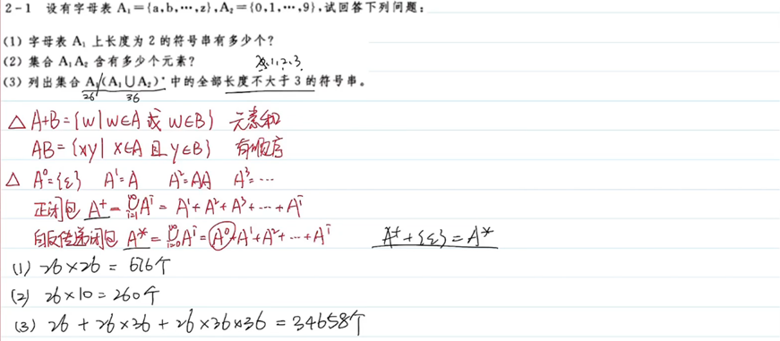

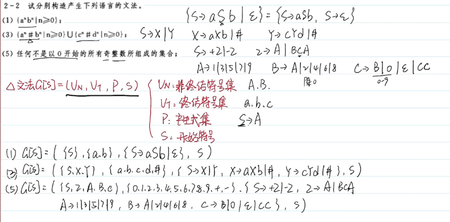

最左推导、最右推导

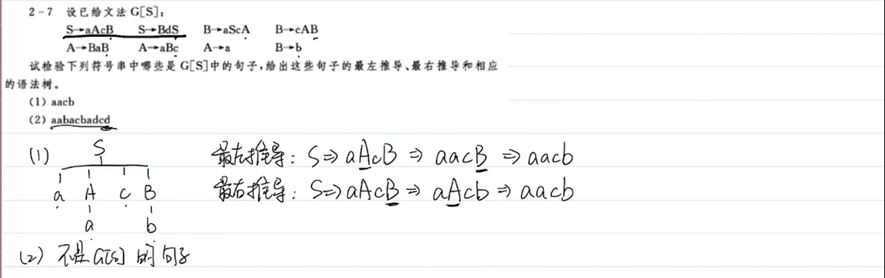

判断二义性

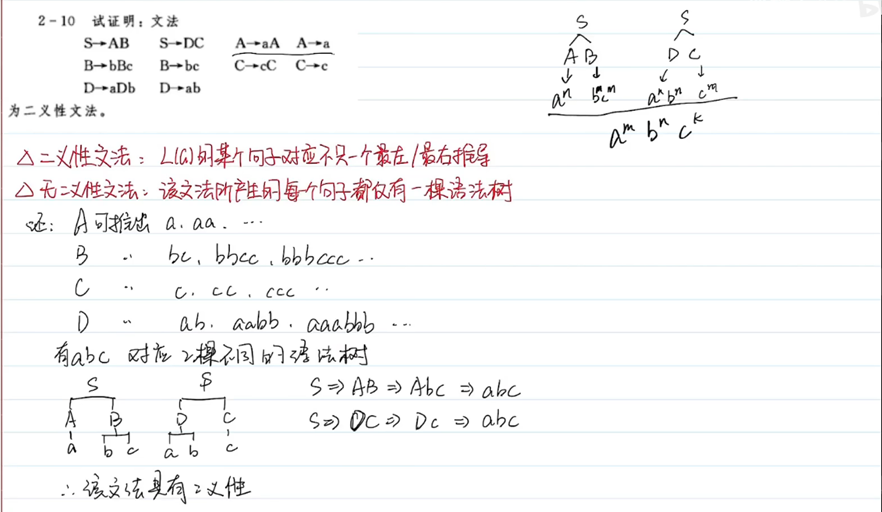

求短语，直接短语，句柄

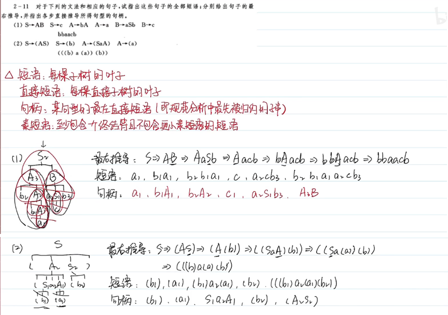

化简文法

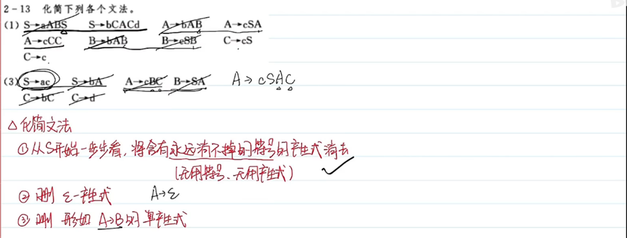

## 第三章 词法分析和词法分析程序

- **正则文法**

  正则文法可以转化为正则表达式。还可以用有穷自动机等价描述。

- **正则表达式**

  简称RE，比如 $0|[1-9] [0-9]^*$表示无符号整数，可以写成正则文法。

- **有穷自动机FA**

  FA可以用转换图表示，用于识别/接收字符串。自动机$M$可识别的串的集合记为$L(M)$。

  自动机可以分为两类：**NFA**和**DFA**。NFA对于一个字符可能转向多个状态，所以叫不确定的FA。反之每个字符有确定的有向边，那就是DFA。NFA更容易想出来，DFA更适合用程序实现。

- **转换图**

  状态转换图是有向图。节点的值随意设置只要不重复，有向边的值是字符或字符集。

  开始状态只有一个，用`start`箭头指向；终止状态可以有多个，用双圈表示。如果串能从开始状态走到终止状态就称这个串被这个FA接收

- **状态转换矩阵（转换表）**

  可以用于表示DFA和NFA

------

- **DFA和NFA**

  NFA和它的转换矩阵：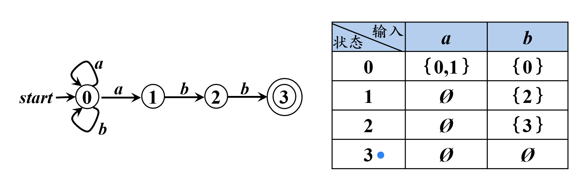

  DFA和它的转换矩阵：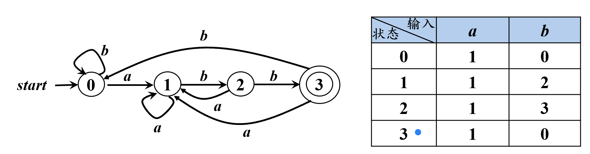

  从矩阵上也容易看出DFA和NFA的区别：NFA一个字符可能转向多种状态

------

- **从正则表达式到DFA**

  从正则表达式到DFA的转换分两步：**RE→NFA→DFA**。

  - **根据RE构造NFA**

    反复运用下面的规则，把式子里的元素替换为相应的有向边。此外如果遇到$()^*$可以先用空多增加一个状态，然后在这个状态上循环，这样看的清楚。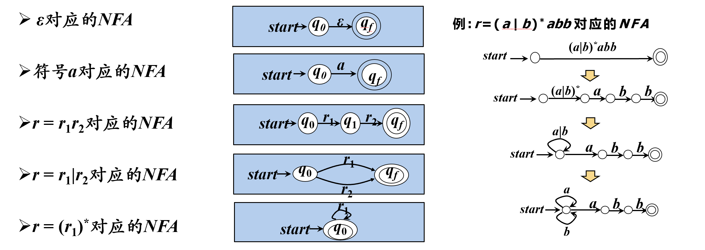

  - **根据NFA构建DFA**

    先了解两个概念：

    ​	**$\epsilon_{-} \text {closure (s) }$**：由状态s经由条件ε可以到达的所有状态的集合

    ​	**$move(A,a)$**：从状态A，经过a到达的状态的集合

    使用**子集构造法**，根据NFA画表格，一行一行从左往右推：

    | $I$                                 | $I_a$                                                | $I_b$                                                |
    | ----------------------------------- | ---------------------------------------------------- | ---------------------------------------------------- |
    | $\epsilon_{-} \text {closure (s) }$ | $\epsilon_{-} \text {closure (move(最左侧集合,a)) }$ | $\epsilon_{-} \text {closure (move(最左侧集合,b)) }$ |
    | 第二列开始不为空的集合放到这列      | 按照和上一行同样的推法...                            |                                                      |
    | .....直到放完                       |                                                      |                                                      |

    最后把最左侧的状态集合重新标号作为新状态，按照状态转换矩阵构造DFA的转换图

- **DFA最小化**

  DFA最小化即优化DFA，使其状态数最少。方法是合并等价的状态。

  **如何判断两个状态是否可合并？**无论下一个接收的符号是什么，只要得到的结果总是一样的，这样的状态就是等价的，可以合并。

  最小化过程分三步：消去到达不了的状态，划分状态集合为终态和非终态，合并等价的状态

------

### 练习题

状态转换图

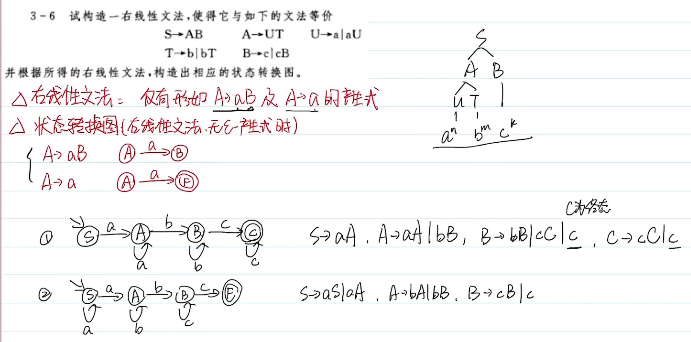

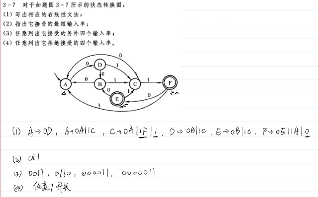

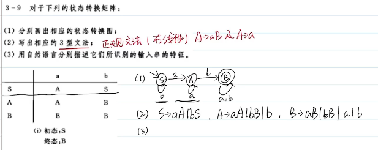

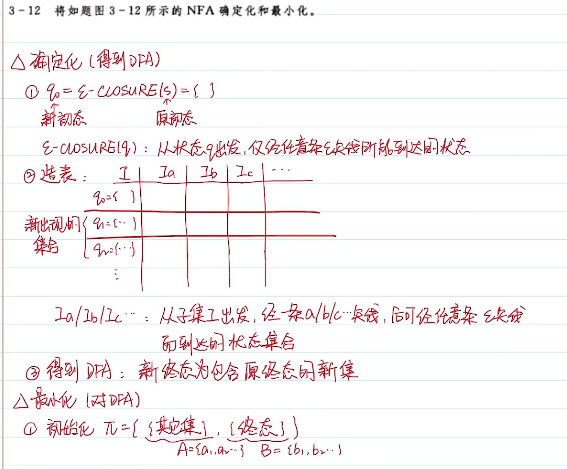

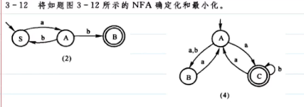

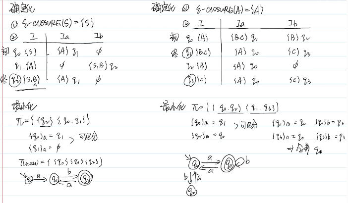

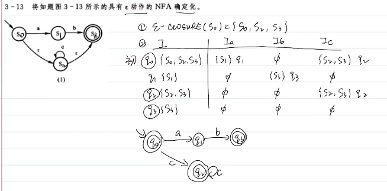

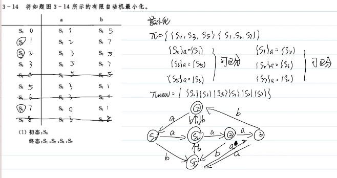

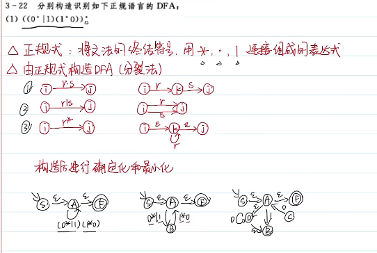

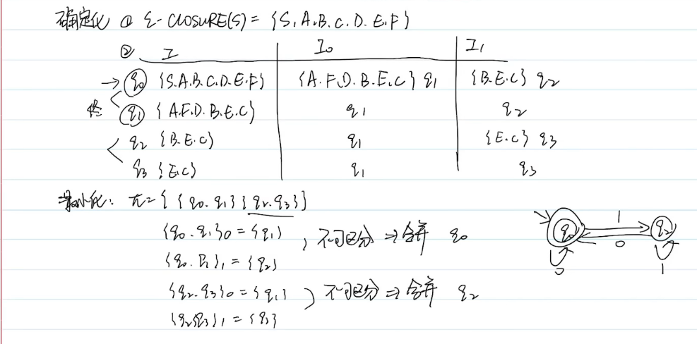

[正规式->最小化DFA说明 - katago - 博客园 (cnblogs.com)](https://www.cnblogs.com/cute/p/4021689.html)

## 第四章 语法分析和语法分析程序

- **最左推导**

  每次都替换句型中最左侧的非终结符

- 消除左递归

  

- **First集**

- **Follow集**

- **$LL(1)$分析表**

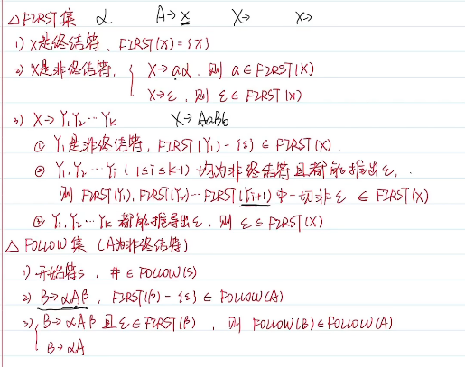

------

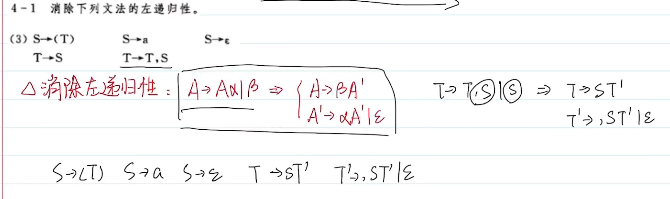

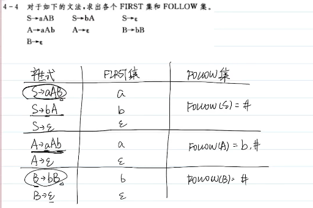

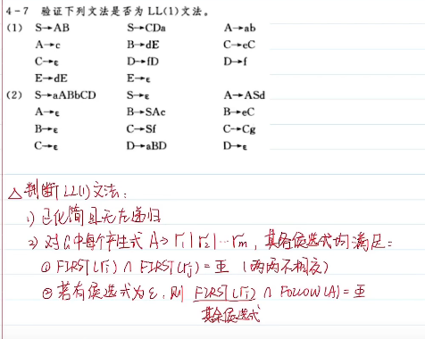

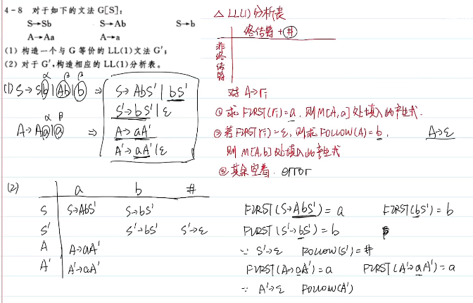

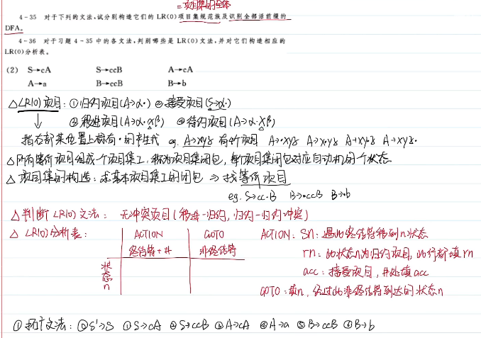
