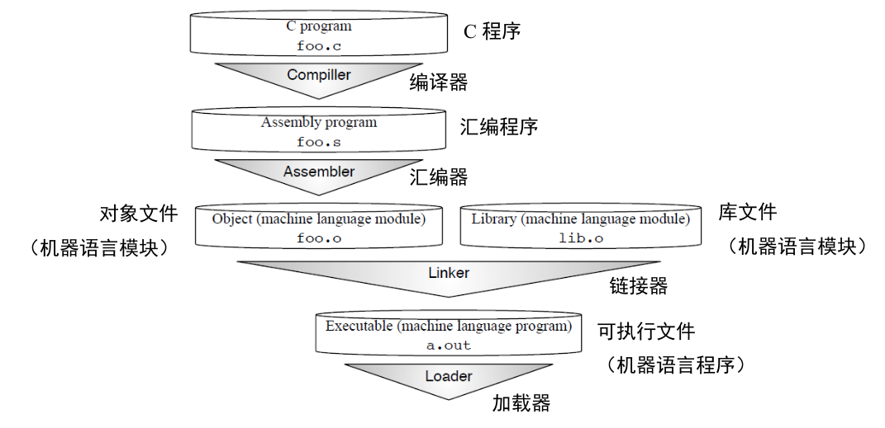
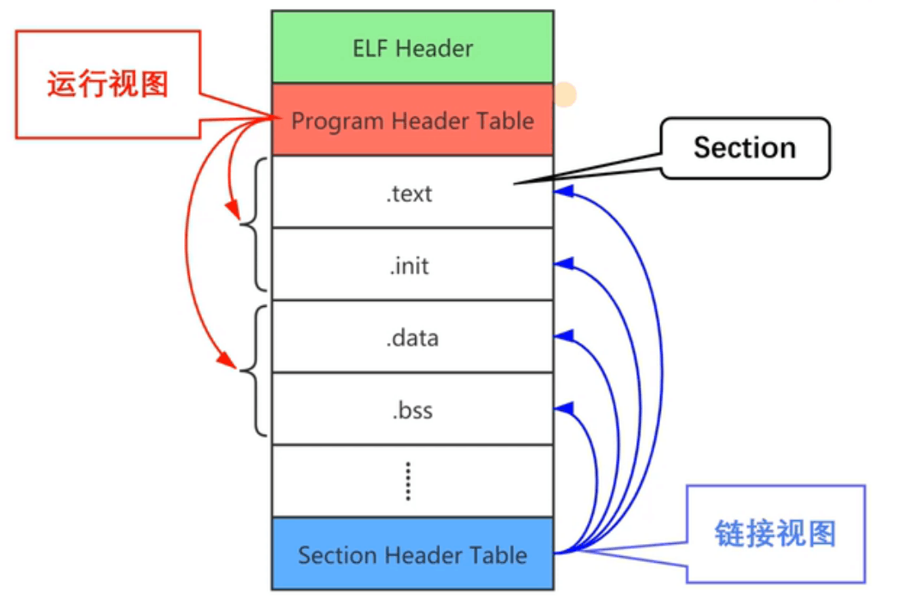

## 编译器的概念

编译器是一组程序，可以将源程序翻译为可执行的程序。比如要盖一间木屋，首先得先造运输工具锤子斧头之类的工具，编译器就是这样的工具。

编译器是一组程序，可能运行在一种体系架构上。它生成的可执行程序，可能在另一种体系架构上。这种情况叫做交叉编译。

## GCC编译器

GCC是一组编译器套件，它支持 C、C++、Objective-C、Fortran、Ada 等多种编程语言，并且已经被移植到多种计算机体系架构上，如 x86,ARM,RISC-V 等

GCC并不单独提供，它被包含在GNU项目中，比如我们平时用的`gcc`被包含在`x86_64-linux-gnu-`中，同级的工具除了`gcc`还有`ar`,`g++`,`objcopy`,`objdump`,`ld`,`ar`等多种工具。

### GCC的编译，汇编，链接

以C语言为例，从 C 程序翻译成为可以在计算机上执行的机器语言程序的步骤：**编译，汇编，链接**。

**编译**：编译器完成 “预处理” 和 “编译”，“预处理” 指处理源文件中以 “#” 开头的预处理指令，譬如 #include、#define 等；“编译” 则针对预处理的结果进行一系列的词法分析、语法分析、语义分析，优化后生成汇编指令，存放在 .s 为后缀的汇编文件中

**汇编**：汇编器将汇编语言代码转换为机器语言，存放于.o文件中。.o是基于机器语言的文件，但还不是可执行的二进制文件。

**链接**：链接器将目标文件合并并和一些标准库（譬如 libc）文件链接，形成最终可执行的应用程序a.out。




### GCC的不同版本

编译器本身也是可执行文件，可以自己从源码编译，也可以直接下载别人编译好的编译器。

我们平时用的`gcc`是一个软链接，它指向`gcc-11`，然后`gcc-11`又指向可执行文件`x86_64-linux-gnu-gcc-11`，由它生成的a.out只能在x86上运行。

利用`x86-64-linux-gnu-gcc-11`的源码，可以做一个生成的可执行文件可以在riscv64上运行的编译器`riscv64-unknown-elf-gcc`。用它生成的可执行文件只能在riscv64架构的机器上运行。

ubuntu的官方仓库也提供了运行在x86上但生成在riscv上运行的可执行文件的编译器，执行`sudo apt autoremove gcc-riscv64-linux-gnu `安装。（不过我实际使用的时候出了点问题）。编译器是`riscv64-linux-gnu-gcc-11`

### GCC的命令

```shell
gcc hello.c					#编译C代码，生成可执行文件a.out
gcc -c hello.c -o hello.o	#生成目标文件
gcc -g -c hello.c			#生成带有调试信息的目标文件
gcc hello.c -v				#编译并显示详细的编译过程信息
```

经常会针对多个源文件进行处理：

```shell
gcc -c 1.c -o 1.o
gcc -c 2.c -o 2.o
gcc -c 3.c -o 3.o
# 链接
gcc 1.o 2.o 3.o -o a.out
```

下面这几个对应了GCC的执行步骤

```shell
gcc -E test.c -o test.i		# 预处理
gcc -S test.i -o test.s		# 编译
gcc -c test.s -o test.o		# 汇编	
gcc test.o -o a.out			# 链接
```

> | -E       | 只做预处理                     |
> | -------- | ------------------------------ |
> | 常用选项 | 含义                           |
> | -c       | 只编译不链接，生成文件.o       |
> | -S       | 生成汇编代码                   |
> | -o file  | 输出生成到指定文件中           |
> | -g       | 输出的文件中加入支持调试的信息 |
> | -v       | 输出整个翻译为可执行文件的过程 |
>

其他版本GCC的使用样例

```shell
riscv64-unknown-elf-gcc -march=rv32ima -mabi=ilp32 hello.c	#生成a.out
file a.out													#查看文件类型:risc-v上的可执行文件
qemu-riscv32-static ./a.out									#在模拟器上运行
```

## 文件

### 文件类型

常见文件类型如下：

`.c`：c源文件

`.cc/.cxx/.cpp`：c++源文件

`.i`：经过预处理的c源文件

`.s/.S`：汇编语言源文件，`.S`通常包含一些预处理指令

`.h`：头文件

`.o`：目标文件

`a.out`：可执行文件

`os.elf` ：可执行文件，通常具有可执行代码、符号表、调试信息等。

`os.bin` ：纯二进制文件，只包含用于直接加载到内存的二进制数据。

在常见的情况下，`os.elf `文件是通过编译器和链接器生成的，它包含了完整的可执行程序的信息，可以在运行时被操作系统或硬件加载和执行。

而` os.bin `文件则是通过使用目标文件复制程序（如` objcopy`）从 `os.elf `文件中提取二进制数据生成的，它只包含原始的二进制数据，可以直接加载到指定的内存地址运行。

### 文件格式

可执行文件不是直接跑在硬件设备上的，中间隔了一层操作系统。要在操作系统上运行，可执行文件必须满足特定的格式，比如Windows的可执行文件格式是PE，Linux的就是ELF。

PE格式的文件包括以下几种类型：

| 文件类型                             | 说明                                    | 后缀          |
| ------------------------------------ | --------------------------------------- | ------------- |
| 可执行文件（Executable Files）       | Windows上的可执行文件                   | `.exe`,`.com` |
| 动态链接库（Dynamic Link Libraries） | Windows上的DLL文件                      | `.dll`        |
| 驱动程序文件（Device Drivers）       | Windows驱动程序文件，如内核模式驱动程序 | `.sys`        |

重点介绍ELF文件格式。

#### ELF

ELF格式的文件包括以下几种类型：

| ELF                           | 说明                                                         | 后缀    |
| ----------------------------- | ------------------------------------------------------------ | ------- |
| 目标文件（Object File）       | 包含了程序的二进制代码和数据，但它们还没有被链接为可执行文件 | `.o`    |
| 可执行文件（Executable File） | 可以直接执行的程序                                           | `a.out` |
| 共享库文件（Shared Library）  | 可以作为链接器的输入                                         | `.so`   |

ELF文件格式的结构如下，包含若干的段：

可以用`objdump -d benos.elf `查看ELF格式文件的反汇编内容



任何一种可执行文件都是由代码段，数据段等section组成，只以linux上的可执行文件为例，它由链接器将若干`.o`文件链接得到。`.o`和可执行文件都是ELF格式的文件。

#### 处理ELF文件的工具：Binutils

Binutils和GCC一样，被包含在GNU项目中，它包含多种命令行工具，用于处理二进制文件。

- `ar`：归档文件，将多个文件打包为大文件

- `as`：汇编器，被GCC调用，用于将汇编语言源代码文件转换成目标文件

   ```shell
   # 如果加上-v查看详细的过程，会发现gcc其实调用了as
  # 详细信息中显示调用了as -v --64 -o test.o test.s
  gcc -c test.s -o test.o	-v	
  ```
  
- `ld`：链接器，被GCC调用，用于将目标文件链接在一起，生成可执行文件或共享库

- `objcopy`：用于复制和转换目标文件格式等

  ```shell
  objcopy input.bin output.bin		# 复制文件
  objcopy -O binary os.elf os.bin 	# -O binary：输出.bin文件格式
  ```
  
- `objdump`：显示ELF文件的反汇编

   ```shell
   objdump -S hello.o					# 显示源代码和反汇编代码的交叉引用
   objdump -d benos.elf             	# 查看各个段的反汇编
   ```

- `readelf`：查看ELF格式文件的信息

   ```shell
   readelf -h hello.o					# h是header的缩写，查看文件头信息ELF Header
   readelf -S hello.o					# S是Section，查看Section Header Table
   readelf -SW hello.o					# W就是Wide的意思，这样查看比较舒服
   readelf -a start.o               	# 显示详细的关于 ELF 文件结构、段头、节头、符号表、动态节、重定位信息和其他信息的报告
   ```

## 链接脚本

链接器在链接过程中会用到一个链接脚本，当没有通过`-T`选项指定链接脚本时，链接器会使用默认的。链接脚本控制如何把输入文件的段整合到输出文件的段里，以及这些段的地址空间布局等。

最简单的链接脚本只有一个命令：`SECTIONS`。 用于描述输出文件的内存布局。

在此示例中， 程序仅包含代码，初始化数据和未初始化数据。 它们分别位于`.text`,`.data`和`.bss`段中。 代码应在地址 `0x10000` 处加载，数据应从地址 `0x8000000` 开始：

```
SECTIONS
{
  . = 0x10000;
  .text : { *(.text) }
  . = 0x8000000;
  .data : { *(.data) }
  .bss : { *(.bss) }
}
```

上例中 `SECTIONS` 命令中的第一行设置特殊符号 `. ` 的值，即位置计数器。如果未通过其他方式指定输出段的地址（稍后将介绍其他方式），地址就会被设置为位置计数器的当前值。然后将位置计数器增加输出段的大小。在`SECTIONS`命令的开头，位置计数器的值为 `0 `。

第二行定义了一个输出段`.text `。 在输出段名称后面的花括号中，列出应放置在此输出段中的输入段的名称。`*` 是与任何文件名匹配的通配符。表达式 `*(.text) ` 表示所有输入文件中的 `.text` 输入段。由于在定义输出段`.text`时位置计数器为`0x10000`，因此链接程序会将输出文件中`.text`段的地址设置为`0x10000`。

剩下的行定义了定义输出文件中的`.data`和`.bss `段。链接器会将`.data`输出段放置在地址`0x8000000`处。在链接器放置`.data`段后，位置计数器为`0x8000000`加上`.data` 段的大小。因此`.bss`输出段在内存中将会紧紧挨在`.data`段后面。

链接器将通过增加位置计数器（如有必要）来确保每个输出部分具有所需的对齐方式。在此示例中，`.text` 和`.data` 段的指定地址可以满足任何对齐方式约束，但链接器可能必须在`.data` 和`.bss`段之间创建一个小的间隙。

### ENTRY

`ENTRY`用来定义程序的入口位置

```
/* Entry Point */
ENTRY(Reset_Handler)
```

### MEMORY

`MEMORY`顾名思义，内存配置块，具体使用了哪些内存，具体位置和大小，还有是否可读写和执行，都需要写清楚。

比如这里就定义了中断的入口地址(0x0)以及中断向量表的长度(0x400)，接着是代码的位置紧接着向量表，中断和代码都是只读可运行的，所以是RX。

后面的两个区域就是对应的RAM区域了，如果有两块就分开写，如果是一块在功能上要区分成多块的话，也可以分段写。

里面的区域名称可以自定义，但是后面会对每个部分进行初始化，所以这个变量会被引用到。

```
/* Specify the memory areas */
MEMORY
{
  m_interrupts          (RX)  : ORIGIN = 0x00000000, LENGTH = 0x00000400
  m_text                (RX)  : ORIGIN = 0x00000400, LENGTH = 0x0001FC00
  m_data                (RW)  : ORIGIN = 0x20000000, LENGTH = 0x00020000
  m_data2               (RW)  : ORIGIN = 0x20200000, LENGTH = 0x00040000
}
```

### SECTIONS

`SECTIONS`是描述各个部分应该映射到哪里，如何放到VMA和LMA中，说白了就是描述输入和输出的

```
/* Define output sections */
SECTIONS
{
....
}
```
