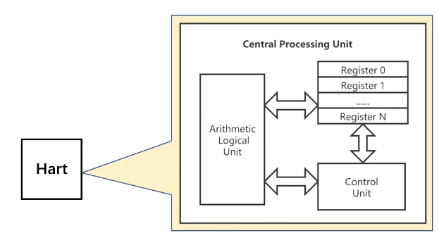
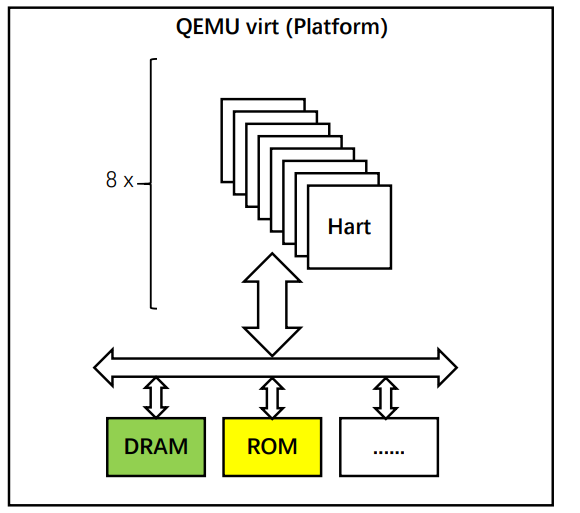
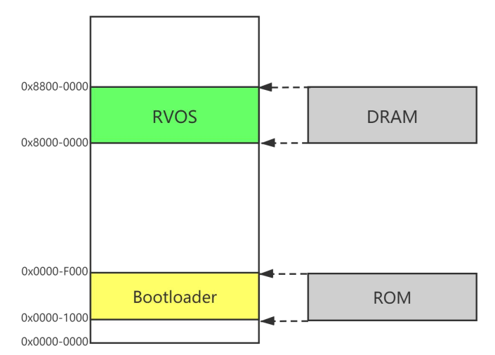
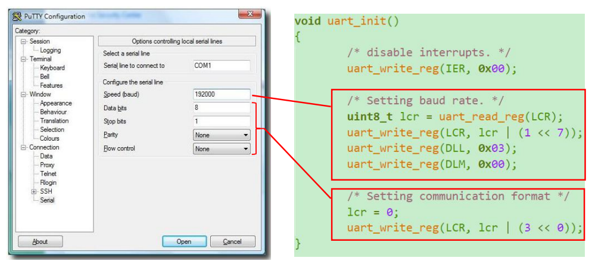
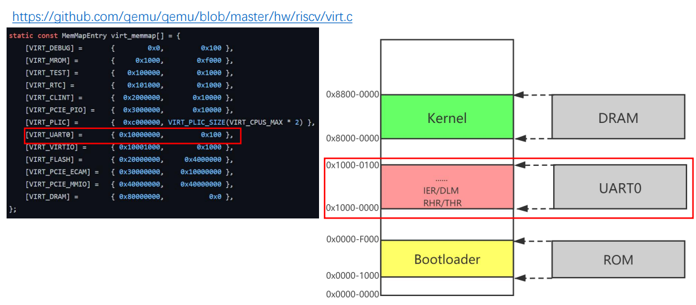
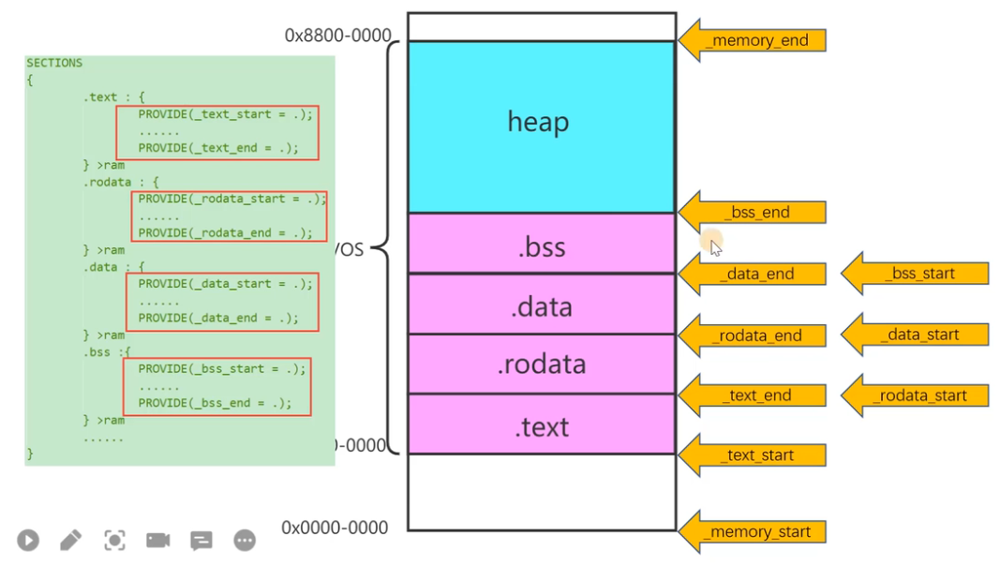
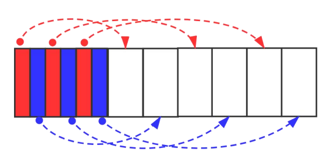

# RVOS代码解析

## 00-引导过程

### qemu-virt

Hart就是一个执行流，现代的core有时候包含多个执行流，所以就把Hart抽象出来了



下面这个就是一个完整的机器，可以称为Platform（？一块芯片）


然后这个命令行指定qemu模拟的是virt这个机器，并且不加载bios

```shell
qemu-system-riscv32 -nographic -smp 1 -machine virt -bios none -kernel os.elf
```

QEMU-virt就是模拟了一个Platform



QEMU-virt地址映射表：https://github.com/qemu/qemu/blob/master/hw/riscv/virt.c


咱们写的东西就加载到DRAM这块



### 链接脚本

链接时候指定用自己的链接脚本`os.ld`了，没有通过-T选项指定脚本时会使用内置的。

```makefile
# Makefile
os.elf: ${OBJS}
	${CC} ${CFLAGS} -T os.ld -o os.elf $^
	${OBJCOPY} -O binary os.elf os.bin
```

`os.ld`里定义了输出的可执行文件的体系架构和程序入口是`_start`标签。

```ld
OUTPUT_ARCH( "riscv" )
ENTRY( _start )
```

然后就是`MEMORY`，用于描述目标机器上的内存。

```ld
# os.ld
MEMORY
{
	/* w:可写 x:可执行 a:可分配 !r:不可读 !i:不初始化 */
	ram   (wxa!ri) : ORIGIN = 0x80000000, LENGTH = 128M
}
```

然后就是用`SECTIONS`描述段怎么存放在内存中的：

```ld
# os.ld
SECTIONS
{
	.text : {
		PROVIDE(_text_start = .);
		/* 所有输入文件的.text段和.text.*段 */
		*(.text .text.*)
		PROVIDE(_text_end = .);
	} >ram

	.rodata : {
		PROVIDE(_rodata_start = .);
		*(.rodata .rodata.*)
		PROVIDE(_rodata_end = .);
	} >ram

	.data : {
		. = ALIGN(4096);
		PROVIDE(_data_start = .);
		*(.sdata .sdata.*)
		*(.data .data.*)
		PROVIDE(_data_end = .);
	} >ram
	.bss :{
		PROVIDE(_bss_start = .);
		*(.sbss .sbss.*)
		*(.bss .bss.*)
		*(COMMON)
		PROVIDE(_bss_end = .);
	} >ram
	PROVIDE(_memory_start = ORIGIN(ram));
	PROVIDE(_memory_end = ORIGIN(ram) + LENGTH(ram));

	PROVIDE(_heap_start = _bss_end);
	PROVIDE(_heap_size = _memory_end - _heap_start);
}
```

`PROVIDE(_text_start = .)`把当前位置计数器的地址导出为标号，在源文件中可以使用导出的标号

```assembly
# mem.S
HEAP_START: .word _heap_start
# start.S
```

`>ram`表示输出段的位置，这里的段都放到`ram`里了。输出段有两个地址，前面这个是虚拟内存地址（VMA），还有一个是用`AT>`指定的加载内存地址（LMA）。如果没有指定LMA，那么默认等于VMA。

那么，程序的入口，在哪里呢？被放在`start.S`中

### start.S

`start.S`文件里包含了`_start`标签，所以程序会从这个标签的位置开始执行。

首先是将`platform.h`给`include`进来，这个文件定义了一些和机器相关的宏

```c
// platform.h
#ifndef __PLATFORM_H__
#define __PLATFORM_H__

#define MAXNUM_CPU 8
#define UART0 0x10000000L

#endif
```

然后是一些伪指令：

```assembly
.equ	STACK_SIZE, 1024	# 定义符号常数，当前汇编文件可见
.global	_start				#定义全局符号`_start`，被定义的符号可以在其他的汇编文件或C文件中使用
```

特别介绍下`.text`，和`.section .text`是一个意思

> `.section`用于定义段，段的范围持续到文件结尾或者下一个`.section`	

段的内容最终会通过链接被放置到可执行文件的段里，可以通过`objdump -d benos.elf`查看`.text`段的反汇编：

```
Disassembly of section .text:

80000000 <_start>:
80000000:	f14022f3          	csrr	t0,mhartid
80000004:	00028213          	mv	tp,t0
80000008:	02029c63          	bnez	t0,80000040 <park>
8000000c:	00022517          	auipc	a0,0x22
80000010:	00450513          	addi	a0,a0,4 # 80022010 <out_buf>
80000014:	00025597          	auipc	a1,0x25
80000018:	0d858593          	addi	a1,a1,216 # 800250ec <_bss_end>
8000001c:	00b57863          	bgeu	a0,a1,8000002c <_start+0x2c>
80000020:	00052023          	sw	zero,0(a0)
80000024:	00450513          	addi	a0,a0,4
80000028:	feb56ce3          	bltu	a0,a1,80000020 <_start+0x20>
8000002c:	00a29293          	slli	t0,t0,0xa
80000030:	00010117          	auipc	sp,0x10
80000034:	3d010113          	addi	sp,sp,976 # 80010400 <stacks+0x400>
80000038:	00510133          	add	sp,sp,t0
8000003c:	0882006f          	j	800200c4 <start_kernel>

80000040 <park>:
80000040:	10500073          	wfi
80000044:	ffdff06f          	j	80000040 <park>
80000048:	00000013          	nop
8000004c:	00000013          	nop
......
8000fff8:	00000013          	nop
8000fffc:	00000013          	nop

80010000 <stacks>:
	...
```

当然`.text`段不只`start.S`的`.text`段，所有输入文件的`.text`段和`.text.*`段都被放到了里面：

```
# os.ld
.text : {
    PROVIDE(_text_start = .);
    /* 所有输入文件的.text段和.text.*段 */
    *(.text .text.*)
    PROVIDE(_text_end = .);
} >ram
```

os.ld文件里的`.text`最先被放入DRAM这块内存，`start.S`又是第一个输入文件，所以`start.S`的第一条汇编占据DRAM的开头：

```makefile
# OBJS的第一个是 start.S
os.elf: ${OBJS}
	${CC} ${CFLAGS} -T os.ld -o os.elf $^
```

又因`_start`是第一条汇编，所以`_start`的虚拟内存地址就是`0x80000000`。因为定义了`_start`是入口程序，所以第一条执行的指令的地址是`0x80000000`。

`.align 16 `是对齐伪指令，这里的16是对齐的位数，也可以理解为指数，实际把地址对齐到`0x10000`的倍数

`.skip`创建一段连续的内存空间，用于栈空间。

`.end`感觉加不加都行..标志代码结束

------

接下来的代码跳转前做了三件事情：让除了第一个Hart以外的核空转，将`.bss`段初始化为0，分配栈空间并设置`sp`寄存器

```assembly
	csrr	t0, mhartid					# csrr是伪指令，从CSR寄存器中读取值
	mv		tp, t0			
	bnez	t0, park
					
	la		a0, _bss_start
	la		a1, _bss_end
	bgeu	a0, a1, 2f					# a0-a1大于或等于零（无符号数），则跳转2f
1:										# 这块都是为了bss初始化，如果bss为0,1是可以跳过的
	sw		zero, 0(a0)
	addi	a0, a0, 4
	bltu	a0, a1, 1b					# 如果a0小于（无符号数）a1，则跳转
2:
	slli	t0, t0, 10					# 左移10位，即乘以1024
	la		sp, stacks + STACK_SIZE		# 设置sp寄存器
	add		sp, sp, t0					# 每个hart的sp都独占一片栈空间

	j	start_kernel	
park:
	wfi									# 进入休眠状态，直到收到中断信息
	j	park
```

上面段里用到的标签可以分3类：

|          | 说明                                                         | 例子           |
| -------- | ------------------------------------------------------------ | -------------- |
| 全局符号 | 即用`.global`声明过的，在其他源程序中也可以访问              | `_start`       |
| 本地符号 | 只在当前汇编文件中使用的                                     | `park`,`stack` |
| 本地标签 | 临时使用的，没有特别意义的，比如循环时候用<br />通常用0-99整数作为编号，可以重复定义，在汇编器内会编译成更有意义的符号<br />搭配`f`和`b`向前搜索或者向后搜索标签：`1f`,`2b` | `1`,`2`        |

### CSRs寄存器组	

Control and Status Registers（CSRs）


> - 除了所有Level下都可以访问的通用寄存器组之外，每个Level都有自己对应的一组寄存器
>
> - 高Level可以访问低Level的CSR，反之不可以
>
> - ISA Specification（"Zicsr"扩展）定义了特殊的**CSR指令**来访问这些CSR

Machine模式下的CSR列表：


看见了吗，有`mhartid`，它是Machine模式下的CSR寄存器，这个CSR只读

## 01-helloRVOS

```c
// kernel.c
// extern告诉编译器某个变量或函数的定义在当前文件之外，需要在其他文件中找到
extern void uart_init(void);
extern void uart_puts(char *s);

void start_kernel(void)
{
	uart_init();
	uart_puts("Hello, RVOS!\n");

	while (1) {}; // stop here!
}
```

它在`uart.c`里

```c
#include "types.h"
#include "platform.h"

// UART的控制寄存器被内存映射到地址UART0
// 根据寄存器的偏移地址返回寄存器的地址
#define UART_REG(reg) ((volatile uint8_t *)(UART0 + reg))

//这些寄存器的大小是8bit
#define RHR 0	// 用于存储接收到的数据
#define THR 0	// 用于存储要发送的数据
#define DLL 0	// 用于设置波特率
#define IER 1	// 用于启用和禁用不同类型的串口中断，如接收数据中断和发送数据中断
#define DLM 1	
#define FCR 2	
#define ISR 2	
#define LCR 3	
#define MCR 4	
#define LSR 5	
#define MSR 6	
#define SPR 7

#define LSR_RX_READY (1 << 0)
#define LSR_TX_IDLE  (1 << 5)

#define uart_read_reg(reg) (*(UART_REG(reg)))
#define uart_write_reg(reg, v) (*(UART_REG(reg)) = (v))

void uart_init()
{
    //禁止中断
    
    // (*(((volatile uint8_t *)(UART0 + IER))) = (0X00))
	uart_write_reg(IER, 0x00);	
    
    //设置波特率
	//(*(((volatile uint8_t *)(UART0 + LCR))))
    //lcr是解引用后拿到的寄存器内容
	uint8_t lcr = uart_read_reg(LCR);
	uart_write_reg(LCR, lcr | (1 << 7));
	uart_write_reg(DLL, 0x03);
	uart_write_reg(DLM, 0x00);

    //设置传输格式，字长为8,无奇偶校验
	lcr = 0;
	uart_write_reg(LCR, lcr | (3 << 0));
}

int uart_putc(char ch)
{
	//判断LSR第5位（0-7）是不是0
	//直到LSR的第5位读出来是1，说明THR空闲，可以放新数据进去
	while ((uart_read_reg(LSR) & LSR_TX_IDLE) == 0);

	return uart_write_reg(THR, ch);
}

void uart_puts(char *s)
{
	while (*s) {
		uart_putc(*s++);
	}
}
```



### NS16550a编程接口



qemu模拟器的`0x10000000`往后`0x100`的内存被映射为UART0的寄存器，所以才有：

```c
#define UART0 0x10000000L
```

## 02-内存管理

```c
// kernel.c
#include "os.h"

extern void uart_init(void);
extern void page_init(void);
// extern void uart_puts(char *s)被放到os.h里了，因为多次使用
void start_kernel(void)
{
    /*省略上一章串口的内容*/
    //新增
	page_init();
}
```

这里新增一个对`page_init`的调用，它的定义在`page.c`里

```c
#include "os.h"

// 存放各个段的地址
// extern说明要到其他文件中去找，事实上它们在mem.S里
extern uint32_t TEXT_START;
extern uint32_t TEXT_END;
extern uint32_t DATA_START;
extern uint32_t DATA_END;
extern uint32_t RODATA_START;
extern uint32_t RODATA_END;
extern uint32_t BSS_START;
extern uint32_t BSS_END;
extern uint32_t HEAP_START;
extern uint32_t HEAP_SIZE;

//_alloc_start指向堆池的实际起始地址
//_alloc_end指向堆池的实际结束地址
//_num_pages 保存我们可以分配的实际最大页面数
static uint32_t _alloc_start = 0;
static uint32_t _alloc_end = 0;
static uint32_t _num_pages = 0;

#define PAGE_SIZE 4096
#define PAGE_ORDER 12

#define PAGE_TAKEN (uint8_t)(1 << 0)
#define PAGE_LAST  (uint8_t)(1 << 1)

// 位 0：标记此页是否已占用（已分配）
// 位 1：标记该页是否是分配的内存块的最后一页
// 用数组存储页表是否被使用
struct Page {
	uint8_t flags;
};

static inline void _clear(struct Page *page)
{
	page->flags = 0;
}

static inline int _is_free(struct Page *page)
{
	if (page->flags & PAGE_TAKEN) {
		return 0;
	} else {
		return 1;
	}
}


static inline int _is_last(struct Page *page)
{
	if (page->flags & PAGE_LAST) {
		return 1;
	} else {
		return 0;
	}
}

static inline void _set_flag(struct Page *page, uint8_t flags)
{
	page->flags |= flags;
}

/*
 * align the address to the border of page(4K)
 */
static inline uint32_t _align_page(uint32_t address)
{
	uint32_t order = (1 << PAGE_ORDER) - 1;
	//可以自己画一下
    // 00101011 address
    // 00001111 order
    // 11110000 ~order
    // 001_0000 结果只有_不确定，取决于address的后4位是不是0
    // 最后的效果是向上取整，order是4,就是按照10000的倍数对齐
    // 因为一个页是4k，所以对齐到4k
	return (address + order) & (~order);
}

void page_init()
{
	// 保留了 8 个页面 (8 x 4096) 来保存页面结构
	_num_pages = (HEAP_SIZE / PAGE_SIZE) - 8;
	printf("HEAP_START = %x, HEAP_SIZE = %x, num of pages = %d\n", HEAP_START, HEAP_SIZE, _num_pages);
	// 清理保存页面结构的flag
	struct Page *page = (struct Page *)HEAP_START;
	for (int i = 0; i < _num_pages; i++) {
		_clear(page);
		page++;	
	}

    // 页面标识从HEAP_START开始 然后是空了一块 接着是页面(4k一个) 
	_alloc_start = _align_page(HEAP_START + 8 * PAGE_SIZE);
	_alloc_end = _alloc_start + (PAGE_SIZE * _num_pages);

	printf("TEXT:   0x%x -> 0x%x\n", TEXT_START, TEXT_END);
	printf("RODATA: 0x%x -> 0x%x\n", RODATA_START, RODATA_END);
	printf("DATA:   0x%x -> 0x%x\n", DATA_START, DATA_END);
	printf("BSS:    0x%x -> 0x%x\n", BSS_START, BSS_END);
    printf("flag:   0x%x -> 0x%x\n", HEAP_START,HEAP_START + 8 * PAGE_SIZE)
	printf("HEAP:   0x%x -> 0x%x\n", _alloc_start, _alloc_end);
}


// 分配一个内存块，传页数，返回指针
void *page_alloc(int npages)
{
	// 有够暴力的，直接遍历查找了
	int found = 0;
	struct Page *page_i = (struct Page *)HEAP_START;
	for (int i = 0; i <= (_num_pages - npages); i++) {
		if (_is_free(page_i)) {
			found = 1;
			//遇到一个空闲的，看它下面的是不是空的
			struct Page *page_j = page_i + 1;
			for (int j = i + 1; j < (i + npages); j++) {
				if (!_is_free(page_j)) {
					found = 0;
					break;
				}
				page_j++;
			}
			
            //如果found=1，就分配下
			if (found) {
				struct Page *page_k = page_i;
				for (int k = i; k < (i + npages); k++) {
					_set_flag(page_k, PAGE_TAKEN);
					page_k++;
				}
				page_k--;
				_set_flag(page_k, PAGE_LAST);
                // (void*)是malloc()的返回类型，它不能加减，因为不知道指向的数据类型大小，就不知道加减跳几个字节
				return (void *)(_alloc_start + i * PAGE_SIZE);
			}
		}
		page_i++;
	}
	return NULL;
}

// 释放内存块，p指向内存块的起始地址
void page_free(void *p)
{
	/*
	 * Assert (TBD) if p is invalid
	 */
	if (!p || (uint32_t)p >= _alloc_end) {
		return;
	}
	/* get the first page descriptor of this memory block */
	struct Page *page = (struct Page *)HEAP_START;
	page += ((uint32_t)p - _alloc_start)/ PAGE_SIZE;
	/* 循环并清除该内存块的所有页面标识 */
	while (!_is_free(page)) {
		if (_is_last(page)) {
			_clear(page);
			break;
		} else {
			_clear(page);
			page++;;
		}
	}
}

void page_test()
{
	void *p = page_alloc(2);
	printf("p = 0x%x\n", p);
	//page_free(p);

	void *p2 = page_alloc(7);
	printf("p2 = 0x%x\n", p2);
	page_free(p2);

	void *p3 = page_alloc(4);
	printf("p3 = 0x%x\n", p3);
}
```

咱们编写的东西放在DRAM这块128M的内存上，然后段被加载到这块内存上后，它的大小不可变的。128M剩下的内存用作堆。



动态分配要做的就是如何利用Heap这段空间。Heap的起始结束地址已经在链接文件中导出了

### 数据结构设计

红颜色表示分配的内存，红颜色表示未分配的内存

链表方式：


数组方式：占空间，速度块



这里用的数组实现方式，每个数组元素和后面的页一一对应，数组用2bit记录了是否alloc和是否这个内存块最后一个页。

## 03-上下文切换和协作式多任务

在一个Hart上实现多任务
