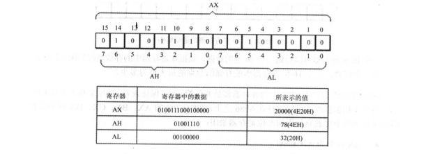
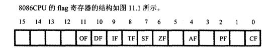
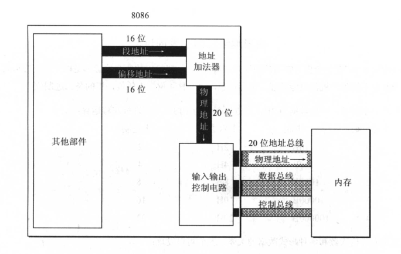
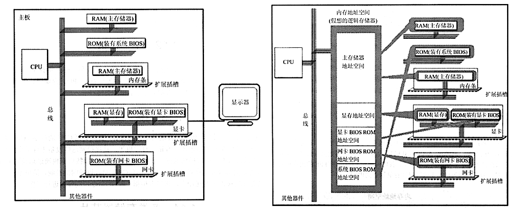
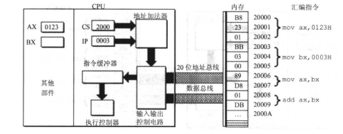

# 8086CPU的设计

------

## 寄存器

8086CPU一共有14个16位的寄存器。

通用寄存器：AX，BX，CX，DX，SP，BP，SI，DI

控制寄存器：IP，FLAG(标志寄存器)

段寄存器：CS，DS，SS，ES

### AX-DX

AX-DX都是通用寄存器，8086CPU上一代的CPU寄存器是8位的，为了兼容性，AX-DX都可以拆分成两个独立的8位寄存器来使用。



多字节的数据被放入内存中时，是高对高，低对低的。

### CS,IP

偏移地址和段地址都是16bit，但地址总线需要20bit的内存地址。所以采用段地址:偏移地址的方式来表示20bit的内存地址。
$$
物理地址=段地址*16（即16进制下补一个0)+偏移地址
$$
任何时候CPU将CS:IP指向的内容当成指令执行

### SS,SP

SS:SP始终指向栈顶元素，我们可以把一组长度为N（N<=64K，因为SP的范围是0000-FFFF，为64K）的内存单元定义为一个栈段。

对栈的操作可能越界，栈空时SP=0，放入一个元素后SP=SP-2=FFFE，指向第一个元素。

对SS的修改也需要借助普通的寄存器

> 补充：修改段寄存器（DS，CS，SS，ES）时需要先把段地址送入普通寄存器

### DS 

指令中`[]`表示内存单元的**偏移地址**，没在`[]`里使用寄存器BP时，默认取DS中的内容作为内存单元的**段地址**。

要修改DS就必须先把数据送入一个普通的寄存器，然后再送入DS

```masm
mov ax,idata
mov ds,ax
```

### SI和DI

和BX功能相似，但不能拆分为两个8位寄存器使用。

可以用`[bx+si]`和`[bx+di]`的方式对内存单元寻址，也可以写成`[bx][si]`

### 标志寄存器

flag寄存器是按照位起作用的，1,3,5,12,13,14,15位不具有任何含义，其他位都有专门的含义，记录特定的信息。这些信息可以是CPU相关指令的执行结果，也可以用于给CPU执行相关指令提供依据，控制CPU工作方式等等。



DEBUG的查看命令的结果里有一行`NV UP EI PL NZ AC PO NC`，这是标志寄存器的值

| 标志   |  1   |  0   | 意义            |                                                              |
| :----- | :--: | :--: | --------------- | ------------------------------------------------------------ |
| *SF*   |  NG  |  PL  | 符号(Sign)      | 记录指令执行后，结果是否为负。如果为负，SF=1；如果非负，SF=0。<br />我们知道00000001B可以看作无符号数的1，也可以看作有符号数+1<br />10000001B可以看作是无符号数129，也可以看作有符号数-127<br />用补码的好处，就是对有符号和无符号数的加减法运算不用区分，认为它是什么就是什么。关键在于我们需要哪个结果。<br />也就是add等指令必然会影响到SF标志位，只是把数据当作无符号数来运算的时候SF的值没有意义，虽然它确实被影响了，但我们不需要。 |
| *ZF*   |  ZR  |  NZ  | 零值            | 标记相关指令的计算结果是否为0。ZF=1表示结果是0，ZF=0表示结果为1<br />add,sub,mul,div,inc,or,and等会逻辑算术运算指令会影响标志寄存器，<br />而mov,push,pop等数据移动指令则不会 |
| *PF*   |  PE  |  PO  | 奇偶            | 记录指令执行后结果的所有二进制位中1的个数的奇偶。1的个数为偶数，则PF=1；1的个数为奇数，PF=0<br />比如`or al,2`的结果，其中`al`为01H，结果为00000011B，1的个数为偶数，所以PF=1 |
| **CF** |  CY  |  NC  | 进位(Carry)     | 针对的是无符号数，对16位和8位的计算都有效，记录最高位的进位/借位值。<br />比如`sub al,98H`，其中al是97H。执行指令后CF=1，即发生了借位 |
| **OF** |  OV  |  NV  | 溢出(Over flow) | 针对的是有符号数，标识是否发生溢出。<br />如果运算结果使用8位寄存器，那范围是-128~127，如果用16bit存放，范围就是-32768~32767。<br />比如`add al,99`，其中AL是98，因为$98+99=197$，所以发生溢出。实际存储结果是C5H，解释为有符号数为-59<br />当然还有$-16-120$也会发生溢出 |
| DF     |  DN  |  UP  | 方向(Direction) | 在串处理指令中，控制每次操作后si,di的增减。<br />DF=0 每次操作后si,di递增<br />DF=1 每次操作后si,di递减<br /><br />8086CPU提供了两条指令对DF位进行设置<br />`cld`：将DF设置为0<br />`std`：将DF设置为1 |

> 对于进位和溢出的一些额外解释：
>
> 对于无符号数运算，用CF位记录是否发生进位；
>
> 对于有符号数，用OF位判断是否溢出，用SF位记录符号。
>
> 比如$98+99$，如果看成是无符号数，没有进位，所以CF=0。如果看成有符号数，他们相加发生溢出，所以OF=1，实际结果是负数，所以SF=1。
>
> 此外，溢出和进位并没有什么必然联系。

## 总线

负责在CPU，内存等部件之间传输信息，相当于总指挥。

### 地址总线

CPU通过地址总线来找到存储器单元的，如果有N根地址线，那么寻址能力是$2^N$个存储单元

8086CPU的地址总线有20根地址线，可以传送20bit的地址，达到1MB的寻址能力。但8086CPU是16bit的寄存器，只能给出16bit的地址，所以采用两个16bit的地址合成一个20bit的地址的方法。



> 8086采用段地址和偏移地址组合的方式表示一个20bit的地址

### 数据总线

CPU与内存或其他器件之间的数据传送是通过数据总线进行的。如果有M根数据线，一次可以传送Mbit的数据。

8086只有8根数据线，一次可以传送8bit的数据。传送16bit的数据需要分两次进行传送。

### 控制总线

CPU对外部器件的控制是通过控制总线实现的

比如对内存的读写是由两根控制线通过高低电平控制的，一根负责发送CPU读信息，一根负责发送写信息。

## 内存

### 存储器

存储器被划分为多个存储单元，并从0开始编号。一个存储单元可以存储1Byte的数据，可以用内存地址找到对应的存储单元。

存储器可以分为随机存储器RAM和只读存储器ROM，随机存储器可读可写，断电存储内容流失；RAM只能读不能写，断电数据也不会消失。

### 内存地址

比如一个CPU的地址线宽度是10，那么可以寻址1024个内存单元，这1024个内存单元就构成了这个CPU的内存地址空间。

实际被访问的内存地址在物理上并不是一个连续的整体，但是CPU在操控它们的时候把它们看成一个逻辑上的整体。

> 存储器在物理上是独立的器件，它们都和CPU总线相连接（左），在实际操控时可以看成一个大的逻辑存储器（右）。
>
> 

比如显卡有自己的存储器RAM，称为显存，显存上的内容会显示在显示器上。8086cpu的显存空间的地址是B8000H-BFFFFH

## 指令执行过程

CPU先从CS:IP指向的内存读指令：CS和IP的内容被送入地址加法器，运算得到的结果被送上地址总线，被指到的内存单元存放的机器指令通过数据总线送入CPU

机器指令被CPU放入指令缓冲器，当CPU读取指令后，**IP自动增加当前指令的字节数**，然后再执行指令缓冲器里的指令，如此一个循环完成。




8086CPU加电启动时，CS:IP会被设置为FFFF:0000，在FFFF0处存放了8086CPU机开机后执行的第一条指令：`jmp F000:005C`。然后就会跳转到F005C继续执行。

F005C处存放BIOS的指令，BLOS做的事情是将硬盘主引导扇区（0面0道1扇区，结尾0x55AA）的内容加载到07C00处，且最后一条指令是`jmp 0000：7C00`。跳转到7C00处继续执行。
