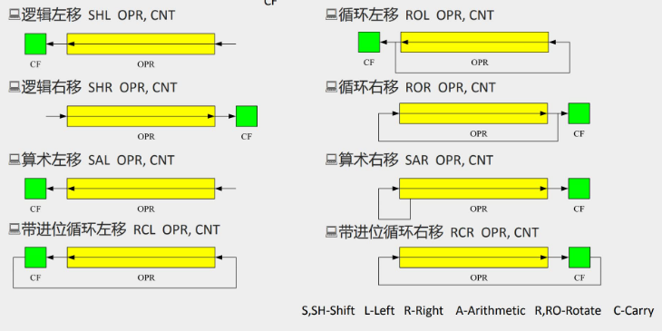
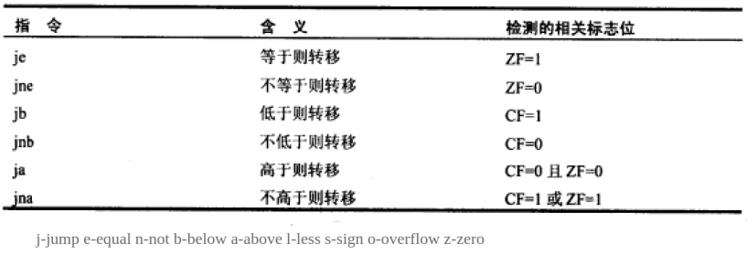

# x86汇编指令

------

## 算术逻辑运算

### add

用前面的加上后面的，把结果存在前面的里面。

```masm
add ax,3
add cx,bx    
add cx,cx
add ax,[0]
add [4],bx
add cx,FFFF 					;越界会丢弃高位
add bl,F0 						;低8位越界不会进位到高8位，直接舍掉
add ax,ds 						;(错误示范) add不可以对段寄存器操作
```

此外汇编编译器支持表达式，它能识别运算符并处理：

```
add ax,8-4
add cx,offset do0end-offest do0		;偏移地址
```

### sub

用前面的减去后面的，把结果存在前面的里面。

```masm
sub bx,10 
sub ax,bx   					;2字节
sub ax,[0]
sub [0],bx
```

### mul

无符号数乘法，两个相乘的数，要么都是8位，要么都是16位。

8位乘8位，默认一个乘数放在AH里，结果放在AX中。

```masm
mul bl 							;和AH相乘，结果放在AX里
```

16位乘16位，默认一个乘数在AX中，结果放在两个16位寄存器里。高位放在DX中，低位放在AX中。

```masm
amul bx,2710 					;和AX相乘，结果放在DX AX里
```

### div

除数可以是8bit或者16bit。

除数是8位，被除数就是16位，默认放在AX中。AL放商，AH放余数。

```masm
div BL 							;被除数是AX，商是AL，余数是AH
```

除数是16位，被除数则是32位，默认放在DX和AX中。DX存放高16位，AX存放低16位。AX存结果的商，DX存除法操作的余数。

```masm
div BX 							;被除数是DX AX，商是AX，余数是DX
```

### 关于有符号数和无符号数运算的解释

CPU在执行add等加减法指令的时候包含了两种含义：有符号数和无符号数运算。这是因为使用补码表示有符号数时，它的加减规则和无符号数的运算方法相同，所以可以统一运算。只需要根据实际需要把它当成有符号或者无符号即可。SF，CF，OF标志寄存器必然受到影响，但只有在被当作有符号数的时候SF和OF有用，当作无符号数的时候CF有用。

但乘除法需要区分有无符号，所以有两种指令：`mul`和`div`(用于无符号)，`imul`和`idiv`(用于有符号)，当然数据本身并不包含是有无符号数的信息，取决于你如何解释它。

------

### inc

相当于ax++

```masm
inc ax
```

### dec

相当于ax--

```masm
dec ax
```

### and

按位与运算

```masm
and al,01001110B
```

### or

按位或运算

```masm
or al,10101110B
```

### adc

带进位加法指令，利用了CF位上记录的进位值。下面的指令，实际相当于让$ax=ax+bx+CF$

```masm
adc ax,bx
```

`adc`被提供的目的就是为了可以对更大的数据进行加法运算

```masm
;计算1EF0001000H+2010001EF0H，结果放在ax（高位）,bx（中）,cx（低）里
mov ax,001EH
mov bx,0F00H
mov cx,1000H

add cx,1EF0H
adc bx,1000H
adc ax,0020H
```

### sbb

带借位减法指令，利用了CF上的借位值。下面的指令，实际相当于让$ax=ax-bx-CF$

```masm
sbb ax,0020H
```

和`adc`是类似的道理

### cmp

`cmp`是比较指令，对标志寄存器的影响相当于减法，只是不保存结果。

```masm
cmp ax,bx
```

比如`cmp ax,ax`，执行后ZF=1，PF=1，SF=0，CF=0，OF=0

通过`cmp`指令执行后标志寄存器的值，可以看出ax和bx的大小关系。

无符号数看CF和ZF即可

有符号数看ZF，SF和OF。注意计算结果的正负，和逻辑上结果的正负，并不一定一致。因为存在溢出的情况，如果不发生溢出，那二者一致；如果发生了溢出，那计算的结果和真实的结果正负值必然是相反的。

## 移位指令



### shl

逻辑左移

把移出的一位写入CF，最低位用0补充

```masm
shl al,1 						;把al的数据左移一位
```

如果移动位数大于1,必须把移动位数放到cl里。以及CF的值是最后移出的那位

```masm
mov al,01010001b
mov cl,3
shl al,cl					;执行后CF是0即最后移出的那位
```

可以看出每一次左移，相当于执行X=X*2

### shr

逻辑右移

低位移出的一位写入CF，最高位补0

```masm
shr al,l
```

如果移动位数大于1,必须把移动位数放到cl里。CF是最后移出的那位，这里是0

```masm
mov al,01010010b
mov cl,3
shr al,cl
```

可以看出每一次右移，相当于执行X=X/2

### rol

循环左移，和逻辑左移的区别是移出的位数会被放入右侧

### ror

循环右移，和逻辑右移的区别是移出的位数会被放入左侧

### sal

算术左移，和逻辑左移一样，最高位放到CF里，右侧补0

### sar

算术右移，最高位用移动前最高位填充

### rcl

带进位循环左移，最高位放到CF里，最低位补移动前的CF

### rcr

带进位循环右移，最高位用原来的CF填充

## 定义数据

定义的数据会被编译器直接填充进内存。

### db

定义字节数据

```masm
db 42,41,73,69,63
```

也可以直接写字符串，要用`''`括起来。实际存储的是字符串的ASCII码，ASCII码的一个字符对应1Byte

```masm
db 'BAsic'   			;等价于db 'B','A','s',i','c'，等价于db 42,41,73,69,63
```

> 大写字母+20H=小写字母   利用这个规律，只要改变第5位即可改变大小写（用and 或者or）

### dw

定义字型数据。用法如下：

```masm
dw 0123H,2321H,2132H,3546H,9ACDH,321FH
```

所以`dw`可以说是定义字型数据，也可以说是开辟2个字节的内存空间。

注意因为定义的是字型数据，占用2个字节。每个数据依旧是高对高，低对低，比如上面定义的数据在内存中是：

```
23 01 21 23 32 21 46 35 CD 9A 1F 32
```

### dd

定义双字型（32bit），和dw一样，定义的数据占4字节，高对高，低对低。

```masm
dd 36477834  				;识别为十进制，十六进制：22C9B8A
```

内存的结果是

```
8A 9B 2C 02
```

### dup

与db,dw,dd一样，是编译器处理的符号。它和db,dw,dd等数据定义伪指令搭配使用，用来进行数据的重复。

```masm
db 3 dup (0)			;定义3个字节，它们值都是0，相当于db 0,0,0
db 3 dup (1,2,3)		;定义9个字节，相当于db 1,2,3重复3次
db 3 dup ('abc','ABC')  ;定义18个字节，相当于db 'abcABCabcABCabcABC'
dw 3 dup (2)			;定义6个字节，相当于dw 2重复3次，内存里是000200020002
```

### 将标号当作数据来定义

会根据是字型数据还是双字型，自动选择存放偏移地址还是段地址与偏移地址

```masm
data segment
	a db 1,2,3,4,5,6,7,8
	b dw 0
	c dw a,b		;字型数据，即2字节，存放的就是a,b的偏移地址
					;相当于c dw offset a,offset b
	d dd a,b		;双字型数据，存放的是偏移地址和段地址
					;d dw offset a,seg a,offset b,seg b
data ends
```

## 数据移动

### mov

```masm
mov ax,8    	;机器码占3个字节
mov bx,ax
mov al,bh   	;操作对象为1字节
mov ax,[0]  	;将ds:0处的数据送入ax中
mov ax,[bx] 	;偏移地址bx中，段地址在ds中，ax隐式指定移动2个字节
mov al,[bx] 	;偏移地址bx中，段地址在ds中，移动1字节
mov ax,ds:[bx]	;可以显式的给出段前缀
mov ax,ss:[0]	;
mov bx,cs:[bx]	;显式的给出段前缀
;不同的写法
mov ax,[200+bx]
mov ax,[bx+200]
mov ax,200[bx]
mov ax,[bx].200
;支持部分寄存器的组合
mov ax,[bx+si]
mov ax,[200+bx+si]
```


### 串传送指令

#### movsb

相当于执行如下的代码

```masm
mov es:[di],byte ptr ds:[si]		;8086并不支持这样的指令，只是个描述
;根据DF寄存器的值，对si和di的值递增或递减。
;DF=0
inc si
inc di
;DF=1
dec si
dec di
```

可以看出`movsb`的功能是将ds:si指向的内存单元的字节送入es:di中，然后让si和di指向上一个或者下一个内存单元。

#### movsw

和`movsb`的区别只是一次传送一个字，即将ds:si指向的内存单元的word送入es:di中，然后根据DF对si和di递增2或递减2

```masm
mov es:[di],word ptr ds:[si]        ;8086并不支持这样的指令，只是个描述
;DF=0
add si,2
add di,2
;DF=1
add si,2
add di,2
```

#### cld和std

8086CPU提供了两条指令对DF位进行设置

`cld`：将DF设置为0

`std`：将DF设置为1

#### rep

`movsb`和`movsw`通常都和`rep`配合使用，格式如下

```masm
rep movsb
;相当于执行
s: 	movsb
	loop s
```

可见`rep`的作用是根据cx的值，重复执行串传送指令。一共可以实现(cx)个字符的传送。

比如用串传送指令，将`data`段中的第一个字符串拷贝到后面的空间中

```masm
data segment
	db 'Welcome to masm!'
	db 16 dup (0)
data ends

mov ax,data
mov ds,ax
mov si,0						;ds:si指向data:0
mov es,ax
mov di,16						;es:di指向data:16
mov cx,16		`				;cx=16,循环16次
cld								;DF=0 正向传送比较方便
rep movsb
```

### push和pop

栈由高地址向低地址增长，所以增加元素的时候SP要减，减少元素的时候SP要增。SP始终指向栈顶元素（没有元素的时候，SP=栈底地址+2）

入栈：SP=SP-2，然后把ax的内容送入SS:SP指向的内存单元

```masm
push ax
```

出栈：将SS:SP指向的内存单元的数据送入ax，接着SP=SP+2

```masm
pop ax
```

### pushf和popf

`pushf`：将标志寄存器的值压栈

`popf`：从栈中弹出数据，送入标志寄存器

## 转移指令

8086CPU的转移可以分为两类：**段内转移**（只修改IP）和**段间转移**（同时修改CS和IP），

段内转移又可以分为短转移和近转移，短转移的IP范围在-128-127（8bit），近转移IP的范围是-32768-32767（16bit）

转移的地址，可以通过偏移量（IP变化量）给出，或者通过目标地址（CS和IP，或者只有IP）

### offset	

offset是由编译器处理的符号，用于取得标号的偏移地址

将取得的偏移地址理解为一个长度为2字节的数即可，它可以被加减

```masm
assume cs:codesg
codesg segment
	start: mov ax,offset start  	;相当于mov ax,0
									;这条指令长度3字节
		s: mov ax,offset s			;相当于mov ax,3
codesg ends
end start
```

如果被取得偏移地址的标号和当前指令不在同一个段中，也是可以取得的。不过是相对于标号所在段的偏移地址。

汇编编译器可以处理表达式，比如下面的这段代码，`-`是由编译器识别的运算符号，`offset do0end-offset do0`是合法的，得到的是do0代码的长度

```masm
do0:	;代码
		mov cx,offset do0end-offset do0
		mov ax,4c00H
		int 21H
do0end:	nop
```

### seg

功能为取得某一标号的段地址，这个段地址就是所在段的标号地址

### jmp

jmp是无条件转移指令，可以只修改IP，也可以同时修改CS和IP

需要给出目的地址和转移的距离（段间转移，段内近转移，段内短转移）

下面三种不同格式的jmp指令对应了三种不同的转移方式：

| 指令                | 转移方式                         | 转移地址给出的方式 |
| ------------------- | -------------------------------- | ------------------ |
| `jmp short 标号`    | 段内短转移（IP修改范围-128-127） | IP的变化量         |
| `jmp near ptr 标号` | 段内近转移                       | IP的变化量         |
| `jmp far ptr 标号 ` | 段间转移                         | 目标地址（CS:IP）  |

```masm
jmp short 标号		
						;转到标号处执行指令，段内短转移（IP修改范围-128-127）
					 	;它对应的机器指令中保存的是IP的变化量 比如EB 03，表示IP+3，即修改为下一条指令的地址+3个字节
						;变化量在编译的时候算出，用补码保存
					 	;如果实际跳转超过IP修改范围，会报错
jmp near ptr 标号 		
						;段内近转移
						;如果实际是短转移，机器码是EB 变化量 90（nop占位）
						;如果是近转移，机器码是E9打头，跟16bit的IP变化量（存储依旧是高对高，低对低）
jmp far ptr 标号  	
						;段间转移，在机器码中保存的是目标地址（CS:IP）
						;比如EA0B01BD0B ，含义是JMP 0BBD:010B
```

转移地址在寄存器中的jmp指令：

```masm
jmp ax  						;类似于mov IP,ax
```

以下这种修改CS和IP的写法，是在Debug中使用的汇编指令，汇编编译器并不认识，如果在源程序中使用，编译时候会报错

```masm
jmp 2AE3:3  					;类似于mov CS,2AE3   mov IP,3
```

转移地址在内存中的jmp指令有两种格式：

```masm
;段内转移
mov ax,0123H
mov ds:[0],ax
jmp word ptr ds:[0]				;ds:[0] 处存放一个偏移地址，执行后IP=ds:[0]指向的内存单元的值

;段间转移
mov ax,0123H
mov ds:[0],ax
mov word ptr ds:[2],0			;高地址放段地址，低地址放偏移地址
jmp dword ptr ds:[0]			;执行后CS=0,IP=0123H
```

### jcxz

jcxz为有条件转移指令，所有的有条件转移指令都是短转移，在对应的机器码中包含转移的位移，IP变化范围是-128-127

```masm
jcxz 标号		;如果cx=0，转移到标号处执行
```

相当于在cx=0时，执行`jmp short 标号`

### 其他的条件转移指令

条件满足时，发生转移



jxxx系列指令和`cmp`指令配合实现高级语言中的if语句：

```masm
;如果ah=bh,则ah=ah+ah,否则ah=ah+bh
        cmp ah,bh
        je s				;判断是否相等
        add ah,bh
        jmp short ok
   s:   add ah,ah
  ok:	ret
```

### loop

短转移，转移地址用IP的变化量给出（IP修改范围是-128-127）。

循环指令的框架如下：

```masm
mov cx,11
s:	
	;循环执行的代码段
	loop s
```

执行到`loop s`时会先让cx=cx-1，然后判断cx的值是否为0，如果为0继续执行下面的代码，如果不为0转至`s`处执行。

> 结论：cx中存放的值是循环次数

### ret和retf

ret用栈中数据修改IP的内容，实现近转移

```masm
ret                   	;相当于pop IP
```

retf用栈中数据修改CS和IP的内容，实现远转移

```masm
retf					;相当于pop IP,pop CS
```

### call

用于将CS和IP压入栈，并转移。call经常和ret一起使用，实现子程序

#### 地址是标号的情况

根据位移转移的call指令（段内近转移）

```masm
call 标号			
				;将当前的IP压入栈中，并转移到标号处
				;相当于push IP,jmp near ptr 标号
				;call的机器码存储的同样是IP的变化值，而非目标地址（变化值=标号处的地址-call指令的下一个指令的地址）
				;E80600,变化值为0006
```

根据目的地址转移的call指令（段间转移）

```masm
call far ptr 标号
				;将当前的CS和IP压入栈中，并转移到标号处
				;相当于 push CS,push IP,jmp far ptr 标号
				;机器码 9A 05 01 6E 07 ,即目标地址076E:0105
```

#### 地址在寄存器中

转移地址在寄存器中的call指令

```masm
call 16位寄存器
				;比如call ax，等于push IP,jmp ax
```

#### 地址在内存中

转移地址在内存中的call指令

```masm
call word ptr 内存单元地址
				;段内转移
				;相当于只执行push IP,jmp word ptr 内存单元地址
call dword ptr 内存单元地址
				;段间转移
				;相当于push CS,push IP,jmp dword ptr 内存单元地址
```

### 关于转移指令的补充

1. ip的变化量在编译的时候算出，用补码保存

2. 当位移超出转移范围的限制时，编译会发生报错。例如：

   ```masm
   assume cs:code
   
   code segment
   	start:	jmp short s				;IP+128才能指向s标号的地址，发生了越界
   			db 128 dup (0)
   		s:  mov ax,ffffH
   code ends
   end start
   ```

3. 因为是在IP自增完后才执行的指令，所以在指令执行时，IP已经指向下一条指令了。所以机器码中的IP变化量都是从下一条指令的位置开始算的，而不是当前的指令位置。

   比如call指令里入栈的IP是下一条指令的IP地址。

## 内存单元寻址方式

### []的用法

`[]`有如下几种用法

| 用法            | 解释                                     |
| --------------- | ---------------------------------------- |
| `[idata]`       | 一个常量来表示地址，直接定位一个内存单元 |
| `[bx]`          | 一个变量表示地址                         |
| `[bx+idata]`    | 变量+常量                                |
| `[bx+si]`       | 两个变量表示地址                         |
| `[bx+si+idata]` | 两个变量+常量                            |

在8086CPU中，只有`bx,si,di,bp`可以在`[]`中进行内存单元的寻址，比如下列指令都是正确的：

```masm
mov ax,[bx]
mov ax,[bx+si]
mov ax,[bx+di]
mov ax,[bp]
mov ax,[bp+si]
```

而下列的指令是错误的：

```masm
mov ax,[cx]
mov ax,[ax]
mov ax,[dx]
mov ax,[ds]
```

此外这四个寄存器要么单独出现，要么以`[bx+si]`,`[bx+di]`,`[bp+si]`,`[bp+di]`以及它们加上常量的组合出现，其他的组合都是错误的。

### []的格式

以下四种格式等价（常用）

```masm
mov ax,[bx+200]

mov ax,[200+bx]
mov ax,200[bx]
mov ax,[bx].200
```

### 用哪个段寄存器

段寄存器可以是默认的，可以是显式指定的

当未显式给出段寄存器时候，只要在`[]`中出现了寄存器BP，那么段寄存器默认是SS；如果没有出现BP，段寄存器就默认是DS。

```masm
;用到BP，段寄存器是SS
mov ax,[bp]
mov ax,[bp+idata]
mov ax,[bp+si]
mov ax,[bp+si+idata]

;没用到BP，段寄存器是DS
mov ax,[0]
mov ax,[di]
mov ax,[bx+8]
mov ax,[bx+si]
mov ax,[bx+si+8]
```

也可以显式的给出段寄存器

```masm
mov ax,ds:[bp]
mov ax,es:[bx]
mov ax,ss:[bx+si]
mov ax,cs:[bx+si+8]
```

### 数据长度是多少

指令要处理的数据长度，可以是byte和word，在机器指令中必须要指明是字操作还是字节操作，有两种指明方式

一种是根据寄存器隐式的指明要处理的数据尺寸

```masm
;字操作
mov ax,1
mov bx,ds:[0]
mov ds,ax
inc ax
add ax,1000

;字节操作
mov al,1
mov al,bl
mov al,ds:[0]
mov ds:[0],al
inc al
add al,100
```

一种是用操作符`ptr`显示的指明内存单元的长度

```masm
;访问的单元是字单元
mov word ptr ds:[0],1
inc word ptr [bx]					
add word ptr [bx],2
;访问的单元是字节单元
mov byte ptr ds:[0],1
inc byte ptr [bx]
inc byte ptr ds:[0]
inc byte ptr [bx],2
```

像`push`这样的指令不需要指明访问的是字单元还是字节单元，因为它只能进行字操作

## 关于标号

### 地址标号

地址标号代表一个内存单元的地址，它可以被用于标记指令，数据，段的起始地址。

```masm
;标记段的起始地址
code segment
code ends

;标记指令
start:	mov ax,1

;标记数据
a:	db 1,2,3,4,5,6
```

### 数据标号

数据标号专门用于定义数据。

比起地址标号多给出了内存单元的长度：即是1字节，2字节还是4字节

下面的代码定义了数据标号`a`和`b`：

```masm
assume cs:code
code segment
		a db 1,2,3,4,5,6,7,8
		b dw 0					;将冒号删掉就是数据标号
start:	mov si,0
		mov cx,8
s:		mov al,a[si]
		mov ah,0
		add b,ax
		inc si
		loop s
		mov ax,4c00H
		int 21H
code ends
end start
```

比如对于上面的数据标号，对应的指令可以解释如下

```masm
;b的偏移地址是8
mov ax,b		;相当于mov ax,cs:[8]
mov b,2			;相当于mov word ptr cs:[8],2
inc b			;相当于inc word ptr cs:[8]
;a的偏移地址是0
mov al,a[si]	;相当于mov al,cs:0[si]
mov al,a[3]		;相当于mov al,cs:0[3]
mov al,a[bx+si+3]	;相当于mov al,cs:0[bx+si+3]
```

在用到数据标号时，段寄存器由`assmue`给出。比如上面的`a`和`b`都定义在`code`段里，这个段又和CS寄存器关联了起来，所以寄存器用的是CS。

必须手动将CS设置指向`code`段，这里因为加载程序后CS默认指向第一个段的段地址，也就是code段，不必再设置。

还可以将标号当作数据来定义：

```masm
data segment
	a db 1,2,3,4,5,6,7,8
	b dw 0
	c dw a,b		;字型数据，存放的就是a,b的偏移地址
					;相当于c dw offset a,offset b
	d dd a,b		;双字型数据，存放的是偏移地址和段地址
					;d dw offset a,seg a,offset b,seg b
data ends
```

## 其他

### nop

占位，占1个字节，没有实际意义

```masm
nop			;90
```

