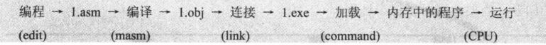
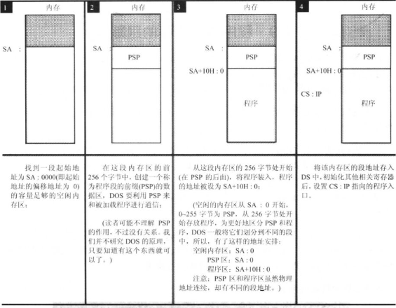
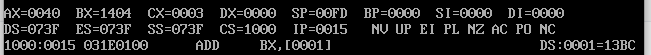
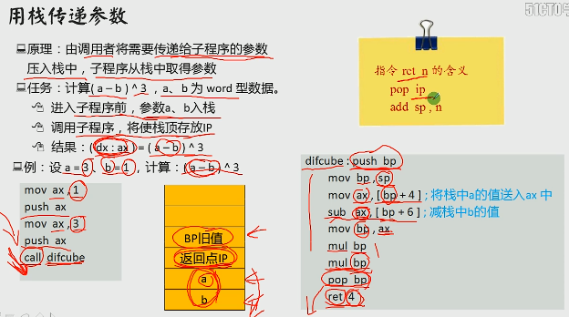
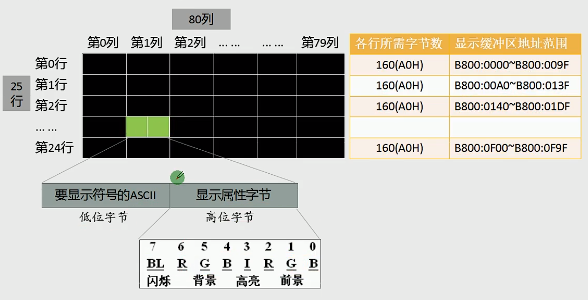

# x86汇编程序

------

## 汇编源程序是什么

以下是一个汇编源程序的示例：

```masm
; 1.asm
assume cs:abc
abc segment
    mov ax,2
    add ax,ax
    add ax,ax

    mov ax,4c00H
    int 21H
abc ends
end
```

> 源程序：源程序文件中的所有内容，包括伪指令
>
> 程序：源程序中最终被计算机执行处理的指令和数据，以汇编形式被保存在源程序中，编译连接后转变为机器码存在可执行文件中。

## 伪指令

一个汇编程序有两种指令，一种是汇编指令，一种是伪指令。汇编指令有对应的机器码，可以被编译成机器指令，最终被CPU执行。伪指令没有对应的机器码，是由编译器来执行的指令。编译器根据伪指令进行相关的编译工作。

### XXX segement   XXX ends

以下程序定义了一个段：

```masm
codesg segment             		;定义一个叫codesg的段

codesg ends                		;名称为codesg的段结束
```

一个汇编程序由多个段组成，这些段被用来存放代码，数据或者当成栈空间来使用。指令数据栈被分到不同的段中，一个有意义的汇编程序至少有一个段。

### end

`end`除了可以通知编译器程序结束以外，还可以用于指定程序的入口

```masm
end								;通知编译器编译结束
end start						;程序入口是star
```

在程序被载入内存后，CS:IP会被设置指向程序入口（CS=入口所在段，IP=入口偏移地址）。

如果直接`end`，CS:IP就会默认指向第一个段的起始地址（CS=第一个段的段地址，IP=0）。

### assume

assume的作用是只是让编译器知道数据标号所在段对应的段寄存器，从而用到数据标号的时候能正确设置段寄存器。而将段地址装入段寄存器的任务仍然是由用户手动完成的

```masm
assume cs:codesg   				;将codesg和cs联系起来
```

然后`mov bx,[a+0]`会被翻译为`mov bx,cs:[a的偏移地址+0]`

可见用到标号的时候，段寄存器是根据`a`>>`a`所在段`codesg`>>关联的是`cs`找到的段寄存器，所以`cs`还是得手动设置为`codesg`的值

## 汇编程序的执行过程

> 操作系统环境：DOS（一种早期的PC操作系统）
>
> 汇编工具：MASM-v5.00
>
> 命令：`masm`,`debug`,`link`

通用的操作系统都要提供shell，在DOS中有一个程序是command.com，这个程序在DOS中被称为命令解释器，也是DOS系统的shell。

启动shell：

```dos
command
```

汇编工具里包括DEBUG.EXE、MASM.EXE、LINK.EXE等可执行文件，它们可以在DOS下直接执行：

```dos
masm				#编译
debug				#调试
link				#连接
```

------



### 编译和连接，运行

对1.asm进行编译，编译后生成目标文件 1.obj

```dos
masm 1
```

对1.obj进行连接，生成可执行文件1.exe

```dos
link 1
```

运行1.exe

```dos
1
```

### 运行1.exe的过程

command运行后，在屏幕上显示盘符和提示符，等待用户输入。

键入`1`后，command查找到1.exe文件，并将1.exe的程序载入内存，设置CS:IP指向程序的入口。此后command暂停运行，CPU运行程序

CPU运行完1.exe程序后，再返回到command中，CPU继续运行command，command再次显示当前盘符和提示符，等待用户输入

1.exe具体载入过程如下：

先由DOS系统分配一段空间足够的内存，然后依次存放PSP区和程序区（合称内存区）

其中PSP区占用256字节，二进制开头是CD 20，用于DOS和程序通信

然后设置相关寄存器等等



> 加载1.exe进内存后，CX被设置为程序的长度，DS被设置为内存区的段地址（也是PSP的起始地址），CS:IP指向程序入口（默认指向ds+10H:0，即图中程序区开始的地方，如果指定了入口地址，会被设置为ds+10H:入口的偏移地址）

### 跟踪1.exe运行过程

跟踪需要用到`debug`命令。

和直接执行1.exe不一样，调试的执行过程是 command 加载 DEBUG 进内存，DEBUG 再把1.exe程序载入内存，接着设置相关寄存器的值，但DEBUG不放弃对CPU的控制。这样就可以用DEBUG的相关命令单步执行程序。

```dos
DEBUG 1.exe
```

返回时从1.exe程序返回 DEBUG ，再返回 command

此外，也可以直接执行`debug`，这可以用来跟踪CPU的执行和查看CPU的寄存器

#### DEBUG模式下常用命令

##### R 查看，修改CPU中寄存器的内容

查看寄存器

```
r
```



> `1000:0015`是当前cs:ip的值，`031E0100`是cs:ip指向的内容，`ADD BX,[0001]`是对应的指令

修改寄存器ax的内容

```
r ax
```

修改寄存器cs的内容

```
r cs 
```

##### D 查看内存中的内容

查看1000:1000往后的128个内存单元

```
d 1000:0000
```

查看1000:1000到1000:20的内容，共32字节

```
d 段地址:起始偏移地址 结尾偏移地址
d 1000:0000 20（结尾偏移地址）
```

从1000:9个开始的128个内存单元

```
d 1000:9
```

可以把段地址用段寄存器写，很方便

```
d ds:0
d ds:10 18 						查看10-18中的内容
d cs:0 							查看当前代码段的内容
d ss:0  						查看当前栈段的内容
```

在E，A，U指令中也可以使用

```
e ds:0 11 22 33
u cs:0
a ds:0
```

##### E 修改内存中的内容

修改内存 

```
e 起始地址 数据 数据 数据 数据
e 0100:0000 1 2 3
```

逐一修改内存，空格下一个，回车结束

```
e 起始地址
e 0100:0000
```

##### U 以汇编指令的形式显示内存中的内容

显示机器指令的地址，机器指令和对应的汇编指令。

```
u
```

由此可见内存中的数据和代码没有任何区别，关键在于如何解释

```
u 1000:0
```

##### T 执行CS:IP指向的指令

执行一次CS:IP指向的机器指令

```
t
```

##### G 执行到结束

```
g
```

##### A 以汇编形式写入指令

直接以汇编指令的形式写入多个指令，不输入然后Enter结束输入

```
a 1000:0
```

注意：

这个方式输入的指令，不能是二进制形式，比如`mov ax,01000101B`是不对的，数据不用点名类型，默认是16进制

##### P 跳过循环

遇到循环的时候使用可以跳过接下来的循环，直到CS:IP指向循环的下一条

`int 21`需要用P执行，记住就好

##### G 运行到程序结束

##### q 退出DEBUG模式

## 使用段组织代码，数据和栈

### 段是什么

一段内存可以是代码存储空间，数据存储空间，栈空间，也可以啥也不是。它就是一串二进制数据，关键是如何解释它。

一个段名对应着一个段地址，可以直接送入寄存器。

```masm
mov ax,data
```

送入段寄存器需要借助通用寄存器

```masm
mov ax,stack
mov ss,ax
```

可以看出，一个段的容量为0000-FFFF的偏移地址范围，共64KB

### 在代码段中使用数据和栈

#### 使用数据

以下代码在这个段的开头开辟了12个字节的内存空间。

```masm
; 1.asm
assume cs:abc
abc segment
	dw 0123H,2321H,2132H,3546H,9ACDH,321FH
    start:	mov ax,0
    		mov cx,5
        s: 	add,ax,cs:[bx]
            add bx,2
            loop s
    mov ax,4c00H
    int 21H
abc ends
end start
```

> `end start`指明了程序的入口在标号`start`处，这个入口地址会被放在可执行文件的描述信息中，程序被载入内存时，加载者会从描述信息中读取入口地址，并设置CS:IP。

#### 使用栈

通过`dw`开辟空间用于栈，然后设置SS:SP指向第一个栈元素来创建一个栈。将程序中定义的数据逆序存放代码如下：

```masm
assume cs:codesg
codesg segment
	dw 0123H,2321H,2132H,3546H,9ACDH,321FH
	dw 0,0,0,0,0,0                              	;定义6个字型数据，程序加载后，将取得8个字的内存空间，这部分当作栈使用
	start:	mov ax,cs
			mov ss,ax								;
			mov sp,24								;将栈顶指向cs:24，cs:0-cs:23存放的是数据，从cs:12-cs:23被当作栈使用
			mov bx,0
			mov cx,6								;循环次数
	s:		push cs:[bx]
			add bx,2
			loop s
			mov bx,0
			mov cx,6
	s0: 	pop cs:[bx]
			add bx,2
			loop s0
			mov ax,4c00h
			int 21h
codesg ends
end start											;指明程序入口
```

### 将数据，代码，栈放入不同的段

以下代码实现的功能和上面的一样，用栈把数据反过来放，但是定义了3个段，用对应的段寄存器指向对应的段名来实现不同的段。

把段名放入段寄存器需要借助中间寄存器，因像`mov ds,data`这样的写法是错误的。

```masm
assume cs:code,ds:data,ss:stack						;assume是伪指令，用于指定每个段对应的段寄存器
data segment
	dw 0123H,2321H,2132H,3546H,9ACDH,321FH
data ends
stack segment
	dw 0,0,0,0,0,0
stack ends
code segment
	;`stack`，`code`都只是标号，CPU不会主动把它们作为数据段和栈，要手动修改段寄存器存储它们。
	start: 	mov ax,stack
			mov ss,ax
			mov sp,16									;设置栈顶指向stack:16
			
			mov ax,data
			mov ds,ax
			mov bx,0									;ds:bx指向data段的第一个单元
			
			mov cx,8
		s:	push [bx]
			add bx,2
			loop s										;循环的把data段的0-15单元的8个字形数据入栈
			
			mov bx,0
			mov cx,8
		s0: pop [bx]
        	add bx,2
        	loop s0                                      ;出栈送到data段的0-15单元中
        	
        	mov ax,4c00h
        	int 21h
code ends
end start
			
```

在8086处理器中，段与段之间紧密连续，每个段的起始地址都是紧接着上一个段的结束地址。当然，段的最小跨度是10H，也就是16字节。所以会用0填充不满的内存。

## 使用call和ret实现子程序

call将当前的IP入栈，然后转移到标号处执行。在子程序的末尾再用ret把地址放IP。

### 用寄存器存储参数和结果

计算N的3次方，完整代码如下。把参数放到BX寄存器中，子程序会用它，然后把结果放到dx和ax中

```masm
assume cs:code

data segment
	dw 1,2,3,4,5,6,7,8			;2字节
	dd 0,0,0,0,0,0,0,0			;4字节
data ends


code segment
	start: 	mov ax,data
			mov ds,ax
			mov si,0
			mov di,16			;[di],[si]默认是ds寄存器

			mov cx,8
	s:		mov bx,[si]			;第一个word放入bx
			call cube			;当前IP入栈，跳转计算
			
			mov [di],ax
			mov [di+2],dx		;放到di里

			add si,2			;ds:si指向下一个word单元
			add di,4			;ds:di指向下一个dword单元
			loop s

			mov ax,4c00h
			int 21h

    ;子程序，计算N的3次方
    ;参数：(bx)=N
    ;结果：(dx:ax)=N^3
    cube:	mov ax,bx
            mul bx
            mul bx
            ret						;出栈元素放到IP

code ends
end start
```

载入代码后DS寄存器被设置为内存区的地址（也是PSP区的地址），CS和IP指向程序的入口，查看内存SS居然默认是被设置为PSP区的最后16个字节..

### 用内存单元传递数据

将数据放到内存中，然后把内存空间的首地址放到寄存器中，传给需要的子程序。

下面的代码将data段中的字符串转化为大写

```masm
assmue cs:code
data segment
	db 'conversation'
data ends
code segment
	start:	mov ax,data
			mov ds,ax
			mov cx,12
			call capital
			mov ax,4c00H
			int 21H
	capital:and byte ptr [si] 11011111b
			inc si
			loop capital 
			ret
code ends
end start
```

### 用栈传递参数

将子程序参数压入栈中，子程序从栈中获得参数

计算$(a-b)^3$，a和b都是word型数据



```masm
code segment
start:			mov ax,1
				push ax
				mov ax,3
				push ax
				call difcube			;IP入栈
				mov ax,4c00H
				int 21H
difcube:		push bp					;在栈中保存bp旧值，因为主程序可能用到bp
				mov bp,sp
				mov ax,[bp+4]
				mov ax,[bp+6]
				mov bp,ax
				mul bp
				mul bp
				pop bp
				ret 4
code ends
```

### 寄存器冲突的问题

即一个重要的寄存器在子程序调用后被修改，导致出现问题。

还是将data段中的字符转化为大写的问题，但这次用0表示字符串结束：

```masm
assmue cs:code
data segment
	db 'conversation',0
data ends
code segment
	start:	mov ax,data
			mov ds,ax
			mov si,0			;设置起始地址
			call capital
			mov ax,4c00H
			int 21H
	capital:
			mov cl,[si]
			mov ch,0
			jcxz ok
			and byte ptr [si] 11011111b
			inc si
			jmp short capital 
		ok:	ret
code ends
end start
```

当处理多个字符串时，cx又用于循环，又用于判断是否遇到0，就发生了冲突

```masm
assmue cs:code
data segment
	db 'conv',0
	db 'word',0
	db 'good',0
data ends
code segment
	start:	mov ax,data
			mov ds,ax
			mov bx,0
			mov cx,4
		s:	mov si,bx
			call capital
			add bx,5
			loop s
			mov ax,4c00H
			int 21H

;si 字符串起始地址
;当读到0时结束处理
	capital:
			mov cl,[si]
			mov ch,0
			jcxz ok
			and byte ptr [si] 11011111b
			inc si
			jmp short capital 
		ok:	ret
code ends
end start
```

我们希望调用子程序的时候不必考虑子程序使用了哪些寄存器，编写子程序的时候也无需考虑调用者使用了哪些寄存器。解决方案如下：

**在子程序的开始，保存将用到的所有寄存器，在子程序返回前再恢复**

```masm
子程序开始:		
				子程序中用到的寄存器入栈
				子程序内容
				子程序使用到的寄存器出栈
				返回（ret,retf）
```

比如上面CX寄存器冲突的问题可以这样解决

```masm
assmue cs:code
data segment
	db 'conv',0
	db 'word',0
	db 'good',0
data ends
code segment
	start:	mov ax,data
			mov ds,ax
			mov bx,0
			mov cx,4
		s:	mov si,bx
			call capital
			add bx,5
			loop s
			mov ax,4c00H
			int 21H

;si 字符串起始地址
;当读到0时结束处理
	capital:
;;;;;;用到cx,si;;;;;;;;;;;;;;;;;;;
			push cx
			push si
;;;;;;;;;;;;;;;;;;;;;;;;;;;;;;;;;;
			mov cl,[si]
			mov ch,0
			jcxz ok
			and byte ptr [si] 11011111b
			inc si
			jmp short capital 
			
		ok:	pop si			;
			pop cx			;出栈
			ret
code ends
end start
```

## 操作显存数据

屏幕上的内容=显存中的数据



内存地址空间中，B8000H～BFFFFH共32K的空间，为80*25彩色字符模式的显示缓冲区。一屏的内容在显示缓冲器里占用4000个字节。

显示缓冲区分8页，每页4K，显示器可以显示任何一页的内容。一般情况是第0页的内容。也就是通常B8000～B8F9F 中的4000个字节的内容显示在屏幕上。

在屏幕中间显示白底蓝字的Welcome to masm

```masm
assume cs:codeseg,ds:datasg
datasg segment
	db 'welcome to masm!'
datasg ends

codeseg segment
start:	
		;初始化寄存器
		mov ax,datasg
		mov ds,ax
		mov ax,0B800H
		mov es,ax
		mov si,0
		mov di,160*12+80-16		;在屏幕中间显示

		;显示字符串
		mov cx,16
w:		mov al,[si]
		mov es:[di],al
		inc di
		mov al,71H
		mov es:[di],al
		inc si
		inc di
		loop w

		mov ax,4c00H
		int 21H
codeseg	ends
end start
```

## 用查表的方法解决问题：直接定址表

### 对数据的查表

对数据的查表是将数据放到表中，统一管理。

问题：以十六进制的形式在屏幕中间显示给定的byte型数据

最简单的解决方案：建立一张表，表中依次存放字符0-F，通过数值0-15直接查找到对应的字符

```masm
table db '0123456789ABCDEF'			;建立字符表
```

完整代码如下

```masm
assume cs:code
code segment
start: 		mov al,02BH			;2B是要显示的内容
			call showbyte
			mov ax,4c00H
			int 21H
			
;子程序
showbyte:
			jmp short show
			table db '0123456789ABCDEF'
    show:		push bx
                push es
                push cx

				;让ah存高4位，al存低4位
                mov ah,al
                mov cl,4
                shr ah,cl		    ;右移4位，ah中得到高4位的值
                and al,00001111b	;al中得到低4位的值
                
                ;设置es
				mov bx,0b800H
				mov es,bx
				
				;取得高4位字符并显示
				mov bl,ah
				mov bh,0
				mov ah,table[bx]		;code段和cs关联起来了，所以相当于mov ah,cs:[table+bx]
				mov es:[160*12+40*2],ah
				
				;取得低4位并显示
				mov bl,al
				mov bh,0
				mov ah,table[bx]
				mov es:[160*12+40*2+2],ah
				
                pop cx
                pop es
                pop bx
                
                ret
code ends
end start
```

再看另一个问题：计算$sin(x)，x∈\{0,π/6,π/3,π/2,2π/3,5π/6,π\}$，并在屏幕中间显示结果。

偏移表如下，`table`标号处的是连续7个偏移地址

```masm
;用0标志字符串的结尾
table dw ag0,ag30,ag60,ag90,ag120,ag150,ag180
	ag0 	db '0',0
	ag30 	db '0.5',0
	ag60	db '0.866',0
	ag90	db '1',0
	ag120   db '0.866',0
	ag150   db '0.5',0
	ag180 	db '0',0

;访问数据
table[bx]		;可以找到下标为bx的元素（元素是偏移地址）
cs:[bx]			;假设bx已经是偏移地址，这将得到第一个字符的ascii码
```

完整代码如下

```masm
assume cs:code
code segment
start:
	mov al,60
	call showsin
	mov ax,4c00H
	int 21H
showsin:
	jmp short show
	;这里放字符串偏移表
	show:
			push bx
			push es
			push si
			
			mov bx,0b800H
			mov es,bx
			
			;用角度值/30作为相对于table的偏移量，取得字符串的偏移地址放入bx
			mov ah,0
			mov bl,30
			div bl
			mov bl,al
			mov bh,0
			add bx,bx
			mov bx,table[bx]
			
			;显示sin(x)对应的字符串
			mov si,160*12+40*2
			shows:	mov ah,cs:[bx]
					cmp ah,0				;判断ah是否是0
					je showret
					mov es:[si],ah
					inc bx					;一个字符1byte，所以bx加1即可
					add si,2
					jmp shows
			showret:
			
			pop si
			pop es
			pop bx
	ret
code ends
end start
```

### 对代码的查表

对代码的查表即将子程序保存到一张表中统一管理

例如下面的代码，实现了一个子程序setscreen，提供了四个功能：清屏，设置前景色，设置背景色，向上滚动一行。

实现的方式是将这4个功能写成4个子程序，然后把这些子程序的入口地址保存在一张表中，他们在表中的位值和功能号相对应。对应关系为：功能号*2=对应功能的子程序相对于地址表的偏移。接着用主程序去调用相应的子程序即可。

```masm
;清屏：将显存中的所有字符设置为空格符
sub1:
	push bx
	push cx
	push es
	
	mov bx,0b800H
	mov es,bx
	mov bx,0
	mov cx,2000
sub1s:
	mov byte ptr es:[bx],' '
	add bx,2
	loop sub1s
	
	pop es
	pop cx
	pop bx
	ret
	
;设置前景色：设置显存中奇地址字节的012位
;al:颜色
sub2:
	push bx
	push cx
	push es
	
	mov bx,0b800H
	mov es,bx
	mov bx,1
	mov cx,2000
sub2s:
	and byte ptr es:[bx],11111000b
	or es:[bx],al
	add bx,2
	loop sub2s
	
	pop es
	pop cx
	pop bx
	ret

;设置背景色：设置显存中的奇地址字节的456位
;al:颜色
sub3:
	push bx
	push cx
	push es
	
	mov cl,4
	shl al,cl
	
	mov bx,0b800H
	mov es,bx
	mov bx,1
	mov cx,2000
sub3s:
	and byte ptr es:[bx],10001111b
	or es:[bx],al
	add bx,2
	loop sub3s
	
	pop es
	pop cx
	pop bx
	ret

;向上滚动一行：依次将第n+1行的内容复制到第n行处，最后一行置空
sub4:
	push cx
	push si
	push di
	push es
	push ds
	
	;准备工作
	mov si,0b800H
	mov es,si
	mov ds,si
	mov si,160
	mov di,0	 		;ds:si指向n+1行,es:di指向第n行
	cld					;DF=0
    mov cx,24
	;复制前24行
sub4s:
	push cx
	mov cx,160
	rep movsb			;复制
	pop cx
	loop sub4s
	;清空最后一行
	mov cx,80
	mov sl,0
sub4s1:
	mov byte ptr es:[160*24+si],' '
	add si,2
	loop sub4s1

	pop ds
	pop es
	pop di
	pop si
	pop cx
	ret
```

主程序如下

```masm
;ah：功能号
assume cs:code
code segment
start:
	mov ah,2
	mov al,5
	call setscreen
	mov ax,4c00H
	int 21H

setscreen:
	jmp short set
	table dw sub1,sub2,sub3,sub4
set:
	push bx
	cmp ah,3	
	ja sret			;高于则转移
	mov bl,ah
	mov bh,0
	add bx,bx
	call word ptr table[bx]
sret:
	pop bx
	ret
;这里放4个功能子程序
code ends
end start
```

可以看出，要想在setscreen里添加新的功能，只要在地址表中加入入口地址就可以了，结构清晰，便于扩充。
