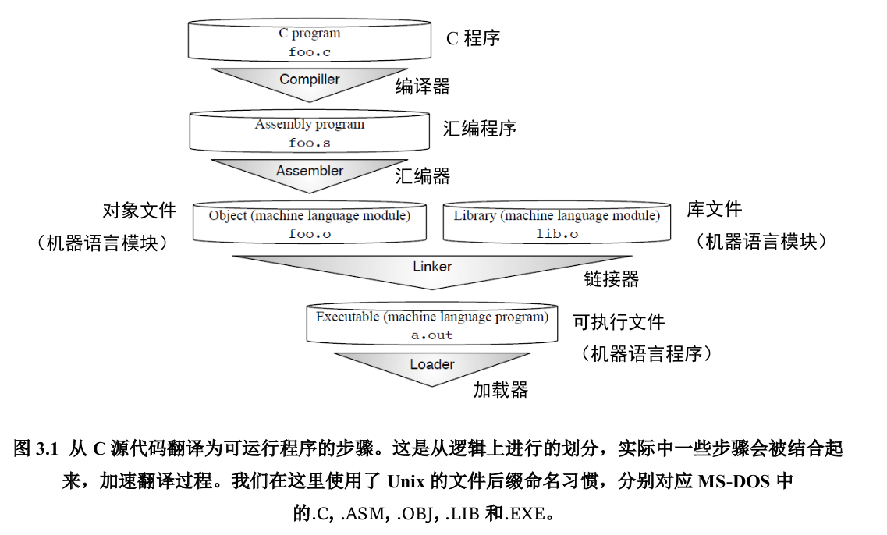
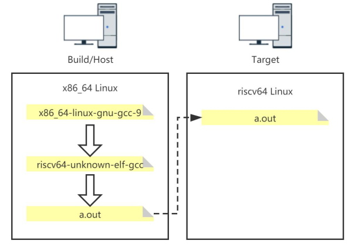

## 硬盘的构造和工作原理

软盘是一种早期的存储设备，已经过时了，下面是3种硬盘：

U盘，采用USB接口

机械硬盘，简称HDD，是机械和电子技术的混合体

固态硬盘，简称SSD，纯粹由集成电路组成

以机械硬盘为例子，它有多个盘片，正反都可以存储数据。转速每分钟千转到万转，形成一个一个圆圈，称为磁道。磁头臂可以带动读写磁头到不同的磁道上读写，读写的最小单位是扇区，它是磁道的一个弧段，固定是512Byte。柱面是指半径相同的磁道形成的圆柱面，扇面是指盘片的一个面。

因为磁头臂切换磁道的速度相较于读写很慢，所以都是按照一个一个柱面读写的：


8086CPU有一步是将硬盘主引导扇区读到内存地址07C00处，然后用一个跳转指令跳到07C00处执行。在硬盘上 0面0柱1扇区 就是主引导扇区，如果想让.bin绕过操作系统被硬件直接执行，就可以把它放到主引导扇区

比如下面的.bin文件：

主引导扇区必须凑够512个字节。此外要让主引导扇区被识别，最后2个字节还必须是55AA

```nasm
;B8 30 00 BA C0 00 01 D0
mov ax,0x30
mov dx,0xc0
add ax,dx

times 502 db 0		;用 0 填充满 502 个字节

db 0x55,0xaa 		;主引导扇区最后两个字节必须是 0x55aa
```

可以用二进制查看工具查看.bin文件

然后用`dd`命令把它写入到虚拟硬盘，`count`选项指定只读取一个扇区

将 boot.bin 文件写入到 /dev/fd0 设备（通常是软盘驱动器）的第一个扇区：

```shell
dd if=boot.bin of=/dev/fdo bs=512 count=1
```


### 虚拟硬盘

不同公司对如何模拟硬盘有不同的想法，所以出现了多种不同的虚拟硬盘格式

VMDK（VMWare虚拟机的硬盘格式）

VDI （VirtualBox虚拟机的硬盘格式）

VHD（Virtual-PC/Hyper-V虚拟机的硬盘格式）

VHD的硬盘格式比较简单，就是按照扇区的顺序，每512字节对应一个硬盘上的扇区

# 编译与链接

## GCC编译器

GCC全称GNU Compiler Collection，是由GNU开发的，遵循GPL许可证发行的编译器套件，它支持 C、C++、Objective-C、Fortran、Ada 等多种编程语言，已经被移植到多种计算机体系架构上，如 x86,ARM,RISC-V 等

### GCC的主要执行步骤

从 C 程序翻译成为可以在计算机上执行的机器语言程序的经典步骤：编译，汇编，链接



编译：编译器完成 “预处理” 和 “编译”，“预处理” 指处理源文件中以 “#” 开头的预处理指令，譬如 #include、#define 等；“编译” 则针对预处理的结果进行一系列的词法分析、语法分析、语义分析，优化后生成汇编指令，存放在 .s 为后缀的目标文件中

汇编：汇编器将汇编语言代码转换为机器（CPU）可以执行的指令，存放于.o文件中

链接：链接器将汇编器生成的目标文件和一些标准库（譬如 libc）文件组合，形成最终可执行的应用程序a.out。

### GCC命令

#### 命令选项

| 常用选项 | 含义                           |
| -------- | ------------------------------ |
| -E       | 只做预处理                     |
| -c       | 只编译不链接，生成文件.o       |
| -S       | 生成汇编代码                   |
| -o file  | 输出生成到指定文件中           |
| -g       | 输出的文件中加入支持调试的信息 |
| -v       | 输出整个翻译为可执行文件的过程 |

#### 常用命令

```shell
gcc hello.c					#生成a.out
gcc -c hello.c -o hello.o	#生成目标文件
gcc -g -c hello.c			#生成带有调试信息的目标文件

gcc -E foo.c -o foo.i		#预处理
gcc -S foo.i -o foo.s		#编译
gcc -c foo.s -o foo.o		#汇编
gcc foo.o -o a.out			#链接
```


### 常见文件类型

`.c`：c源文件

`.cc/.cxx/.cpp`：c++源文件

`.i`：经过预处理的c源文件

`.s/.S`：汇编语言源文件

`.h`：头文件

`.o`：目标文件

`a.out`：可执行文件

### ELF文件

可执行文件不是直接跑在硬件设备上的，中间隔了一层操作系统。要在操作系统上运行，可执行文件必须满足特定的格式，比如Windows的可执行文件格式是PE，Linux的是ELF。

ELF是一种Unix-like系统上的二进制文件格式标准，ELF标准中将采用ELF格式的文件分为4类

| ELF文件类型  | 说明                                                 | 实例            |
| ------------ | ---------------------------------------------------- | --------------- |
| 可重定位文件 | 包含代码和数据，可以被链接成可执行文件或共享目标文件 | Linux上的.o文件 |
| 可执行文件   | 可以直接执行的程序                                   | Linux上的a.out  |
| ...          |                                                      |                 |

#### 文件格式


#### 处理ELF文件的相关工具：Binutils

`ar`：归档文件，将多个文件打包为大文件

`as`：被GCC调用，输入汇编文件，输出目标文件供链接器ld链接

`ld`：GNU链接器，被GCC调用，用于把目标文件和各种库文件结合在一起，重定位数据，并链接符号引用

`objcopy`：执行文件格式的转换

`objdump`：显示ELF文件的信息

```
objdump -S hello.o				#显示源代码和反汇编代码的交叉引用
```

`readelf`：显示更多ELF格式文件的信息，直接vim查看是一堆乱码，得用专门工具看

```
readelf -h hello.o				#h是header的缩写，查看文件头信息ELF Header
readelf -S hello.o				#S是Section，查看Section Header Table
readelf -SW hello.o				#W就是Wide的意思，这样查看比较舒服
```

## 交叉编译

编译器本身也是个程序，它用于生成另外一个程序。

根据参与编译运行时的机器担任的角色，可以把机器划分为下面三类：

- 构建（build）系统：生成编译器这个可执行程序的计算机

- 主机（host）系统：运行编译器这个可执行程序的计算机

- 目标（target）系统：运行编译器生成的可执行程序的计算机

交叉编译就是指 Host!=Target 的情况，Host和Build相不相同取决于我们是自己编译出编译器，还是直接下载别人编译好的工具链。



> 我们平时用的gcc是一个软链接，实际上是`x86_64-linux-gnu-gcc-11`，由它生成的a.out只能在x86上运行。
>
> 利用`x86-64-linux-gnu-gcc-9`的源码，可以做一个生成的可执行文件可以在riscv64上运行的编译器，即图中的`riscv64-unknown-elf-gcc`。
>
> 然后平时就用`riscv64-unknown-elf-gcc`去生成a.out，它只能在riscv64架构的机器上运行（比如咱们用qemu模拟）。

### 例子

```shell
riscv64-unknown-elf-gcc -march=rv32ima -mabi=ilp32 hello.c	#生成a.out
file a.out													#文件类型risc-v上的可执行文件
qemu-riscv32 ./a.out										#在模拟器上运行
```


## GDB调试器

GDB 是一个调试器，支持 assembly,c,c++,go,rust,pascal 等多种语言

gdb支持本地调试和远程调试，远程调试即被调试的程序和gdb前端不在一个机器上

平时我们在vscode里使用的调试，其实都是GUI界面对GDB的调用

### 安装

ubuntu安装：

```
sudo apt install gdb
```

检查gdb版本

```
gdb --version
```

### 快速开始

先写一个cpp文件

```c++
#include<bits/stdc++.h>
using namespace std;
int main(){
    int arr[4]={1,2,3,4};
    for(int i=0;i<4;i++){
        printf("%d\n",arr[i]);
    }
    return 0;
}
```

编译，生成可执行文件a.out

```shell
g++ 1.cpp				#生成a.out
```

执行

```shell
./a.out					#执行
```

要用gdb调试，必须要在编译时用`-g`选项生成调试信息：

```shell
g++ -g 1.cpp			#生成带有调试信息的a.out
```

用gdb调试：

```shell
gdb ./a.out
```

启动gdb后会打印出`(gdb)`等待用户调试

### GDB常用命令

#### 运行命令

| 命令       | 简写 | 作用                                                         |
| ---------- | ---- | ------------------------------------------------------------ |
| `run`      | `r`  | 运行程序，当遇到断点后，程序会在断点处停止运行，等待用户输入下一步的命令 |
| `continue` | `c`  | 继续执行，到下一个断点处（或运行结束）                       |
| `next`     | `n`  | 单步调试，遇到函数时，直接调用函数，不会进入函数内部         |
| `step`     | `s`  | 单步调试，如果有函数调用，则进入函数中继续执行               |
| `until`    |      | 运行程序直到退出循环体                                       |
| `quit`     | `q`  | 退出gdb                                                      |

#### 打断点

当程序执行遇到断点时，会在断点处停下

| 命令            | 简写      | 作用                                       |
| --------------- | --------- | ------------------------------------------ |
| `break 函数`    | `b 函数`  | 在指定函数的第一行打断点<br />`break main` |
| `break n	`   | `b n	` | 在第n行处打断点                            |
| `info break`    | `info b`  | 查看已有断点                               |
| `delete 断点号` |           | 删除断点，断点号通过`info b`获得           |

#### 监视点相关

监视一个表达式，当表达式的值发生变化时会停下

| 命令           | 作用                                         |
| -------------- | -------------------------------------------- |
| `watch 表达式` | 设置监视点，表达式可以是数字，变量，函数调用 |

#### 查看代码和变量

| 命令           | 简写 | 作用                                                         |
| -------------- | ---- | ------------------------------------------------------------ |
| `list`         | `l`  | 列出程序的源代码，每次显示10行                               |
| `print 表达式` | ` p` | 显示表达式的值，表达式可以是数字，变量，函数调用。<br />`p arr[0]`，`p &arr[1]`，`p &i`，`print gdb_test(22)` |

#### 调用shell

```gdb
shell 命令
```

#### 设置日志

```
set logging on 			
```

gdb会创建一个`gdb.txt`来记录日志

## make工具

执行`make`会自动查找当前目录下的Makefile文件

Makefile 由一条或者多条规则（rule）组成，执行`make`时如果不指定，默认执行第一条规则，可以用`.DEFAYKT-GOAL:all`指定默认规则

此外Makefile会分析规则之间的依赖关系，然后执行某个规则，并用类似拓扑排序的算法更新它的依赖。

一条规则用于生成一个目标，依赖可以是文件，也可以是一个目标，格式类似于

```makefile
main.o: main.cpp					#
	g++ -c main.cpp
```

像上面的规则，如果`main.o`比`main.cpp`旧，执行规则会执行命令；如果`main.o`新一些，就会显示`main.o已是最新`并不执行`g++ -c main.cpp`。

用`.PHONY:clean`指定伪规则，伪规则用于定义非文件的目标，只要伪规则被执行，命令就被执行。

```makefile
.PHONY: all say_hello generate clean
.DEFAULT_GOAL := all

all: say_hello generate			

say_hello:
        @echo "Hello World"

generate:
	@echo "Creating empty text files..."
	touch file-{1..10}.txt

clean:
	@echo "Cleaning up..."
	rm *.txt
```


------

# 虚拟机的环境配置

常见的虚拟机有qemu，vmware，bochs等

bochs是用C++编写的，只能用于模拟x86计算机的硬件环境，支持调试

qemu则x86,arm,risc-v的硬件架构都能模拟，调试手段也比bochs丰富，它还支持GDB调试器

## VMWare

### 安装和卸载VMWare

官网上下载安装	[VMWare下载地址](https://www.vmware.com/products/workstation-pro/workstation-pro-evaluation.html)

安装包是.bundle文件，需要给它可执行权限，然后运行 VMware Workstation 安装程序：

```bash
sudo chmod +x VMware-Workstation-Full-17.0.2-21581411.x86_64.bundle
sudo ./VMware-Workstation-Full-17.0.2-21581411.x86_64.bundle
```

安装完成后，用密钥激活它，淘宝有3.8一个，网上貌似也可以搜到

打开Help>About VMware Workstation可以查看许可证信息

卸载VMWare

```
vmware-installer -u vmware-workstation
```

这并不会删除已有的虚拟机和许可证等配置信息

## VirtualBox

### 安装VirtualBox

```
sudo apt install virtualbox
```

## Bochs

### 安装：

问题是真的多：

```shell
sudo apt install bochs
sudo apt install bochs-x					#包含一个用于Bochs的X11 GUI插件
```

在启动bochs时会有一个报错：

```shell
00000000000p[MEM0  ] >>PANIC<< ROM: couldn't open ROM image file '/usr/share/bochs/BIOS-bochs-latest'.
========================================================================
Event type: PANIC
Device: [MEM0  ]
Message: ROM: couldn't open ROM image file '/usr/share/bochs/BIOS-bochs-latest'.
```

解决方法参考了这个issue https://github.com/microsoft/WSL/issues/6389

```shell
sudo apt-get install bochsbios
sudo apt-get install vgabios
```

### 配置bochs

Bochs 将按以下顺序搜索配置文件：

1. 当前目录中的 .bochsrc
2. 当前目录中的 bochsrc
3. bochsrc.txt在当前目录中
4. （仅限Unix）.bochsrc在用户的主目录中
5. （仅限 Unix）/etc 目录中的 bochsrc

执行命令启动bochs，第一次启动bochs时将进入配置界面：

```shell
bochs
```

选择 `4. Save options to...`

然后输入文件名 `bochsrc` 直接保存，这会在当前目录下创建`bochsrc`文件保存配置信息。

选择 `7. Quit now` 退出 bochs

然后创建一个虚拟硬盘

```shell
bximage
```

选择`1.Create new floppy or hard disk image`

选项依次为：软硬盘`hd`,硬盘格式`flat`,硬盘大小`128`,硬盘名称`master.img`

创建完成后会输出：

```shell
The following line should appear in your bochsrc:
  ata0-master: type=disk, path="master.img", mode=flat
```

也就是说要把上面的这段文本写进配置文件

现在修改配置文件

把`ata0-master`那行修改为上面这行文本

修改`boot:floppy`为`boot:disk`，以支持从硬盘启动

修改`display_library`为`display_library: x, options="gui_debug"`，以使用`Bochs Enhanced Debugger`（一个图像化调试界面）

现在硬盘已经有了，但还要把.bin文件写入到硬盘里

编译：

```shell
nasm hello.asm -o hello.bin
```

写入：

```shell
dd if=hello.bin of=master.img bs=512 count=1 conv=notrunc
```

`bs=512`是扇区大小，`count=1`写入一个扇区，如果不加`conv=notrunc`这个选项`master.img`会被截断，会只剩下`hello.bin`大小的字节数

写入后可以用Hex Editor以二进制形式查看虚拟硬盘的内容，它和master.bin的内容是一样的，.bin里只有程序对应的机器码，没有其他东西。

接着执行`bochs`即可启动虚拟机进入调试

## qemu


### 安装qemu

安装参考 https://www.qemu.org/download/#linux

```shell
apt-get install qemu-system							For full system emulation
apt-get install qemu-user-static 					For emulating Linux binaries
```

上面的两种安装命令对应两种运行模式：全系统模拟模式和用户模式

全系统模拟模式提供一个计算机的虚拟模型（CPU、内存和模拟设备）来运行操作系统，所以可以做到完全仿真。

而用户模式只在CPU上进行仿真

------

### qemu-img

`qemu-img`用于创建和修改硬盘镜像

创建一个 4 GB *raw* 格式的镜像，`-f`指定镜像格式：

```bash
qemu-img create -f raw Image.img 4G
```

> *raw*：分配的镜像大小和实际占用硬盘的大小一样
>
> qcow2：分配的镜像大小和实际占用的硬盘空间不一致。实际写入内容的时候，才会分配硬盘空间。

增加镜像 10 GB 大小，通过`resize`选项

```bash
qemu-img resize Image.img +10G
```

还可以用于转换硬盘格式，然后可以创建一个虚拟机，把转换出的虚拟硬盘作为虚拟机的硬盘

```shell
qemu-img convert -O vmdk master.img master.vmdk
```

### qemu-system-

`qemu-system-`是系统级别的模拟

`qemu-system-x86_64`可以模拟x86_64架构的计算机，比如：

```
qemu-system-x86_64 -enable-kvm -cdrom Manjaro.iso -boot menu=on -drive file=Image.img -m 2G
```


# 杂项

## vscode c++环境搭建

------

vscode扩展包是C/C++ Extension Pack

### 安装编译器

Ubuntu 环境里， 编译 C 语言的是 GCC ，编译 C++的是 G++。执行下面的执指令安装编译 C 语言和 C++的环境：

```bash
sudo apt-get install gcc g++
gcc -v
g++ -v
```

### 配置.vscode

#### 配置编译器路径

编译器等配置信息会以json格式文件保存在当前目录的.vscode文件夹下

配置编译器路径：运行cpp文件，会让选择编译器。选择一个合适的编译器即可。

也可以主动配置：快捷键ctrl+shift+p，然后键入 C/C++: 编辑配置(UI)，以UI方式编辑配置信息，选择编译器

> 备注：GDB调试时会输出一些多余的信息，这只在linux平台上的gdb上会有

#### 配置includePath

有时候会警告：检测到 #include 错误。请更新 includePath。

这并不影响实际的编译，但是红线毕竟不好看。

要查看g++的用到的头文件，可以用它编译一个cpp文件并显示详细输出

```shell
g++ -v 1.cpp
```

输出结果中包含 includePath，把它添加到.vscode配置的包含路径即可


------

## 在虚拟机中安装Archlinux

------

创建虚拟硬盘，下载archlinux镜像文件，然后从镜像文件启动，进入archlinux的试用。接下来就在这里对虚拟硬盘进行操作。

### 硬盘分区

查看当前硬盘和硬盘分区情况

```zsh
fdisk -l
```

咱们这里只有一块虚拟硬盘，被命名为`/dev/sda`，用伪图像化界面对它进行分区

```zsh
cfdisk /dev/sda
```

分区结果如下，挂载点和文件系统还没设置

| 分区      | 大小  | 挂载点    | 文件系统 |
| --------- | ----- | --------- | -------- |
| /dev/sda1 | 512MB | /boot/dfi | fat32    |
| /dev/sda2 | 1G    |           | swap分区 |
| /dev/sda3 | 7G    | /         | ext4     |

格式化文件系统

```zsh
mkfs.fat -F32 /dev/sda1
mkswap /dev/sda2
swapon /dev/sda2
mkfs.ext4 /dev/sda3
```

挂载分区，这样就能以目录形式访问文件系统

```zsh
mount /dev/sda3 /mnt
mkdir /mnt/boot
mkdir /mnt/boot/efi
mount /dev/sda1 /mnt/boot/efi
```

### 安装系统文件

在`/mnt`目录下，也就是根目录挂载点，下载必要的文件

```zsh
pacstrap /mnt base linux linux-firmware base-devel
```

fstab 是一个系统配置文件，用于在启动时自动挂载文件系统

`genfstab`命令用于生成文件系统表（fstab）

现在生成文件系统表并将其追加到`/mnt/etc/fstab `文件中

```zsh
genfstab -U /mnt >> /mnt/etc/fstab
```

### 安装常用软件

进入根目录为 `/mnt`的虚拟系统环境，运行`/mnt`下的系统命令和工具

就像登陆到根目录为`/mnt`的root用户一样

```zsh
arch-chroot /mnt
```

安装必要的软件

```
pacman -S vim iwd networkmanager ttf-dejavu sudo bluez
```

### 修改配置信息

保持登陆状态继续操作

设置时区

```
ln -sf /usr/share/zoneinfo/Asia/Shanghai /etc/localtime
```

设置语言，删除`en_US.UTF-8`和`zh_CN.UTF-8`两项前面的`#`

```
vim /etc/locale.gen
```

设置root用户密码

```
passwd
```

设置主机名（系统名）

```
echo "archlinux-yuan" >> /etc/hostname
```

### 安装引导

保持登陆状态继续操作

安装Grub引导程序工具

```
pacman -S grub
```

将 Grub 引导程序安装到 `/dev/sda` 上

```
grub-install /dev/sda
```

生成 Grub 的配置文件，并将其保存到 `/boot/grub/grub.cfg`

```
grub-mkconfig -o /boot/grub/grub.cfg
```

退出当前虚拟系统环境

```
exit
```

### 完成系统安装

重新启动系统，这次从硬盘启动，接着就进入了archlinux的命令行界面，说明安装完毕

### 网络服务

不过此时如果执行`ip ad`并不能看到局域网ip，需要启动管理网络连接的服务

```
systemctl start NetworkManager
```

设置自启动

```
systemctl enable NetworkManager
```

为了能用SSH登陆系统，需要安装：

```
sudo pacman -S openssh
```

启动并设置自启动

```
systemctl start sshd
systemctl enable sshd
```

修改配置文件`/etc/ssh/sshd_config`允许root用户登陆

```
PermitRootLogin yes
```


------

## qemu跑RISC-V Linux

------

看一下咯，一路工具都是自己编译的，虽然搭出来了，但还是一知半解 https://www.zhihu.com/question/421757389/answer/2937412514
