### Django

#### django重要的知识点

##### django如何处理一个请求

参考 https://docs.djangoproject.com/zh-hans/4.2/topics/http/urls/#how-django-processes-a-request ，关键就是理解`HttpRequest`和`HttpResponse`

`request`是一个`WSGIRequest`对象，它是`HttpRequest`的新版本。https://docs.djangoproject.com/zh-hans/4.2/ref/request-response/#attributes

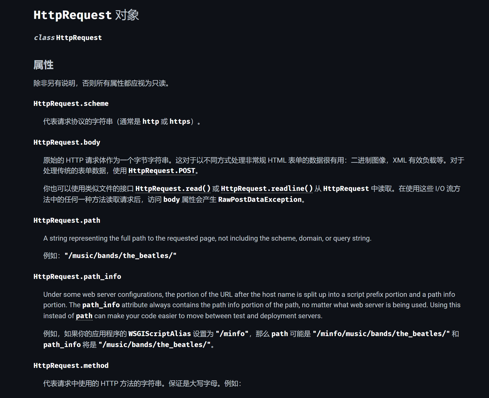

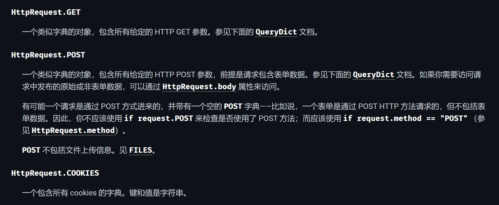

`HttpRequest.POST`的结果是querydict对象 https://docs.djangoproject.com/zh-hans/4.2/ref/request-response/#querydict-objects


`HttpResponse` 对象 https://docs.djangoproject.com/zh-hans/4.2/ref/request-response/#httpresponse-objects

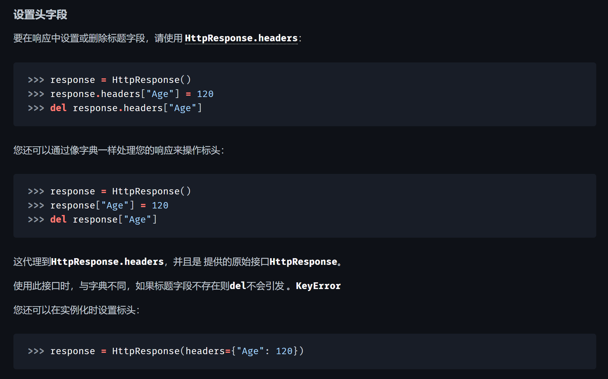

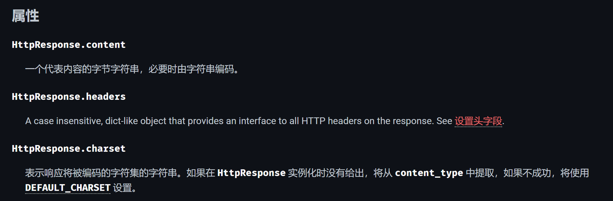

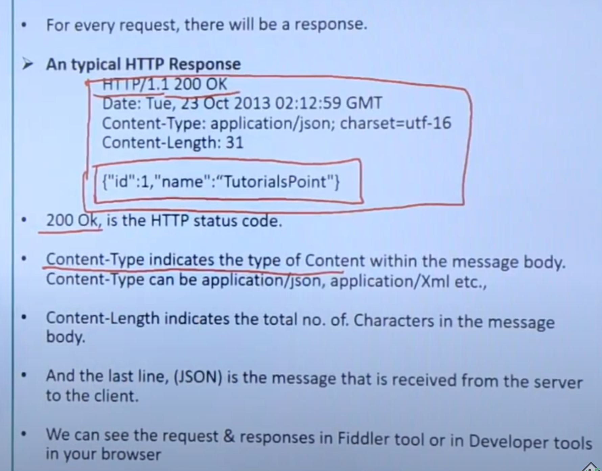

`JsonResponse` https://docs.djangoproject.com/zh-hans/4.2/ref/request-response/#jsonresponse-objects

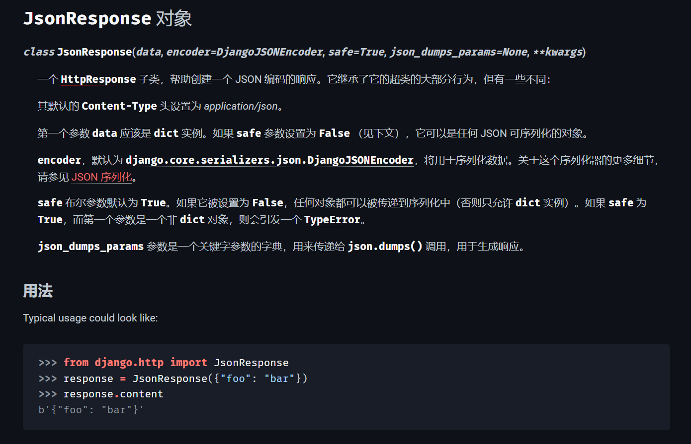

#### route

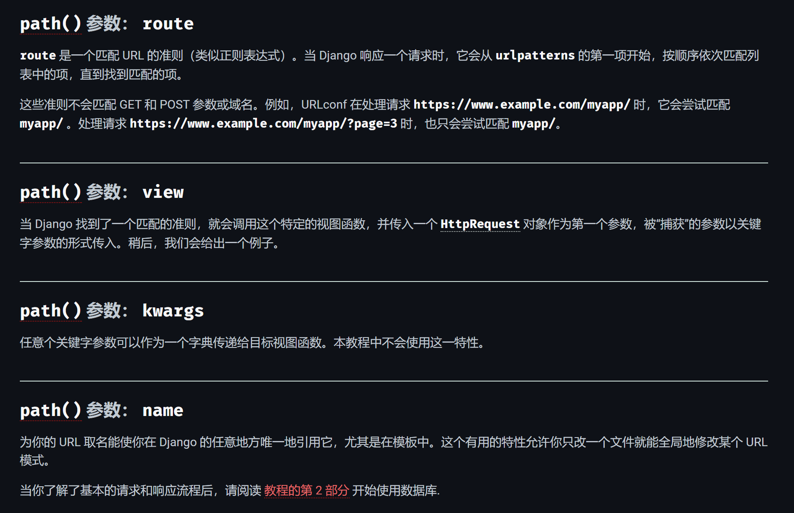

就是它是完整匹配，除非有include。/articles/2005/03/不会和第二个匹配，因为不是完整匹配。

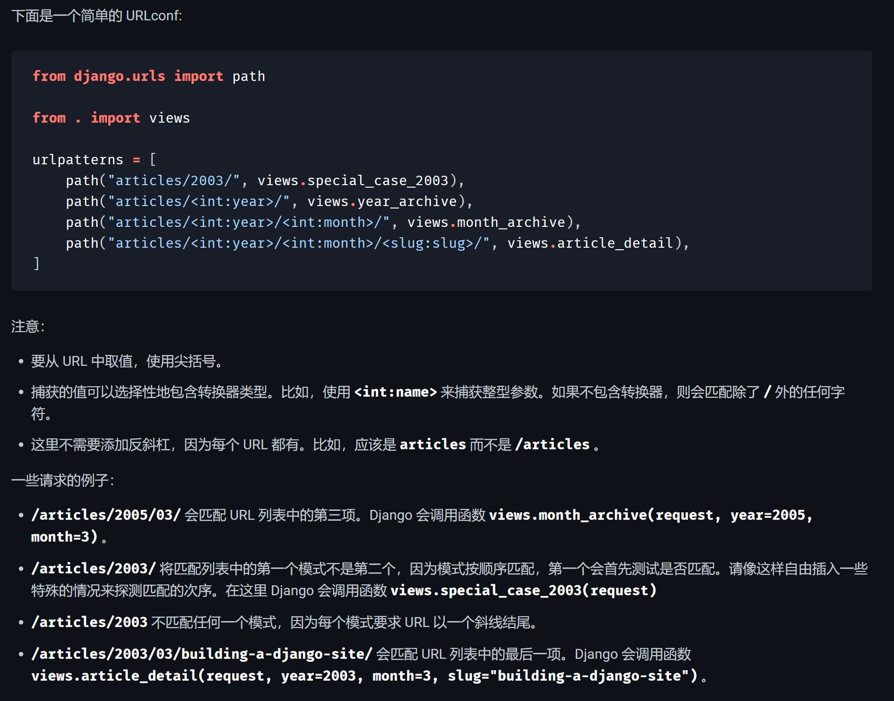

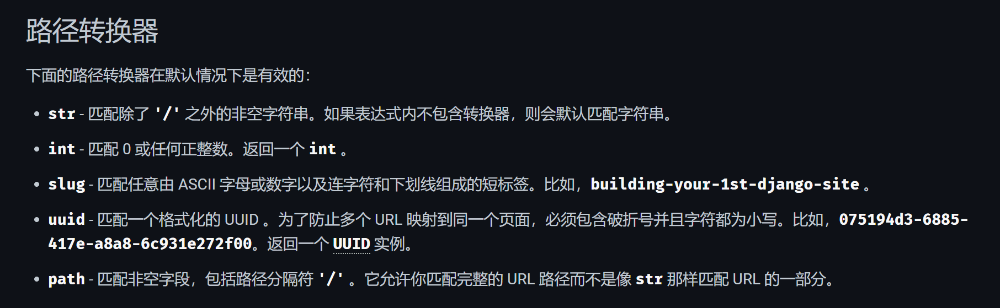

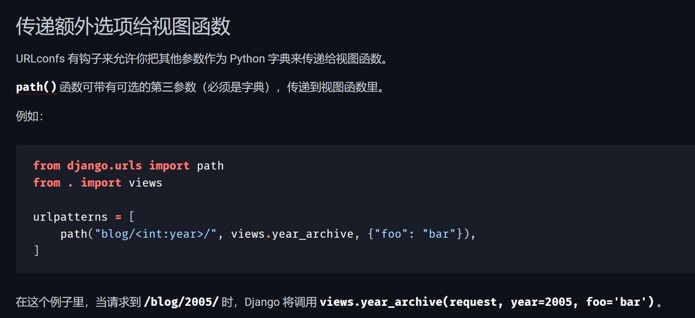

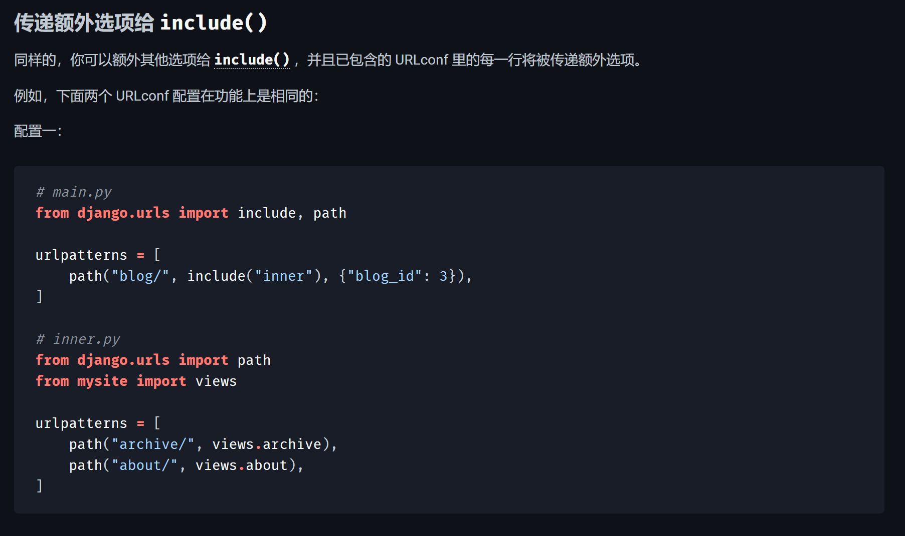

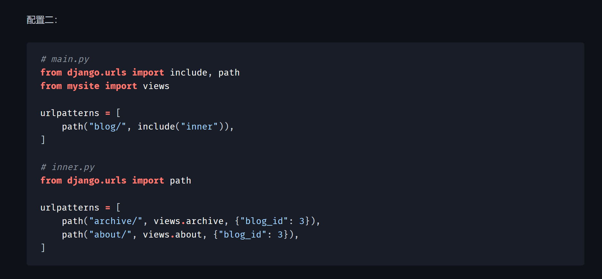

#### 测试工具

 https://docs.djangoproject.com/zh-hans/4.2/topics/testing/tools/ 用postman吧

举个例子

```python
# urls.py
from django.contrib import admin
from django.urls import path, include

urlpatterns = [
    path('admin/', admin.site.urls),
    path('blog/', include('blog.urls', namespace='blog')),
    path('test/<int:dd>/hh/',include('blog.urls',namespace='blog'),{'test':3})
]
# blog\urls.py
from django.urls import path
from . import views

app_name = 'blog'

urlpatterns = [
    # post views
    path('', views.post_list, name='post_list'),
    path('<int:id>/', views.post_detail, {'test2':'test'},name='post_detail'),
]
# blog\views.py
from django.views.decorators.csrf import csrf_exempt
@csrf_exempt
def post_detail(request,id,dd,test,test2):
    print(request.POST)
    post = get_object_or_404(Post, 
                             id=id,
                             status=Post.Status.PUBLISHED)
    return render(request,
                  'blog/post/detail.html',
                  {'post': post})
```

然后用postman发一个POST请求给后端

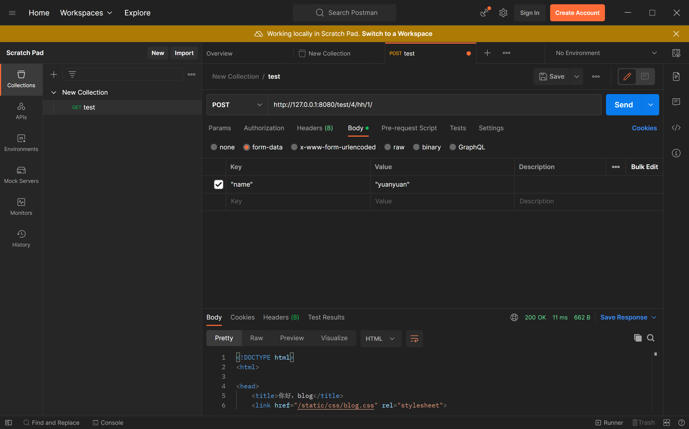

`<int:id>/`匹配成功后会作为函数参数传入，就像这样`post_detail(request, id)`。

在request里包含了很多信息，比如请求方法，表单信息，路径，当前登录的用户等等。

- `request.method`：请求方法，可以是`GET`、`POST`、`PUT`等。
- `request.path`：请求的路径，例如`/about/`。
- `request.META`：一个包含HTTP请求头信息的字典，可以通过它获取HTTP请求的一些额外信息，例如HTTP_REFERER、HTTP_USER_AGENT等。
- `request.GET`：包含所有GET参数的字典。
- `request.POST`：包含所有POST参数的字典。
- `request.session`：一个类似于字典的对象，用于存储和获取当前会话的数据，例如登录状态等。
- `request.user`：当前登录的用户对象，如果用户未登录则为`AnonymousUser`对象。
- `request.resolver_match`：一个包含与请求匹配的URL模式的信息的对象。

稍微修改一下，让它返回`JsonResponse`，因为`post.author`是`User`对象，是没法被JSON序列化的，所以调用username属性获得字符串。如果`post.title`是一个字符串，可以直接使用`post.title`作为对应的值。

```python
def post_detail(request, id,dd,test,test2):
    print(request.user) #AnonymousUser
    print(request.POST) #<QueryDict: {'"name"': ['"yuanyuan"']}>
    post = get_object_or_404(Post,
                             id=id,
                             status=Post.Status.PUBLISHED)
    return JsonResponse({
        'author':post.author.username,
        'title':post.title,
    })
```

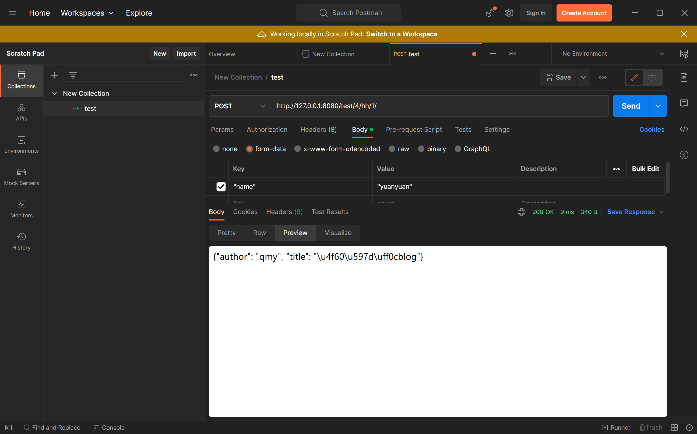

还有一个例子，注意是`JsonResponse`而不是`HttpResponse`。

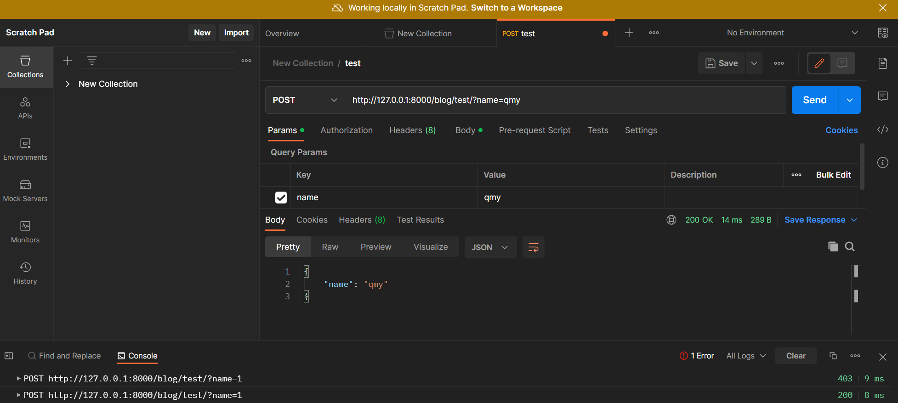

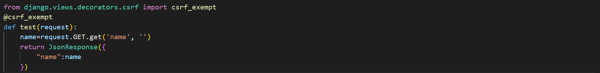

#### 第一个项目

创建并启动项目，成功可以看到小火箭。acapp/acapp是一个总的项目文件夹

```python
$ django-admin startproject acapp
acapp/
    manage.py
    acapp/                       #
        __init__.py
        settings.py
        urls.py
        asgi.py
        wsgi.py
$ python manage.py runserver 8000
$ python manage.py runserver 0.0.0.0:8000 #详细见官网
```

每一个应用都是一个python包，处于 `manage.py` 所在的目录下，然后运行这命令来创建一个game应用

```python
$ python manage.py startapp game
acapp/
	manage.py
    acapp/
    game/
        __init__.py
        admin.py
        apps.py
        migrations/
            __init__.py
        models.py                          #数据库模型
        tests.py
        views.py                           #处理http请求
```

在game/views.py内添加第一个视图，在game下创建一个urls.py文件并在acapp/urls.py和game/urls.py内添加urls映射，

```python
-------game/views.py-------------
from django.http import HttpResponse


def index(request):
    return HttpResponse("Hello, world. You're at the polls index.")
-------game/urls.py--------------
from django.urls import path
from . import views

urlpatterns = [
    path("index", views.index, name="index"),
]
-------acapp/urls.py-------------
from django.contrib import admin
from django.urls import path,include

urlpatterns = [
    path("game/", include("game.urls")),
    path("admin/", admin.site.urls),
]
```

然后就可以在http://127.0.0.1:8000/game/index下看到index返回的东西了。

#### 项目系统设计

menu：菜单页面
playground：游戏界面
settings：设置界面

#### 项目准备

删掉urls.py,views.py,models.py，把他们换成文件夹，在文件夹下添加`__init__.py`，这样才支持import导入。

添加static和templates文件夹。

```python
templates目录：管理html文件
urls目录：管理路由，即链接与函数的对应关系
views目录：管理http函数
models目录：管理数据库数据
static目录：管理静态文件，比如：
    css：对象的格式，比如位置、长宽、颜色、背景、字体大小等
    js：对象的逻辑，比如对象的创建与销毁、事件函数、移动、变色等
    image：图片
    audio：声音
    …
consumers目录：管理websocket函数
```

##### 全局配置

全局配置在acapp/settings.py，修改时区，还有一个和数据库有关的东西，以及静态文件和媒体文件(通常是用户上传)的储存路径和url

```python
-----acapp/settings.py----------
TIME_ZONE = "Asia/Shanghai"

INSTALLED_APPS = [
    'game.apps.GameConfig',
    "django.contrib.admin",
    "django.contrib.auth",
    "django.contrib.contenttypes",
    "django.contrib.sessions",
    "django.contrib.messages",
    "django.contrib.staticfiles",
]

#比如访问静态文件 可以通过/static/image/menu/图片.png
STATIC_ROOT = os.path.join(BASE_DIR,'static')
STATIC_URL = "static/"

MEDIA_ROOT = os.path.join(BASE_DIR,'media')
MEDIA_URL = '/media/'
```

##### static

在static/image下创建menu playground settings三个文件夹，分别存放菜单页面，游戏页面，设置页面。css文件不需要拆分，一个项目一个css就行，在static/css下创建game.css。在static/js下创建dist和src文件夹，写一个脚本把src文件夹下的脚本合成为一个放到dist下，运行脚本`./compress_game_js.sh`

```shell
----- compress_game_js.sh -------
JS_PATH=../game/static/js/
JS_PATH_DIST=${JS_PATH}dist/
JS_PATH_SRC=${JS_PATH}src/

find $JS_PATH_SRC -type f -name '*.js' | sort | xargs cat > ${JS_PATH_DIST}game.js
```

##### templates

在templates创建menu playground settings三个文件夹，再加一个multiends，在multiends下创建web.html，并导入jquery和static目录下的css和js文件。但是导入所有的js可能导致命名冲突，所以需要稍作修改，然后把AcGame这个类用export导出。

```html
------web.html---------修改前

<head>
    <link rel="stylesheet" href="https://cdn.acwing.com/static/jquery-ui-dist/jquery-ui.min.css">
    <script src="https://cdn.acwing.com/static/jquery/js/jquery-3.3.1.min.js"></script>
    <link rel="stylesheet" href="">
    <script src=""></script>
</head>
<body style="margin: 0">
    <div id="ac_game_12345678"></div>
    <script>
        $(document).ready(function(){
            let ac_game =new AcGame("ac_game_12345678");
        });
    </script>
</body>
------web.html---------修改后

<head>
    <link rel="stylesheet" href="https://cdn.acwing.com/static/jquery-ui-dist/jquery-ui.min.css">
    <script src="https://cdn.acwing.com/static/jquery/js/jquery-3.3.1.min.js"></script>
    <link rel="stylesheet" href="">
</head>

<body style="margin: 0">
    <div id="ac_game_12345678"></div>
    <script type="module">
        import {AcGame} from "";
        $(document).ready(function(){
            let ac_game =new AcGame("ac_game_12345678");
        });
    </script>
</body>
```

##### js

在src下创建menu playground settings三个文件夹，再加一个zbase.js（之所以是z开头是为了打包的时候排最后），在zbase.js下写AcGame类。使用js渲染相比于传统的后端渲染，可以减轻服务器端的压力。

```python
----------zbase.js------------
class AcGame{
    constructor(id){
    }
}
```

##### views 

在game/views下创建menu playground settings三个文件夹，并添加`__init__.py`来支持import导入。再创建一个总的index.py，用来返回web.html文件。

```python
-------index.py------
from django.shortcuts import render

def index(request):
    return render(request,"multiends/web.html")
```

##### urls

在game/urls下创建menu playground settings三个文件夹，并添加`__init__.py`来支持import导入。再在game/urls下和它每个子文件夹下创建index.py。并添加urls

```python
-----game/urls/menu/index.py----
from django.urls import path
urlpatterns=[
]

-----game/urls/index.py---------
from django.urls import path,include
from game.views.index import index

urlpatterns=[
    path("",index,name="index")
    path("menu/",include("game.urls.menu.index")),
    path("playground/",include("game.urls.playground.index")),
    path("settings/",include("game.urls.settings.index")),
]
```

打开全局的url文件，把game.urls.index加进去

```python
------acapp/urls.py------

urlpatterns = [
    path("", include("game.urls.index")),
    path("admin/", admin.site.urls),
]
```

这样路由就写完了，感觉分类方式有点像决策树，比如""会和urls.py文件下的第一个匹配，然后截断再把后面的字符串送到include后的内容里进行匹配，发现和第一行匹配，调用index函数，返回web.html

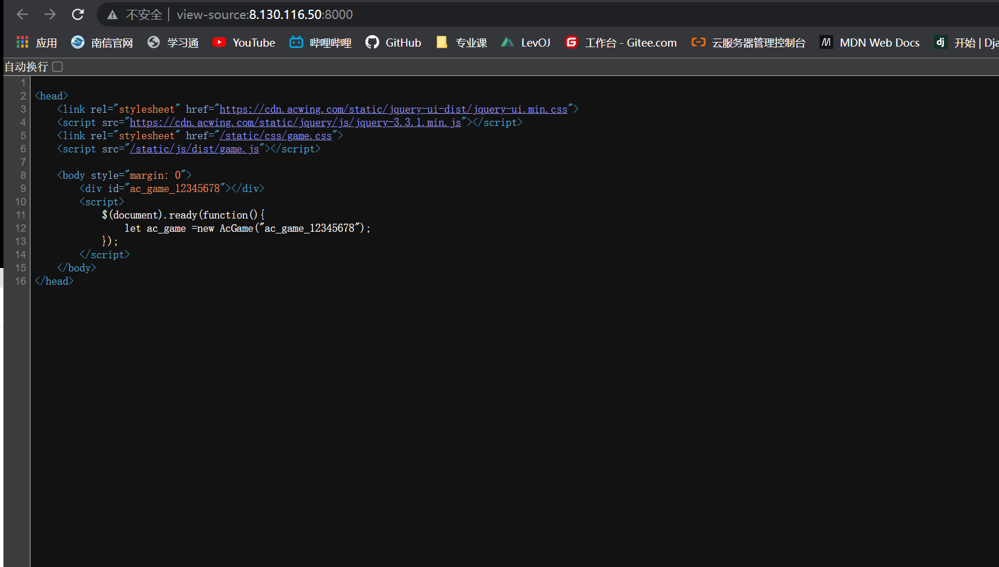

可以看一下项目结构

```
├─acapp
├─game
│  ├─models
│  ├─static
│  │  ├─css
│  │  ├─image
│  │  │  └─menu
│  │  └─js
│  │      ├─dist
│  │      └─src
│  ├─templates
│  │  └─multiends
│  ├─urls
│  │  ├─menu
│  │  ├─playground
│  │  ├─settings
│  ├─views
│  │  ├─menu
│  │  ├─playground
│  │  ├─settings
└─scripts
```

#### 编写menu页面

在js/src/menu/zbase.js内写menu的js代码，最后要执行一下./compress_game_js.sh来合并代码放到dist里。css的起名越精确越好，避免重名。

```js
-----js/src/menu/zbase.js-------
class AcGameMenu{
    constructor(root){
        this.root=root;
        this.$menu=$(
`<div class="ac-game-menu">
    <div class="ac-game-menu-field">
        <div class="ac-game-menu-field-item ac-game-menu-field-item-single">
            单人模式
        </div>
        <br>
        <div class="ac-game-menu-field-item ac-game-menu-field-item-multi">
            多人模式
        </div>
        <br>
        <div class="ac-game-menu-field-item ac-game-menu-field-item-settings">
            设置
        </div>
    </div>
</div>`
);
        this.root.$ac_game.append(this.$menu); //把$menu加入到ac_game里
    }
}  
----js/src/zbase.js-----
class AcGame{
constructor(id){
    this.id=id;
    this.$ac_game=$('#'+id); //拿到id是id的dom元素
    this.menu=new AcGameMenu(this);
	}
}
```

一面看浏览器效果一面编写相应的css代码

```css
----static\css\game.css----
.ac-game-menu{
    width:100%;
    height:100%;
    background-image:url("/static/image/menu/蔡徐坤打篮球背景.png");
    background-size: 100% 100%;
    user-select: none; /*无法选中*/
}

.ac-game-menu-field{
    width:23vw; /*百分比 */
    position:relative;
    top:40vh;
    left:19vw;
}

.ac-game-menu-field-item{
    color:blueviolet;
    height:7vh;
    font-size:6vh;
    font-style:italic;
    padding:2vh;
    text-align: center;
    background-color: rgba(62, 190, 161, 0.3);
    border-radius: 1vw;
    letter-spacing: 0.5vw;
    cursor: pointer;
}

.ac-game-menu-field-item:hover{
    transform:scale(1.2);
    transition: 100ms;
}
```

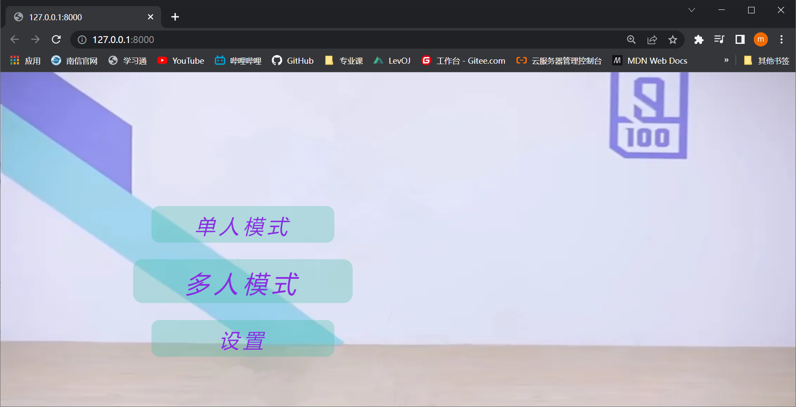

#### 单人模式的游戏界面

##### 使用js切换界面

使用jquery的find找到对应的dom并添加监听函数

```js
-----js/src/menu/zbase.js-------
constructor(root){
    /*略过*/
    this.$single=this.$menu.find(".ac-game-menu-field-item-single");
    this.$multi=this.$menu.find(".ac-game-menu-field-item-multi");
    this.$settings=this.$menu.find(".ac-game-menu-field-item-settings");
    // $menu是一个dom元素的指针集合
    this.start();
}
start(){
        this.add_listening_events();
    }

    add_listening_events(){
        let outer=this;
        this.$single.click(function(){
            console.log("click single")
        })
        this.$multi.click(function(){
            console.log("click multi");
        })
        this.$settings.click(function(){
            console.log("click settings");
        })
    }
```

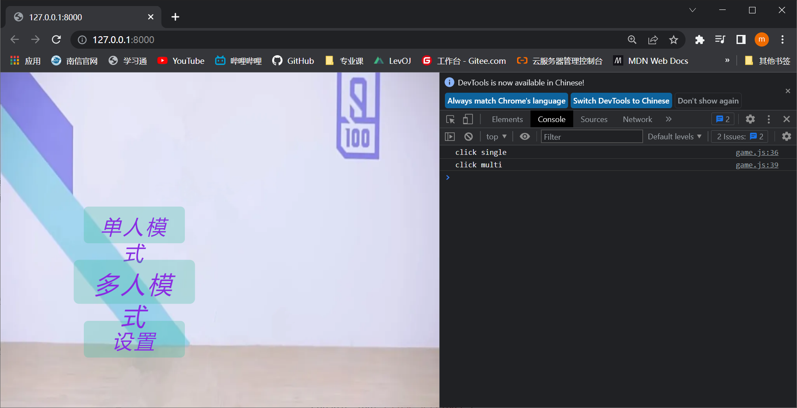

js如何实现切换页面呢，通过dom对象的显示与隐藏，这个show,hide,start的逻辑在写游戏的时候经常用，写其他的同样也可以。在菜单界面添加show和hide函数，在js/src/playground/zbase.js内编写游戏界面，也添加show和hide函数。最后在监听函数里写点击后的逻辑。

```js
----js/src/playground/zbase.js----
class AcGamePlayground{
    constructor(root){
        this.root=root;
        this.$playground=$(
            `<div>游戏界面</div>`
        )
        this.hide();
        this.root.$ac_game.append(this.$playground);

        this.start();
    }
    
    start(){
        
    }
    show(){
        this.$playground.show();
    }

    hide(){
        this.$playground.hide();
    }
}
----js/src/menu/zbase.js----
/*在 AcGameMenu 里写*/
show(){
        this.$menu.show();
    }

    hide(){
        this.$menu.hide();
    }
----js/src/menu/zbase.js----
add_listening_events(){
        let outer=this;
        this.$single.click(function(){
            console.log(outer.root);
            console.log("hh");
            outer.hide();
            outer.root.playground.show()
        })
```

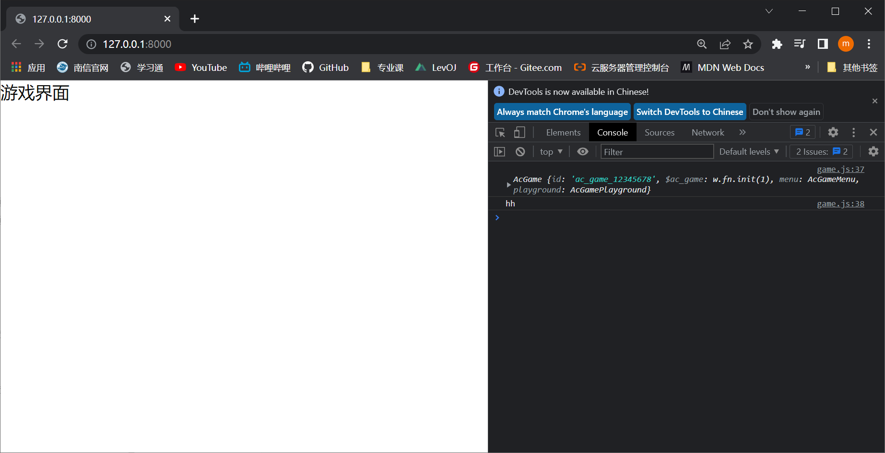

##### 编写单人游戏界面

###### 游戏背景

先把AcGame的`this.menu=new AcGameMenu(this);`注释掉，还有`Acplayground`的`this.hide();`，这样一打开就是游戏界面。

在Playground文件夹下创建acgameobject文件夹，创建zbase.js。在里面写游戏引擎。当AcGameObject被创建的时候，它会被放到AC_GAME_OBJECTS这个列表里。然后通过requestAnimationFrame的递归调用来在每一帧对每个AcGameObject进行处理。

```js
let AC_GAME_OBJECTS = [];

class AcGameObject {
    constructor() {
        AC_GAME_OBJECTS.push(this);

        this.has_called_start = false;  // 是否执行过start函数
        this.timedelta = 0;  // 当前帧距离上一帧的时间间隔
    }

    start() {  // 只会在第一帧执行一次
    }

    update() {  // 每一帧均会执行一次
    }
    
	on_destroy() {  // 在被销毁前执行一次
    }
    
    destroy() {  // 删掉该物体
		this.on_destroy();
        
        for (let i = 0; i < AC_GAME_OBJECTS.length; i ++ ) {
            if (AC_GAME_OBJECTS[i] === this) {
                AC_GAME_OBJECTS.splice(i, 1);
                break;
            }
        }
    }
}

//重复执行
let last_timestamp;
let AC_GAME_ANIMATION = function(timestamp) {
    for (let i = 0; i < AC_GAME_OBJECTS.length; i ++ ) {
        let obj = AC_GAME_OBJECTS[i];
        if (!obj.has_called_start) {
            obj.start();
            obj.has_called_start = true;
        } else {
            obj.timedelta = timestamp - last_timestamp;
            obj.update();
        }
    }
    console.log("hhh");
    last_timestamp = timestamp;

    requestAnimationFrame(AC_GAME_ANIMATION);
}


requestAnimationFrame(AC_GAME_ANIMATION);
```

在Playground文件夹下创建`gamemap`文件夹，创建`zbase.js`。通过`render()`设置画布的大小和颜色，因为继承于AcGameObject，所以它会在每一帧调用一次update。以及`$canvas`被添加到了`$playground`里。

```js
----js\src\playground\gamemap\zbase.js----
class GameMap extends AcGameObject {
    constructor(playground) {
        super();
        this.playground = playground;
        this.$canvas = $(`<canvas tabindex=0></canvas>`);
        this.ctx = this.$canvas[0].getContext('2d');
        this.ctx.canvas.width = this.playground.width;
        this.ctx.canvas.height = this.playground.height;
        this.playground.$playground.append(this.$canvas);
    }

    start() {
    }

    update() {
        this.render()
    }

    render(){
        this.ctx.canvas.width = this.playground.width;
        this.ctx.canvas.height = this.playground.height;
        this.ctx.fillStyle="rgba(0,0,0)";
        this.ctx.fillRect(0,0,this.ctx.canvas.width,this.ctx.canvas.height)
    }
}

```

Acgameplayground也修改，修改一下`$playground`。创建`GameMap`，之后画图就在canvas上，看起来好像一片漆黑，其实每次浏览器重绘之前画布都会重画一次。

```js
----js\src\playground\zbase.js----
class AcGamePlayground{
    constructor(root){
        this.root=root;
        this.$playground=$(
            `<div class="ac-game-playground"></div>`
        )
        //this.hide();
        this.root.$ac_game.append(this.$playground);
        this.width=this.$playground.width();
        this.height=this.$playground.height();
        this.game_map=new GameMap(this);
        this.start();
    }
    /*略*/
}
----game.css----
.ac-game-playground{
    width:100%;
    height:100%;
    user-select: none;
}
```

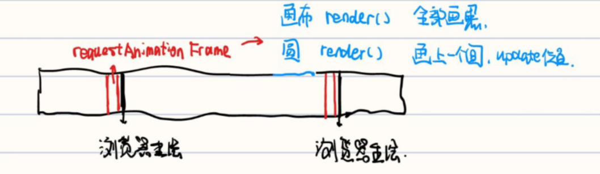

###### 实现玩家

创建player文件夹，在这个里面写每个玩家操控的圆球，通过添加add_listening_events来控制小球的参数。

```js
----playground/player/zbase,js----
class Player extends AcGameObject{
    constructor(playground,x,y,radius,color,speed,is_me){
        super();
        this.playground=playground;
        this.ctx=this.playground.game_map.ctx;
        this.x=x;
        this.y=y;
        this.des_x=x;
        this.des_y=y;
        this.radius=radius;
        this.color=color;
        this.speed=speed;
        this.vx=0;
        this.move_length=0;
        this.vy=0;
        this.is_me=is_me;
        this.eps=0.1;
    }

    start(){
        if(this.is_me)
        this.add_listening_events();
    }

    add_listening_events(){
        let outer=this;
        this.playground.game_map.$canvas.on("contextmenu",function(){
            return false;
        })
        this.playground.game_map.$canvas.mousedown(function(e){
            if(e.which===3){
                //这里的this因为匿名函数比较复杂，用outer存一下
                outer.move_to(e.clientX,e.clientY);
            }
        })
    }
    get_dist(x1, y1, x2, y2) {
        let dx = x1 - x2;
        let dy = y1 - y2;
        return Math.sqrt(dx * dx + dy * dy);
    }

    move_to(tx, ty) {
        this.des_x=tx;
        this.des_y=ty;
        this.move_length = this.get_dist(this.x, this.y, this.des_x,this.des_y);
        let angle = Math.atan2(this.des_y - this.y, this.des_x- this.x);
        this.vx = Math.cos(angle);
        this.vy = Math.sin(angle);
    }

    update(){
        if(this.move_length<this.eps){
            this.move_length=0;
            this.vx=this.vy=0;
        }else{
            let moved=Math.min(this.move_length,this.speed*this.timedelta/1000)
            this.x+=this.vx*moved;
            this.y+=this.vy*moved;
            this.move_length= this.get_dist(this.x, this.y, this.des_x, this.des_y);
        }
        this.render();
    }
    render(){
        this.ctx.beginPath();
        this.ctx.arc(this.x,this.y,this.radius,0,Math.PI*2,false);
        this.ctx.fillStyle =this.color;
        this.ctx.fill();
        this.ctx.closePath();
    }
}
```

在AcGamePlayground的构造函数里添加来创建一个小球。

```js
----Playground/zbase.js----
this.players=[];
this.players.push(new Player(
    this,this.width/2,this.height/2,this.height*0.05,"white",this.height*0.15,true))
```

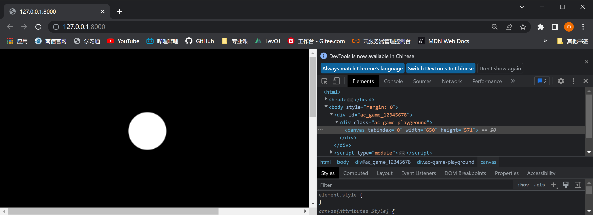

###### 实现火球

创建skill文件夹，在里面写火球，虽然火球在player之后创建了类，但是在player里依旧可以创建火球实例，这是因为javascript的类没有顺序要求，它的函数成员也没有顺序要求，先创建的可以调用后者的类。

```js
class FireBall extends AcGameObject {
    constructor(playground, player, x, y, radius, vx, vy, color, speed, move_length, damage) {
        super();
        this.playground = playground;
        this.player = player;
        this.ctx = this.playground.game_map.ctx;
        this.x = x;
        this.y = y;
        this.vx = vx;
        this.vy = vy;
        this.radius = radius;
        this.color = color;
        this.speed = speed;
        this.move_length = move_length;
        this.eps = 0.01;
    }

    start() {
    }

    update() {
        if (this.move_length < this.eps) {
            this.destroy();
            return false;
        }

        this.update_move();


        this.render();
    }

    update_move() {
        let moved = Math.min(this.move_length, this.speed * this.timedelta / 1000);
        this.x += this.vx * moved;
        this.y += this.vy * moved;
        this.move_length -= moved;
    }


    render() {
        this.ctx.beginPath();
        this.ctx.arc(this.x, this.y, this.radius, 0, Math.PI * 2, false);
        this.ctx.fillStyle = this.color;
        this.ctx.fill();
    }

    on_destroy() {
        /* let fireballs = this.player.fireballs;
        for (let i = 0; i < fireballs.length; i ++ ) {
            if (fireballs[i] === this) {
                fireballs.splice(i, 1);
                break;
            }
        } */
    }
}

```

在player里加入监听，先测试一下能不能正常监听到结果

```js
class Player extends AcGameObject{
    constructor(playground,x,y,radius,color,speed,is_me){
        this.cur_skill=null;
    }

    start(){
        if(this.is_me)
        this.add_listening_events();
    }

    add_listening_events(){
        let outer=this;
        this.playground.game_map.$canvas.on("contextmenu",function(){
            return false;
        })
        this.playground.game_map.$canvas.mousedown(function(e){
            if(e.which===3){
                //这里的this因为匿名函数比较复杂，用outer存一下
                outer.move_to(e.clientX,e.clientY);
            }else if(e.which===1){
            
                if(outer.cur_skill==="fireball"){
                    console.log("ok")
                    outer.shoot_fireball(e.clientX,e.clientY);
                }
            }
        })

        $(window).keydown(function(e){
            if(e.which===81){
                outer.cur_skill="fireball";
                return false;
            }
        })
    }

    shoot_fireball(tx,ty){
        console.log("shoot fireball",tx,ty)
    }
    get_dist(x1, y1, x2, y2) {
        let dx = x1 - x2;
        let dy = y1 - y2;
        return Math.sqrt(dx * dx + dy * dy);
    }

    move_to(tx, ty) {
        this.des_x=tx;
        this.des_y=ty;
        this.move_length = this.get_dist(this.x, this.y, this.des_x,this.des_y);
        let angle = Math.atan2(this.des_y - this.y, this.des_x- this.x);
        this.vx = Math.cos(angle);
        this.vy = Math.sin(angle);
    }

    update(){
        if(this.move_length<this.eps){
            this.move_length=0;
            this.vx=this.vy=0;
        }else{
            let moved=Math.min(this.move_length,this.speed*this.timedelta/1000)
            this.x+=this.vx*moved;
            this.y+=this.vy*moved;
            this.move_length= this.get_dist(this.x, this.y, this.des_x, this.des_y);
        }
        this.render();
    }
    render(){
        this.ctx.beginPath();
        this.ctx.arc(this.x,this.y,this.radius,0,Math.PI*2,false);
        this.ctx.fillStyle =this.color;
        this.ctx.fill();
        this.ctx.closePath();
    }
}
```

然后实现一下shoot_fireball，发完三颗子弹后要把技能设置为0

```js
 add_listening_events(){
        let outer=this;
        this.playground.game_map.$canvas.on("contextmenu",function(){
            return false;
        })
        this.playground.game_map.$canvas.mousedown(function(e){
            if(e.which===3){
                //这里的this因为匿名函数比较复杂，用outer存一下
                outer.move_to(e.clientX,e.clientY);
            }else if(e.which===1){
            
                if(outer.cur_skill==="fireball"){
                    outer.shoot_fireball(e.clientX,e.clientY);
                    outer.count-=1;
                    if(outer.count===0){
                        outer.cur_skill=null;
                    }
                }
            }
        })

        $(window).keydown(function(e){
            if(e.which===81){
                outer.cur_skill="fireball";
                outer.count=3;
                return false;
            }
        })
shoot_fireball(tx,ty){
    console.log("shoot fireball",tx,ty)
    let x=this.x,y=this.y;
    let radius=this.playground.height*0.01;
    let angle=Math.atan2(ty-this.y,tx-this.x);
    let vx=Math.cos(angle),vy=Math.sin(angle);
    let color="orange";
    let speed=this.playground.height*0.5;
    let move_length=this.playground.height*1;
    new FireBall(this.playground,this,x,y,radius,vx,vy,color,speed,move_length);

}
```

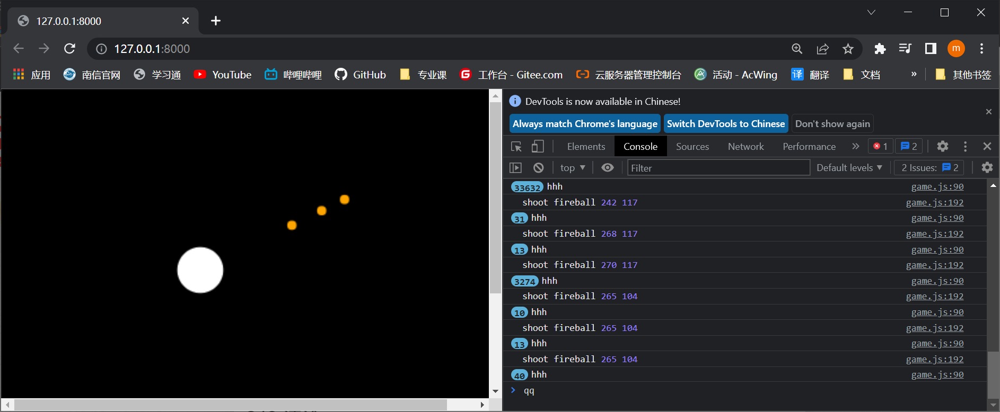

###### 创建简单的AI

AcGameplayground的构造函数里生成五个蓝色的ai

```js
for(let i=0;i<5;i++){
            let x=Math.random()*this.width,y=Math.random()*this.height;
            this.players.push(new Player(this,x,y,this.height*0.05,"blue",this.height*0.15,false))
        }
```

player里面写，这样ai就能随机行走。

```js
start(){
    if(this.is_me){
        this.add_listening_events();
    }else {
        let tx=Math.random()*this.playground.width;
        let ty=Math.random()*this.playground.height;
        this.move_to(tx,ty);
    }
}
update(){
    if(this.move_length<this.eps){
        this.move_length=0;
        this.vx=this.vy=0;
        if(!this.is_me){
            let tx=Math.random()*this.playground.width;
            let ty=Math.random()*this.playground.height;
            this.move_to(tx,ty);
        }
    }else{
        let moved=Math.min(this.move_length,this.speed*this.timedelta/1000)
        this.x+=this.vx*moved;
        this.y+=this.vy*moved;
        this.move_length= this.get_dist(this.x, this.y, this.des_x, this.des_y);
    }
    this.render();
}
```

###### 实现碰撞

给子弹增加碰撞检测

```js
 ----fireball/zbase.js----
 update() {
        if (this.move_length < this.eps) {
            this.destroy();
            return false;
        }

        this.update_move();

        for (let i = 0; i < this.playground.players.length; i ++ ) {
            let player = this.playground.players[i];
            if (this.player !== player && this.is_collision(player)) {
                this.attack(player);
                break;
            }
        }

        this.render();
    }

    is_collision(player) {
        let distance = this.player.get_dist(this.x, this.y, player.x, player.y);
        if (distance < this.radius + player.radius)
            return true;
        return false;
    }

    attack(player) {
        let angle = Math.atan2(player.y - this.y, player.x - this.x);
        player.is_attacked(angle, this.damage);

        this.destroy();
    }

```

player里面增加`is_attacked`，它修改damage_speed等参数，然后update里要写处理damage_speed不为0的情况。

```js
----player/zbase,js----
    //构造函数里添加
    this.damage_x = 0;
    this.damage_y = 0;
    this.damage_speed = 0;
    this.friction=0.8

is_attacked(angle, damage) {
        this.radius -= damage;
        console.log(this.radius,damage,this.playground.width)
        if (this.radius < this.playground.width*0.01) {
            this.destroy();
            return false;
        }
        this.damage_x = Math.cos(angle);
        this.damage_y = Math.sin(angle);
        this.damage_speed = damage * 100;
        this.speed *= 0.8;
}

update(){
        if(this.damage_speed>this.eps){
            this.vx=this.vy=0;
            this.move_length=0;
            this.x += this.damage_x * this.damage_speed * this.timedelta / 1000;
            this.y += this.damage_y * this.damage_speed * this.timedelta / 1000;
            this.damage_speed *= this.friction;

        }
        else{
            if(this.move_length<this.eps){
                this.move_length=0;
                this.vx=this.vy=0;
                if(!this.is_me){
                    let tx=Math.random()*this.playground.width;
                    let ty=Math.random()*this.playground.height;
                    this.move_to(tx,ty);
                }
        }else{
            let moved=Math.min(this.move_length,this.speed*this.timedelta/1000)
            this.x+=this.vx*moved;
            this.y+=this.vy*moved;
            this.move_length= this.get_dist(this.x, this.y, this.des_x, this.des_y);
        }}
        this.render();
    }
```

###### AI随机颜色以及发射子弹

player的update里增加发送子弹的逻辑

```js
if(!this.is_me&&Math.random()<1/360.0){
            let player=this.playground.players[0];
            this.shoot_fireball(player.x,player.y);
        }
//升级后难度随时间而增大，子弹有预判
this.timecount+=0.01;
console.log(1/1000.0*Math.log10(this.timecount+1))
if(!this.is_me&&Math.random()<1/1000.0*Math.log10(this.timecount+1)){

    let player=this.playground.players[0];
    let tx=player.x+player.speed*player.vx*this.get_dist(this.x,this.y,player.x,player.y)/this.shoot_speed;
    let ty=player.y+player.speed*player.vy*this.get_dist(this.x,this.y,player.x,player.y)/this.shoot_speed;
    console.log(tx,player.x,player.speed*player.vx*player.timedelta)
    this.shoot_fireball(tx,ty);
}
```

小球死亡后应该从players里删除

```js
----player/zbase.js----
on_destroy(){
        let players=this.playground.players;
        for (let i = 0; i < players.length; i ++ ) {
            if (players[i] === this) {
                players.splice(i, 1);
                break;
            }
         }
    }
```

随机颜色

```js
 for(let i=0;i<5;i++){
            let x=Math.random()*this.width,y=Math.random()*this.height;
            this.players.push(new Player(this,x,y,this.height*0.05,this.get_random_color(),this.height*0.15,false))
        }
        this.start();
    }
    get_random_color(){
        let color=["blue","red","pink","grey","green"];
        return color[Math.floor(Math.random()*5)];
    }
```

#### 添加用户登录

先登录到admin，在url后加上/admin，如果不行可能是数据表损坏，通过运行数据库迁移命令修复它。

```
python manage.py migrate --run-syncdb
```

使用这个命令创建新的超级用户

```python
python manage.py createsuperuser
```

然后登录到admin，这个是django自带的用户管理系统

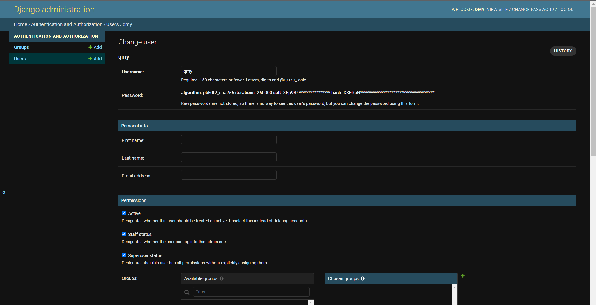

##### 创建player数据表

models下创建Player文件夹，然后在admin.py下注册，然后执行数据库同步命令。

```py
----game\models\player\player.py----
from django.db import models
from django.contrib.auth.models import User


class Player(models.Model):
    user=models.OneToOneField(User,on_delete=models.CASCADE)  #级联，User删除把关联的Player一起删除
    photo = models.URLField(max_length=256,blank=True)

    def __str__(self):   #显示什么
        return str(self.user)
----game\admin.py----
from django.contrib import admin
from game.models.player.player import Player
# Register your models here.


admin.site.register(Player)
```

数据库同步

```bash
python manage.py makemigrations
python manage.py migrate
```

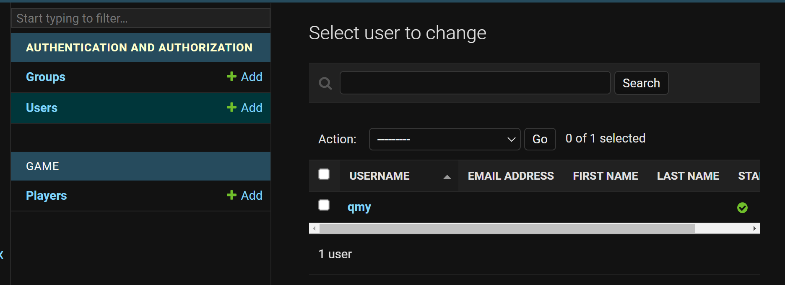然后就可以在左侧看到创建的表格了，我们先手动添加一个player

##### 实现登录请求

views实现调用数据库的逻辑，urls里实现路由，js里实现调用

```python
----game\views\settings\getinfo.py----
from django.http import JsonResponse
from game.models.player.player import Player

def getinfo_acapp(request):
    pass

def getinfo_web(request):
    user=request.user
    print(request.user)

    if not user.is_authenticated:
        return JsonResponse({
            'result':"未登录",
        })
    player =Player.objects.all()[0]
    return JsonResponse({
        'result':"success",
        'username':player.user.username,
        'photo':player.photo,
    })

def getinfo(request):
    platform =request.GET.get("platfrom")
    if platform=="ACAPP":
        return getinfo_acapp(request)
    else:
        return getinfo_web(request)
    
----game\urls\settings\index.py----
from django.urls import path
from game.views.settings.getinfo import getinfo

urlpatterns=[
    path("getinfo/",getinfo,name="settings_getinfo"),
]
```

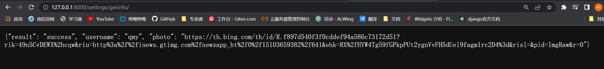

先用`this.$menu.hide()`把menu界面隐藏，然后创建settings文件夹，写Settings类，然后实例化一个Settings

```js
----game\static\js\src\settings\zbase.js----
class Settings {
    constructor(root) {
        this.root = root;
        this.platform = "WEB";
        
        this.start();
    }

    start() {
        this.getinfo();
       
    }

    login(){  //打开登录界面

    }

    register(){ //注册界面

    }
    getinfo(){
        let outer=this;

        $.ajax({
            url: "/settings/getinfo/",
            type: "GET",
            data:{
                platform:this.platform,
            },
            success: function(resp) {
                if (resp.result === "success") {
                   console.log(resp);
                   outer.hide();
                   outer.root.menu.show();
                }else{
                    outer.login();
                }
            }
        });
    }

    hide(){

    }

    show(){

    }
}
----game\static\js\src\zbase.js----
this.settings=new Settings(this);
```

Settings在创建的时候通过`$.ajax`向着/settings/getinfo/发了一个GET请求，包含platform这个数据，getinfo函数接收到就根据platform分类处理， 最终返回JsonResponse给前端，然后前端执行请求成功时的函数，根据是否登录是菜单还是跳出注册界面。

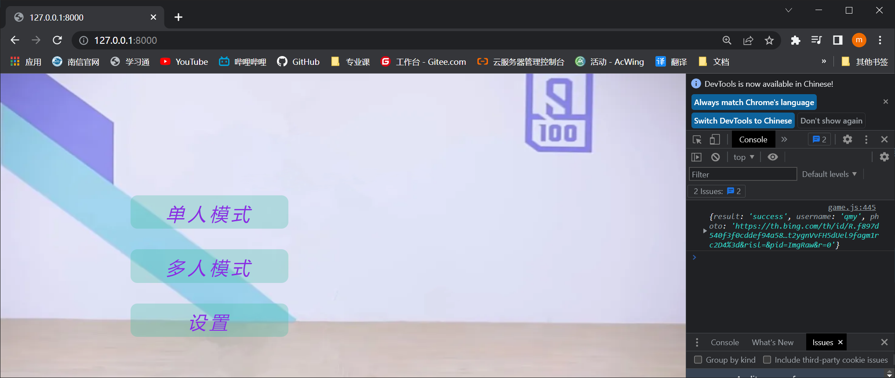

用`print(request.__dict__)`查看前端都向后端发送了哪些东西（特别多），不过有个user是当前登录的


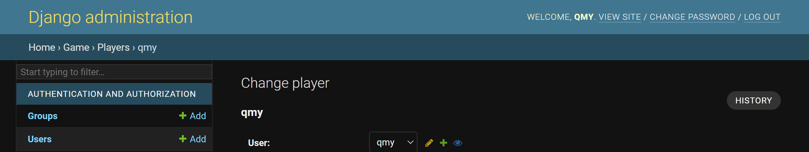

前端的administration如果在线，传给后端的request.user是能在session里查找到的，所以is_authenticated是true。登出之后，再打开就执行的false逻辑。

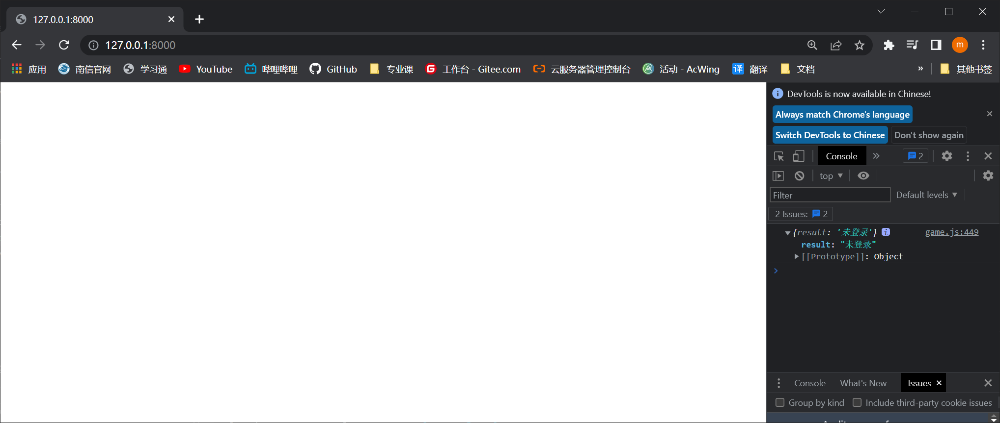

##### 为玩家设置图片

把request的内容传给username和photo，判断一下是玩家自己就用图片

```python
----game\static\js\src\settings\zbase.js----

this.username="";
this.photo="";
        
getinfo(){
let outer=this;

$.ajax({
    url: "/settings/getinfo/",
    type: "GET",
    data:{
        platform:this.platform,
    },
    success: function(resp) {
        if (resp.result === "success") {
            outer.username =resp.username;
            outer.photo=resp.photo;
            outer.hide();
            outer.root.menu.show();
        }else{
            console.log(resp);
            outer.login();
        }
    }
});
    }

----game\static\js\src\playground\player\zbase.js----
if(this.is_me){
        this.img=new Image();
        this.img.src=this.playground.root.settings.photo;
    }

render(){
        if(this.is_me){
            this.ctx.save();
            this.ctx.beginPath();
            this.ctx.arc(this.x, this.y, this.radius, 0, Math.PI * 2, false);
            this.ctx.stroke();
            this.ctx.clip();
            this.ctx.drawImage(this.img, this.x - this.radius, this.y - this.radius, this.radius * 2, this.radius * 2); 
            this.ctx.restore();
        }else{
            this.ctx.beginPath();
            this.ctx.arc(this.x,this.y,this.radius,0,Math.PI*2,false);
            this.ctx.fillStyle =this.color;
            this.ctx.fill();
            this.ctx.closePath();
        }
    }
```

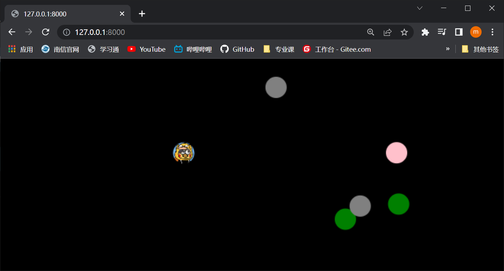

##### 绘制登录界面和登录登出

增加$settings和相应的css代码，然后给注册增加监听，点击后隐藏登录，展示注册，登录同理。

```js
class Settings {
    constructor(root) {
        this.root = root;
        this.platform = "WEB";

        this.username="";
        this.photo="";

        this.$settings=$(`
<div class="ac-game-settings">
    <div class="ac-game-settings-login">
        <div class="ac-game-settings-title">
            登录
        </div>
        <div class="ac-game-settings-username">
            <div class="ac-game-settings-item">
                <input type="text" placeholder="用户名">
            </div>
        </div>
        <div class="ac-game-settings-password">
            <div class="ac-game-settings-item">
                <input type="password" placeholder="密码">
            </div>
        </div>
        <div class="ac-game-settings-submit">
            <div class="ac-game-settings-item">
                <button>登录</button>
            </div>
        </div>
        <div class="ac-game-settings-error-message">
        </div>
        <div class="ac-game-settings-option">
            注册
        </div>
        <br>
        <div class="ac-game-settings-acwing">
            
            <br>
            <div>
                AcWing一键登录
            </div>
        </div>
    </div>
    <div class="ac-game-settings-register">
        <div class="ac-game-settings-title">
            注册
        </div>
        <div class="ac-game-settings-username">
            <div class="ac-game-settings-item">
                <input type="text" placeholder="用户名">
            </div>
        </div>
        <div class="ac-game-settings-password ac-game-settings-password-first">
            <div class="ac-game-settings-item">
                <input type="password" placeholder="密码">
            </div>
        </div>
        <div class="ac-game-settings-password ac-game-settings-password-second">
            <div class="ac-game-settings-item">
                <input type="password" placeholder="确认密码">
            </div>
        </div>
        <div class="ac-game-settings-submit">
            <div class="ac-game-settings-item">
                <button>注册</button>
            </div>
        </div>
        <div class="ac-game-settings-error-message">
        </div>
        <div class="ac-game-settings-option">
            登录
        </div>
        <br>
        <div class="ac-game-settings-acwing">
            
            <br>
            <div>
                AcWing一键登录
            </div>
        </div>
    </div>
</div>`

        )
        this.$login = this.$settings.find(".ac-game-settings-login");
        this.$login_username = this.$login.find(".ac-game-settings-username input");
        this.$login_password = this.$login.find(".ac-game-settings-password input");
        this.$login_submit = this.$login.find(".ac-game-settings-submit button");
        this.$login_error_message = this.$login.find(".ac-game-settings-error-message");
        this.$login_register = this.$login.find(".ac-game-settings-option");

        this.$login.hide();

        this.$register = this.$settings.find(".ac-game-settings-register");
        this.$register_username = this.$register.find(".ac-game-settings-username input");
        this.$register_password = this.$register.find(".ac-game-settings-password-first input");
        this.$register_password_confirm = this.$register.find(".ac-game-settings-password-second input");
        this.$register_submit = this.$register.find(".ac-game-settings-submit button");
        this.$register_error_message = this.$register.find(".ac-game-settings-error-message");
        this.$register_login = this.$register.find(".ac-game-settings-option");

        this.$register.hide();

        this.$acwing_login = this.$settings.find('.ac-game-settings-acwing img');

        this.root.$ac_game.append(this.$settings);
        this.start();
    }

    start() {
        this.getinfo();
        this.add_listening_event();
    }

    add_listening_event(){
        let outer= this;
        this.$register_login.click(function(){
            outer.login();
        })
        this.$login_register.click(function(){
            outer.register();
        })
    }

    login(){  //打开登录界面
        this.$login.show();
        this.$register.hide();
    }

    register(){ //注册界面
        this.$login.hide();
        this.$register.show();
    }
    getinfo(){
        let outer=this;

        $.ajax({
            url: "/settings/getinfo/",
            type: "GET",
            data:{
                platform:this.platform,
            },
            success: function(resp) {
                if (resp.result === "success") {
                    outer.username =resp.username;
                    outer.photo=resp.photo;
                    outer.hide();
                    outer.root.menu.show();
                }else{
                    console.log(resp);
                    outer.login();
                }
            }
        });
    }

    hide(){
        this.$settings.hide();
    }

    show(){
        this.$settings.show();
    }
}

```

然后实现登录逻辑，在views的settings下创建login.py用来处理前端返回的账号密码

```python
----login.py----
from django.http import JsonResponse
from django.contrib.auth import authenticate,login


def loginhttp(request):
    print(request.GET)
    data=request.GET
    username=data.get('username')
    password=data.get('password')
    user=authenticate(username=username,password=password)
    if not user:
        return JsonResponse({
            'result':"用户名或密码不正确",
        })
    login(request,user)
    return JsonResponse({
        'result':"success",
    })
----urls/settings/index.py----
    path("login/",loginhttp,name="settings_login"),
----game\static\js\src\settings\zbase.js----
    add_listening_event(){
        let outer= this;
        this.$login_submit.click(function(){
            outer.login_on_func();
        })
        this.$register_submit.click(function(){
            outer.register_on_func();
        })
    }

    register_on_func(){ //在远程服务器上注册

    }

    login_on_func(){ //在远程服务器上登录
        let username=this.$login_username.val();
        let password=this.$login_password.val();
        this.$login_error_message.empty();
		let outer=this;
        $.ajax({
            url:"/settings/login",
            type:"GET",
            data:{
                username:username,
                password:password,
            },
            success:function(resp){
                console.log(resp);
                if(resp.result==="success"){
                    location.reload();
                }else{
                    outer.$login_error_message.html(resp.result);
                }
            }
        })
    }
```

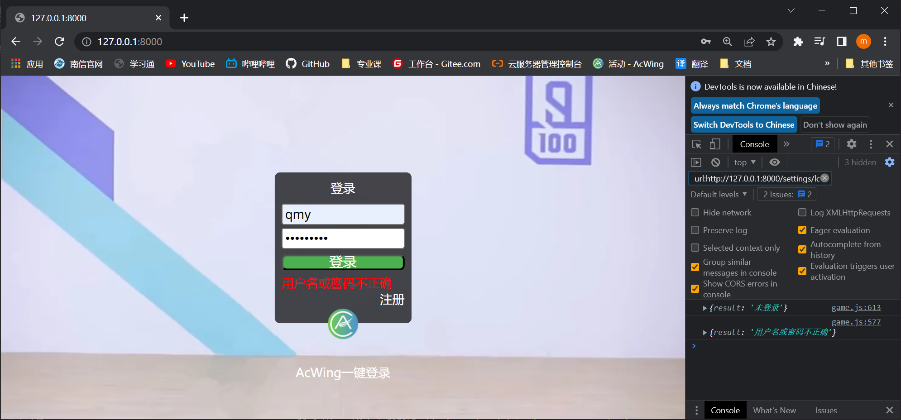

再增加一个登出，先不去实现前端交互，访问/settings/logout就退出了

```python
----game\views\settings\logout.py---
from django.http import JsonResponse
from django.contrib.auth import logout

def logouthttp(request):
    user=request.user
    if not user.is_authenticated:
        return JsonResponse({
            'result':"success",
        })
    logout(request)
    return JsonResponse({
        'result':"success",
    })
----urls/settings/index.py----
path('logout',logouthttp,name="settings_logout"),
```

然后实现一下前端页面，就在原来的设置上加，另外在ac_game里加一个web，这样就知道去$.ajax往哪里发了。点一下设置，就会调用logout_func()函数，后端那边会登出该用户（我猜是session ID被删掉了），然后前端收到suceess后就刷新页面，然后getinfo()发出请求，is_authenticated是false，所以返回未登录，然后打开登录界面。

```js
----settings/zbase.js----
logout_func(){
        if(this.platform==="WEB"){
            $.ajax({
                url:this.root.web+"/settings/logout",
                type:"GET",
                success:function(resp){
                    console.log(resp);
                    if(resp.result==="success"){
                        location.reload();
                    }
                }
            })
        }
    }
----game\static\js\src\menu\zbase.js----
this.$settings.click(function(){
            console.log("click settings");
            outer.root.settings.logout_func();
})
```

##### 注册用户

```js
----game\views\settings\register.py----
from django.http import JsonResponse
from django.contrib.auth import login
from django.contrib.auth.models import User
from game.models.player.player import Player


def register(request):
    data =request.GET
    username=data.get("username","").strip() #返回username，没有就返回空
    password = data.get("password","").strip()
    password_confirm=data.get("password_confirm","").strip()
    if not username or not password:
        return JsonResponse({
            'result':"用户名和密码不能为空"
        })
    if password !=password_confirm:
        return JsonResponse({
            'result':"两次密码不一致",
        })
    if User.objects.filter(username=username).exists():
        return JsonResponse({
            'result':"用户名已存在"
        })
    user=User(username=username)
    user.set_password(password)
    user.save()

    Player.objects.create(user=user,photo="https://pic2.zhimg.com/v2-88e534dacda86fd9f46e9af91cd6b9cd_r.jpg")
    login(request,user)
    return JsonResponse({
        'result':"success"
    })
----game\urls\settings\index.py----
    path("register/",register,name="settings_regiser")
----game\static\js\src\settings\zbase.js----
 register_on_func(){ //在远程服务器上注册
        let outer=this;
        let username=this.$register_username.val();
        let password=this.$register_password.val();
        let password_confirm=this.$register_password_confirm.val();
        this.$register_error_message.empty();

        $.ajax({
            url:this.root.web+"/settings/register",
            type:"GET",
            data:{
                username:username,
                password:password,
                password_confirm:password_confirm,
            },
            success:function(resp){
                console.log(resp);
                if(resp.result==="success"){
                    location.reload();
                }else{
                    outer.$register_error_message.html(resp.result);
                }
            }
        })
    }
```
