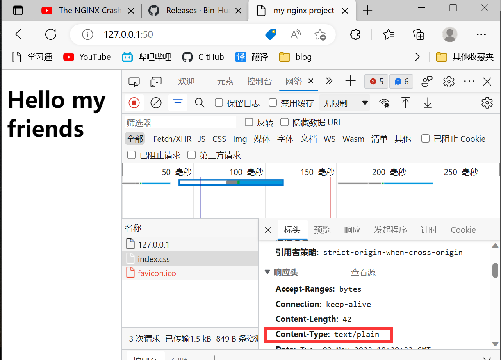

#### 参考视频

youtube [The NGINX Crash Course - YouTube](https://www.youtube.com/watch?v=7VAI73roXaY)

nginx是反向代理服务器


使用用户较多，可以增加服务器数量来缓解服务器压力。通过反向代理服务器把请求发给实际的服务器

另一个是加密，使用https，意味着数据被加密

安装

```
sudo apt-get update
sudo apt-get install nginx
```

Nginx的配置文件位于/etc/nginx/nginx.conf。在Linux系统中，Nginx的配置文件通常位于此目录中。

Nginx的配置文件（nginx.conf）是Nginx服务器的主要配置文件，它定义了Nginx服务器的行为和性能。Nginx的配置文件包含多个块，每个块定义了不同的配置指令。以下是nginx.conf的一些常见配置指令：

1. worker_processes：定义Nginx服务器使用的工作进程数。
2. error_log：定义Nginx服务器的错误日志文件路径。
3. access_log：定义Nginx服务器的访问日志文件路径。
4. server：定义Nginx服务器的虚拟主机。
5. location：定义Nginx服务器的URL位置和处理方式。
6. proxy_pass：定义Nginx服务器的反向代理。
7. root：定义Nginx服务器的默认文档根目录。

通过编辑nginx.conf文件，您可以配置Nginx服务器的行为和性能，例如定义虚拟主机、反向代理、负载均衡等。

nginx启动服务，nginx -s stop停止服务

添加pages/index.html

```
<html>
    <body>
        <h1>Hello my friends</h1>
    </body>
</html>
```

修改nginx.conf

```
http {
	server{
		listen 50;
		root /pages;
	}
}

events {}
```

然后nginx -s reload重新加载，就可以在50端口上看到index.html的内容了

添加./index.css

```
h1{
        background-color:pink;
        color:red;
}
```

html也做一些修改

```
<!DOCTYPE html>
<html>
    <head>
        <meta charset="UTF-8"/>
        <title>my nginx project</title>
        <link rel="stylesheet" href="./index.css">
    </head>
    <body>
        <h1>Hello my friends</h1>
    </body>
</html>
```

然后按下ctrl+shift+r刷新缓存，就能看到网站这边是加载了的，但是css没正确显示，原因很简单，因为相应头的Content-Type错了



添加types解决问题

```
http {
	types{
		text/css     css;   #content-type和拓展名
		text/html    html;
	}
	server{
		listen 50;
		root /pages;
	}
}

events {}
```

记得nginx -s reload然后刷新缓存，就能看到css正确显示了

其实nginx.conf同名目录下有个`mime.types`，它是Nginx服务器中的一个配置文件，它定义了文件扩展名和MIME类型之间的映射关系。

把它include进来，然后也是能正确工作的

```
http {
	
	include mime.types;
	
	server{
		listen 50;
		root /pages;
	}
}

events {}
```

location

