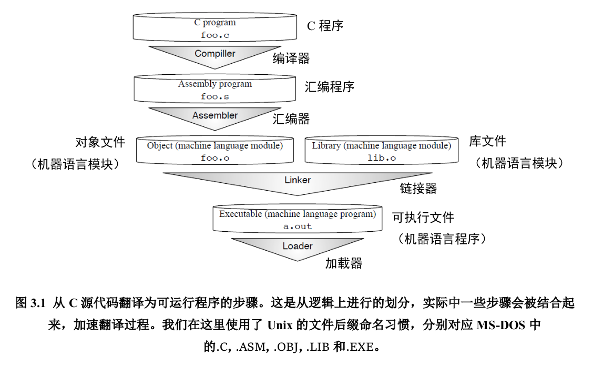
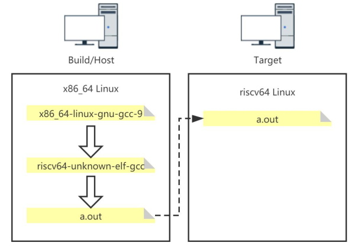

------

# 虚拟机

------

## 硬件知识

<p style="font-size:20px;color:red">待补充，等学完李忠的x86汇编实模式</p>

ELF是最常见的Linux可执行文件格式

## VMWare

### 安装VMWare

官网上下载安装	[VMWare下载地址](https://www.vmware.com/products/workstation-pro/workstation-pro-evaluation.html)

安装包是.bundle文件，需要给它可执行权限，然后运行 VMware Workstation 安装程序：

```bash
sudo chmod +x VMware-Workstation-Full-17.0.2-21581411.x86_64.bundle
sudo ./VMware-Workstation-Full-17.0.2-21581411.x86_64.bundle
```

安装完成后，用密钥激活它，淘宝有3.8一个，网上貌似也可以搜到

打开Help>About VMware Workstation可以查看许可证信息

### 卸载VMWare

```
vmware-installer -u vmware-workstation
```

这并不会删除已有的虚拟机和许可证等配置信息

### VMWare虚拟网络配置

Virtual Network Editor被用于进行虚拟网络配置。

采用默认配置即可。   [介绍虚拟机网络模式](https://www.bilibili.com/video/BV11M4y1J7zP/?spm_id_from=333.1007.top_right_bar_window_history.content.click)

## VirtualBox

### 安装VirtualBox

```
sudo apt install virtualbox
```

## Bochs

### 安装Bochs

```
sudo apt install bochs
```

输入`bochs`启动虚拟机

```
1. Restore factory default configuration
2. Read options from...
3. Edit options
4. Save options to...
5. Restore the Bochs state from...
6. Begin simulation
7. Quit now
```

### 使用Bochs

<p style="font-size:30px;color:red">待补充，等学完李忠的x86汇编实模式</p>

## DOSBox

### DOSBox的安装

DOS是一种早期的PC命令行操作系统。DOSBox 则是一个模拟 DOS 环境的工具。

早期的Windows是以DOS为底层操作系统的，随着发展Windows逐渐摆脱对DOS的依赖，成为一个独立的操作系统。

在ubuntu上安装：

```bash
sudo apt install -y dosbox
```

### vscode插件

vscode插件 `MASM/TASM`提供了一个DOSBOX，还提供了tasm,masm两种编译器。

### 常用DOS命令

把masm目录挂载作为c盘

```
mount c ~/nasm_project/masm
```

进入c盘

```
c:
```

查看文件

```
dir
```

### TASM,MASM,NASM

TASM、MASM 和 NASM 都是 x86 汇编程序编译器。TASM和MASM是运行在DOS/Windows下的，NASM则可以用于其他平台。

#### masm的安装

masm汇编工具下载链接 [MASM汇编工具](https://github.com/codists/learnings/blob/main/nasm/%E6%B1%87%E7%BC%96%E8%AF%AD%E8%A8%80/DEBUG.zip) 

masm汇编工具内包含DEBUG.EXE、MASM.EXE、LINK.EXE等可执行文件，这些文件可以在DOS系统下直接执行。因此只要把汇编工具的目录挂载成DOS的盘就可以在dos里访问到可执行文件了。

#### nasm的语法

nasm的语法和masm有细微的区别

<p style="font-size:20px;color:red">待补充，等学完李忠的x86汇编实模式</p>

#### nasm的命令

```nasm
nasm -f elf 1.asm			#把文件1.asm编译成ELF格式的文件1.o
nasm -f bin 1.asm -o 2.com  #把文件1.asm编译成二进制格式的文件2.com
nasm 1.asm -o 2.bin			#把文件1.asm编译成可执行文件2.bin
```

## qemu

### 安装qemu

安装参考 https://www.qemu.org/download/#linux

```shell
apt-get install qemu-system							For full system emulation
apt-get install qemu-user-static 					For emulating Linux binaries
```

上面的两种安装命令对应两种运行模式：全系统模拟模式和用户模式

全系统模拟模式提供一个计算机的虚拟模型（CPU、内存和模拟设备）来运行操作系统，所以可以做到完全仿真。

用户模式只在CPU上进行仿真

------

### qemu-img

`qemu-img`用于创建和修改硬盘镜像

创建一个 4 GB *raw* 格式的镜像，`-f`指定镜像格式：

```bash
qemu-img create -f raw Image.img 4G
```

> *raw*：分配的镜像大小和实际占用硬盘的大小一样
>
> qcow2：分配的镜像大小和实际占用的硬盘空间不一致。实际写入内容的时候，才会分配硬盘空间。

增加镜像 10 GB 大小，通过`resize`选项

```bash
qemu-img resize Image.img +10G
```

### qemu-system-

`qemu-system-`是系统级别的模拟

`qemu-system-x86_64`可以模拟x86_64架构的计算机，比如：

```
qemu-system-x86_64 -enable-kvm -cdrom Manjaro.iso -boot menu=on -drive file=Image.img -m 2G
```

<p style="font-size:20px;color:red">待补充，等学完risc-v操作系统</p>


------

# 手动编译c++

------

虽然叫“编译”，但这里的“编译”是指的从c程序到可执行文件的过程，包含了多个子步骤，有一个子步骤也叫编译，总之编译这个叫法很迷惑...要结合语境

## GCC编译器

GNU Compiler Collection，即由GNU开发的，遵循GPL许可证发行的编译器套件，GNU是一个自由的操作系统项目，里面有很多工具程序等

支持 C、C++、Objective-C、Fortran、Ada 等多种编程语言

已经被移植到多种计算机体系架构上，如 x86,ARM,RISC-V 等

### GCC的主要执行步骤

从 C 程序翻译成为可以在计算机上执行的机器语言程序的经典步骤：



#### 编译

用到的程序：`/usr/lib/gcc/x86_64-linux-gnu/11/cc1 `

命令：

```shell
gcc -E foo.c -o foo.i		#预处理
gcc -S foo.i -o foo.s		#编译
```

编译器完成 “预处理” 和 “编译”，“预处理” 指处理源文件中以 “#” 开头的预处理指令，譬如 #include、#define 等；“编译” 则针对预处理的结果进行一系列的词法分析、语法分析、语义分析，优化后生成汇编指令，存放在 .s 为后缀的目标文件中

#### 汇编

命令：

```shell
gcc -c foo.s -o foo.o		#汇编
```

汇编器将汇编语言代码转换为机器（CPU）可以执行的指令。

#### 链接

命令：

```shell
gcc foo.o -o a.out			#链接
```

链接器将汇编器生成的目标文件和一些标准库（譬如 libc）文件组合，形成最终可执行的应用程序。

> 来自learncpp的图
>
> 编译and汇编：
>
> 
>
> 链接：
>
> 

### 命令选项

| 常用选项 | 含义                           |
| -------- | ------------------------------ |
| -E       | 只做预处理                     |
| -c       | 只编译不链接，生成文件.o       |
| -S       | 生成汇编代码                   |
| -o file  | 输出生成到指定文件中           |
| -g       | 输出的文件中加入支持调试的信息 |
| -v       | 输出整个翻译为可执行文件的过程 |

直接生成可执行文件 a.out

```
gcc hello.c
```

## 交叉编译

编译器本身也是个程序，它用于生成另外一个程序。

根据参与编译运行时的机器担任的角色，可以把机器划分为下面三类：

- 构建（build）系统：生成编译器这个可执行程序的计算机

- 主机（host）系统：运行编译器这个可执行程序的计算机

- 目标（target）系统：运行编译器生成的可执行程序的计算机

交叉编译就是指 Host!=Target 的情况，Host和Build相不相同取决于我们是自己编译出编译器，还是直接下载别人编译好的工具链。



> 我们平时用的gcc是一个软链接，实际上是`x86_64-linux-gnu-gcc-11`，由它生成的a.out只能在x86上运行。
>
> 利用`x86-64-linux-gnu-gcc-9`的源码，可以做一个生成的可执行文件可以在riscv64上运行的编译器，即图中的`riscv64-unknown-elf-gcc`。
>
> 然后平时就用`riscv64-unknown-elf-gcc`去生成a.out，它只能在riscv64架构的机器上运行（比如咱们用qemu模拟）。

## GDB调试器

GDB 是一个调试器，可以启动程序，打断点，查看程序停下时发生的事情等等

支持 assembly,c,c++,go,rust,pascal 等多种语言

### 安装

ubuntu安装：

```
sudo apt install gdb
```

检查gdb版本

```
gdb --version
```

### 快速开始

先写一个cpp文件

```c++
#include<bits/stdc++.h>
using namespace std;
int main(){
    int arr[4]={1,2,3,4};
    for(int i=0;i<4;i++){
        printf("%d\n",arr[i]);
    }
    return 0;
}
```

编译，生成可执行文件a.out

```shell
g++ 1.cpp				#生成a.out
```

执行

```shell
./a.out					#执行
```

要用gdb调试，必须要在编译时用`-g`选项生成调试信息：

```shell
g++ -g 1.cpp			#生成带有调试信息的a.out
```

用gdb调试：

```shell
gdb ./a.out
```

启动gdb后会打印出`(gdb)`等待用户调试

### 常用命令

#### 运行命令

| 命令       | 简写 | 作用                                                         |
| ---------- | ---- | ------------------------------------------------------------ |
| `run`      | `r`  | 运行程序，当遇到断点后，程序会在断点处停止运行，等待用户输入下一步的命令 |
| `continue` | `c`  | 继续执行，到下一个断点处（或运行结束）                       |
| `next`     | `n`  | 单步调试，遇到函数时，直接调用函数，不会进入函数内部         |
| `step`     | `s`  | 单步调试，如果有函数调用，则进入函数中继续执行               |
| `until`    |      | 运行程序直到退出循环体                                       |
| `quit`     | `q`  | 退出gdb                                                      |

#### 打断点

当程序执行遇到断点时，会在断点处停下

| 命令            | 简写      | 作用                                       |
| --------------- | --------- | ------------------------------------------ |
| `break 函数`    | `b 函数`  | 在指定函数的第一行打断点<br />`break main` |
| `break n	`   | `b n	` | 在第n行处打断点                            |
| `info break`    | `info b`  | 查看已有断点                               |
| `delete 断点号` |           | 删除断点，断点号通过`info b`获得           |

#### 监视点相关

监视一个表达式，当表达式的值发生变化时会停下

| 命令           | 作用                                         |
| -------------- | -------------------------------------------- |
| `watch 表达式` | 设置监视点，表达式可以是数字，变量，函数调用 |

#### 查看代码和变量

| 命令           | 简写 | 作用                                                         |
| -------------- | ---- | ------------------------------------------------------------ |
| `list`         | `l`  | 列出程序的源代码，每次显示10行                               |
| `print 表达式` | ` p` | 显示表达式的值，表达式可以是数字，变量，函数调用。<br />`p arr[0]`，`p &arr[1]`，`p &i`，`print gdb_test(22)` |

#### 调用shell

```gdb
shell 命令
```

#### 设置日志

```
set logging on 			
```

gdb会创建一个`gdb.txt`来记录日志

## make工具

<p style="font-size:20px;color:red">这里补充make相关知识，可以参考汪老师的课</p>


------

# vscode c++环境搭建

------

vscode扩展包是C/C++ Extension Pack

## 安装编译器

Ubuntu 环境里， 编译 C 语言的是 GCC ，编译 C++的是 G++。执行下面的执指令安装编译 C 语言和 C++的环境：

```bash
sudo apt-get install gcc g++
gcc -v
g++ -v
```

## 配置.vscode

### 配置编译器路径

编译器等配置信息会以json格式文件保存在当前目录的.vscode文件夹下

配置编译器路径：运行cpp文件，会让选择编译器。选择一个合适的编译器即可。

也可以主动配置：快捷键ctrl+shift+p，然后键入 C/C++: 编辑配置(UI)，以UI方式编辑配置信息，选择编译器

> 备注：GDB调试时会输出一些多余的信息，这只在linux平台上的gdb上会有

### 配置includePath

有时候会警告：检测到 #include 错误。请更新 includePath。

这并不影响实际的编译，但是红线毕竟不好看。

要查看g++的用到的头文件，可以用它编译一个cpp文件并显示详细输出

```shell
g++ -v 1.cpp
```

输出结果中包含 includePath，把它添加到.vscode配置的包含路径即可


------

# 在虚拟机中安装Archlinux

------

创建虚拟硬盘，下载archlinux镜像文件，然后从镜像文件启动，进入archlinux的试用。接下来就在这里对虚拟硬盘进行操作。

## 硬盘分区

查看当前硬盘和硬盘分区情况

```zsh
fdisk -l
```

咱们这里只有一块虚拟硬盘，被命名为`/dev/sda`，用伪图像化界面对它进行分区

```zsh
cfdisk /dev/sda
```

分区结果如下，挂载点和文件系统还没设置

| 分区      | 大小  | 挂载点    | 文件系统 |
| --------- | ----- | --------- | -------- |
| /dev/sda1 | 512MB | /boot/dfi | fat32    |
| /dev/sda2 | 1G    |           | swap分区 |
| /dev/sda3 | 7G    | /         | ext4     |

格式化文件系统

```zsh
mkfs.fat -F32 /dev/sda1
mkswap /dev/sda2
swapon /dev/sda2
mkfs.ext4 /dev/sda3
```

挂载分区，这样就能以目录形式访问文件系统

```zsh
mount /dev/sda3 /mnt
mkdir /mnt/boot
mkdir /mnt/boot/efi
mount /dev/sda1 /mnt/boot/efi
```

## 安装系统文件

在`/mnt`目录下，也就是根目录挂载点，下载必要的文件

```zsh
pacstrap /mnt base linux linux-firmware base-devel
```

fstab 是一个系统配置文件，用于在启动时自动挂载文件系统

`genfstab`命令用于生成文件系统表（fstab）

现在生成文件系统表并将其追加到`/mnt/etc/fstab `文件中

```zsh
genfstab -U /mnt >> /mnt/etc/fstab
```

## 安装常用软件

进入根目录为 `/mnt`的虚拟系统环境，运行`/mnt`下的系统命令和工具

就像登陆到根目录为`/mnt`的root用户一样

```zsh
arch-chroot /mnt
```

安装必要的软件

```
pacman -S vim iwd networkmanager ttf-dejavu sudo bluez
```

## 修改配置信息

保持登陆状态继续操作

设置时区

```
ln -sf /usr/share/zoneinfo/Asia/Shanghai /etc/localtime
```

设置语言，删除`en_US.UTF-8`和`zh_CN.UTF-8`两项前面的`#`

```
vim /etc/locale.gen
```

设置root用户密码

```
passwd
```

设置主机名（系统名）

```
echo "archlinux-yuan" >> /etc/hostname
```

## 安装引导

保持登陆状态继续操作

安装Grub引导程序工具

```
pacman -S grub
```

将 Grub 引导程序安装到 `/dev/sda` 上

```
grub-install /dev/sda
```

生成 Grub 的配置文件，并将其保存到 `/boot/grub/grub.cfg`

```
grub-mkconfig -o /boot/grub/grub.cfg
```

退出当前虚拟系统环境

```
exit
```

## 完成系统安装

重新启动系统，这次从硬盘启动，接着就进入了archlinux的命令行界面，说明安装完毕

## 网络服务

不过此时如果执行`ip ad`并不能看到局域网ip，需要启动管理网络连接的服务

```
systemctl start NetworkManager
```

设置自启动

```
systemctl enable NetworkManager
```

为了能用SSH登陆系统，需要安装：

```
sudo pacman -S openssh
```

启动并设置自启动

```
systemctl start sshd
systemctl enable sshd
```

修改配置文件`/etc/ssh/sshd_config`允许root用户登陆

```
PermitRootLogin yes
```


------

# qemu跑RISC-V Linux

------

看一下咯，一路工具都是自己编译的，虽然搭出来了，但还是一知半解 https://www.zhihu.com/question/421757389/answer/2937412514
