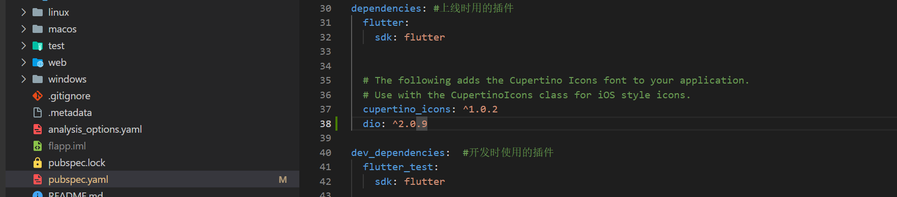
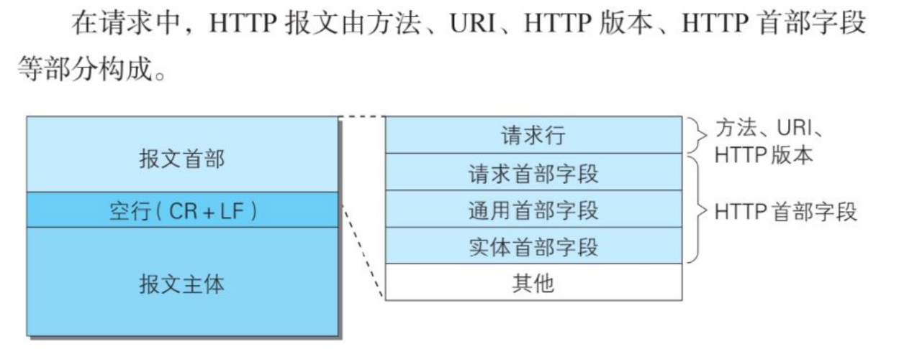
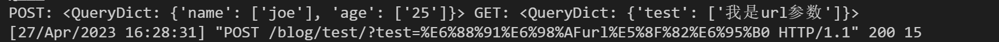
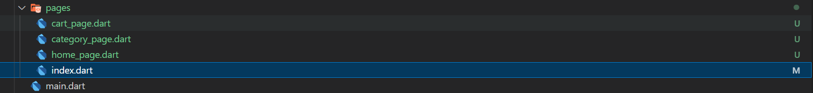
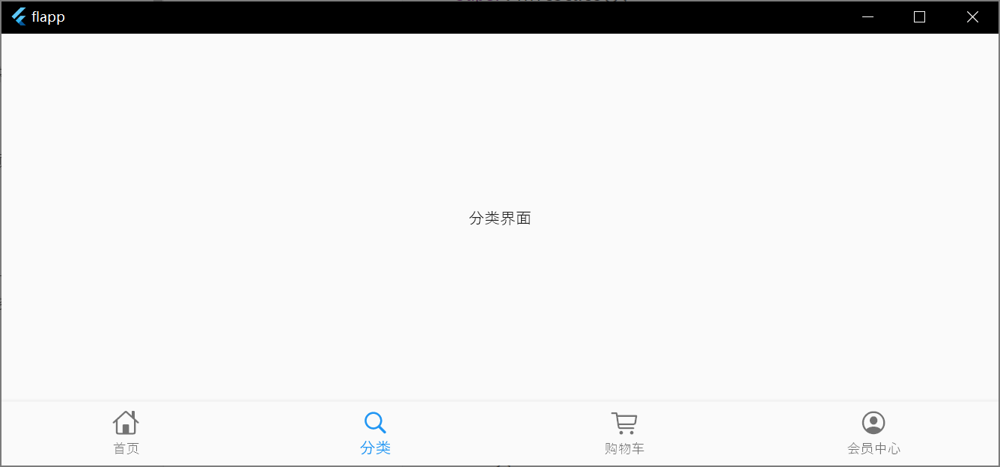
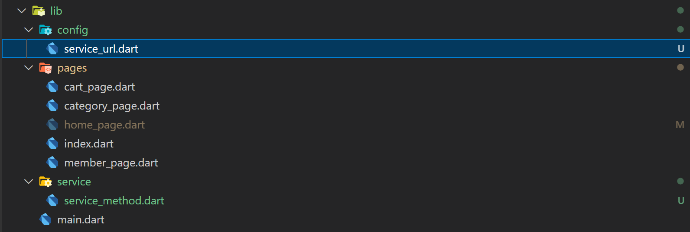
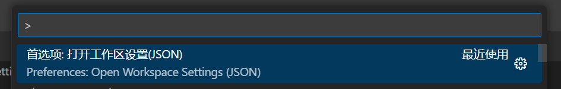
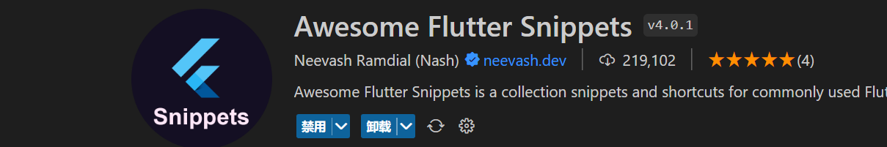

### package中的lib文件

https://juejin.cn/post/7051398049583038501

对于package来说，lib中的文件是可以被导出的文件，但是我们在引入package的时候最好不要使用绝对路径或者相对路径直接导入lib中的文件。

而是需要使用`import 'package:'`

举个例子，假如我们有下面结构的library文件：

```bash
my_package
└─ lib
   └─ api.dart
   test
   └─ api_test.dart
复制代码
```

api.dart就是我们要导出的文件。如果我们在api_test.dart中需要引用api.dart，则可以有下面两种方式：

```arduino
import 'package:my_package/api.dart';
复制代码
```

和：

```arduino
import '../lib/api.dart';
复制代码
```

其中上面一种方式是官方推荐的方式，为什么不使用下面一种方式呢？这是因为相对路径的方式只能在包内部使用。并且dart官方不建议将lib放在引用路径中，如果要引用lib内部的文件， 一定要使用package:。

当然，如果是package内部的引用，则优先使用相对路径，比如：

```bash
my_package
└─ lib
   ├─ src
   │  └─ stuff.dart
   │  └─ utils.dart
   └─ api.dart
   test
   │─ api_test.dart
   └─ test_utils.dart

复制代码
```

那么对应lib/api.dart来说，可以这样引用：

```arduino
import 'src/stuff.dart';
import 'src/utils.dart';
复制代码
```

对于utils.dart来说，可以这样引用：

```arduino
import '../api.dart';
import 'stuff.dart';
复制代码
```

对于test/api_test.dart来说，可以这样引用：

```arduino
import 'package:my_package/api.dart'; 

import 'test_utils.dart';
复制代码
```

总之，不要在import的路径中出现lib。

### dio库

dio库是一个为Flutter/dart量身定制的的http客户端，`pubspec.yaml`用于管理第三方库及资源的配置文件，在里面添加dio依赖保存后会自动执行`flutter packages get`。



HTTP的请求报文和相应报文都含有报文主体和报文首部。报文首部提供在客户端和服务器处理时需要的一些重要信息，比如content-type用于说明报文主体的媒体类型。报文主体包含用户的资源和信息。



url参数是在请求行里，它属于报文首部。url参数使用GET获取，而表单数据使用POST获取。案例如下，queryParameters会被自动整合到url后面，而data后是表单数据。分别使用GET和POST接收。

```dart
Response response;
Dio dio =new Dio();
FormData formData = FormData.fromMap({
    "name": "joe",
    "age": 25,
});
response=await dio.post(servicePath['HomePageContent']!,queryParameters:{"test":"我是url参数"},data:formData); 
```



### 应用案例

#### 移动电商

##### 先把项目跑起来

示例代码，就在lib下面写。两个无状态组件，用snippets去自动生成就行：

```dart
//main.dart
import 'package:flapp/pages/index.dart';
void main()=>runApp(MyApp());

void main()=>runApp(MyApp());

class MyApp extends StatelessWidget {
  const MyApp({super.key});

  @override
  Widget build(BuildContext context) {
    return Container(
      child:MaterialApp(
        title:'百姓生活+',
        debugShowCheckedModeBanner: false,
        theme:ThemeData(
          primaryColor: Colors.pink
        ),
        home:IndexPage()
      ),
    );
  }
}
//pages\index.dart

class IndexPage extends StatelessWidget {
  const IndexPage({super.key});

  @override
  Widget build(BuildContext context) {
    return Scaffold(
      appBar: AppBar(title:Text('百姓生活+')),
      body:Center(
        child:Text('百姓生活+'),
        )
    );
  }
}
```

##### 编写导航栏

material和cupertino是两种风格，material是很有质感的，cupertino是适合ios的。flutter可以多选风格。有变化的用有状态的组件。所以把index.dart下的内容删除，用代码片段生成有状态的组件，然后添加`<BottomNavigationBar>list`存几个选项，在home下写几个简单的测试页面。



```dart
//index.dart
class IndexPage extends StatefulWidget {
  const IndexPage({super.key});

  @override
  State<IndexPage> createState() => _IndexPageState();
}

class _IndexPageState extends State<IndexPage> {
  final List<BottomNavigationBarItem> bottomTabs=[
    const BottomNavigationBarItem(
      icon: Icon(CupertinoIcons.home),
      label:'首页'
      ),
      const BottomNavigationBarItem(
      icon: Icon(CupertinoIcons.search),
      label:'分类'
      ),
      const BottomNavigationBarItem(
      icon: Icon(CupertinoIcons.shopping_cart),
      label:'购物车'
      ),
      const BottomNavigationBarItem(
      icon: Icon(CupertinoIcons.profile_circled),
      label:'会员中心'
      )
  ];
  @override
  Widget build(BuildContext context) {
    return Container();
  }
}

//pages\home_page.dart
import 'package:flutter/material.dart';

class HomePage extends StatelessWidget {
  const HomePage({super.key});

  @override
  Widget build(BuildContext context) {
    return Scaffold(
      body:Scaffold(
        body:Center(child: Text('商城首页'),)
      )
    );
  }
}
```

然后import引入页面，再用List存下每个页面。用`inits`生成初始化的代码片段。

```dart
 final List tabBodies=[
    HomePage(),
    CategoryPage(),
    CartPage(),
    MemberPage(),
  ];
  
  int currentIndex =0;
  var currentPage;

  @override
  void initState() {
    currentPage=tabBodies[currentIndex];
    super.initState();
  }
```

然后返回一个`Scaffold`组件，用`onTap`传入回调函数修改`currentIndex`和`currentPage`的值。

```dart
return Scaffold(
      backgroundColor: const Color.fromRGBO(244,245,245,1.0),
      bottomNavigationBar: BottomNavigationBar(
        type:BottomNavigationBarType.fixed,
        currentIndex: currentIndex,
        items:bottomTabs,
        onTap: (index){   
          setState(() {
            currentIndex=index;
            currentPage=tabBodies[index];
          });
        },
        ),
        body:currentPage,
      );
```

最终完整的代码

```dart
//pages\index.dart
import 'package:flutter/material.dart';
import 'package:flutter/cupertino.dart';
import 'home_page.dart';
import 'cart_page.dart';
import 'category_page.dart';
import 'member_page.dart';


class IndexPage extends StatefulWidget {
  const IndexPage({super.key});

  @override
  State<IndexPage> createState() => _IndexPageState();
}

class _IndexPageState extends State<IndexPage> {
  final List<BottomNavigationBarItem> bottomTabs=[
    const BottomNavigationBarItem(
      icon: Icon(CupertinoIcons.home),
      label:'首页'
      ),
      const BottomNavigationBarItem(
      icon: Icon(CupertinoIcons.search),
      label:'分类'
      ),
      const BottomNavigationBarItem(
      icon: Icon(CupertinoIcons.shopping_cart),
      label:'购物车'
      ),
      const BottomNavigationBarItem(
      icon: Icon(CupertinoIcons.profile_circled),
      label:'会员中心'
      )
  ];

  final List tabBodies=[
    const HomePage(),
    const CategoryPage(),
    const CartPage(),
    const MemberPage(),
  ];
  
  int currentIndex =0;
  var currentPage;

  @override
  void initState() {
    currentPage=tabBodies[currentIndex];
    super.initState();
    
  }
    
  @override
  Widget build(BuildContext context) {
    return Scaffold(
      backgroundColor: const Color.fromRGBO(244,245,245,1.0),
      bottomNavigationBar: BottomNavigationBar(
        type:BottomNavigationBarType.fixed,
        currentIndex: currentIndex,
        items:bottomTabs,
        onTap: (index){   
          setState(() {
            currentIndex=index;
            currentPage=tabBodies[index];
          });
        },
        ),
        body:currentPage,
      );
  }
}
```



##### 增加`config`和`service`文件夹



在`service_url.dart`文件内是url的配置，在`service_method.dart`文件内是一些请求方法。

```dart
----lib\config\service_url.dart----
const serviceUrl='http://127.0.0.1:8000';
const servicePath={
  'HomePageContent':serviceUrl+'/blog/test/',
  
};
----lib\service\service_method.dart----
import 'package:dio/dio.dart';
import 'dart:async';
import 'dart:io';
import '../config/service_url.dart';

//获取首页主题内容
Future getHomePageContent() async{
  try{
    print('开始获得首页数据......');
    Response response;
    Dio dio =new Dio();
    FormData formData = FormData.fromMap({
   "name": "joe"
    });
    response=await dio.post(servicePath['HomePageContent']!,data:formData);  //断言不为空，为空会抛出NoSuchMethodError异常
    if(response.statusCode==200){
      return response;
    }else{
      throw Exception('后端接口出错');
    }
  }catch(e){
    return print("ERROR:${e}");
  }
}
```

##### 编写`HomePage`界面

编写一下`HomePage`组件，在初始化的时候去执行获取首页主题内容的页面的函数，初始化可以用inits生成代码片段。

```dart
import "package:flutter/material.dart";
import '../service/service_method.dart';

class HomePage extends StatefulWidget {
  const HomePage({super.key});

  @override
  State<HomePage> createState() => _HomePageState();
}

class _HomePageState extends State<HomePage> {
  String HomePageContent='正在获取数据';

  @override
  void initState() {
    // TODO: implement initState
    super.initState();
    getHomePageContent().then((val){
      setState(() {
        HomePageContent=val.toString();
      });
    } ,);
  }

  @override
  Widget build(BuildContext context) {
    return Scaffold(
      appBar:AppBar(title:Text('百姓生活+')),
      body:SingleChildScrollView(
        child: Text(HomePageContent),
        
        )
    );
  }
}
```

### 配置和插件

保存时自动补全const：



```json
----settings.json----
{
    "editor.codeActionsOnSave": {
        "source.fixAll": true // 自动修复 all
      },
}
```

一些好用的插件 支持代码片段：



