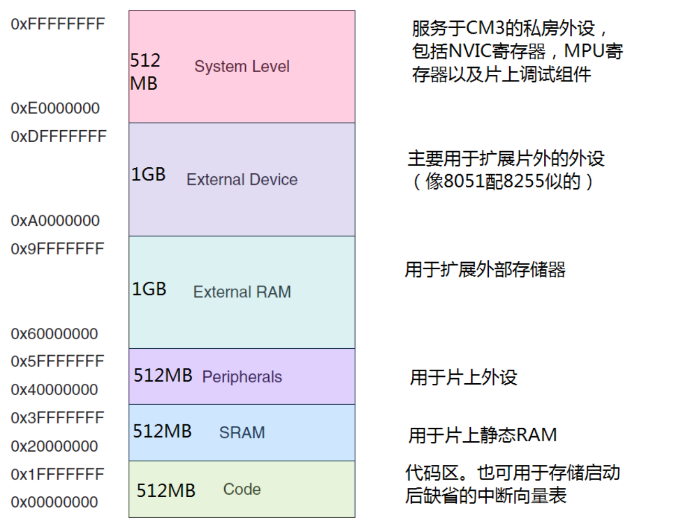
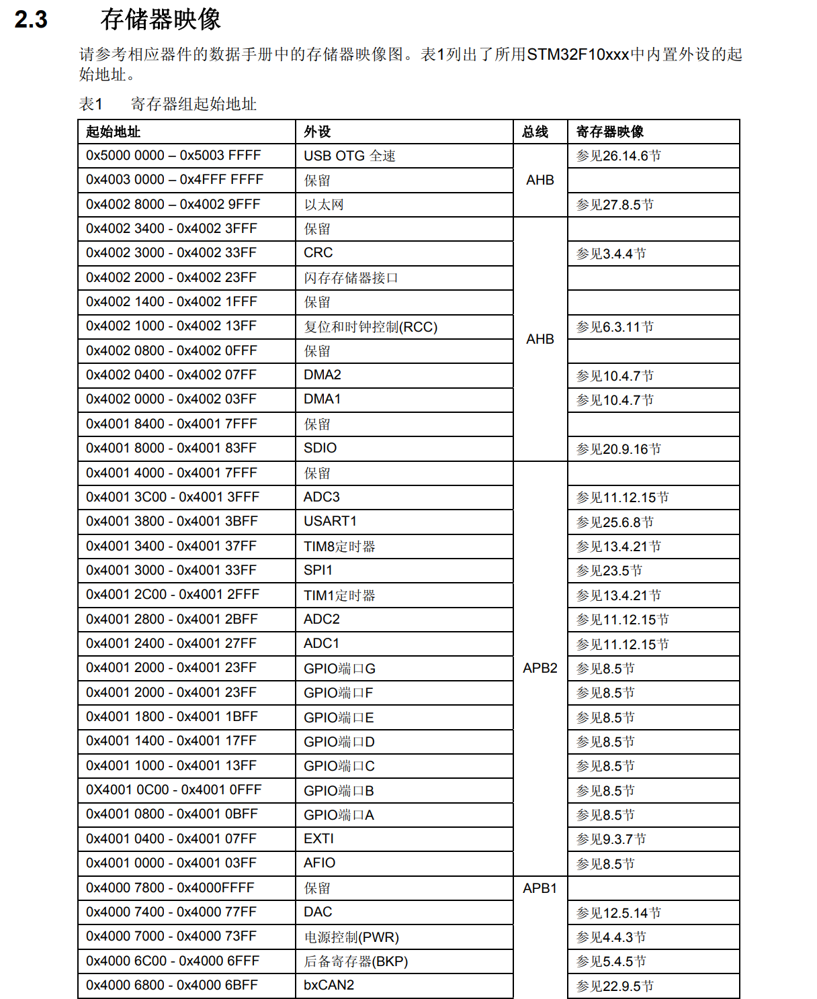
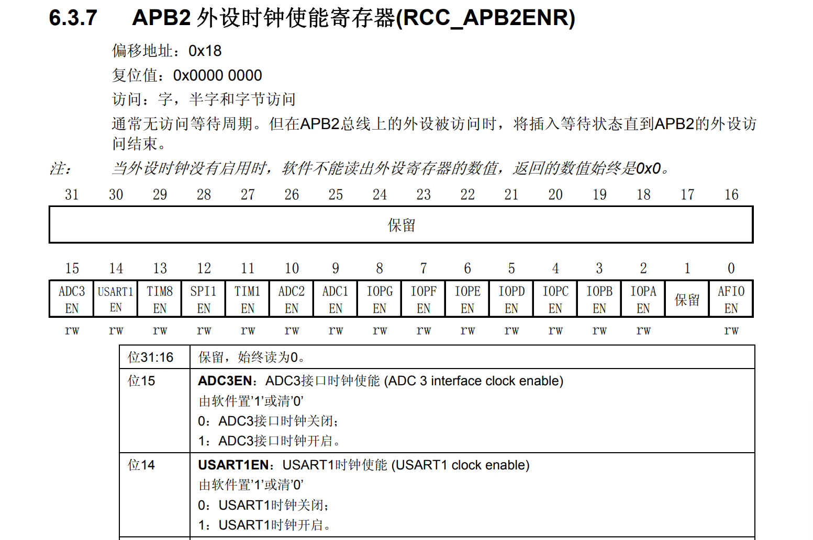
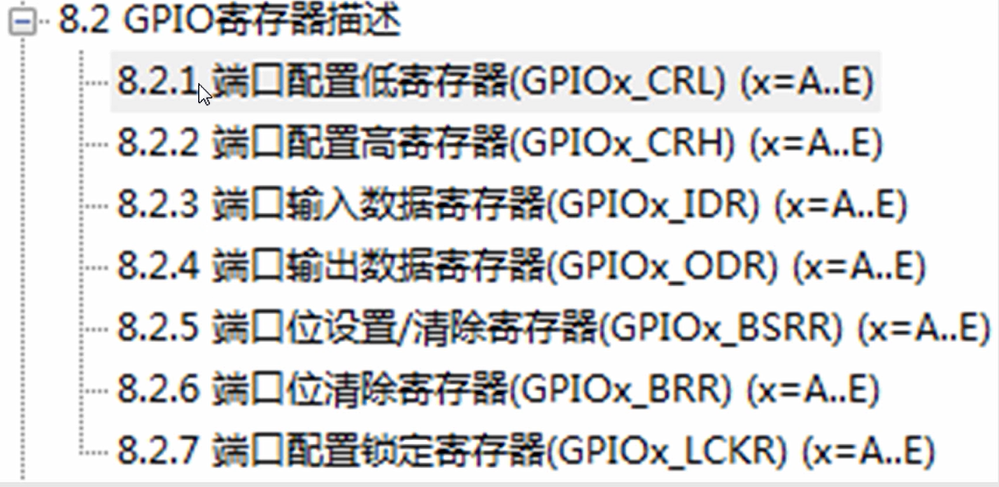
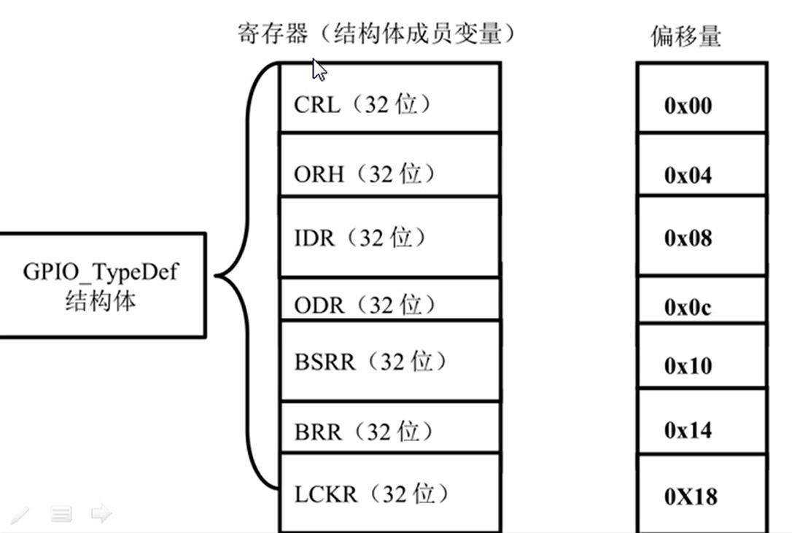
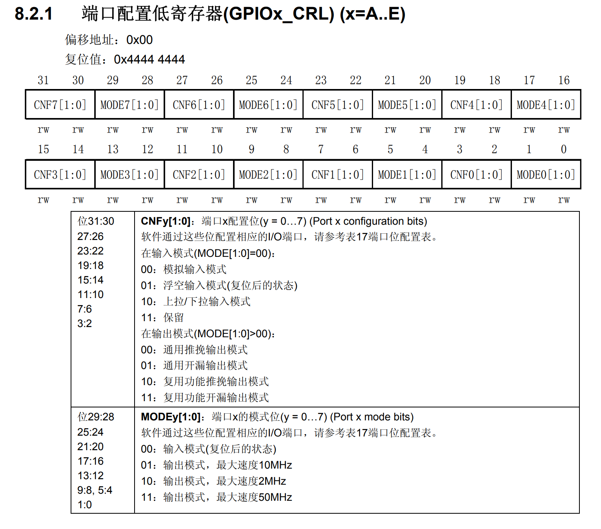
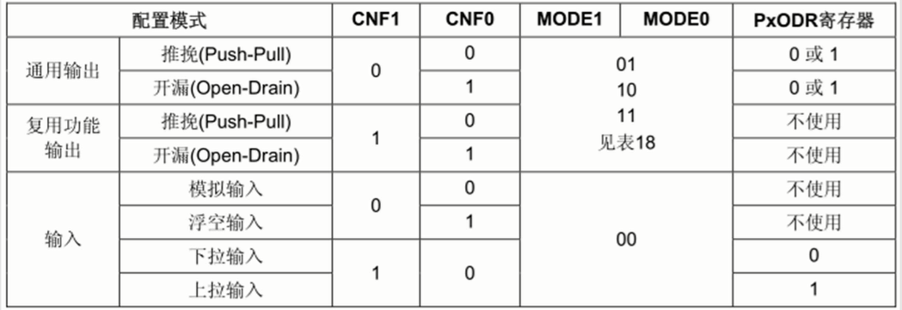
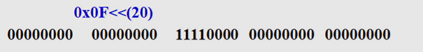

# 权威指南

总体来说，Cortex‐M3 支持 4GB 存储空间，如图所示地被划分成若干区域：

# 点亮LED（仿库函数写法）

如何得到外设地址？

可以看 参考手册的2.3节存储器映像找到对应的外设地址，然后再加上偏移地址。

比如APB2外设时钟使能寄存器RCC_APB2ENR是0x40021000+0x18=0x40021018

GPIO有7个寄存器，每个寄存器是4字节

1. 
这里放标题

ODR是输出寄存器，BSRR和BRR都是用来设置ODR的。

端口配置低寄存器配置低8位，高寄存器配置高8位

GPIO_init就是配置CNFy[1:0]和MODEy[1:0]这四个位

先清零，再根据需要赋值

到这里讲的都是最基础的库函数是如何实现的

------

